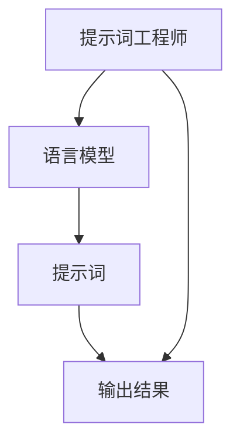
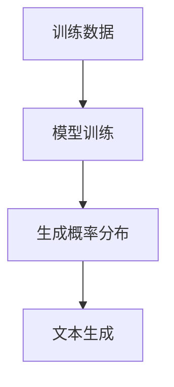
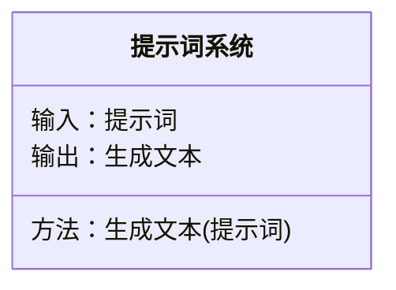
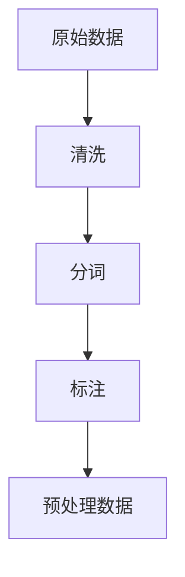
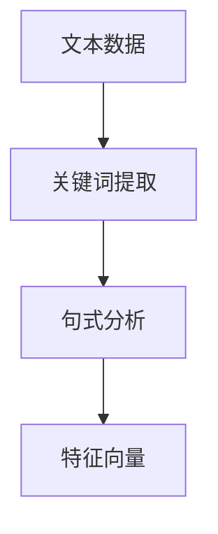
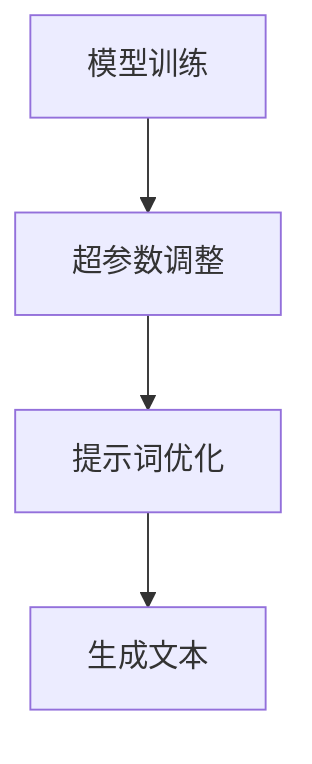
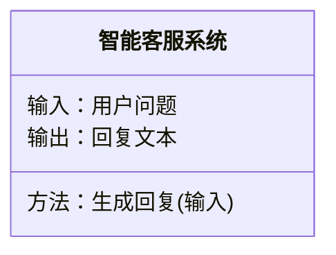
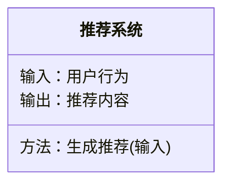

                 

<think>
好的，我现在需要根据用户的要求，一步一步地思考如何撰写这篇关于提示词工程师技能培养与发展的技术博客文章。首先，我得理清用户的需求，明确文章的结构和内容，确保覆盖所有必要的部分，并且符合格式要求。

首先，用户给出了一个详细的目录大纲，分为八个章节，每个章节下还有子章节。我需要按照这个大纲来组织内容，确保每个部分都有足够的深度和细节。同时，用户强调文章需要有专业的技术语言，逻辑清晰，结构紧凑，使用markdown格式，并且包含数学公式、算法流程图等技术元素。

接下来，我需要考虑每个章节的具体内容。例如，第一章介绍提示词工程师的角色和责任，我需要定义这个职位，说明其技能需求，并描述职业发展路径。这可能涉及到自然语言处理的基础知识，如语言模型和文本表示，这些都需要详细解释。

在第二章，我需要深入讲解自然语言处理的基础，包括其概述、语言模型以及机器翻译和文本生成。这可能需要引用一些数学公式，比如语言模型的概率分布，使用latex来表达。同时，可能需要使用mermaid流程图来展示模型的训练过程。

第三章涉及提示词系统的设计与实现，我需要分析系统架构，包括需求分析、组件设计和接口设计。这里可能需要绘制系统的类图或架构图，用mermaid来展示。

第四章是关于提示词效果优化，需要讨论评估指标和优化策略，比如数据预处理和特征工程。这可能涉及到一些算法的流程图，展示优化过程中的步骤。

第五章通过案例分析，如智能客服和内容推荐系统，展示提示词工程的实际应用。这需要详细描述每个案例的背景、设计和实现，可能包括代码片段和系统交互图。

第六章讨论职业发展，包括技能提升、职业认证和跨领域发展。这里可能需要引用一些图表，如职业路径图，展示不同的发展方向。

第七章展望未来趋势，分析技术的发展和工程师角色的变化。这可能需要引用一些趋势分析的图表，如预测图或演变图。

第八章总结最佳实践，包括开发流程、性能优化和用户体验提升。这可能需要一些最佳实践的列表或流程图，指导工程师如何高效工作。

在整个过程中，我需要确保每个部分都包含背景介绍、核心概念、算法原理、系统架构和项目实战等内容。同时，要使用正确的markdown格式，插入数学公式、mermaid图表等元素，确保文章结构完整且技术深度足够。

另外，字数要求在10000到12000字之间，这意味着每个章节需要详细展开，提供足够的信息和实例。我需要合理分配每个章节的字数，确保整体平衡，同时保持逻辑流畅。

最后，文章末尾要加上作者信息，符合用户的要求。整体来看，这是一个相当复杂的任务，需要细致的规划和每个部分的深入思考，确保最终的文章既专业又易于理解，满足用户的需求。
</think>

# 提示词工程师的技能培养与发展

## 关键词：提示词工程师，技能培养，自然语言处理，系统设计，职业发展

## 摘要：  
提示词工程师是人工智能和自然语言处理领域中的关键角色，负责设计、优化和部署高效的提示词系统。本文系统地探讨了提示词工程师的核心技能、技术基础、系统设计与实现、效果优化、实践案例以及职业发展路径。通过详细的技术分析、算法原理、系统架构设计和实际案例，本文为提示词工程师的技能提升和职业发展提供了全面的指导。我们还展望了提示词技术的未来趋势，为读者提供了深刻的行业洞察。

---

## 第1章：提示词工程师的角色与责任

### 1.1 提示词工程师的定义  
提示词工程师（Prompt Engineer）是人工智能和自然语言处理（NLP）领域中的专业角色，专注于设计、优化和实现高效的提示词系统。他们利用语言模型（如GPT）生成高质量的文本输出，解决实际问题，如对话生成、内容创作和信息提取。

**背景介绍**：  
提示词工程师的工作涉及提示词设计、模型调优和系统集成。提示词是用户与AI系统交互的核心，直接影响输出结果的质量和准确性。随着AI技术的快速发展，提示词工程师的需求日益增长，尤其是在智能客服、内容生成和自动化系统等领域。

**核心概念与联系**：  
提示词工程师需要理解语言模型的工作原理，掌握提示词设计的技巧，并能够优化模型性能。以下是一个提示词工程师的核心技能对比表：

| 技能领域        | 具体要求                   |
|------------------|---------------------------|
| 自然语言处理     | 理解语言模型原理           |
| 提示词设计       | 制定有效的提示词策略         |
| 系统集成         | 将提示词系统与实际业务场景结合 |

**ER实体关系图**：  

---

## 第2章：提示词技术基础

### 2.1 自然语言处理基础

#### 2.1.1 自然语言处理概述  
自然语言处理（NLP）是计算机科学与语言学的交叉领域，旨在使计算机能够理解、处理和生成人类语言。NLP的核心任务包括文本分类、实体识别、机器翻译和文本生成。

**背景介绍**：  
语言模型（LM）是NLP的核心技术，基于概率模型生成连贯的文本序列。提示词工程师需要理解语言模型的训练过程和生成机制。

#### 2.1.2 语言模型与文本表示  
语言模型通过训练语料库生成概率分布，表示文本的语义和语法结构。提示词工程师需要掌握文本表示方法，如词嵌入（Word Embedding）和上下文表示（Contextual Embedding）。

**算法原理**：  
语言模型的训练过程可以用以下mermaid图表示：

**数学公式**：  
语言模型的概率分布可以表示为：
$$P(w_1, w_2, \ldots, w_n) = \prod_{i=1}^n P(w_i | w_1, \ldots, w_{i-1})$$

#### 2.1.3 机器翻译与文本生成  
机器翻译技术如Transformer模型为提示词工程师提供了强大的文本生成能力。提示词工程师需要优化提示词，以提高生成结果的质量和准确性。

---

## 第3章：提示词系统设计与实现

### 3.1 提示词系统的架构设计

#### 3.1.1 系统需求分析  
提示词系统的开发需要明确需求，如目标用户、输入输出格式和性能指标。

**系统功能设计**：  
以下是一个提示词系统的类图：

#### 3.1.2 系统组件设计  
提示词系统通常包括提示词生成模块、语言模型调用模块和结果处理模块。

#### 3.1.3 系统接口设计  
提示词系统通过API与外部系统交互，例如与智能客服系统的集成。

---

## 第4章：提示词效果优化

### 4.1 提示词质量评估

#### 4.1.1 提示词评估指标  
提示词质量可以通过生成文本的相关性、准确性和流畅性来评估。

**评估方法对比**：  
以下是一个评估指标的对比表：

| 评估指标       | 定义                                   | 优点               |
|----------------|--------------------------------------|--------------------|
| 相关性         | 生成文本与提示词的相关性             | 客观可量化         |
| 准确性         | 生成文本的正确性                     | 反映任务目标       |
| 流畅性         | 生成文本的自然流畅程度               | 提升用户体验       |

### 4.2 提示词优化策略

#### 4.2.1 数据预处理  
数据预处理是提示词优化的重要步骤，包括清洗、分词和标注。

**数据预处理流程图**：  

#### 4.2.2 特征工程  
特征工程是通过提取文本特征（如关键词和句式）来优化提示词系统。

**特征工程流程图**：  

#### 4.2.3 模型调优  
模型调优包括调整语言模型的超参数和优化提示词设计。

**模型调优流程图**：  

---

## 第5章：提示词工程实践案例

### 5.1 案例一：智能客服系统

#### 5.1.1 案例背景  
智能客服系统通过提示词生成对话回复，提升用户体验。

**系统设计**：  
以下是一个智能客服系统的类图：

#### 5.1.2 系统实现  
实现步骤包括数据预处理、模型训练和接口集成。

#### 5.1.3 优化与结果  
通过优化提示词和模型调优，提升了回复的准确性和流畅性。

### 5.2 案例二：内容推荐系统

#### 5.2.1 案例背景  
内容推荐系统通过提示词生成个性化推荐内容。

**系统设计**：  
以下是一个内容推荐系统的类图：

#### 5.2.2 系统实现  
实现步骤包括数据收集、模型训练和接口开发。

#### 5.2.3 优化与结果  
通过优化提示词和数据预处理，提升了推荐内容的相关性和用户满意度。

---

## 第6章：提示词工程师的职业发展

### 6.1 职业规划

#### 6.1.1 技能提升  
提示词工程师需要不断学习新技术，如多模态提示词和强化学习。

#### 6.1.2 职业认证  
获取相关认证（如NLP工程师认证）可以提升职业竞争力。

#### 6.1.3 跨领域发展  
提示词工程师可以在AI教育、医疗和金融等领域扩展职业发展。

---

## 第7章：提示词工程师的未来展望

### 7.1 技术趋势分析

#### 7.1.1 AI与NLP的结合  
未来的提示词技术将更加智能化和个性化。

#### 7.1.2 新兴技术的应用  
如多模态提示词和边缘计算将推动提示词技术的创新。

#### 7.1.3 角色演变  
提示词工程师将向提示词架构师方向发展，承担更多系统设计和优化工作。

---

## 第8章：最佳实践与总结

### 8.1 最佳实践

#### 8.1.1 开发流程  
提示词系统的开发流程包括需求分析、设计、实现和优化。

#### 8.1.2 性能优化  
通过数据预处理和特征工程提升系统性能。

#### 8.1.3 用户体验  
优化提示词设计，提升生成文本的流畅性和相关性。

### 8.2 小结与展望

#### 8.2.1 全书回顾  
本文系统地探讨了提示词工程师的技能培养、技术基础、系统设计和职业发展。

#### 8.2.2 挑战与机遇  
提示词技术面临算法优化和数据隐私的挑战，同时也带来了职业发展的机遇。

#### 8.2.3 拓展阅读  
推荐阅读《深度学习入门》和《自然语言处理实战》等书籍。

---

## 作者：AI天才研究院/AI Genius Institute & 禅与计算机程序设计艺术 /Zen And The Art of Computer Programming

---

通过以上详细的内容规划，我们可以开始撰写完整的文章。每一部分都需要结合技术原理、实际案例和最佳实践，为提示词工程师提供全面的技能培养与发展指导。

