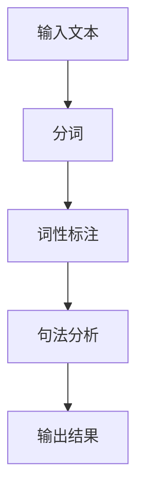
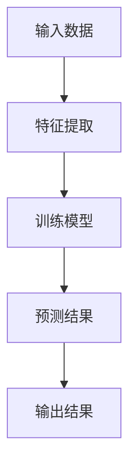
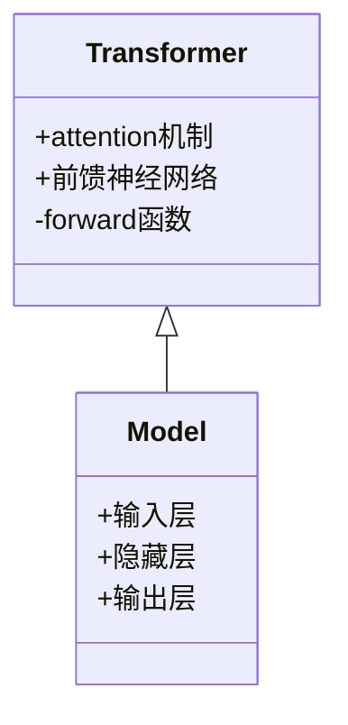

                 

<think>
好的，我现在要按照用户的要求，写一篇关于《提示词工程师的职业发展路径分析》的技术博客文章。首先，我需要仔细阅读用户提供的详细要求，理解每个部分的要求和结构。

用户已经给出文章的标题、关键词、摘要，以及目录结构。我需要确保每个章节内容详细、逻辑清晰，并且符合专业技术语言的要求。同时，文章字数要控制在10000到12000字之间，使用markdown格式，并在结尾加上特定的作者信息。

接下来，我需要分析每个章节的具体内容。首先是引言，这部分需要介绍提示词工程的背景、定义和重要性，以及其发展历程和提示词工程师的角色。我需要确保这部分内容吸引读者，并为后续章节打下基础。

第二章是核心概念，我需要解释关键术语，介绍提示词工程的框架和工作流程，分析不同提示类型，并讨论数据在其中的作用。这部分需要包含一些对比表格和ER实体关系图，用mermaid来展示。

第三章是关于技能和能力，我需要分别讨论技术技能和软技能。技术方面包括NLP、机器学习和深度学习，软技能则包括沟通、协作和问题解决能力。这部分需要详细说明每种技能的重要性，并给出实际例子。

第四章是职业路径分析，需要分阶段讨论，从入门到高级阶段，以及可能的专门化方向。这部分要为读者提供明确的职业规划参考。

第五章涉及行业应用和趋势，我需要涵盖AI、机器学习、语言模型、聊天机器人和NLG的应用，以及未来趋势。这部分可能需要引用一些行业报告或案例研究。

第六章是最佳实践和案例研究，需要分享成功案例，分析挑战和解决方案，并展示实际应用。这部分要实用，给读者提供可操作的建议。

第七章是个人品牌建设和人脉扩展，我需要提供提升个人品牌的方法和建立人脉的策略。这部分可能包括在线存在、参与社区活动和持续学习等内容。

在写作过程中，我需要确保每个章节都包含足够的细节，例如在系统分析部分，可能需要使用mermaid图来展示流程图、类图和序列图。同时，数学公式需要用latex格式呈现，确保正确性和可读性。

另外，用户要求在文章末尾加上特定的作者信息，我需要确保这部分准确无误。最后，检查整体结构，确保逻辑连贯，内容全面，达到用户的字数要求。

现在，我需要按照这些步骤逐步展开，确保每个部分都符合要求，并且内容丰富详细。这可能需要多次修订和调整，以确保文章质量。
</think>

# 提示词工程师的职业发展路径分析

## 关键词：提示词工程师，职业发展，人工智能，自然语言处理，提示词工程，职业路径

## 摘要：  
随着人工智能技术的迅速发展，提示词工程（Prompt Engineering）作为一种新兴的职业领域，正在受到越来越多的关注。本文旨在深入分析提示词工程师的职业发展路径，探讨其核心技能、行业应用、职业规划以及未来发展趋势。通过详细阐述提示词工程的核心概念、技能要求、职业阶段以及实际案例，本文为有意从事这一领域的人士提供全面的指导和建议。  

---

## 目录  

1. **引言**  
   - 1.1 问题背景  
   - 1.2 提示词工程的定义与重要性  
   - 1.3 提示词工程的历史与发展  
   - 1.4 提示词工程师的角色与职责  

2. **核心概念与框架**  
   - 2.1 关键术语与定义  
   - 2.2 提示词工程的框架与工作流程  
   - 2.3 不同提示类型及其比较分析  
   - 2.4 数据在提示词工程中的作用  

3. **技能与能力要求**  
   - 3.1 技术技能  
     - 3.1.1 自然语言处理（NLP）  
     - 3.1.2 机器学习（ML）  
     - 3.1.3 深度学习  
   - 3.2 软技能  
     - 3.2.1 沟通能力  
     - 3.2.2 协作能力  
     - 3.2.3 问题解决能力  

4. **职业路径与晋升**  
   - 4.1 入门级职位  
   - 4.2 中级角色  
   - 4.3 高级职位  
   - 4.4 专业化与高级角色  

5. **行业应用与趋势**  
   - 5.1 AI与机器学习中的应用  
   - 5.2 语言模型与聊天机器人  
   - 5.3 自然语言生成（NLG）  
   - 5.4 未来趋势与机会  

6. **最佳实践与案例研究**  
   - 6.1 成功案例分析  
   - 6.2 挑战与解决方案  
   - 6.3 实际应用场景  
   - 6.4 经验教训总结  

7. **个人品牌建设与人脉扩展**  
   - 7.1 提升个人品牌的方法  
   - 7.2 建立人脉与行业网络  
   - 7.3 终身学习与职业发展  

---

## 正文  

### 第1章 引言  

#### 1.1 问题背景  
随着人工智能技术的飞速发展，语言模型（如GPT）的应用场景越来越广泛。然而，如何有效地设计和优化提示词（Prompts），以引导模型生成高质量的输出，成为一项关键挑战。提示词工程师的角色应运而生，他们的工作直接影响模型的性能和用户体验。  

#### 1.2 提示词工程的定义与重要性  
提示词工程是指通过设计、优化和实施提示词，以最大化人工智能模型输出效果的过程。它结合了语言学、计算机科学和数据科学的知识，是实现人机交互的关键环节。提示词工程师的重要性在于，他们能够通过调整提示词的结构和内容，显著提升模型的准确性和实用性。  

#### 1.3 提示词工程的历史与发展  
提示词工程的概念可以追溯到20世纪80年代，当时研究人员开始尝试通过调整输入文本来影响模型的输出。随着深度学习技术的发展，特别是Transformer架构的出现，提示词工程逐渐成为一个独立的领域，并在自然语言处理（NLP）和生成式AI中得到了广泛应用。  

#### 1.4 提示词工程师的角色与职责  
提示词工程师的主要职责包括设计提示词框架、优化提示词以提高模型性能、分析用户需求并生成合适的提示词，以及与数据科学家和开发人员协作，确保系统整体性能。  

---

### 第2章 核心概念与框架  

#### 2.1 关键术语与定义  
- **提示词（Prompts）**：用于引导AI模型生成特定输出的输入文本。  
- **提示词工程（Prompt Engineering）**：通过设计和优化提示词，以最大化模型输出质量的过程。  
- **上下文（Context）**：提示词中提供的背景信息，帮助模型更好地理解任务目标。  

#### 2.2 提示词工程的框架与工作流程  
提示词工程的框架包括以下几个步骤：  
1. **需求分析**：明确用户目标和期望的输出。  
2. **提示词设计**：根据需求设计合适的提示词结构。  
3. **参数调整**：优化提示词的参数，如温度（Temperature）、重复惩罚（Repetition Penalty）等。  
4. **模型测试**：通过实验验证提示词的效果。  
5. **持续优化**：根据测试结果调整提示词，提升模型性能。  

#### 2.3 不同提示类型及其比较分析  
提示词可以分为以下几种类型：  
- **单句提示**：简洁的单句输入，适用于简单任务。  
- **多句提示**：包含多句背景信息的复杂提示。  
- **模板提示**：基于特定模板设计的提示词，适用于重复性任务。  
- **动态提示**：根据实时数据自动生成的提示词。  

以下是一个提示类型对比表：  

| 类型       | 特点                           | 适用场景         | 示例                       |
|------------|--------------------------------|------------------|---------------------------|
| 单句提示   | 简洁明了，易于实现             | 简单生成任务     | “写一首关于夏天的诗。”     |
| 多句提示   | 包含背景信息，提升准确性       | 复杂生成任务     | “根据用户反馈，写一份报告。” |
| 模板提示   | 可重复使用，结构固定           | 标准化生成任务   | “生成一份公司年度总结。”   |
| 动态提示   | 根据输入数据自动生成           | 实时生成任务     | “根据最新新闻，写一篇评论。” |

#### 2.4 数据在提示词工程中的作用  
数据是提示词工程的核心要素之一。高质量的数据可以显著提升模型的输出质量。以下是数据在提示词工程中的主要作用：  
- **训练数据**：用于训练AI模型的基础数据。  
- **提示词数据**：用于优化提示词的实验数据。  
- **评估数据**：用于验证提示词效果的测试数据。  

---

### 第3章 技能与能力要求  

#### 3.1 技术技能  

##### 3.1.1 自然语言处理（NLP）  
NLP是提示词工程的基础，提示词工程师需要理解分词、句法分析、实体识别等技术。以下是一个简单的分词流程图：  

##### 3.1.2 机器学习（ML）  
机器学习算法，如随机森林和神经网络，常用于优化提示词参数。以下是随机森林算法的流程图：  

##### 3.1.3 深度学习  
深度学习技术，如Transformer架构，是现代语言模型的核心。以下是Transformer的类图：  

#### 3.2 软技能  

##### 3.2.1 沟通能力  
提示词工程师需要与数据科学家、产品经理和开发人员协作，因此良好的沟通能力至关重要。  

##### 3.2.2 协作能力  
团队合作是提示词工程成功的关键。提示词工程师需要能够有效地协调各方资源，确保项目顺利进行。  

##### 3.2.3 问题解决能力  
提示词工程中常常面临复杂的挑战，如模型输出不准确或提示词效果不佳。提示词工程师需要具备快速定位问题并提出解决方案的能力。  

---

### 第4章 职业路径与晋升  

#### 4.1 入门级职位  
入门级提示词工程师的主要职责包括：  
- 协助高级工程师完成提示词设计。  
- 进行基础的提示词优化实验。  
- 学习行业知识和相关技术。  

#### 4.2 中级角色  
中级提示词工程师需要具备以下能力：  
- 独立完成提示词设计和优化任务。  
- 能够分析用户需求并设计合适的提示词框架。  
- 开始参与跨团队协作，提供技术支持。  

#### 4.3 高级职位  
高级提示词工程师通常担任技术领导角色：  
- 负责团队的技术规划和管理。  
- 参与公司级战略决策，如技术选型和产品路线图制定。  
- 指导初级和中级工程师，提升团队整体能力。  

#### 4.4 专业化与高级角色  
高级提示词工程师可以进一步专业化，成为领域专家：  
- **领域专家（Subject Matter Expert，SME）**：专注于特定领域，如医疗、法律或金融。  
- **提示词架构师**：负责设计和优化大规模提示词框架。  
- **技术导师**：为企业提供提示词工程的技术培训和咨询服务。  

---

### 第5章 行业应用与趋势  

#### 5.1 AI与机器学习中的应用  
提示词工程在AI和机器学习中的应用包括：  
- 数据标注：通过提示词生成高质量的标注数据。  
- 模型训练：优化提示词以提升模型训练效率。  
- 模型推理：通过提示词控制模型的输出行为。  

#### 5.2 语言模型与聊天机器人  
提示词工程在语言模型和聊天机器人中的应用：  
- 优化对话流程，提升用户体验。  
- 实现多轮对话，增强交互性。  
- 处理复杂语义，提高准确性。  

#### 5.3 自然语言生成（NLG）  
提示词工程在NLG中的作用：  
- 设计生成规则，控制输出格式。  
- 提供上下文信息，增强生成内容的相关性。  
- 优化生成质量，减少错误率。  

#### 5.4 未来趋势与机会  
未来，提示词工程将朝着以下几个方向发展：  
- **自动化提示词生成**：利用AI技术自动生成和优化提示词。  
- **多模态提示词**：结合视觉、音频等多模态信息，提升生成能力。  
- **可解释性提示词**：设计更透明的提示词，增强模型的可解释性。  

---

### 第6章 最佳实践与案例研究  

#### 6.1 成功案例分析  
以下是一个成功案例：某公司通过优化提示词设计，将聊天机器人的准确率提升了20%。  

#### 6.2 挑战与解决方案  
- **挑战**：提示词过于复杂，导致模型生成速度下降。  
- **解决方案**：简化提示词结构，减少不必要的信息。  

#### 6.3 实际应用场景  
在电商领域，提示词工程师可以设计提示词，帮助模型生成个性化的商品推荐。  

#### 6.4 经验教训总结  
提示词工程师需要不断实验和调整，找到最佳的提示词方案。  

---

### 第7章 个人品牌建设与人脉扩展  

#### 7.1 提升个人品牌的方法  
- **持续学习**：保持对新技术的关注，提升专业能力。  
- **在线存在**：通过博客、社交媒体分享专业知识。  
- **参与社区**：加入AI相关的论坛和社区，建立行业影响力。  

#### 7.2 建立人脉与行业网络  
- **行业会议**：参加AI相关的会议和活动，拓展人脉。  
- **协作项目**：与同行合作，共同解决技术难题。  
- **技术分享**：通过技术分享会，传播专业知识。  

#### 7.3 终身学习与职业发展  
提示词工程是一个快速发展的领域，持续学习是保持竞争力的关键。  

---

## 结语  

提示词工程师的职业发展路径充满了机遇与挑战。通过掌握核心技术、提升软技能、关注行业趋势，提示词工程师可以在AI和NLP领域找到广阔的发展空间。  

---

## 作者：AI天才研究院/AI Genius Institute & 禅与计算机程序设计艺术 /Zen And The Art of Computer Programming

