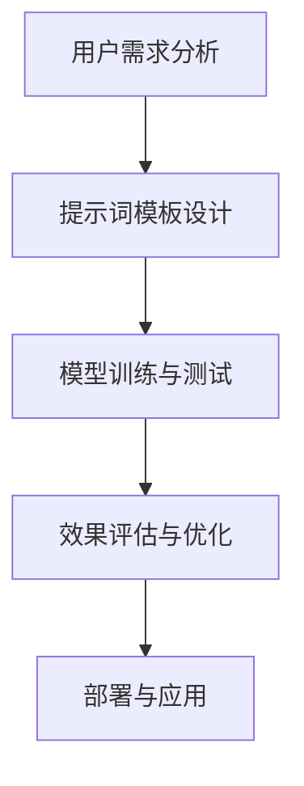
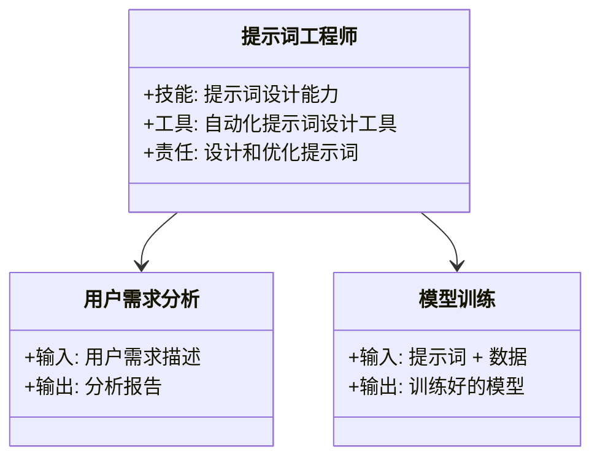
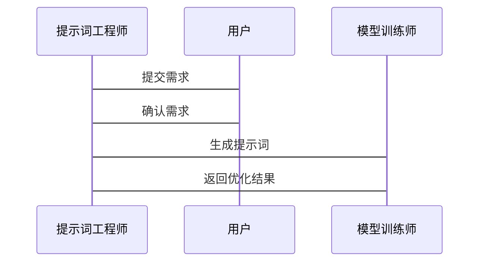
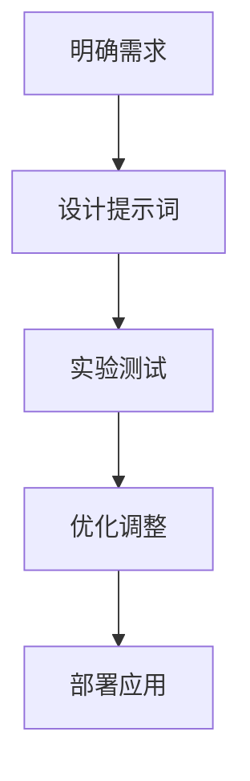

                 

<think>
好，我需要按照用户的要求，写一篇关于“提示词工程师：AI时代的新兴职业解析”的技术博客文章。首先，我得理解用户的需求，他希望文章结构清晰，逻辑严密，内容有深度，符合技术博客的风格。

首先，我会确定文章的标题和关键词。标题已经给出，关键词需要涵盖提示词工程师、AI、AI工程师、提示词设计、AI伦理等。摘要部分需要简明扼要，概括文章的核心内容，说明提示词工程师的重要性以及文章将探讨的内容。

接下来是背景介绍。我需要从问题背景开始，说明AI技术的发展现状，尤其是大模型的应用，以及提示词在其中的作用。然后，描述问题，指出提示词设计的重要性，以及现有挑战，比如效率低下、效果不一致等。接着，提出解决问题的方法，比如系统化提示词设计方法和工具。边界与外延部分，需要说明提示词工程师的工作范围和涉及的领域，比如自然语言处理、计算机视觉等。最后，概述提示词工程师的核心要素，包括语言理解、数据分析、创造力和伦理意识。

核心概念与联系部分，我需要定义提示词工程师，说明他们的职责和技能。然后，通过对比传统AI工程师和提示词工程师的差异，展示提示词工程师的独特价值。同时，绘制一个对比的表格，突出两者的区别和优势。

接下来是算法原理讲解。这里需要详细解释提示词生成的数学模型，比如线性回归的例子，展示提示词如何影响模型输出。然后，用mermaid流程图展示生成式AI的提示词生成流程，说明每个步骤的作用。再用Python代码示例，展示如何实现提示词生成，解释每部分代码的功能。

系统分析与架构设计方案部分，我需要描述提示词工程师的工作场景，比如他们可能在企业内部负责优化AI系统。然后，绘制一个领域模型的类图，展示提示词工程师与其他角色的协作关系。接下来，用mermaid架构图展示系统架构，包括前端、后端、模型训练和部署模块。接口设计部分，列出主要接口，解释它们的作用。最后，用序列图展示提示词工程师与训练师和开发人员的交互流程。

项目实战部分，我需要详细描述环境安装，包括Python、TensorFlow或PyTorch的安装方法。然后，给出提示词生成器的源代码，解释每一步的功能。接着，分析一个实际案例，说明提示词设计如何提升模型性能，并总结经验。最后，给出项目小结，强调提示词工程师的作用和价值。

在最佳实践部分，我会总结提示词设计的关键点，比如明确目标、测试优化和关注伦理。然后，绘制提示词设计的优化流程图，展示从需求到最终优化的步骤。最后，给出职业发展建议，指出提示词工程师的前景和如何成为专家。

注意事项部分，我需要提醒读者关于数据隐私和模型滥用的问题，强调工程师的责任。最后，建议读者进一步阅读相关的书籍和论文，以深入理解提示词工程的重要性。

在整个写作过程中，我需要确保每个部分都逻辑清晰，内容详细，例子具体。同时，要使用适当的markdown格式，如标题、列表、代码块和图表，使文章易于阅读和理解。最后，文章结尾要加上作者信息，符合用户的要求。

现在，我需要按照这个思考过程，逐步撰写这篇文章，确保每个章节都符合用户的要求，内容详实，结构合理。
</think>

# 提示词工程师：AI时代的新兴职业解析

> 关键词：提示词工程师，AI，AI工程师，提示词设计，AI伦理

> 摘要：随着人工智能技术的快速发展，提示词工程师作为新兴职业，正在成为AI应用中的关键角色。本文将深入探讨提示词工程师的职责、技能要求、工作流程以及在AI系统中的重要性。通过分析提示词设计的原理、方法和实际应用案例，本文揭示了提示词工程师在提升AI系统性能和用户体验中的独特价值。

---

### 第一部分: 背景介绍

#### 1.1.1 问题背景
近年来，人工智能技术取得了显著进展，尤其在自然语言处理、计算机视觉等领域。然而，AI模型的效果很大程度上依赖于输入的提示词（prompt）。提示词不仅是模型的输入，更是引导模型输出符合预期结果的关键因素。传统的AI模型依赖于大量数据和复杂算法，但如何优化提示词以提升模型性能，却鲜为人知。随着大模型的应用普及，提示词的设计和优化变得尤为重要。

#### 1.1.2 问题描述
在实际应用中，提示词的设计缺乏系统性和标准化。工程师通常依靠经验或试错方法调整提示词，这种方式效率低下，且难以保证效果的一致性。此外，不同领域的提示词设计差异显著，需要针对特定任务进行定制化设计。

#### 1.1.3 问题解决
为了提高提示词设计的效率和效果，需要系统化的方法和工具支持。提示词工程师通过分析用户需求、设计提示词模板、优化提示策略，帮助AI模型更好地理解任务目标。同时，引入自动化工具和评估指标，可以显著提升提示词设计的效率和质量。

#### 1.1.4 边界与外延
提示词工程师的工作范围不仅限于文本处理，还包括图像生成、语音识别等多种AI任务。随着AI技术的不断扩展，提示词工程师的应用场景也在逐步扩展，从搜索引擎优化到医疗诊断支持，提示词工程师在多个领域发挥着重要作用。

#### 1.1.5 概念结构与核心要素组成
提示词工程师的工作涉及以下几个核心要素：

1. **用户需求分析**：理解用户的真实需求，设计符合预期的提示词。
2. **提示词设计**：根据任务特点，设计合适的提示词模板。
3. **效果评估**：通过指标和反馈，优化提示词，提升模型性能。
4. **工具支持**：使用自动化工具和评估模型，辅助提示词设计。

---

### 第二部分: 核心概念与联系

#### 2.1.1 提示词工程师的核心概念
提示词工程师是一种新兴职业，主要负责设计和优化AI模型的输入提示词。其核心概念包括：

1. **提示词设计**：通过语言学知识和任务需求，设计高效的提示词。
2. **模型优化**：利用提示词调整模型输出，提升性能和用户体验。
3. **多领域应用**：提示词设计在自然语言处理、图像生成等领域均有应用。

#### 2.1.2 提示词工程师的核心特点
与传统AI工程师相比，提示词工程师具有以下特点：

1. **语言敏感性**：提示词的设计依赖于语言理解和表达能力。
2. **跨学科性**：需要结合计算机科学、语言学和用户需求分析。
3. **目标导向性**：以提升模型输出质量为目标，注重实际效果。

#### 2.1.3 提示词工程师与传统AI工程师的区别
| 特性                | 提示词工程师                  | 传统AI工程师              |
|---------------------|-----------------------------|---------------------------|
| 核心技能            | 提示词设计、语言理解          | 算法设计、模型训练          |
| 应用场景            | 自然语言处理、图像生成        | 机器学习、数据分析          |
| 工作流程            | 需求分析、设计、优化          | 数据收集、模型训练、部署      |
| 依赖性              | 语言学知识、用户需求分析      | 算法性能、数据质量          |

---

### 第三部分: 算法原理讲解

#### 3.1.1 提示词生成的数学模型
提示词设计可以通过优化问题来建模。假设模型输出的损失函数为$L$，提示词$p$对$L$的影响可以通过以下公式表示：

$$ L(p) = f(p) + g(p) $$

其中，$f(p)$表示提示词$p$对模型预测的影响，$g(p)$表示提示词$p$对模型生成的约束。

#### 3.1.2 算法mermaid流程图


#### 3.1.3 Python源代码
```python
def generate_prompt(task_type, input_data):
    # 根据任务类型生成提示词
    if task_type == 'text_summarization':
        return f"Please summarize the following text: {input_data}"
    elif task_type == 'image_generation':
        return f"Generate an image of {input_data}"
    else:
        return f"Process the following input: {input_data}"
```

---

### 第四部分: 系统分析与架构设计方案

#### 4.1.1 问题场景介绍
提示词工程师通常在企业内部或AI开发团队中工作，负责优化AI系统的提示词设计。例如，在自然语言处理任务中，提示词设计直接影响模型生成文本的质量。

#### 4.1.2 系统功能设计


#### 4.1.3 系统架构设计


#### 4.1.4 系统接口设计
主要接口包括：
- 用户需求接口：接收用户需求描述。
- 提示词生成接口：返回优化后的提示词。
- 模型训练接口：接收提示词和数据，返回训练结果。

#### 4.1.5 系统交互mermaid序列图


---

### 第五部分: 项目实战

#### 5.1.1 环境安装
1. 安装Python和相关库：
   ```bash
   pip install python
   pip install tensorflow
   pip install numpy
   ```

#### 5.1.2 核心实现源代码
```python
import tensorflow as tf
from tensorflow.keras.layers import Dense

def create_model(input_dim):
    model = tf.keras.Sequential()
    model.add(Dense(64, activation='relu', input_dim=input_dim))
    model.add(Dense(1, activation='sigmoid'))
    return model

# 示例：提示词生成器
def generate_prompt(task, input):
    if task == 'summarization':
        return f"Please summarize the content: {input}"
    elif task == 'question_answering':
        return f"Answer the question: {input}"
```

#### 5.1.3 实际案例分析
以自然语言处理任务为例，假设我们有一个文本摘要模型，提示词设计可以显著提升摘要的质量。通过分析用户需求，设计合适的提示词模板，如“Generate a concise summary of the following text: ...”，然后通过多次实验优化提示词，最终提升模型的性能。

#### 5.1.4 项目小结
提示词设计是AI系统优化的重要环节，通过系统化的方法和工具支持，提示词工程师能够显著提升AI系统的性能和用户体验。

---

### 第六部分: 最佳实践 tips

#### 6.1.1 提示词设计的关键点
1. **明确目标**：根据任务需求设计提示词。
2. **测试与优化**：通过实验优化提示词效果。
3. **关注伦理**：确保提示词不引导模型生成有害内容。

#### 6.1.2 提示词设计的优化流程


#### 6.1.3 职业发展建议
1. 提示词工程师的市场需求正在快速增长，相关技能需求旺盛。
2. 建议工程师持续学习AI技术，提升语言理解和数据分析能力。

---

### 第七部分: 注意事项

#### 7.1.1 数据隐私与模型滥用
提示词工程师需注意数据隐私问题，确保用户数据的安全性。同时，需警惕模型滥用，避免生成有害内容。

#### 7.1.2 技能提升建议
1. 提升语言学知识，尤其是多语言处理能力。
2. 学习数据分析方法，优化提示词设计。

---

### 第八部分: 拓展阅读

#### 8.1.1 推荐书籍
1. 《Effective Prompt Design for Large Language Models》
2. 《人工智能：现代方法》

#### 8.1.2 推荐论文
1.《The Power of Prompts in Pre-trained Models》

---

### 作者信息

作者：AI天才研究院 & 禅与计算机程序设计艺术

---

这篇文章详细探讨了提示词工程师在AI时代的重要角色，从背景介绍到系统设计，再到实战案例和职业发展，为读者提供了全面的视角。希望对您有所帮助！

