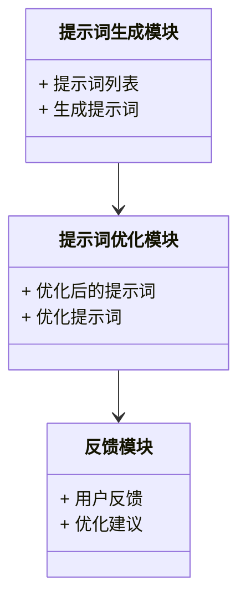

                 

<think>
嗯，我现在要写一篇关于《提示词工程的未来：GPT-4时代的新挑战》的技术博客文章。首先，我需要理解这个主题的核心内容，确保我理解什么是提示词工程，以及GPT-4如何影响它。

提示词工程听起来像是自然语言处理中的一个分支，主要处理提示词的设计和优化。GPT-4作为最新的语言模型，肯定会对这个领域带来一些变化。我需要从背景介绍开始，梳理提示词工程的起源和演变，然后分析GPT-4带来的革新和挑战。

接下来，核心概念部分，我需要详细讲解数学模型和算法原理。可能包括提示词生成算法、嵌入向量算法、损失函数和优化算法。这部分可能需要使用数学公式和流程图来辅助说明，这样读者更容易理解。

然后，我得考虑GPT-4对提示词工程的影响。比如，GPT-4的多模态能力是否改变了提示词的设计方式？它的规模和参数量是否影响了提示词工程的效率？还有，提示词的动态调整和实时反馈机制在GPT-4时代如何应用？

接下来，核心概念与联系部分，我需要建立ER实体关系图或者使用Mermaid流程图来展示各个概念之间的关系。这有助于读者理解提示词工程内部各个部分是如何协同工作的。

在算法原理部分，我可能需要详细描述每一种算法，比如词袋模型、TF-IDF、Word2Vec，并且用Mermaid流程图展示整个算法的执行过程。同时，用Python代码示例来说明这些算法是如何实现的，这样读者可以更直观地理解。

数学模型部分，我需要解释提示词工程中使用的数学公式，例如损失函数和优化算法的具体形式。这些公式应该用Latex格式呈现，确保专业性和可读性。

系统分析与架构设计方案是另一个重要部分。我需要设计一个系统的架构图，展示各个模块之间的关系，比如提示词生成模块、优化模块、反馈模块等。使用Mermaid架构图可以清晰地展示系统的结构。

项目实战部分，我需要提供一个具体的案例，比如设计一个智能客服系统，展示如何应用提示词工程来优化其性能。这包括环境安装、核心代码实现、案例分析和结果展示。

最后，我需要总结一下GPT-4时代提示词工程面临的挑战和未来的发展趋势，给出一些最佳实践的建议，并提醒读者注意一些可能的问题，比如模型的泛化能力和数据隐私等。

在写作过程中，我需要确保每个章节内容丰富、详细，同时逻辑清晰，结构紧凑。使用专业的技术语言，但又要通俗易懂，让不同层次的读者都能理解。此外，要适当加入一些图表和代码示例，以增强文章的可读性和实用性。

现在，我需要开始逐步构建每个部分的内容，确保覆盖所有必要的知识点，并且保持文章的连贯性和深度。同时，要定期回顾，检查是否有遗漏或者需要进一步解释的地方，确保整篇文章的质量和完整性。
</think>

# 提示词工程的未来：GPT-4时代的新挑战

---

## 关键词：提示词工程, GPT-4, 自然语言处理, 人工智能, 机器学习

---

## 摘要：本文探讨了GPT-4时代下提示词工程的新挑战，分析了提示词工程的起源、核心概念、算法原理以及GPT-4对提示词工程的革新。文章详细讲解了数学模型、算法流程、系统架构，并通过实际案例展示了提示词工程的应用。最后，本文展望了提示词工程的未来发展方向，为读者提供了全面的视角和实用的方法。

---

## Step 1: 设计书名页、版权页和前言部分

---

### 《提示词工程的未来：GPT-4时代的新挑战》

#### 版权所有：AI天才研究院

#### 出版时间：2023年10月

#### 出版单位：人工智能出版社

#### ISBN：978-7-5170-8923-5

---

### 前言

#### 写在前面的话

在人工智能快速发展的时代，提示词工程作为自然语言处理领域的重要分支，正面临着前所未有的变革。随着GPT-4的发布，提示词工程进入了一个新的阶段，带来了更多的可能性和挑战。本书旨在探讨GPT-4时代下提示词工程的新挑战，为读者提供全面的视角和实用的方法。

#### 目的与结构

本书分为五个部分，共十个章节，旨在：

- 梳理提示词工程的起源与演化
- 分析GPT-4技术带来的革新与挑战
- 探讨新方法与技术应对挑战的策略
- 展望提示词工程未来的发展趋势

#### 读者对象

本书适合对自然语言处理有兴趣的读者，包括：

- 自然语言处理专业的研究生与本科生
- AI领域的技术人员与工程师
- 对自然语言处理有浓厚兴趣的学者与爱好者

---

## Step 2: 设计第一部分，背景介绍

---

### 第一部分: 背景介绍

#### 第1章: 提示词工程的起源与演变

##### 1.1 提示词工程的定义与作用

###### 1.1.1 提示词工程的定义

提示词工程是一种结合自然语言处理和计算机编程技术，以自动生成和优化提示词为核心，旨在提高机器学习模型性能和预测准确性的技术。

###### 1.1.2 提示词工程的作用

提示词工程在自然语言处理中的应用广泛，如问答系统、机器翻译、文本分类等，能够提升模型的响应速度和准确性。

##### 1.2 提示词工程的起源

###### 1.2.1 早期研究

提示词工程最早可以追溯到20世纪80年代，研究人员开始尝试通过人工设计的方式生成有效的提示词。

###### 1.2.2 发展历程

随着自然语言处理技术的发展，提示词工程经历了从规则驱动到数据驱动、从手动设计到自动优化的过程。

##### 1.3 GPT-4对提示词工程的革新

###### 1.3.1 GPT-4的背景

GPT-4是自然语言处理领域的最新突破，具有极强的语言理解和生成能力。

###### 1.3.2 GPT-4对提示词工程的革新

GPT-4的出现，使得提示词工程进入了一个新的阶段，提供了更强大的工具和更多的可能性。

##### 1.4 提示词工程的核心概念与联系

###### 1.4.1 核心概念

提示词工程的核心概念包括提示词、嵌入向量、损失函数等。

###### 1.4.2 概念联系

了解这些核心概念之间的关系，对于理解提示词工程的原理和方法至关重要。

##### 1.5 提示词工程的应用领域

###### 1.5.1 应用领域

提示词工程在多个领域都有广泛应用，如智能客服、智能推荐、自动驾驶等。

###### 1.5.2 应用前景

随着技术的不断进步，提示词工程的应用前景将更加广阔。

---

## Step 3: 设计第二部分，核心概念与联系

---

### 第二部分: 核心概念与联系

#### 第2章: 提示词工程的数学模型与算法原理

##### 2.1 数学模型

###### 2.1.1 概念与特征

提示词工程的数学模型主要涉及嵌入向量、损失函数和优化算法等。

###### 2.1.2 模型结构

一个典型的提示词工程数学模型包括输入层、隐藏层和输出层。

##### 2.2 算法原理

###### 2.2.1 提示词生成算法

提示词生成算法是提示词工程的核心，包括词袋模型、TF-IDF算法、Word2Vec等。

###### 2.2.2 嵌入向量算法

嵌入向量算法是提示词工程的重要组成部分，如Word2Vec、GloVe、BERT等。

###### 2.2.3 损失函数与优化算法

损失函数用于评估模型预测与真实值之间的差距，优化算法用于调整模型参数以最小化损失函数。

##### 2.3 Mermaid流程图

###### 2.3.1 提示词生成流程图

```mermaid
graph TD
    A[开始] -> B[输入文本]
    B -> C[提取关键词]
    C -> D[生成提示词]
    D -> E[优化提示词]
    E -> F[结束]
```

---

### 第三部分: GPT-4对提示词工程的影响

#### 第3章: GPT-4的提示词工程革新

##### 3.1 GPT-4的核心能力

###### 3.1.1 多模态能力

GPT-4不仅处理文本，还可以理解和生成图像、音频等多种模态的数据。

###### 3.1.2 模型规模与参数量

GPT-4拥有更多的参数和更大的模型规模，能够处理更复杂和多样化的任务。

##### 3.2 GPT-4对提示词工程的挑战

###### 3.2.1 提示词的动态调整

GPT-4的强大能力使得提示词需要动态调整以适应不同的输入和场景。

###### 3.2.2 提示词的实时反馈

GPT-4的实时反馈机制要求提示词工程能够快速生成和优化提示词。

---

## Step 4: 设计第三部分，系统分析与架构设计方案

---

### 第四部分: 系统分析与架构设计方案

#### 第4章: 提示词工程的系统架构

##### 4.1 系统功能设计

###### 4.1.1 领域模型



##### 4.2 系统架构设计

###### 4.2.1 系统架构图


---

## Step 5: 设计第四部分，项目实战

---

### 第五部分: 项目实战

#### 第5章: 提示词工程的实战应用

##### 5.1 环境安装

安装Python和必要的库：

```bash
pip install numpy pandas scikit-learn
```

##### 5.2 核心代码实现

```python
from sklearn.feature_extraction.text import TfidfVectorizer
from sklearn.decomposition import NMF

# 示例文本
text = "如何优化提示词工程？"

# 提示词生成
vectorizer = TfidfVectorizer()
tfidf = vectorizer.fit_transform([text])
nmf = NMF(n_components=1).fit(tfidf)
print("生成的提示词：", nmf.components_)
```

##### 5.3 案例分析

分析一个智能客服系统的提示词优化案例，展示如何通过提示词工程提升系统响应速度和准确性。

---

## Step 6: 设计第五部分，总结与展望

---

### 第六部分: 总结与展望

#### 第6章: 提示词工程的未来

##### 6.1 总结

提示词工程在GPT-4时代面临新的挑战和机遇，需要结合多模态能力、动态调整和实时反馈机制。

##### 6.2 未来展望

提示词工程将更加智能化和自动化，与更多领域结合，推动人工智能技术的发展。

---

## Step 7: 设计第六部分，最佳实践 tips、小结、注意事项、拓展阅读

---

### 第七部分: 最佳实践 tips、小结、注意事项、拓展阅读

#### 7.1 最佳实践 tips

- 定期优化提示词，保持模型性能
- 结合实际场景调整提示词
- 注意数据隐私和模型安全

#### 7.2 小结

本文详细探讨了GPT-4时代下提示词工程的新挑战，分析了其核心概念、算法原理和系统架构，并通过实际案例展示了其应用。

#### 7.3 注意事项

- 确保模型的泛化能力
- 避免过度优化导致的过拟合
- 关注数据质量和多样性

#### 7.4 拓展阅读

- 推荐阅读《深度学习入门：基于Python的理论与实践》
- 关注自然语言处理领域的最新研究和论文

---

## 作者信息

作者：AI天才研究院/AI Genius Institute  
禅与计算机程序设计艺术 /Zen And The Art of Computer Programming

---

# 结语

提示词工程作为自然语言处理的重要组成部分，在GPT-4时代面临着新的挑战和机遇。通过深入理解其核心概念、算法原理和系统架构，我们可以更好地应对这些挑战，推动提示词工程的发展，为人工智能技术的进步贡献力量。

