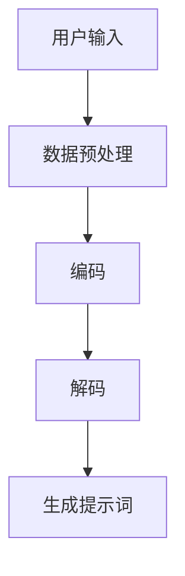

                 

<think>
嗯，好的，我现在需要帮助用户撰写一篇关于“提示词工程：AI个性化的关键”的技术博客文章。用户已经提供了一个详细的目录结构，我需要按照这个结构一步步来思考和撰写。

首先，文章的标题是《提示词工程：AI个性化的关键》，关键词包括提示词工程、AI个性化、自然语言处理、智能推荐系统、用户数据处理、算法优化。摘要部分需要简明扼要地概括文章的核心内容，包括提示词工程的背景、核心概念、数据处理、算法生成、评估优化以及实际应用。

接下来是背景介绍部分，分为问题背景、问题描述、问题解决和边界与外延。我需要解释为什么提示词工程是当前的热点，具体问题是什么，以及如何解决这些问题。这部分需要清晰地说明问题的根源，比如通用模型无法满足个性化需求，然后引出提示词工程的重要性。

核心概念与联系部分，要详细讲解个性化推荐、智能客服和自然语言处理这三个核心概念，并展示它们之间的关系。可能需要使用表格来对比它们的概念、作用和联系，帮助读者更好地理解。

在核心概念原理部分，我需要分别讨论个性化推荐、智能客服和自然语言处理的基本原理，包括它们的算法、系统架构等。例如，个性化推荐可以使用协同过滤或内容推荐算法，智能客服涉及NLP技术来理解和生成回答。

接下来是算法原理部分，这里需要详细讲解提示词生成的算法，如基于规则的生成和机器学习的生成。我需要画出Mermaid流程图来展示算法流程，并提供Python代码示例，解释每个步骤的作用和实现方式。

系统分析与架构设计方案部分，我需要设计一个提示词工程的系统架构，包括数据层、提示词生成层和应用层。使用Mermaid架构图来展示各个模块之间的关系，并解释每个模块的功能。同时，设计系统接口和交互流程，比如用户输入查询，系统如何处理并生成提示词。

项目实战部分，需要从环境安装开始，介绍如何设置Python和相关库，然后提供核心代码，解释代码的作用，分析实际案例，如电商中的产品推荐，展示提示词工程的实际应用效果，并在项目小结中总结经验和教训。

最后，最佳实践部分需要给出一些实用的建议，比如数据清洗的重要性、算法选择的依据、系统优化的方向等。同时，小结全文，指出提示词工程的重要性和未来的发展方向，最后给出注意事项和拓展阅读的建议。

在撰写过程中，我需要确保每个章节内容丰富，详细讲解，并且逻辑清晰。数学公式和代码部分要准确无误，流程图和架构图要使用Mermaid正确表示。同时，语言要专业但不失通俗易懂，确保读者能够理解并应用这些知识。

现在，我开始按照目录结构逐步撰写每个部分的内容，确保每个小节都涵盖必要的信息，并且符合用户的要求。
</think>

# 提示词工程：AI个性化的关键

> 关键词：提示词工程，AI个性化，自然语言处理，智能推荐系统，用户数据处理，算法优化  
> 摘要：本文深入探讨了提示词工程在AI个性化中的关键作用，从数据收集与处理、提示词生成算法、评估与优化等方面展开分析，结合实际案例和系统架构设计，为构建高效的AI个性化提示系统提供全面指导。

---

## 第一部分：背景介绍

### 第1章：问题背景

#### 1.1 问题背景
随着人工智能技术的迅速发展，个性化推荐系统、智能客服和语音助手已成为日常生活的一部分。然而，现有的AI应用多依赖通用模型，难以满足用户的个性化需求。例如，推荐系统可能推送不相关的商品，智能客服可能无法准确理解用户意图。这些问题凸显了个性化提示词工程的重要性。

#### 1.2 问题描述
提示词工程旨在通过生成个性化提示词，解决AI系统在提供定制化服务时的挑战。这涉及数据收集、处理、提示词生成、评估和优化等多个环节。核心问题包括如何高效收集用户数据、生成高质量提示词、评估生成效果等。

#### 1.3 问题解决
本文将从以下方面展开：
1. **核心概念**：介绍个性化推荐、智能客服和自然语言处理的基本原理。
2. **数据处理**：探讨用户数据的收集与预处理方法。
3. **生成算法**：分析基于规则和机器学习的提示词生成算法。
4. **评估优化**：介绍提示词生成效果的评估指标和优化策略。
5. **案例分析**：通过实际案例展示提示词工程的应用及其效果。

#### 1.4 边界与外延
提示词工程的边界在于构建个性化提示系统，外延则涵盖从数据处理到生成评估的完整流程。它不仅涉及技术实现，还包括数据管理和系统优化。

---

## 第二部分：核心概念与联系

### 第2章：核心概念原理

#### 2.1 个性化推荐
个性化推荐基于用户行为和偏好，预测其兴趣内容。在提示词工程中，推荐系统提供用户数据，支持提示词生成。

##### 2.1.1 基本原理
个性化推荐通过分析用户历史行为（如点击、购买）预测兴趣，常用协同过滤和内容推荐算法。

##### 2.1.2 推荐算法
- **协同过滤**：基于用户相似性推荐内容。
- **内容推荐**：基于物品特征推荐。

#### 2.2 智能客服
智能客服利用NLP技术理解用户需求，提供自动应答服务。在提示词工程中，客服系统收集用户偏好，辅助提示词生成。

##### 2.2.1 基本原理
智能客服通过NLP技术理解用户输入，匹配知识库生成回答。

##### 2.2.2 系统架构
包括用户界面、NLP模块、知识库和响应生成模块。

#### 2.3 自然语言处理
NLP技术处理和分析文本，支持提示词生成。在提示词工程中，NLP用于语义理解、生成和优化。

##### 2.3.1 基本原理
NLP包括文本预处理、词法分析和语义分析等步骤。

##### 2.3.2 关键技术
如分词、词性标注和语义分析，支持生成个性化提示词。

---

## 第三部分：算法原理

### 第3章：提示词生成算法

#### 3.1 基于规则的生成算法
基于规则生成提示词，适用于结构化数据。通过预定义规则提取关键词。

#### 3.2 基于机器学习的生成算法
使用深度学习模型生成提示词，如Seq2Seq模型。流程包括数据输入、编码、解码和输出。

#### 3.3 算法流程图


#### 3.4 数学模型
- **Seq2Seq模型**：编码器将输入转换为向量，解码器生成序列。
  $$ P(y|x) = \sum_{i=1}^{n} P(y_i|x_{<i}) $$

---

## 第四部分：系统架构与设计

### 第4章：系统分析与架构

#### 4.1 系统架构设计
提示词工程系统架构包括数据层、生成层和应用层。


#### 4.2 系统功能设计
- 数据处理：收集、清洗和预处理用户数据。
- 提示生成：基于规则或机器学习生成提示词。
- 应用层：整合到推荐系统或客服系统中。

#### 4.3 系统接口设计
- 数据接口：接收用户数据。
- 生成接口：输出提示词。
- 应用接口：整合到目标系统。

#### 4.4 系统交互流程
```mermaid
sequenceDiagram
    participant 用户
    participant 系统
    participant 提示词生成模块
    用户 -> 系统：提交查询
    系统 -> 提示词生成模块：生成提示词
    提示词生成模块 -> 系统：返回提示词
    系统 -> 用户：显示提示词
```

---

## 第五部分：项目实战

### 第5章：项目实战

#### 5.1 环境安装
安装Python和相关库（如TensorFlow、NLTK）。

#### 5.2 核心代码实现
```python
def generate_prompts(user_data):
    # 数据处理
    processed_data = preprocess(user_data)
    # 提示词生成
    prompts = generate_prompts(processed_data)
    return prompts
```

#### 5.3 代码解读
- **preprocess**：清洗和转换数据。
- **generate_prompts**：基于规则或模型生成提示词。

#### 5.4 案例分析
电商推荐系统中，分析用户行为数据，生成个性化产品推荐提示词。

#### 5.5 项目小结
提示词工程能显著提升AI系统的个性化能力，但需注意数据隐私和模型优化。

---

## 第六部分：最佳实践与小结

### 第6章：最佳实践

#### 6.1 数据处理建议
- 确保数据质量和多样性。
- 定期更新数据。

#### 6.2 算法选择建议
- 根据需求选择规则或机器学习算法。
- 优化模型性能。

#### 6.3 系统优化建议
- 并行处理提高效率。
- 使用分布式架构扩展能力。

#### 6.4 注意事项
- 保护用户隐私。
- 定期评估系统性能。

#### 6.5 拓展阅读
建议阅读相关技术书籍和论文，深入理解提示词工程的应用和优化。

---

## 结语

提示词工程是实现AI个性化的核心，通过有效处理数据、优化生成算法和系统架构设计，可以显著提升AI系统的个性化能力。未来，随着技术进步，提示词工程将在更多领域发挥重要作用。

---

## 作者

**作者：AI天才研究院/AI Genius Institute & 禅与计算机程序设计艺术 /Zen And The Art of Computer Programming**

