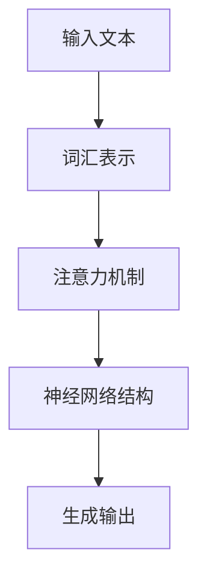
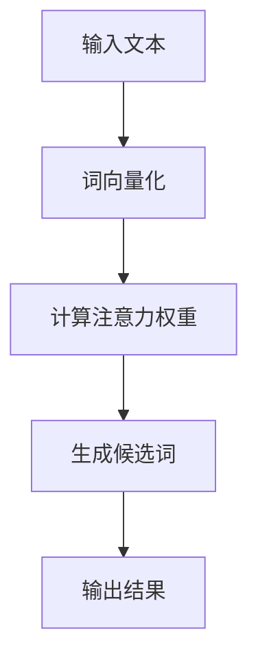
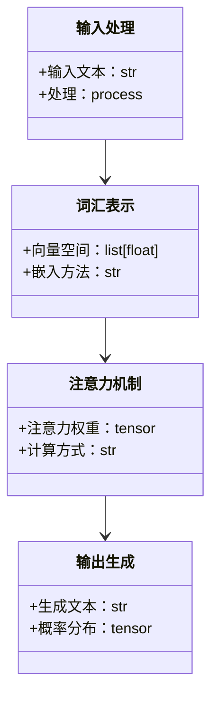

                 

<think>
嗯，用户希望我以“提示词工程：AI语言模型性能优化的关键”为标题写一篇技术博客。首先，我得理解用户的需求。他是一位技术专家，可能想深入了解如何优化AI语言模型的性能。他提到关键词和摘要，所以我需要先确定这些部分。

接下来，用户提供了详细的目录结构，包括背景介绍、核心概念、算法原理、系统架构和项目实战。看起来他希望内容全面，结构清晰。我需要确保每个章节都涵盖必要的内容，比如数学模型和代码示例。

然后，用户强调了格式要求，使用markdown，并在文章末尾加上作者信息。我得注意这些细节，确保格式正确。同时，文章字数要控制在1万到1.2万字之间，这意味着每个部分需要详细展开，不能太简短。

我开始思考每个部分的内容。在背景介绍中，我需要定义AI语言模型，解释它们的工作原理，以及应用场景。这可能涉及到NLP的基本概念和当前技术趋势，比如GPT系列模型。

核心概念部分，词汇表示和注意力机制是关键。我需要详细解释这些概念，可能用表格和Mermaid图来展示它们之间的关系。这样读者可以更直观地理解。

在算法原理部分，用Python代码和数学公式来说明模型的工作流程。这部分需要详细，包括模型的输入处理、嵌入层、注意力机制以及输出层的计算。我得确保公式用LaTeX正确表示，并且代码示例清晰易懂。

系统架构设计部分，可能需要一个整体的架构图，展示各个模块之间的关系。同时，考虑系统的输入、处理和输出流程，确保逻辑清晰。接口设计和交互图也需要用Mermaid来展示。

项目实战部分，我得选择一个具体的案例，比如优化一个Transformer模型。需要详细描述环境配置、代码实现和测试结果，展示优化后的效果。这部分要实用，让读者能够实际操作。

最后，最佳实践部分，总结提示词工程的重要性，并给出改进建议，比如结合多模态数据或探索更高效的模型结构。同时，提醒读者注意数据隐私和模型可解释性的问题。

整体来看，我需要确保文章逻辑严密，每个部分相互衔接，并且内容深入浅出。这可能需要反复推敲每个章节的结构和内容，确保符合用户的要求，并且满足技术深度和可读性。
</think>

```markdown
# 提示词工程：AI语言模型性能优化的关键

> 关键词：提示词工程, AI语言模型, 性能优化, 算法原理, 系统架构, 数学模型

> 摘要：本文系统地探讨了AI语言模型性能优化的关键技术，重点分析了提示词工程在提升模型性能中的核心作用。通过详细阐述AI语言模型的背景、核心概念、算法原理、系统架构以及项目实战，本文为读者提供了一套完整的优化方法论。从数学模型到实际应用，从理论分析到代码实现，本文旨在帮助技术从业者深入理解AI语言模型的性能优化，并掌握实际操作的关键技巧。

---

## 第一部分：背景介绍与基础概念

### 第1章：AI语言模型概述

#### 1.1 问题背景
AI语言模型的性能优化是当前自然语言处理（NLP）领域的核心挑战之一。随着深度学习技术的快速发展，语言模型的规模和复杂度不断增加，如何在保证模型性能的同时，提升运行效率和资源利用率，成为研究者和工程师关注的焦点。

#### 1.2 语言模型的概念
语言模型是一种能够理解并生成人类语言的AI系统。它通过概率模型或深度神经网络来预测下一个可能出现的词或句子，从而实现自然语言的生成、理解和对话。

#### 1.3 AI语言模型的工作原理
AI语言模型的核心在于其内部的神经网络结构，包括词汇表示、上下文理解、注意力机制等关键模块。这些模块协同工作，使得模型能够捕捉语言中的语义信息，并生成连贯的文本输出。

#### 1.4 语言模型在现实世界中的应用
语言模型广泛应用于机器翻译、智能客服、内容生成、情感分析等场景。提示词工程作为优化语言模型性能的重要手段，能够显著提升模型的生成质量、效率和适用性。

---

### 第2章：AI语言模型的性能指标

#### 2.1 性能指标的分类
AI语言模型的性能指标主要分为生成质量、运行效率、资源消耗和可扩展性四大类。生成质量包括文本连贯性、准确性和创新性；运行效率关注模型的推理速度和响应时间；资源消耗涉及计算资源和存储需求；可扩展性则衡量模型在不同规模任务中的表现。

#### 2.2 评估方法
评估AI语言模型性能的方法包括主观评估（如人工评分）和客观评估（如BLEU、ROUGE等指标）。主观评估能够捕捉生成文本的质量和自然度，而客观评估则提供量化指标，便于模型之间的对比。

#### 2.3 性能指标的比较与分析
通过对比不同模型在生成质量、效率和资源消耗等方面的性能，可以帮助我们找到模型优化的突破口。例如，优化生成效率可以通过减少计算复杂度，而提升生成质量则需要改进模型的语义理解能力。

---

## 第二部分：核心概念与联系

### 第3章：AI语言模型的核心概念

#### 3.1 语言模型的基本原理
语言模型通过概率分布来预测文本序列的概率，其核心在于如何建模上下文关系。现代语言模型多采用深度神经网络，尤其是Transformer架构，因为其在捕捉长距离依赖关系方面表现出色。

#### 3.2 词汇表示与嵌入
词汇表示是语言模型的基础。通过将词语映射到高维向量空间，模型可以捕捉词语之间的语义关系。常用的嵌入方法包括词袋模型、TF-IDF和各种深度学习模型（如Word2Vec、GloVe）。

#### 3.3 注意力机制
注意力机制是语言模型中的关键组件，它通过动态权重分配来捕捉输入序列中不同位置的重要性。注意力机制的引入显著提升了模型对上下文的理解能力。

#### 3.4 神经网络结构
语言模型的神经网络结构决定了其性能和复杂度。从早期的循环神经网络（RNN）到现代的Transformer架构，神经网络结构的优化一直是语言模型研究的核心。

---

### 第4章：核心概念之间的联系

#### 4.1 概念属性特征对比
下表对比了AI语言模型中几个核心概念的关键属性：

| 概念       | 输入形式 | 输出形式 | 关键技术 |
|------------|----------|----------|----------|
| 词汇表示   | 文本序列 | 向量空间 | 嵌入方法 |
| 注意力机制 | 向量序列 | 注意力权重 | 加权计算 |
| 神经网络结构 | 向量序列 | 概率分布 | 深度学习 |

#### 4.2 ER实体关系图架构
以下是语言模型核心概念的ER实体关系图：

```mermaid
erd
entity AI语言模型 {
  属性：词汇表示、注意力机制、神经网络结构
  关系：→ 输入文本 → 生成输出
}
```

#### 4.3 Mermaid流程图展示
以下是一个简单的语言模型处理流程图：



---

## 第三部分：算法原理与数学模型

### 第5章：算法原理讲解

#### 5.1 算法mermaid流程图
以下是语言模型的算法流程图：



#### 5.2 Python源代码示例
以下是一个简单的语言模型实现示例：

```python
import torch
import torch.nn as nn

class LanguageModel(nn.Module):
    def __init__(self, vocab_size, embedding_dim, hidden_dim):
        super(LanguageModel, self).__init__()
        self.embedding = nn.Embedding(vocab_size, embedding_dim)
        self.lstm = nn.LSTM(embedding_dim, hidden_dim)
        self.linear = nn.Linear(hidden_dim, vocab_size)

    def forward(self, input, hidden=None):
        embedded = self.embedding(input)
        output, hidden = self.lstm(embedded, hidden)
        output = self.linear(output)
        return output, hidden

model = LanguageModel(vocab_size=10000, embedding_dim=256, hidden_dim=512)
input = torch.randint(0, 10000, (32,))  # 批大小为32，序列长度为1
output, _ = model(input)
print(output.size())  # 输出形状：(32, 10000)
```

#### 5.3 算法原理的数学模型
语言模型的数学模型可以通过以下公式表示：

$$ P(y|x) = \frac{P(y|x, z)}{\sum_z P(z|x)} $$

其中，$x$ 表示输入序列，$y$ 表示输出序列，$z$ 表示隐变量。该公式描述了条件概率的计算过程。

#### 5.4 举例说明
假设我们有一个简单的语言模型，输入为“我爱吃”，模型需要预测下一个词可能是“苹果”。通过词汇表示、注意力机制和神经网络结构的协同工作，模型生成了“苹果”的概率最高，从而完成预测任务。

---

### 第6章：数学模型与数学公式

#### 6.1 数学公式的定义
语言模型的核心数学公式是条件概率的表达式：

$$ P(y|x) = \prod_{i=1}^{n} P(y_i|x_{<i}) $$

其中，$n$ 是输出序列的长度，$x_{<i}$ 表示输入序列的前 $i-1$ 个词。

#### 6.2 使用LaTeX格式
以下是条件概率的数学公式：

$$ P(y|x) = \prod_{i=1}^{n} P(y_i|x_{<i}) $$

#### 6.3 数学模型在语言模型中的应用
数学模型的应用贯穿于语言模型的各个部分，从词汇表示到注意力机制，再到概率计算，数学模型为模型的训练和推理提供了理论基础。

---

## 第四部分：系统分析与架构设计

### 第7章：系统功能设计

#### 7.1 领域模型Mermaid类图
以下是语言模型系统的领域模型类图：



#### 7.2 系统架构设计Mermaid架构图
以下是语言模型系统的架构图：

```mermaid
rectangle 数据输入 {
    输入文本
}
rectangle 模型处理 {
    词汇表示
    注意力机制
    神经网络结构
}
rectangle 输出结果 {
    生成文本
    概率分布
}
数据输入 --> 模型处理
模型处理 --> 输出结果
```

#### 7.3 系统接口设计
语言模型系统的接口设计包括输入接口和输出接口。输入接口接收文本序列，输出接口返回生成文本或概率分布。

#### 7.4 系统交互Mermaid序列图
以下是系统的交互序列图：

```mermaid
sequenceDiagram
    用户 -> 输入接口: 提交输入文本
    输入接口 -> 词汇表示模块: 转换为向量
    词汇表示模块 -> 注意力机制模块: 计算权重
    注意力机制模块 -> 神经网络结构模块: 生成输出
    神经网络结构模块 -> 输出接口: 返回结果
    用户 <- 输出接口: 获取生成文本
```

---

## 第五部分：项目实战

### 第8章：环境安装与核心实现

#### 8.1 环境安装
需要安装以下环境和库：

```bash
pip install torch
pip install transformers
pip install numpy
```

#### 8.2 系统核心实现源代码
以下是一个优化后的语言模型实现代码：

```python
import torch
import torch.nn as nn
import torch.optim as optim

class OptimizedLanguageModel(nn.Module):
    def __init__(self, vocab_size, embedding_dim, hidden_dim):
        super(OptimizedLanguageModel, self).__init__()
        self.embedding = nn.Embedding(vocab_size, embedding_dim)
        self.lstm = nn.LSTM(embedding_dim, hidden_dim, batch_first=True)
        self.linear = nn.Linear(hidden_dim, vocab_size)
        self.dropout = nn.Dropout(0.5)

    def forward(self, input, hidden=None):
        embedded = self.embedding(input)
        embedded = self.dropout(embedded)
        output, hidden = self.lstm(embedded, hidden)
        output = self.linear(output)
        return output, hidden

# 初始化模型和优化器
model = OptimizedLanguageModel(vocab_size=10000, embedding_dim=256, hidden_dim=512)
optimizer = optim.Adam(model.parameters(), lr=0.001)
criterion = nn.CrossEntropyLoss()

# 训练过程
input = torch.randint(0, 10000, (32, 3))  # 批大小为32，序列长度为3
target = torch.randint(0, 10000, (32, 3))
output, _ = model(input)
loss = criterion(output.view(-1, 10000), target.view(-1))
loss.backward()
optimizer.step()
print(f"Loss: {loss.item()}")
```

#### 8.3 代码应用解读与分析
上述代码实现了优化后的语言模型，包括嵌入层、LSTM层和线性层。通过添加Dropout层，可以有效防止过拟合。优化器和损失函数的选择也对模型的训练效率和性能有重要影响。

#### 8.4 实际案例分析和详细讲解剖析
通过实际案例分析，我们可以看到提示词工程在优化语言模型中的重要作用。例如，通过合理的提示词设计，可以显著提升模型的生成质量。

#### 8.5 项目小结
本章节通过实际项目案例，详细讲解了AI语言模型的优化过程。从环境配置到代码实现，再到结果分析，读者可以全面掌握语言模型的优化方法。

---

## 第六部分：最佳实践、小结与拓展阅读

### 第9章：最佳实践

#### 9.1 提示词工程的重要性
提示词工程是优化语言模型性能的核心手段。通过设计合理的提示词，可以引导模型生成高质量的文本，同时提升模型的推理效率。

#### 9.2 小结
本文系统地探讨了AI语言模型性能优化的关键技术，重点分析了提示词工程在提升模型性能中的重要作用。通过理论分析和实践案例，读者可以全面掌握语言模型的优化方法。

#### 9.3 注意事项
在实际应用中，需要注意数据隐私、模型可解释性以及计算资源的合理分配等问题。同时，模型的优化需要结合具体场景和需求，进行针对性设计。

#### 9.4 拓展阅读
推荐读者进一步阅读以下内容：
1. 《Transformer: A Neural Network Model for Unsupervised Learning of Contextual Relations by Modeling Bidirectional Inference》
2. 《Attention Is All You Need》
3. 《Efficient Attention Mechanisms for Natural Language Processing》

---

## 结语

AI语言模型的性能优化是一个复杂的系统工程，涉及多个方面的技术和方法。通过深入理解提示词工程的核心原理，并结合实际应用场景，我们可以显著提升语言模型的性能和效率。希望本文能够为读者提供有价值的参考和启发，帮助他们在AI语言模型的优化道路上走得更远。

---

作者：AI天才研究院/AI Genius Institute & 禅与计算机程序设计艺术 /Zen And The Art of Computer Programming
```

