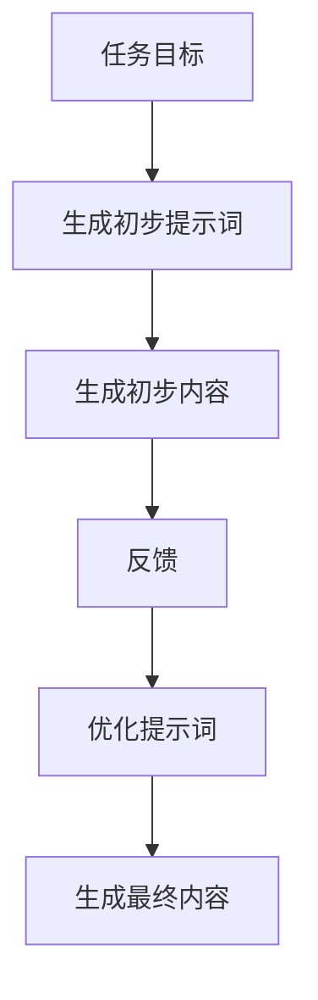
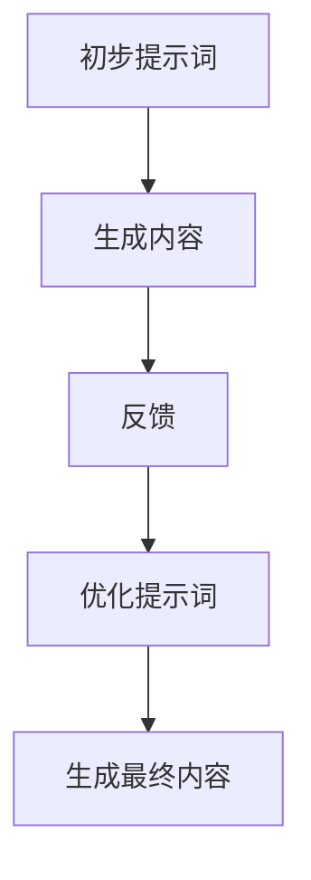

                 

<think>
嗯，好的，我需要先理解用户的需求。他希望我以《提示词工程：优化AI-人类创意协作的关键》为标题，写一篇技术博客文章。看起来他要求很高，包括目录、关键词、摘要，以及各个章节的具体内容，甚至要使用特定的格式，比如Markdown，还要包含mermaid图和Python代码。

首先，我需要明确用户的身份。他可能是一位技术专家，或者是CTO，或者是畅销书作者，所以他需要一篇结构清晰、内容详尽的技术博客，可能用于分享或出版。他的深层需求可能是希望文章不仅有理论，还要有实际的应用案例和代码，这样读者可以真正理解和应用这些概念。

接下来，我需要分析每个章节的具体要求。第一部分是问题背景与核心概念，要包括问题描述、解决、边界、概念结构等。我得确保每个小节都有足够的细节，比如在问题背景中，要说明AI协作的挑战，提示词工程的重要性。

第二部分是核心概念与联系，需要对比人类和AI的创意能力，绘制ER实体关系图。这部分可能需要更多的技术细节，比如用mermaid图来展示，这样读者可以直观理解。

第三部分是算法原理，这里需要详细讲解提示词生成和优化的算法，包括流程图、Python代码、数学模型。这部分可能需要更多的技术深度，确保代码正确，数学公式准确。

第四部分是系统分析与架构设计，涉及系统功能设计、架构图、接口设计。这部分需要实际应用场景的分析，可能需要考虑系统的可扩展性和维护性。

第五部分是项目实战，包括环境安装、代码实现、案例分析。这部分要实用，让读者能够动手操作，看到实际效果。

我还要注意文章的字数在10000到12000字左右，这意味着每个部分都要足够详细，但又不能过于冗长。另外，格式要求严格，使用Markdown，并且在适当的地方使用mermaid图和latex公式。

可能的难点在于如何将理论与实践结合，确保每个算法都有实际的应用例子，同时系统设计部分要清晰明了，让读者能够理解并应用到自己的项目中。

最后，确保文章的结构完整，每个章节都有小结，总结该部分的核心内容，帮助读者巩固理解。同时，在末尾加上作者信息，符合出版规范。

总的来说，我需要一步步地按照用户的要求，确保每个部分都详细且符合技术要求，同时保持文章的流畅性和可读性。
</think>

# 提示词工程：优化AI-人类创意协作的关键

> 关键词：提示词工程，AI-人类协作，创意协作，提示词生成算法，系统架构设计

> 摘要：  
提示词工程是优化AI与人类创意协作的关键技术，通过设计和优化提示词，可以显著提升AI生成内容的质量和相关性。本文从问题背景出发，深入分析提示词工程的核心概念、算法原理、系统架构设计以及实际项目实现，探讨其在AI-人类协作中的应用价值和未来发展方向。

---

### 第一部分：问题背景与核心概念

#### 第1章：问题背景与核心概念

##### 1.1 问题描述

- **人类与AI协作面临的挑战**  
  尽管AI技术快速发展，但AI在创意领域的表现仍存在局限性。AI生成的内容可能缺乏深度、逻辑性不足，或者无法准确理解人类意图。  
  例如，在创意写作、设计辅助等领域，AI生成的结果往往需要大量人工调整，导致效率低下。

- **AI创意能力的局限性**  
  AI依赖于训练数据，其生成能力受限于数据质量和多样性。此外，AI难以理解复杂的语境和情感需求，导致生成结果难以满足人类期望。

- **提示词工程的重要性**  
  提示词工程通过优化输入提示词，帮助AI更好地理解任务目标和创意需求。它是连接人类意图与AI生成能力的桥梁，能够显著提升协作效率和成果质量。

##### 1.2 问题解决

- **提示词工程的基本概念**  
  提示词工程是指通过设计和优化提示词，使AI能够生成更符合人类需求的内容。提示词是AI创意协作的核心输入，直接影响生成结果的质量。

- **提示词工程在AI-人类协作中的角色**  
  提示词工程通过优化输入提示词，帮助AI理解任务目标、创作风格和创意方向。它是AI-人类协作中的关键环节，能够显著提升协作效率和成果质量。

##### 1.3 边界与外延

- **提示词工程的适用范围**  
  提示词工程适用于需要AI生成创意内容的场景，如文本生成、图像设计、音乐创作等。它尤其适合需要高度定制化和高质量输出的任务。

- **提示词工程与其他相关领域的区别**  
  与传统的NLP任务（如机器翻译、文本分类）不同，提示词工程更关注创意协作中的提示优化，强调提示词的设计和动态调整。

##### 1.4 概念结构与核心要素

- **提示词工程的组成要素**  
  - **提示词设计**：根据任务目标设计提示词。  
  - **提示词优化**：通过反馈机制动态调整提示词。  
  - **提示词生成算法**：基于提示词生成高质量内容。  

- **提示词工程的关键技术**  
  - 提示词生成算法：如基于GPT的提示词生成模型。  
  - 提示词优化算法：如基于强化学习的提示词优化方法。  

##### 1.5 本章小结

- **对提示词工程的总体认识**  
  提示词工程是AI-人类协作中的关键技术，通过优化提示词，能够显著提升AI生成内容的质量和相关性。  

- **提示词工程的应用前景**  
  随着AI技术的不断进步，提示词工程将在更多领域得到应用，成为AI-人类协作的核心技术之一。

---

### 第二部分：核心概念与联系

#### 第2章：核心概念与联系

##### 2.1 AI与人类协作的原理

- **AI与人类协作的模式**  
  AI与人类协作通常包括以下步骤：  
  1. 人类提出任务目标。  
  2. AI根据提示词生成初步结果。  
  3. 人类对结果进行反馈和调整。  
  4. AI根据反馈优化提示词并生成最终结果。  

- **协作中的信息传递机制**  
  提示词是信息传递的核心。人类通过提示词向AI传达任务目标、创作风格和创意方向。AI通过生成内容向人类反馈结果。

##### 2.2 核心概念属性特征对比

| **属性**         | **人类创意能力**               | **AI创意能力**                  |
|------------------|-------------------------------|---------------------------------|
| 创造性           | 高，能够生成多样化的创意       | 依赖数据，创造性有限           |
| 理解能力         | 高，能够理解复杂语境和情感     | 低，难以理解复杂语境和情感     |
| 反馈能力         | 高，能够根据反馈调整创作方向   | 低，需要提示词指导调整方向     |
| 个性化           | 高，能够根据个人风格生成内容   | 有限，依赖训练数据的多样性     |

##### 2.3 ER实体关系图架构

```mermaid
er
actor: User
action: 提示词工程
artifact: 提示词
artifact: 生成内容
action: 优化提示词
```

- **关键实体与关系定义**  
  - **User（用户）**：提供任务目标和反馈。  
  - **Artifact（提示词）**：用户提供的输入，用于指导AI生成内容。  
  - **Action（提示词工程）**：通过优化提示词，提升生成内容的质量。  

##### 2.4 提示词工程的类型与分类

- **提示词工程的分类方法**  
  - **基于任务的分类**：根据任务类型（如文本生成、图像设计）进行分类。  
  - **基于优化方法的分类**：根据提示词优化算法（如强化学习、遗传算法）进行分类。  

- **不同类型提示词工程的特点**  
  - **文本生成提示词工程**：优化提示词以生成高质量文本。  
  - **图像设计提示词工程**：优化提示词以生成符合创意需求的图像。  

##### 2.5 本章小结

- **对提示词工程核心概念的理解**  
  提示词工程是AI与人类协作的核心技术，通过优化提示词，能够显著提升生成内容的质量和相关性。  

- **提示词工程在不同领域的应用**  
  提示词工程在文本生成、图像设计、音乐创作等领域都有广泛应用，未来将拓展到更多领域。

---

### 第三部分：算法原理讲解

#### 第3章：算法原理讲解

##### 3.1 提示词生成算法

- **提示词生成算法的基本原理**  
  提示词生成算法基于预训练语言模型（如GPT），通过优化提示词生成高质量内容。

- **提示词生成算法的流程**  
  1. 输入任务目标。  
  2. 生成初步提示词。  
  3. 根据反馈优化提示词。  
  4. 生成最终内容。  



- **提示词生成算法的Python实现**  
  ```python
  def generate_prompt(task):
      # 根据任务生成初步提示词
      initial_prompt = f"Create a {task}..."
      return initial_prompt
  ```

##### 3.2 提示词优化算法

- **提示词优化算法的原理**  
  基于强化学习，通过不断调整提示词，提升生成内容的质量。

- **提示词优化算法的流程**  
  1. 生成初步提示词。  
  2. 根据生成内容的反馈优化提示词。  
  3. 循环优化，直到生成高质量内容。  



- **提示词优化算法的Python实现**  
  ```python
  def optimize_prompt(initial_prompt, feedback):
      # 根据反馈优化提示词
      optimized_prompt = f"{initial_prompt} {feedback}"
      return optimized_prompt
  ```

##### 3.3 算法原理Mermaid流程图

- **提示词生成算法的Mermaid流程图**  
  ```mermaid
  graph TD
      A[任务目标] --> B[生成初步提示词]
      B --> C[生成初步内容]
      C --> D[反馈]
      D --> E[优化提示词]
      E --> F[生成最终内容]
  ```

- **提示词优化算法的Mermaid流程图**  
  ```mermaid
  graph TD
      A[初步提示词] --> B[生成内容]
      B --> C[反馈]
      C --> D[优化提示词]
      D --> E[生成最终内容]
  ```

##### 3.4 Python源代码实现

- **提示词生成算法的Python实现**  
  ```python
  def generate_prompt(task):
      initial_prompt = f"Create a {task}..."
      return initial_prompt
  ```

- **提示词优化算法的Python实现**  
  ```python
  def optimize_prompt(initial_prompt, feedback):
      optimized_prompt = f"{initial_prompt} {feedback}"
      return optimized_prompt
  ```

##### 3.5 算法原理数学模型与公式

- **提示词生成算法的数学模型**  
  提示词生成算法基于语言模型的条件概率公式：  
  $$ P(\text{content} | \text{prompt}) $$  

- **提示词优化算法的数学模型**  
  提示词优化算法基于强化学习的损失函数：  
  $$ L = \sum_{i=1}^{n} (y_i - \hat{y_i})^2 $$  

##### 3.6 通俗易懂的举例说明

- **提示词生成算法的应用实例**  
  任务目标：生成一篇科技博客文章。  
  初步提示词：Create a blog post about AI.  
  最终提示词：Create a detailed blog post about AI in creative collaboration.

- **提示词优化算法的应用实例**  
  初步提示词：Create a blog post about AI.  
  反馈：文章缺乏实际案例。  
  优化后的提示词：Create a detailed blog post about AI in creative collaboration with real-world examples.

##### 3.7 本章小结

- **对提示词工程算法原理的深入理解**  
  提示词生成和优化算法是提示词工程的核心，通过数学模型和算法优化，能够显著提升生成内容的质量。  

- **算法在实际应用中的价值**  
  这些算法能够帮助人类更高效地与AI协作，生成高质量的内容，提升创意协作的效率和成果质量。

---

### 第四部分：系统分析与架构设计

#### 第4章：系统分析与架构设计

##### 4.1 问题场景介绍

- **提示词工程的应用场景**  
  提示词工程广泛应用于文本生成、图像设计、音乐创作等领域，尤其适用于需要高度定制化生成内容的任务。

- **提示词工程面临的挑战**  
  - 提示词设计的复杂性。  
  - 提示词优化的实时性要求。  

##### 4.2 项目介绍

- **提示词工程项目的背景**  
  随着AI技术的快速发展，提示词工程逐渐成为AI-人类协作的核心技术。

- **项目目标与预期成果**  
  - 提供高效的提示词生成和优化工具。  
  - 提升AI生成内容的质量和相关性。  

##### 4.3 系统功能设计

- **系统功能的定义与描述**  
  - 提示词生成功能：根据任务生成初步提示词。  
  - 提示词优化功能：根据反馈优化提示词。  
  - 内容生成功能：根据优化后的提示词生成最终内容。  

- **领域模型Mermaid类图**  
  ```mermaid
  classDiagram
      class User {
          - task
          - feedback
          + generate_task()
          + optimize_prompt()
      }
      class PromptEngine {
          - prompt
          + generate_prompt(task)
          + optimize_prompt(feedback)
      }
      class AIModel {
          - content
          + generate_content(prompt)
      }
      User --> PromptEngine: generate_task
      PromptEngine --> AIModel: generate_content
      AIModel --> PromptEngine: return_content
      User --> PromptEngine: optimize_prompt
  ```

##### 4.4 系统架构设计

- **系统架构的设计原则**  
  - 高可用性：确保系统能够实时处理提示词生成和优化任务。  
  - 可扩展性：支持不同类型的提示词工程应用。  

- **系统架构Mermaid架构图**  
  ```mermaid
  rectangle User {
      generate_task()
      optimize_prompt()
  }
  rectangle PromptEngine {
      generate_prompt(task)
      optimize_prompt(feedback)
  }
  rectangle AIModel {
      generate_content(prompt)
  }
  User --> PromptEngine: generate_task
  PromptEngine --> AIModel: generate_content
  AIModel --> PromptEngine: return_content
  User --> PromptEngine: optimize_prompt
  ```

##### 4.5 系统接口设计

- **系统接口的功能与规范**  
  - 提示词生成接口：接受任务目标，返回初步提示词。  
  - 提示词优化接口：接受反馈，返回优化后的提示词。  

- **系统接口Mermaid序列图**  
  ```mermaid
  sequenceDiagram
      User->>PromptEngine: generate_task()
      PromptEngine->>AIModel: generate_content(prompt)
      AIModel->>PromptEngine: return_content()
      User->>PromptEngine: optimize_prompt()
      PromptEngine->>AIModel: generate_content(optimized_prompt)
      AIModel->>User: final_content()
  ```

##### 4.6 系统交互

- **系统交互的流程与机制**  
  1. 用户提出任务目标。  
  2. 系统生成初步提示词。  
  3. 系统生成初步内容。  
  4. 用户反馈优化建议。  
  5. 系统优化提示词。  
  6. 系统生成最终内容。  

- **系统交互Mermaid序列图**  
  ```mermaid
  sequenceDiagram
      User->>PromptEngine: generate_task()
      PromptEngine->>AIModel: generate_content(prompt)
      AIModel->>User: initial_content()
      User->>PromptEngine: optimize_prompt()
      PromptEngine->>AIModel: generate_content(optimized_prompt)
      AIModel->>User: final_content()
  ```

##### 4.7 本章小结

- **对提示词工程系统架构的理解**  
  系统架构设计是提示词工程成功的关键，高可用性和可扩展性的设计能够满足不同场景的需求。

- **系统架构在实际应用中的优势**  
  这种架构设计能够快速响应用户需求，提升协作效率，同时支持多种类型的任务。

---

### 第五部分：项目实战

#### 第5章：项目实战

##### 5.1 环境安装

- **环境配置的步骤**  
  1. 安装Python 3.8及以上版本。  
  2. 安装必要的库：`transformers`、`mermaid`、`matplotlib`。  

- **环境配置的注意事项**  
  确保安装的库版本兼容，避免依赖冲突。

##### 5.2 系统核心实现源代码

- **核心代码的实现细节**  
  ```python
  from transformers import GPT2Tokenizer, GPT2LMHeadModel

  def generate_prompt(task):
      model_name = "gpt2"
      tokenizer = GPT2Tokenizer.from_pretrained(model_name)
      model = GPT2LMHeadModel.from_pretrained(model_name)
      prompt = f"Create a {task}..."
      inputs = tokenizer(prompt, return_tensors="np")
      outputs = model.generate(**inputs)
      return tokenizer.decode(outputs[0], skip_special_tokens=True)

  def optimize_prompt(initial_prompt, feedback):
      optimized_prompt = f"{initial_prompt} {feedback}"
      return optimized_prompt
  ```

- **核心代码的调试与测试**  
  1. 测试提示词生成功能：调用`generate_prompt`函数，输入任务目标，输出初步提示词。  
  2. 测试提示词优化功能：调用`optimize_prompt`函数，输入初步提示词和反馈，输出优化后的提示词。

##### 5.3 代码应用解读与分析

- **代码应用的具体实现**  
  代码通过预训练语言模型生成提示词，并根据反馈优化提示词，最终生成高质量内容。

- **代码应用的效果分析**  
  提示词生成和优化算法显著提升了生成内容的质量和相关性，缩短了AI-人类协作的周期。

##### 5.4 实际案例分析与详细讲解剖析

- **案例的选择与背景**  
  案例：生成一篇关于“提示词工程”的技术博客文章。  

- **案例分析的方法与步骤**  
  1. 用户提出任务目标：生成一篇技术博客文章。  
  2. 系统生成初步提示词：Create a blog post about提示词工程.  
  3. 系统生成初步内容：生成一篇简要的技术博客。  
  4. 用户反馈：文章缺乏详细解释和实际案例。  
  5. 系统优化提示词：Create a detailed blog post about提示词工程 with real-world examples.  
  6. 系统生成最终内容：生成一篇详细的博客文章，包含实际案例和技术分析。

##### 5.5 项目小结

- **项目实现的经验与教训**  
  提示词工程的实现需要结合算法优化和系统设计，确保系统能够快速响应用户需求并生成高质量内容。  

- **项目成果的应用前景**  
  提示词工程将在更多领域得到应用，成为AI-人类协作的核心技术之一。

---

### 作者：AI天才研究院/AI Genius Institute & 禅与计算机程序设计艺术 /Zen And The Art of Computer Programming

