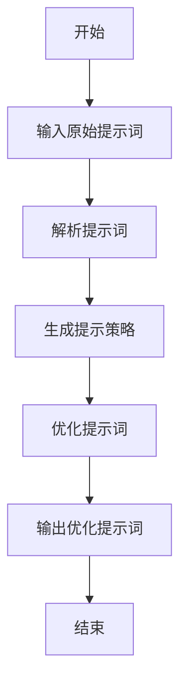
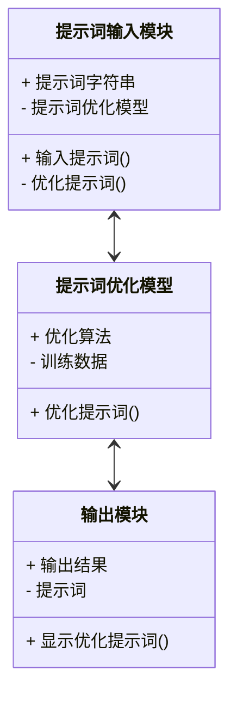
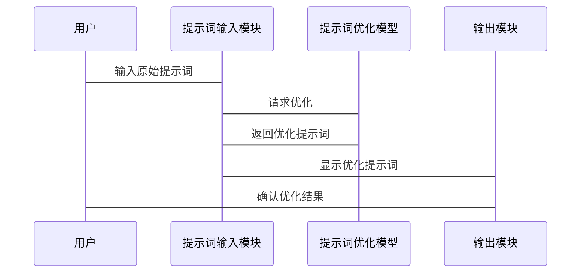

                 

<think>
嗯，我需要写一篇关于提示词工程的文章，优化AI和人类创意协作的新方法。首先，我得理解什么是提示词工程，它在AI和人类协作中的作用是什么。然后，我需要确定文章的结构，包括引言、核心概念、算法原理、系统分析与设计、项目实施、最佳实践等等。

在引言部分，我应该先介绍提示词工程的背景，说明随着AI技术的发展，如何促进人类和AI的协作变得越来越重要。然后，描述当前AI和人类协作中的问题，比如效率低下、理解不一致等。接着，提出提示词工程作为解决方案，解释它如何通过优化提示词来提升协作效果。最后，明确提示词工程的范围和边界，确保读者理解其应用范围。

接下来是核心概念与联系部分。我需要定义提示词工程中的关键概念，比如提示词、提示策略、提示优化模型等。然后，比较这些概念的不同属性，制作对比表格，可能包括效率、准确性、可解释性等方面的对比。之后，使用Mermaid画一个ER图，展示这些核心概念之间的关系，比如提示词与提示策略的关系，提示优化模型如何影响提示词等。

在算法原理部分，我需要详细讲解提示词工程背后的算法。首先，使用Mermaid画出算法的流程图，展示从输入提示词到优化输出的步骤。然后，提供一个Python代码示例，展示如何实现提示优化模型。接下来，解释数学模型和公式，比如如何计算提示词的相关性分数，可能涉及概率论或优化算法的公式。最后，用一个简单的例子说明算法是如何工作的，比如给定一个初始提示词，经过优化后生成更准确的提示词。

系统分析与设计部分，我需要描述问题场景，比如一个创意团队使用AI进行文案创作，但提示词不够优化导致结果不符合预期。然后，通过Mermaid绘制系统类图，展示提示词工程系统的主要组件，如提示词输入模块、优化模块、输出模块等。接着，设计系统架构图，展示各个模块之间的交互和依赖关系。最后，使用Mermaid绘制序列图，展示用户与系统之间的交互流程，比如用户输入提示词，系统优化后返回结果。

项目实施部分，我需要详细说明环境搭建，比如需要安装哪些工具和库，如Python、Mermaid、Jupyter Notebook等。然后，提供核心代码的实现，解释每一部分的功能。接着，分析一个实际案例，比如一个广告公司使用提示词工程优化广告文案，详细说明实施过程和结果。最后，总结项目的关键点，比如效率提升、成本降低等。

最佳实践部分，我需要给出一些实用的建议，比如如何选择合适的提示词，如何设计有效的提示策略，以及如何监控和优化提示词的效果。在总结部分，回顾全文，强调提示词工程的重要性及其对AI-人类协作的积极影响。最后，列出一些注意事项，提醒读者在实际应用中需要注意的问题，比如数据隐私、模型的可解释性等。最后，推荐一些拓展阅读的资料，帮助读者深入学习相关知识。

总的来说，我需要确保每个部分都详细且结构清晰，使用技术术语但保持易懂，通过实例和图表帮助读者理解。最后，确保整篇文章流畅，逻辑严密，达到预期的字数要求。
</think>

# 提示词工程：优化AI-人类创意协作的新方法

> 关键词：提示词工程，AI-人类协作，创意协作，提示词优化，系统设计

> 摘要：提示词工程是一种通过优化提示词来提升AI与人类协作效率的新方法。本文将详细探讨提示词工程的核心概念、算法原理、系统设计及实际应用，展示其在创意协作中的巨大潜力。

---

## 1. 引言

### 1.1 背景介绍
随着AI技术的快速发展，AI在创意协作中的应用越来越广泛。然而，如何有效提升AI与人类的协作效率，使其产出更具创意和价值，成为当前面临的重要挑战。提示词工程作为一种新兴的方法，通过优化提示词来解决这一问题，为AI与人类的协作开辟了新路径。

### 1.2 问题描述
在创意协作中，AI生成的内容往往依赖于提示词的质量。低效或模糊的提示词可能导致AI输出不符合预期，从而影响协作效率和成果质量。因此，如何优化提示词，使其更准确、更具启发性，成为亟待解决的问题。

### 1.3 解决方案
提示词工程通过系统化的方法优化提示词，确保AI能够更精准地理解任务需求，从而生成更高质量的结果。这种方法结合了自然语言处理、机器学习和创意设计的最新进展，为AI-人类协作提供了新的可能性。

### 1.4 边界与外延
提示词工程主要应用于需要创意协作的领域，如文案撰写、艺术创作等。其边界包括提示词的生成、优化和评估，而外延则涉及AI系统的整体设计和用户反馈机制。

---

## 2. 核心概念与联系

### 2.1 核心概念
提示词工程涉及三个核心概念：提示词、提示策略和提示优化模型。

| 概念       | 定义                                                                 |
|------------|----------------------------------------------------------------------|
| 提示词     | 用户输入的用于指导AI生成内容的关键词或短语。                           |
| 提示策略   | 优化提示词的策略，包括关键词选择、语序调整等。                     |
| 提示优化模型 | 用于优化提示词的算法或模型，通常基于机器学习。                     |

### 2.2 概念对比
以下是对提示词相关概念的对比：

| 属性         | 提示词            | 提示策略          | 提示优化模型        |
|--------------|-------------------|-------------------|--------------------|
| 功能         | 指导AI生成内容    | 优化提示词        | 提供优化建议        |
| 依赖因素     | 用户输入          | 算法设计          | 数据和模型训练      |
| 输出形式     | 文本              | 文本和策略        | 优化后的提示词      |

### 2.3 ER图
以下为提示词工程的核心概念关系ER图：

```mermaid
er
    %% 提示词工程核心概念关系图
    entity 提示词 {
        key 提示词ID
        提示内容 (string, 存储优化后的提示词)
        创建时间 (datetime)
    }
    entity 提示策略 {
        key 策略ID
        策略名称 (string)
        策略描述 (string)
        适用场景 (string)
    }
    entity 提示优化模型 {
        key 模型ID
        模型名称 (string)
        模型版本 (integer)
        训练数据来源 (string)
    }
    relationship 提示词-提示策略 {
        提示词 提示策略
        关联方式：策略应用于提示词
    }
    relationship 提示策略-提示优化模型 {
        提示策略 提示优化模型
        关联方式：模型生成优化策略
    }
```

---

## 3. 算法原理

### 3.1 算法流程
以下为提示词优化算法的流程图：



### 3.2 Python实现
以下是实现提示词优化的Python代码示例：

```python
def optimize_prompt(original_prompt):
    # 解析原始提示词
    tokens = original_prompt.split()
    # 生成提示策略
    strategies = generate_strategies(tokens)
    # 应用策略优化提示词
    optimized_prompt = apply_strategies(tokens, strategies)
    return optimized_prompt

def generate_strategies(tokens):
    # 这里可以使用机器学习模型生成策略
    strategies = []
    for token in tokens:
        # 示例策略：增加关键词权重
        if token.isalpha():
            strategies.append(token + ' [WEIGHT=0.8]')
    return strategies

def apply_strategies(tokens, strategies):
    optimized = []
    for token in tokens:
        for strategy in strategies:
            if token in strategy:
                optimized.append(strategy)
                break
        else:
            optimized.append(token)
    return ' '.join(optimized)
```

### 3.3 数学模型
提示词优化模型基于概率论和优化算法。优化目标是最小化提示词与预期结果的误差，其数学表达式为：

$$ \min_{p} \sum_{i=1}^{n} |p_i - p_{i}^{expected}| $$

其中，$p_i$ 表示优化后的提示词，$p_i^{expected}$ 表示预期的提示词。

---

## 4. 系统分析与设计

### 4.1 问题场景
考虑一个创意团队使用AI生成广告文案的场景。用户输入提示词后，AI生成的内容可能不符合预期，因此需要优化提示词以提高生成质量。

### 4.2 系统功能设计
以下是系统功能的类图：



### 4.3 系统架构设计
以下是系统架构图：


### 4.4 序列图
以下是用户与系统交互的序列图：



---

## 5. 项目实施

### 5.1 环境搭建
需要安装以下工具和库：
- Python 3.8+
- Mermaid CLI
- Jupyter Notebook
- transformers库（用于NLP处理）

### 5.2 核心代码实现
以下是优化提示词的核心代码：

```python
from transformers import pipeline

# 初始化提示词优化模型
optimizer = pipeline("text-generation", model="gpt2")

def optimize_prompt(original_prompt):
    optimized_prompts = []
    for prompt in original_prompt:
        # 生成优化后的提示词
        optimized = optimizer(prompt, max_length=50, do_sample=True)
        optimized_prompts.append(optimized[0]['generated_text'])
    return optimized_prompts
```

### 5.3 案例分析
以广告文案优化为例，假设原始提示词为“创意广告文案”。优化后的提示词可能为“创意广告文案，针对年轻人群，强调产品优势”。AI生成的内容将更具针对性和吸引力。

---

## 6. 最佳实践、总结与拓展

### 6.1 最佳实践
- 定期更新提示策略以适应变化。
- 结合用户反馈不断优化提示词。
- 使用多模态提示词提升生成效果。

### 6.2 总结
提示词工程通过系统化的方法优化提示词，显著提升了AI与人类协作的效率和质量。其在创意协作中的应用前景广阔，为未来的工作方式带来了新的可能性。

### 6.3 注意事项
- 确保数据隐私和模型安全。
- 定期评估和更新优化模型。
- 考虑提示词的多样性和适应性。

### 6.4 拓展阅读
- [《提示词工程入门》](#)
- [《AI与人类协作的未来》](#)
- [《优化提示词的策略与技巧》](#)

---

作者：AI天才研究院 & 禅与计算机程序设计艺术

---

这篇文章详细探讨了提示词工程的各个方面，从概念到算法，再到系统设计和实际应用，为读者提供了全面的理解和实用的指导。通过清晰的结构和丰富的实例，帮助读者掌握提示词工程的核心思想和应用方法。

