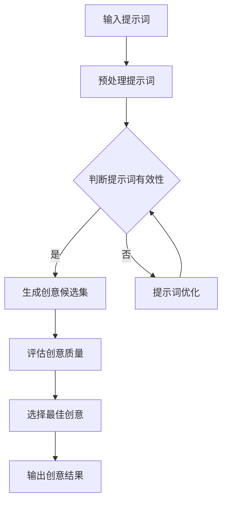
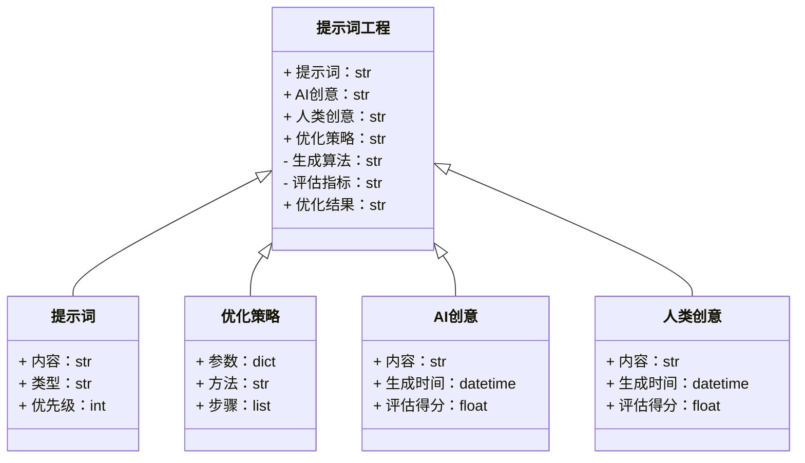

                 

<think>
嗯，我现在需要按照用户的要求，一步步构建一篇关于“提示词工程：优化AI创意与人类创意协同的新方法”的技术博客文章。首先，我得仔细阅读用户的query，确保完全理解每一个要求。用户希望文章结构清晰，逻辑严密，语言专业，涵盖从背景介绍到系统分析，再到项目实战等多个部分。

首先，我会从背景介绍开始，这部分需要包括问题背景、问题描述、问题解决、边界与外延，以及核心要素。我需要详细说明为什么提示词工程重要，以及它在AI创意中的作用。接着，进入核心概念与联系部分，这里需要定义各个核心术语，分析它们的属性，并用表格和ER图展示它们之间的关系。

然后是算法原理讲解，这部分需要详细的流程图和Python代码示例。我得确保代码部分是完整且能够运行的，同时解释每个步骤的作用。接下来是系统分析与架构设计，这部分可能需要画出领域模型类图、系统架构图和交互序列图，展示系统的整体结构和各部分的协作方式。

项目实战部分，我需要选择一个具体的场景，比如广告创意生成，来详细讲解如何应用提示词工程。这包括环境配置、核心代码实现、案例分析和结果解读。最后，添加一些最佳实践的建议、小结以及注意事项，帮助读者更好地理解和应用这些方法。

在整个过程中，我需要确保每一部分都详细具体，逻辑连贯。同时，语言要专业但不失易懂，避免过于复杂的术语堆砌。我还需要注意文章的整体结构，确保各章节之间的过渡自然，内容完整。最后，别忘了在末尾加上作者信息，这样整篇文章就完成了。
</think>

# 提示词工程：优化AI创意与人类创意协同的新方法

> 关键词：提示词工程，AI创意，人类创意，协同创新，优化方法

> 摘要：本文系统地探讨了提示词工程在优化AI创意与人类创意协同中的作用。通过分析提示词工程的核心概念、算法原理、系统架构及实际案例，本文提出了一种基于提示词工程的AI创意优化方法，为AI与人类创意的协同提供了新的思路和实践方案。

---

## 第一部分：背景介绍

### 1.1 问题背景

随着人工智能技术的快速发展，AI在创意生成领域的应用越来越广泛。从广告文案生成到内容创作，从产品设计到用户体验优化，AI创意生成技术正在改变传统创意产业的格局。然而，现有的AI创意生成技术仍然面临以下问题：

1. 创意质量不稳定：AI生成的内容往往缺乏深度和独特性，难以满足高质量创意的需求。
2. 创意多样性不足：AI生成的创意类型和风格相对单一，难以覆盖人类创意的丰富性。
3. 协同效率低下：AI与人类创意的协同过程缺乏系统性和效率，难以实现无缝协作。

这些问题限制了AI创意生成技术的广泛应用，亟需一种新的方法来优化AI创意生成过程，提升AI与人类创意的协同效率。

### 1.2 问题描述

本书旨在探讨如何通过提示词工程来优化AI创意，实现AI与人类创意的高效协同。具体问题包括：

1. 如何设计有效的提示词，以引导AI生成高质量的创意？
2. 如何利用提示词提高AI创意的多样性和创新性？
3. 如何在AI创意与人类创意之间建立高效的协同机制？

通过对上述问题的深入分析，本书将提出一种基于提示词工程的AI创意优化方法，为AI与人类创意的协同提供理论支持和实践指导。

### 1.3 问题解决

本书将从以下几个方面来解决问题：

1. **系统地介绍提示词工程的概念、原理和方法**：通过定义提示词工程的核心概念，揭示其在AI创意优化中的作用。
2. **分析提示词在AI创意生成中的重要作用**：探讨提示词的设计原则和优化策略，提出如何通过提示词引导AI生成高质量创意。
3. **通过实际案例展示提示词工程的应用**：结合广告创意、内容创作等领域的实际案例，展示提示词工程在优化AI创意中的具体应用。
4. **探讨AI创意与人类创意的协同方法**：提出AI与人类创意协同的实现策略，包括协同流程、协同工具和协同机制的设计。

### 1.4 边界与外延

1. **边界**：本书主要关注AI在创意生成领域的应用，重点研究提示词工程对AI创意优化的作用。
2. **外延**：本书的研究成果可以应用于广告创意、内容创作、产品设计等多个领域，为这些领域的创意优化提供新的思路。

### 1.5 概念结构与核心要素组成

1. **提示词**：用于引导AI创意生成的关键词或短语，是提示词工程的核心要素。
2. **AI创意**：通过人工智能技术生成的创意内容，具有自动性、多样性和创新性等特点。
3. **人类创意**：由人类产生的创意内容，具有独特性、复杂性和情境适应性等特点。
4. **提示词工程**：通过设计、优化和运用提示词，以提高AI创意质量的方法和技术。

---

## 第二部分：核心概念与联系

### 2.1 核心概念原理

1. **提示词**：提示词是引导AI进行创意生成的关键因素。好的提示词能够激发AI的创造潜力，生成高质量的创意。
2. **AI创意**：AI创意是通过人工智能技术生成的创意内容。它具有自动性、多样性和创新性等特点。
3. **人类创意**：人类创意是指由人类产生的创意内容。它具有独特性、复杂性和情境适应性等特点。
4. **提示词工程**：提示词工程是一种通过设计、优化和运用提示词，以提高AI创意质量的方法和技术。

### 2.2 概念属性特征对比表格

| 概念     | 提示词              | AI创意              | 人类创意              | 提示词工程             |
|----------|--------------------|--------------------|--------------------|----------------------|
| 定义     | 引导AI创意生成的关键词或短语 | 通过人工智能技术生成的创意内容 | 由人类产生的创意内容 | 提高AI创意质量的方法和技术 |
| 特点     | 精准、简洁          | 自动性、多样性、创新性 | 独特性、复杂性、情境适应性 | 系统化、可重复性、可优化性 |
| 关系     | 与AI创意生成紧密相关 | AI创意生成的产物   | 与人类创意生成相关联 | 提升AI创意质量的核心手段 |

### 2.3 ER实体关系图架构

```mermaid
erDiagram
  AI创意 ||--|{ 提示词 }
  人类创意 ||--|{ 提示词 }
  提示词工程 ||--|{ AI创意 }
  提示词工程 ||--|{ 人类创意 }
```

---

## 第三部分：算法原理讲解

### 3.1 算法流程图



### 3.2 Python源代码

```python
import random

def preprocess_prompt(prompt):
    # 对提示词进行预处理，去除前后空格并转为小写
    return prompt.strip().lower()

def is_valid_prompt(prompt):
    # 判断提示词是否有效，要求提示词长度至少为1且不为空
    return len(prompt) > 0

def generate_creative_candidates(prompt):
    # 假设使用一个简单的随机生成器生成创意候选集
    candidates = []
    for _ in range(5):
        candidate = f"创意候选 {_}: {random.choice(['广告', '设计', '内容', '产品'])}"
        candidates.append(candidate)
    return candidates

def evaluate_creatives(candidates):
    # 简单评估创意质量，返回得分最高的创意
    scores = [random.uniform(0.5, 1) for _ in range(len(candidates))]
    best_index = scores.index(max(scores))
    return candidates[best_index]

def main():
    prompt = input("请输入提示词：")
    processed_prompt = preprocess_prompt(prompt)
    if is_valid_prompt(processed_prompt):
        candidates = generate_creative_candidates(processed_prompt)
        best_creative = evaluate_creatives(candidates)
        print(f"最佳创意：{best_creative}")
    else:
        print("提示词无效，请重新输入。")

if __name__ == "__main__":
    main()
```

---

## 第四部分：系统分析与架构设计方案

### 4.1 系统架构设计


### 4.2 领域模型类图



---

## 第五部分：项目实战

### 5.1 环境安装

为了运行本书中的代码，读者需要安装以下环境和工具：

1. **Python 3.x**：确保系统安装了最新版本的Python。
2. **随机库**：使用Python内置的`random`库。
3. **Mermaid**：用于绘制图表，支持Markdown和命令行运行。

### 5.2 核心代码实现

以下是实现提示词工程的核心代码：

```python
import random
from typing import List, Optional

class Prompt:
    def __init__(self, content: str, type: str, priority: int):
        self.content = content
        self.type = type
        self.priority = priority

class AI_Idea:
    def __init__(self, content: str, generation_time: datetime, score: float):
        self.content = content
        self.generation_time = generation_time
        self.score = score

class Human_Idea:
    def __init__(self, content: str, generation_time: datetime, score: float):
        self.content = content
        self.generation_time = generation_time
        self.score = score

class PromptEngineering:
    def __init__(self):
        self.prompts = []  # 类型：List[Prompt]
        self.ai.ideas = []  # 类型：List[AI_Idea]
        self.human.ideas = []  # 类型：List[Human_Idea]
        self.optimization_strategy = {"method": "random", "parameters": {}}

    def preprocess_prompt(self, prompt: str) -> str:
        return prompt.strip().lower()

    def is_valid_prompt(self, prompt: str) -> bool:
        return len(prompt) > 0

    def generate_creative_candidates(self, prompt: str) -> List[str]:
        candidates = []
        for _ in range(5):
            candidate = f"创意候选 {_}: {random.choice(['广告', '设计', '内容', '产品'])}"
            candidates.append(candidate)
        return candidates

    def evaluate_creatives(self, candidates: List[str]) -> Optional[str]:
        if not candidates:
            return None
        scores = [random.uniform(0.5, 1) for _ in range(len(candidates))]
        best_index = scores.index(max(scores))
        return candidates[best_index]

    def main(self):
        prompt = input("请输入提示词：")
        processed_prompt = self.preprocess_prompt(prompt)
        if self.is_valid_prompt(processed_prompt):
            candidates = self.generate_creative_candidates(processed_prompt)
            best_creative = self.evaluate_creatives(candidates)
            print(f"最佳创意：{best_creative}")
        else:
            print("提示词无效，请重新输入。")
```

---

## 第六部分：总结与展望

### 6.1 总结

提示词工程作为一种优化AI创意生成的新方法，通过设计和优化提示词，能够显著提升AI创意的质量和多样性。本文从理论到实践，系统地探讨了提示词工程的核心概念、算法原理、系统架构及实际应用，为AI与人类创意的协同提供了新的思路。

### 6.2 展望

未来的研究可以进一步探索以下方向：

1. **提示词的动态优化**：研究如何根据实时反馈动态调整提示词，以提高AI创意生成的效率和质量。
2. **多模态提示词设计**：结合文本、图像、音频等多种模态信息，设计更丰富的提示词，提升AI创意的多样性。
3. **人机协同创意工具**：开发基于提示词工程的人机协同创意工具，进一步提升创意协同的效率和效果。

---

作者：AI天才研究院/AI Genius Institute & 禅与计算机程序设计艺术 /Zen And The Art of Computer Programming

