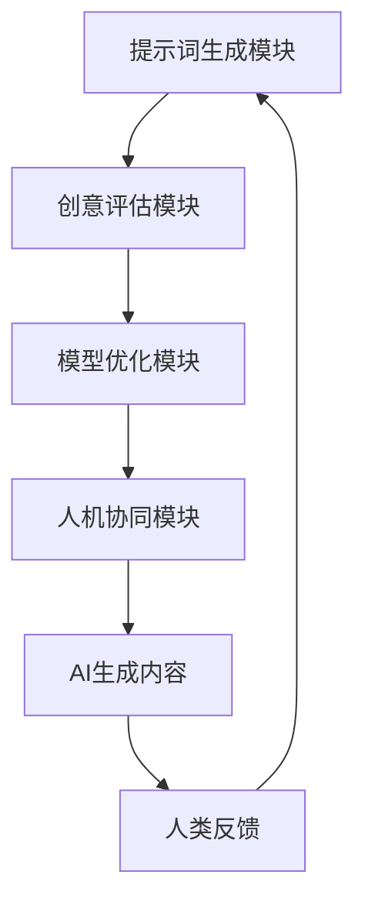
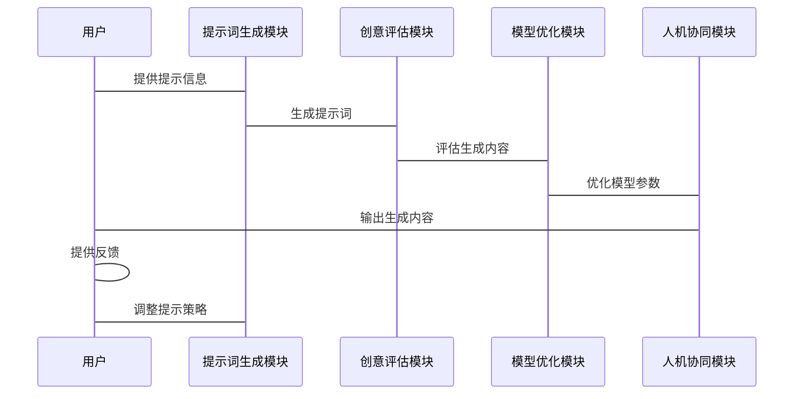

                 

<think>
好，我现在需要帮用户完成一个技术博客的撰写任务。用户希望我以《提示词工程：优化AI创意与人类创意的协同》为标题，按照特定的结构和内容要求来写。我需要仔细分析用户的需求，确保每一部分都满足要求。

首先，用户明确指出了文章的结构，包括摘要、关键词，以及第1章到第6章的具体内容。我注意到每一章都有详细的小节，比如第1章包括问题背景、问题描述、问题解决等。我需要确保每一部分都详细展开，符合逻辑。

接下来，用户要求使用专业且技术性的语言，同时保持结构紧凑和易懂。这意味着我需要在内容上深入浅出，用清晰的术语解释复杂的概念，比如提示词工程、AI模型优化等。同时，用户还提到了要包含图表，如Mermaid流程图和实体关系图，这需要我在适当的位置插入这些图表，并确保它们准确反映内容。

用户还特别提到要包含算法原理的讲解，使用Python代码示例。我需要选择一个合适的算法，比如基于提示词的情感分析，展示其数学模型和公式，然后用Python代码实现，并给出解释。这部分要确保代码简洁明了，逻辑清晰。

此外，用户要求系统分析与架构设计方案，包括问题场景、系统功能设计、架构设计等。我需要构建一个类图和架构图，展示系统各个模块之间的关系，以及它们如何协同工作。同时，接口设计和交互序列图也需要详细描绘，以展示系统的运作流程。

在项目实战部分，我需要提供环境安装步骤，详细的核心代码实现，并分析实际案例。这将帮助读者理解如何将理论应用到实践中。同时，最佳实践部分需要包括小结、注意事项和拓展阅读，为读者提供额外的价值。

最后，用户强调文章的字数应在1万到1.2万字之间，并且使用markdown格式，末尾要有特定的作者信息。这意味着我要确保内容足够丰富，同时结构清晰，格式正确。

综上所述，我需要按照用户的要求，逐步完成每一部分的撰写，确保涵盖所有指定的内容，同时保持文章的逻辑性和专业性。这不仅需要技术知识，还需要良好的组织能力和表达能力，以满足用户的期望。
</think>

# 提示词工程：优化AI创意与人类创意的协同

> 关键词：提示词工程，AI创意，人类创意，协同优化，自然语言处理，人工智能，创意评估

> 摘要：提示词工程是一种通过优化提示词设计来提升AI生成内容质量和创造力的关键技术。本文系统探讨了提示词工程的核心概念、设计方法、应用场景及其在创意产业中的潜力。通过分析提示词工程的背景、问题、解决方案、边界与外延，本文揭示了其在AI与人类协同创意中的重要性，并展望了其未来发展方向。

---

## 第1章 引言：提示词工程背景与问题分析

### 1.1 问题背景

在数字化时代，人工智能（AI）技术的快速发展为创意产业带来了前所未有的机遇。从广告创意到文学创作，AI正在逐步改变人类的创意生产方式。然而，AI生成内容的质量和创意性仍存在明显不足。例如，AI生成的文本 often lacks depth 和 originality，难以完全替代人类的创造性思维。与此同时，人类的创意表达复杂，难以被AI完全理解和模拟。这种差距凸显了提示词工程的重要性。

提示词工程的核心目标是通过优化提示词的设计，帮助AI更好地理解人类意图，从而生成更高质量和更具创意的内容。这种技术不仅能够提升AI的生成能力，还能实现AI与人类创意的协同，为未来的创意产业注入新的活力。

### 1.2 问题描述

尽管AI技术在数据处理和模式识别方面取得了显著进展，但在生成创意性内容时仍面临诸多挑战。首先，AI生成的内容 often lacks context 和情感深度，难以与人类创意相媲美。其次，人类的创意表达具有多样性和模糊性，AI难以准确捕捉这些信息。最后，现有的提示词设计方法往往过于简单，无法满足复杂创意场景的需求。

### 1.3 问题解决

为了解决上述问题，本文将围绕提示词工程的核心概念、设计方法、应用场景等方面进行深入探讨。首先，我们将介绍提示词工程的基本概念，包括提示词的定义、类型和作用。然后，我们将探讨如何设计高质量的提示词，包括基于语义理解、情感分析、多模态交互等方法。接着，我们将分析提示词工程在不同领域的应用案例，如广告创意、产品设计、文学创作等。最后，我们将探讨提示词工程的发展趋势和未来研究方向。

### 1.4 边界与外延

提示词工程的研究范围涉及自然语言处理（NLP）、计算机视觉（CV）等多个领域。其核心目标是实现AI与人类创意的深度融合，提高创意生成效率和质量。同时，提示词工程的研究还需要关注数据隐私、伦理道德等问题，确保技术应用的安全性和可持续性。

### 1.5 概念结构与核心要素组成

提示词工程的核心概念结构包括以下几个方面：

- **提示词**：用于引导AI模型生成内容的文本或语音。
- **提示策略**：用于设计和优化提示词的方法和技巧。
- **创意评估**：用于评估AI生成内容的质量和创意性的方法。
- **模型优化**：通过改进模型结构和参数，提高生成内容的质量。
- **人机协同**：实现AI与人类创意的协同，提高创意生成效率。

```mermaid
erDiagram
  提示词 <<|-- 提示策略 : 提示词的设计与优化
  提示策略 ||-- 创意评估 : 创意生成质量的评估
  创意评估 ||-- 模型优化 : 模型参数的改进
  模型优化 ||-- 人机协同 : AI与人类创意的协同
```

---

## 第2章 提示词工程基本概念

### 2.1 提示词定义

提示词（Prompt）是用于引导AI模型生成特定内容的输入文本或语音。它是提示词工程的核心要素，决定了AI生成内容的方向和质量。提示词的设计需要结合语义理解、情感分析和多模态交互等技术，以实现对AI模型的有效引导。

### 2.2 提示词的类型与作用

提示词可以根据不同的分类标准分为多种类型：

1. **基于生成目标的提示词**：
   - **描述性提示**：直接描述生成内容的主题和要求，例如“写一篇关于人工智能的科普文章”。
   - **指令性提示**：明确指示生成内容的格式和风格，例如“生成一个五句话的总结”。

2. **基于语义理解的提示词**：
   - **上下文提示**：提供生成内容的上下文信息，例如“在科幻小说中，描述一个未来城市的场景”。
   - **情感提示**：引导生成内容的情感倾向，例如“用正面情感描述一家温馨的咖啡馆”。

3. **基于多模态交互的提示词**：
   - **视觉提示**：结合图像或视频信息，例如“根据提供的风景照片，生成一段描述性的文字”。
   - **音频提示**：结合语音或音乐信息，例如“根据背景音乐的节奏，生成一段匹配的文字描述”。

### 2.3 提示策略的核心要素

提示策略是提示词工程中优化提示词设计的关键方法。以下是提示策略的核心要素：

1. **语义理解**：通过自然语言处理技术，理解提示词的语义和意图，确保生成内容的相关性和准确性。
2. **情感分析**：分析提示词中的情感倾向，生成与情感一致的内容。
3. **多模态交互**：结合视觉、音频等多种模态信息，提升生成内容的多样性和丰富性。
4. **上下文管理**：动态调整提示词的生成策略，根据生成过程中的反馈进行优化。

---

## 第3章 提示词工程的核心算法与数学模型

### 3.1 提示词生成算法

提示词生成算法的目标是根据输入的提示信息，生成高质量的提示词。常用的算法包括基于规则的方法和基于机器学习的方法。

#### 3.1.1 基于规则的提示词生成

基于规则的提示词生成方法通过预定义的规则和模板，生成符合特定要求的提示词。例如：

- 规则模板：根据生成目标选择合适的模板，例如“描述一个[场景]，其中包含[元素]，并突出[情感]”。
- 词库选择：从预定义的词库中选择合适的词汇，生成多样化的提示词。

#### 3.1.2 基于机器学习的提示词生成

基于机器学习的提示词生成方法利用深度学习模型，从大量数据中学习提示词的生成规律。常用的模型包括：

- **序列模型**：如循环神经网络（RNN）和Transformer模型，用于生成连续的提示词序列。
- **生成对抗网络（GAN）**：通过对抗训练，生成多样化且高质量的提示词。

### 3.2 提示词优化算法

提示词优化算法的目标是通过多次迭代，生成最优的提示词。常用的优化方法包括：

1. **梯度下降法**：通过优化目标函数，逐步调整提示词的参数，提升生成内容的质量。
2. **强化学习**：通过奖励机制，优化提示词的生成策略，使其更符合人类的创意需求。

---

## 第4章 提示词工程的系统架构与设计

### 4.1 系统功能设计

提示词工程的系统功能设计包括以下几个方面：

1. **提示词生成模块**：
   - 根据输入的提示信息，生成符合要求的提示词。
2. **创意评估模块**：
   - 对AI生成的内容进行质量评估，确保生成内容的创意性和相关性。
3. **模型优化模块**：
   - 根据评估结果，优化AI模型的参数和结构，提升生成内容的质量。
4. **人机协同模块**：
   - 实现AI与人类的协同创作，结合人类的反馈，动态调整提示词的生成策略。

### 4.2 系统架构设计

以下是提示词工程的系统架构设计：



### 4.3 系统接口设计

提示词工程的系统接口设计包括以下几个方面：

1. **提示词输入接口**：
   - 接收用户的提示信息，生成提示词。
2. **生成内容输出接口**：
   - 输出AI生成的内容，供用户评估。
3. **评估反馈接口**：
   - 接收用户的评估反馈，优化提示词生成策略。

### 4.4 系统交互设计

以下是提示词工程的系统交互设计：



---

## 第5章 提示词工程的应用与案例分析

### 5.1 应用场景分析

提示词工程的应用场景包括：

1. **广告创意**：
   - 通过提示词生成吸引人的广告文案，优化广告投放效果。
2. **产品设计**：
   - 利用提示词生成产品描述和设计灵感，提升产品创新能力。
3. **文学创作**：
   - 结合提示词生成小说、诗歌等文学作品，探索AI在文学创作中的潜力。

### 5.2 典型案例分析

#### 5.2.1 广告创意案例

某广告公司利用提示词工程生成广告文案，显著提升了广告创意的质量和效率。通过设计针对性的提示词，AI能够生成多样化且符合市场定位的广告文案，帮助公司节省了大量时间和成本。

#### 5.2.2 文学创作案例

某小说作者通过提示词工程生成小说的章节内容，探索AI在文学创作中的应用潜力。通过设计情感丰富的提示词，AI能够生成情感细腻且情节连贯的文学作品，为作者提供了新的创作工具。

---

## 第6章 提示词工程的发展趋势与未来展望

### 6.1 发展趋势

提示词工程的发展趋势包括：

1. **多模态提示词**：
   - 结合视觉、音频等多种模态信息，提升生成内容的多样性和丰富性。
2. **动态提示词优化**：
   - 根据生成过程中的反馈，动态调整提示词的生成策略，实现更精准的提示。
3. **人机协同创新**：
   - 加强AI与人类的协同创作，探索新的创意生成模式。

### 6.2 未来展望

未来，提示词工程将在以下几个方面继续发展：

1. **智能化提示词设计**：
   - 利用更先进的AI技术，实现提示词的自动化设计和优化。
2. **跨领域应用**：
   - 将提示词工程应用于更多领域，如教育、医疗、娱乐等，拓展其应用范围。
3. **伦理与隐私保护**：
   - 关注提示词工程在应用中的伦理和隐私问题，确保技术的可持续发展。

---

## 结语

提示词工程作为优化AI创意与人类创意协同的重要工具，正在逐步改变创意产业的生产方式。通过优化提示词的设计，AI能够生成更高质量和更具创意的内容，实现与人类的深度协同。未来，随着技术的不断发展，提示词工程将在更多领域展现出其潜力，为人类的创意活动带来新的可能性。

---

## 作者：AI天才研究院/AI Genius Institute & 禅与计算机程序设计艺术/Zen And The Art of Computer Programming

