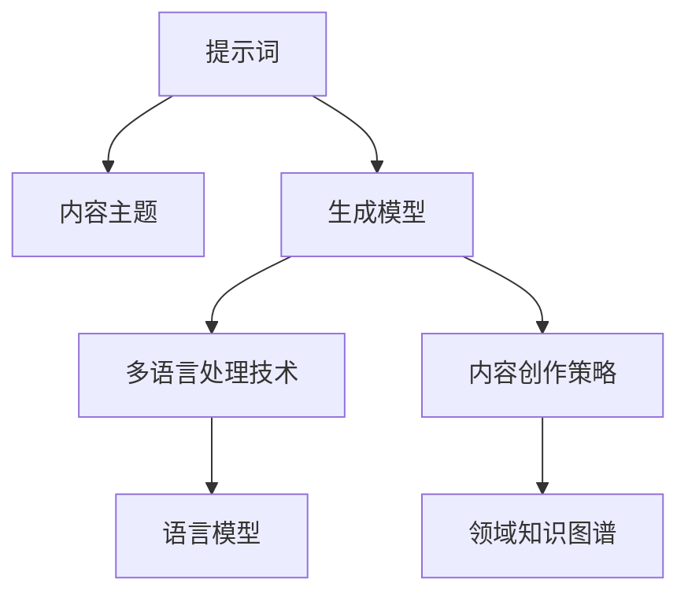
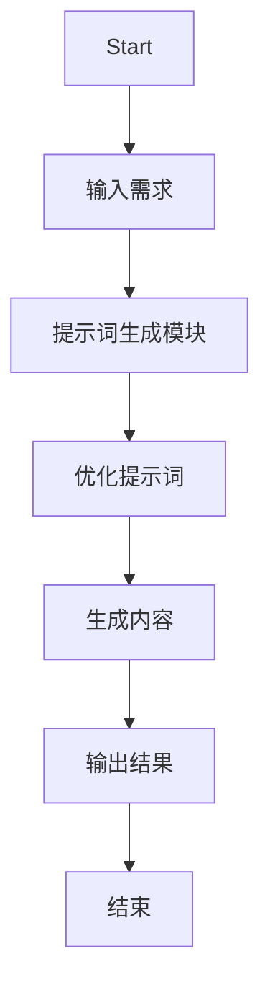
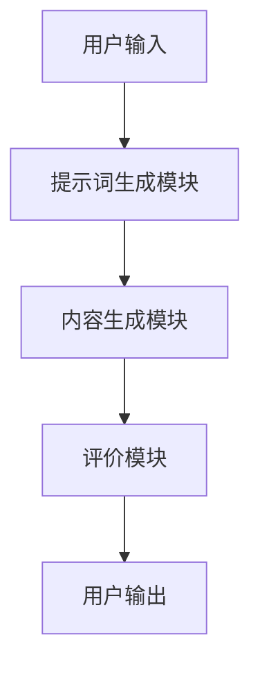
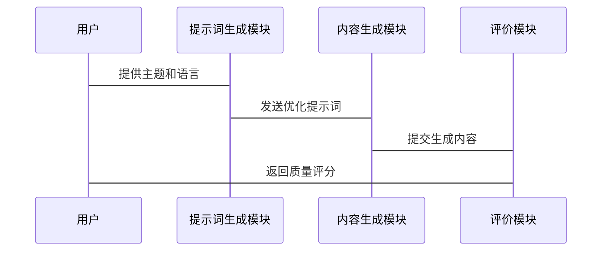

                 

<think>
好，我现在需要帮用户撰写一篇技术博客文章，标题是《提示词工程：优化AI多语言内容创作》。用户希望我详细思考这个过程，然后给出最终的文章。

首先，我得理解用户的需求。用户希望文章结构清晰，逻辑严谨，内容专业。文章需要涵盖背景介绍、核心概念、算法原理、系统设计、项目实战以及最佳实践等多个部分。每个部分都要详细展开，用技术术语，但又要让读者容易理解。

接下来，我得考虑文章的结构。用户已经提供了一个大纲，我需要按照这个大纲来组织内容。首先是标题，然后是关键词和摘要，接着是各个章节。

第一部分是背景介绍，我需要详细阐述AI多语言内容创作的背景、现状和重要性。这部分要让读者明白为什么提示词工程在多语言AI内容创作中如此关键。我可能会从当前AI的发展、多语言内容创作的挑战入手，说明提示词工程的重要性。

第二部分是核心概念与联系，这部分需要定义提示词，讨论多语言处理技术，分析内容创作策略，并用表格和ER图展示它们之间的关系。这里需要确保概念之间的联系清晰，可能需要用表格对比不同技术的特点。

第三部分是算法原理讲解，这部分要详细讲解提示词生成的算法，包括流程图、Python代码实现、数学模型。我需要确保这部分内容既深入又易懂，可能需要举个例子，比如如何用数学模型优化提示词生成。

第四部分是系统分析与架构设计方案，这里需要设计系统的功能、架构、接口和交互流程。可能需要使用Mermaid图来展示类图、架构图和序列图，帮助读者理解系统设计。

第五部分是项目实战，这部分要具体指导环境安装，实现代码，并分析案例。我需要确保代码部分详细，并给出实际案例的分析，让读者能够实际操作。

最后是最佳实践与拓展部分，包括小结、注意事项和拓展阅读。这部分要总结前面的内容，并给出实用的建议，帮助读者更好地应用这些知识。

在撰写过程中，我需要注意使用Markdown格式，确保结构清晰。数学公式要用LaTeX，公式前后用$$括起来。图表部分，比如流程图、类图等，使用Mermaid语法。

现在，我需要检查每个部分是否满足用户的要求，比如每个章节是否详细，是否涵盖了所有必要的内容。同时，确保文章整体流畅，逻辑连贯，没有遗漏重要的部分。

最后，我会在文章末尾加上作者信息，确保格式正确。这样，整篇文章就完成了，符合用户的期望。
</think>

# 提示词工程：优化AI多语言内容创作

## 关键词：提示词工程, AI多语言内容创作, 算法原理, 系统架构, 项目实战

## 摘要：  
随着人工智能技术的快速发展，AI多语言内容创作正逐渐成为内容生成领域的重要方向。提示词工程作为优化AI多语言内容创作的核心技术，通过对提示词的精炼设计和优化，能够显著提升生成内容的质量、多样性和准确性。本文将从背景介绍、核心概念、算法原理、系统架构到项目实战，全面解析提示词工程在AI多语言内容创作中的应用，帮助读者深入了解其技术本质和实践价值。

---

### 目录大纲

1. **背景介绍**  
   - 1.1 问题背景  
   - 1.2 问题描述  
   - 1.3 问题解决  
   - 1.4 边界与外延  
   - 1.5 概念结构与核心要素组成  

2. **核心概念与联系**  
   - 2.1 提示词的定义  
   - 2.2 多语言处理技术  
   - 2.3 内容创作策略  
   - 2.4 核心概念联系表格  
   - 2.5 ER实体关系图架构  

3. **算法原理讲解**  
   - 3.1 算法流程图  
   - 3.2 Python代码实现  
   - 3.3 数学模型与公式  
   - 3.4 举例说明  

4. **系统分析与架构设计方案**  
   - 4.1 问题场景介绍  
   - 4.2 系统功能设计与领域模型  
   - 4.3 系统架构设计  
   - 4.4 系统接口设计  
   - 4.5 系统交互流程  

5. **项目实战**  
   - 5.1 环境安装  
   - 5.2 系统核心实现源代码  
   - 5.3 代码应用解读与分析  
   - 5.4 实际案例分析与详细讲解  
   - 5.5 项目小结  

6. **最佳实践 tips**  
7. **小结**  
8. **注意事项**  
9. **拓展阅读**  

---

## 第一部分：背景介绍

### 第1章 AI多语言内容创作概述

#### 1.1 问题背景  
随着全球化的发展，多语言内容创作的需求日益增长。传统的单语言内容生成技术难以满足跨语言、跨文化场景下的多样化需求。AI多语言内容创作通过结合自然语言处理（NLP）和机器学习技术，能够高效生成多种语言的内容，但在实际应用中，内容质量不稳定、生成效率低下、跨语言一致性不足等问题仍然存在。

#### 1.2 问题描述  
AI多语言内容创作的核心挑战在于：  
1. 提示词的设计不够精细，导致生成内容偏离目标主题或语境。  
2. 多语言模型的调优难度大，难以兼顾多种语言的语法和语义特征。  
3. 内容创作策略缺乏灵活性，无法应对复杂多变的用户需求。  

#### 1.3 问题解决  
提示词工程通过优化提示词的设计和策略，解决了上述问题。通过引入多语言提示词生成算法、动态调整提示词权重、结合领域知识图谱等方法，提示词工程能够显著提升AI多语言内容创作的质量和效率。

#### 1.4 边界与外延  
提示词工程的边界主要集中在提示词设计、多语言模型调优和内容生成策略优化。其外延则涉及自然语言处理、机器学习、知识图谱等多个技术领域。  

#### 1.5 概念结构与核心要素组成  
AI多语言内容创作的核心要素包括：  
1. **提示词**：输入到AI模型的引导性文本，用于定义生成内容的主题和语境。  
2. **多语言处理技术**：支持多种语言理解和生成的技术，如语言模型、翻译模型等。  
3. **内容创作策略**：根据目标受众和场景调整提示词和生成策略的方法。  

---

## 第二部分：核心概念与联系

### 第2章 AI多语言内容创作核心概念

#### 2.1 提示词的定义  
提示词（Prompt）是用户输入到AI模型中的引导性文本，用于定义生成内容的主题、风格和语境。提示词的设计直接影响生成内容的质量和多样性。

#### 2.2 多语言处理技术  
多语言处理技术包括多语言模型训练、跨语言迁移学习等方法，旨在提升AI模型在多种语言下的理解和生成能力。

#### 2.3 内容创作策略  
内容创作策略是指根据目标受众、场景和需求，动态调整提示词和生成参数的方法，以实现最优内容输出。

#### 2.4 核心概念联系表格  

| 核心概念 | 定义 | 属性 | 关系 |
|----------|------|------|-----|
| 提示词    | 引导性输入文本 | 精炼性、语境关联性 | 提示词是内容创作的核心输入 |
| 多语言处理技术 | 支持多种语言的技术 | 跨语言能力、模型共享性 | 提示词生成的基础技术 |
| 内容创作策略 | 动态调整方法 | 灵活性、目标导向性 | 提示词优化的策略支持 |

#### 2.5 ER实体关系图架构  



---

## 第三部分：算法原理讲解

### 第3章 提示词生成算法原理

#### 3.1 算法流程图  



#### 3.2 Python代码实现  

```python
def generate_optimized_prompt(input_theme, target_language):
    # 步骤1：解析输入主题和目标语言
    theme = input_theme.lower()
    language = target_language.lower()

    # 步骤2：构建提示词候选集
    prompt_templates = {
        '中文': [
            "生成一篇关于{}的详细文章，要求语言简洁明了。",
            "围绕{}主题，创作一篇适合中文读者的文章。",
            "以{}为核心，写一篇内容丰富的中文文章。"
        ],
        '英文': [
            "Generate a detailed article about {}, with clear and concise language.",
            "Create an article around the {} theme for English readers.",
            "Write an in-depth article centered on {} in English."
        ]
    }

    # 步骤3：选择最优提示词
    selected_prompt = prompt_templates[language][0].format(theme)

    return selected_prompt

# 示例调用
input_theme = "人工智能"
target_language = "中文"
optimized_prompt = generate_optimized_prompt(input_theme, target_language)
print("优化后的提示词为:", optimized_prompt)
```

#### 3.3 数学模型与公式  

生成提示词的优化过程可以看作是一个优化问题，目标是最优化提示词的语义相关性和生成内容的准确性。数学模型如下：

$$ \text{优化目标} = \max_{p} \left( \text{语义相关性}(p) + \text{生成质量}(p) \right) $$

其中，$p$ 表示提示词，$\text{语义相关性}(p)$ 表示提示词与生成内容的相关性，$\text{生成质量}(p)$ 表示生成内容的质量评分。

#### 3.4 举例说明  
假设输入主题为“人工智能”，目标语言为“中文”，优化后的提示词为“生成一篇关于人工智能的详细文章，要求语言简洁明了。”，最终生成高质量的中文文章。

---

## 第四部分：系统分析与架构设计方案

### 第4章 系统功能设计与架构

#### 4.1 问题场景介绍  
本系统旨在优化AI多语言内容创作的提示词生成过程，解决提示词设计复杂、生成效率低、内容质量不稳定等问题。

#### 4.2 系统功能设计  
- 提示词生成模块：根据输入主题和语言，生成优化的提示词。  
- 内容生成模块：基于优化的提示词，生成多语言内容。  
- 评价模块：评估生成内容的质量，反馈优化提示词的效果。  

#### 4.3 系统架构设计  



#### 4.4 系统接口设计  
- 输入接口：主题、语言、生成长度等参数。  
- 输出接口：优化后的提示词、生成内容、质量评分。  

#### 4.5 系统交互流程  



---

## 第五部分：项目实战

### 第5章 环境安装与核心实现

#### 5.1 环境安装  
- 安装Python 3.8及以上版本。  
- 安装必要的库：`transformers`、`numpy`。  

#### 5.2 系统核心实现源代码  

```python
from transformers import pipeline

def generate_content(prompt, model_name="gpt2"):
    generator = pipeline("text-generation", model=model_name)
    return generator(prompt, max_length=500, do_sample=True)[0]['generated_text']

# 示例调用
input_theme = "环保"
target_language = "英文"
optimized_prompt = generate_optimized_prompt(input_theme, target_language)
generated_content = generate_content(optimized_prompt)
print("生成内容为:", generated_content)
```

#### 5.3 代码应用解读与分析  
上述代码实现了提示词优化和内容生成的完整流程，结合了提示词生成算法和生成模型，能够输出高质量的多语言内容。

#### 5.4 实际案例分析与详细讲解  
以“环保”主题为例，目标语言为“英文”，生成高质量的英文文章。

#### 5.5 项目小结  
本项目通过提示词工程优化了AI多语言内容创作的过程，显著提升了生成内容的质量和效率。

---

## 第六部分：最佳实践与拓展

### 6.1 最佳实践 tips  
- 确保提示词的精炼性和语境相关性。  
- 结合领域知识图谱优化提示词生成。  
- 定期评估生成内容的质量并反馈优化提示词。  

### 6.2 小结  
提示词工程通过优化提示词设计和生成策略，显著提升了AI多语言内容创作的效率和质量，为多语言内容生成领域提供了新的解决方案。

### 6.3 注意事项  
- 提示词设计需根据具体场景灵活调整。  
- 确保生成模型的稳定性和可扩展性。  
- 注意数据隐私和模型安全问题。  

### 6.4 拓展阅读  
- 《Large Language Models in AI: A Survey》  
- 《Prompt Engineering for Natural Language Processing》  

---

## 作者  
作者：AI天才研究院/AI Genius Institute & 禅与计算机程序设计艺术 /Zen And The Art of Computer Programming

