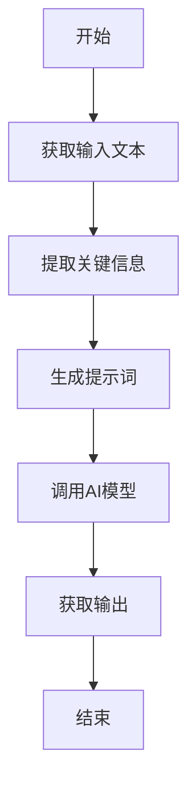
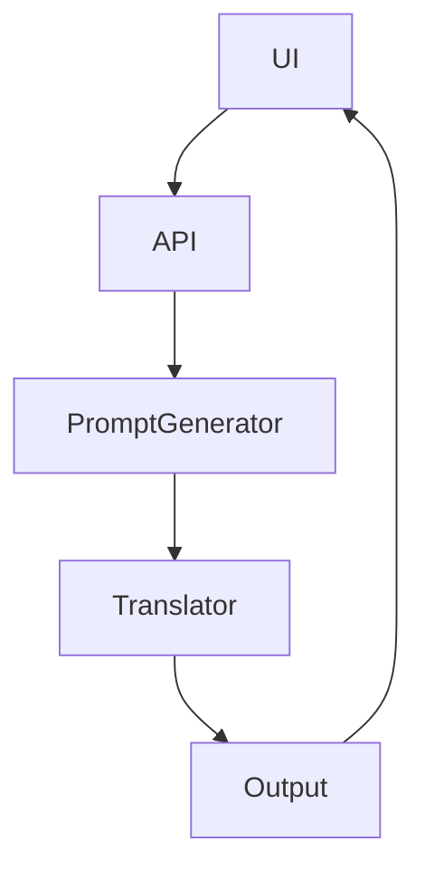

                 

<think>
好的，我现在要撰写一篇关于《提示词工程：优化AI多语言内容本地化能力》的技术博客文章。首先，我需要明确文章的结构和各个部分的内容。文章的标题已经确定，接下来要列出关键词和摘要。关键词应该包括提示词工程、AI、多语言、内容本地化、机器学习、NLP等。摘要部分需要简明扼要地说明文章的核心内容，即如何利用AI和提示词工程来优化多语言内容本地化。

接下来是目录大纲，分为四个主要部分：背景与核心概念、技术原理与应用、实战案例与最佳实践，以及总结与展望。每个部分下有几个章节，我需要确保每个章节的内容完整且逻辑清晰。

第一部分是背景与核心概念，分为三章。第1章讨论问题背景，包括提示词工程的概念、多语言本地化的挑战以及AI在其中的作用。第2章介绍核心概念，如AI技术、多语言处理技术和提示词工程的原理。第3章则通过表格对比不同AI技术在多语言本地化中的表现。

第二部分是技术原理与应用，分为三章。第4章详细讲解技术原理，包括流程图、Python代码、数学模型和实际应用案例。第5章专注于数学模型和公式，使用Latex格式展示并详细解读。第6章涉及系统架构设计，包括问题场景、领域模型、系统架构图和接口设计。

第三部分是实战案例，第7章包括环境安装、核心代码实现、案例分析和项目总结。最后，第四部分总结与展望，分为最佳实践和未来趋势两章。

在撰写过程中，我需要确保每个章节的内容详实，使用清晰的技术语言，并且符合逻辑。特别是数学公式和代码部分，要准确无误。同时，系统架构图和流程图需要使用Mermaid语法，确保图表的正确性。

最后，作者信息部分要添加在文章末尾，确保格式正确。整个思考过程需要逐步展开，确保每个部分都被充分考虑和详细描述。
</think>

# 提示词工程：优化AI多语言内容本地化能力

## 关键词：提示词工程、AI、多语言、内容本地化、机器学习、NLP

## 摘要：本文探讨了如何利用AI技术，特别是提示词工程，优化多语言内容的本地化过程。通过分析技术原理、提供实战案例和架构设计，本文详细展示了提升多语言内容本地化的效率和质量的方法。

---

# 第一部分：背景与核心概念

## 第1章：问题背景

### 1.1 提示词工程的概念

提示词工程是一种利用提示词（prompt）来优化AI模型输出的技术。通过精心设计的提示词，可以引导AI生成更准确和符合上下文的内容，特别是在多语言场景下，提示词工程能够显著提升本地化效果。

### 1.2 多语言内容本地化的挑战

多语言内容本地化面临文化差异、语言习惯和专业术语不一致等挑战。传统方法依赖大量人工校对，效率低下且成本高昂。AI技术的应用虽然提高了效率，但在准确性方面仍有不足，提示词工程的引入进一步优化了这一过程。

### 1.3 AI在多语言内容本地化中的作用

AI技术，尤其是NLP模型，能够处理大量数据并生成自然语言文本。然而，不同语言的语境差异使得模型输出可能不够精准。提示词工程通过提供上下文信息，帮助模型更好地理解需求，生成更符合目标语言习惯的内容。

## 第2章：核心概念

### 2.1 AI技术简介

AI技术涵盖机器学习、深度学习等领域，尤其在NLP方面取得了显著进展。模型如BERT、GPT能够处理多语言任务，但需要提示词工程来优化输出。

### 2.2 多语言处理技术简介

多语言处理涉及机器翻译、跨语言信息检索等技术。提示词工程通过提供上下文信息，提升这些技术的准确性。

### 2.3 提示词工程的原理与作用

提示词工程通过调整输入的提示词，影响AI模型的输出。精心设计的提示词能够引导模型生成更符合目标语言习惯的内容，提升本地化质量。

## 第3章：概念属性特征对比表格

| 技术 | 优势 | 局限性 |
|------|------|--------|
| 传统本地化 | 高准确性 | 低效率，高成本 |
| 基于AI的本地化 | 高效率 | 输出准确性依赖模型训练 |
| 提示词优化本地化 | 高效率与准确性 | 需要专业提示词设计 |

---

# 第二部分：技术原理与应用

## 第4章：技术原理讲解

### 4.1 提示词工程算法流程图



### 4.2 算法原理Python源代码

```python
def generate_prompt(text, target_lang):
    # 提取关键信息
    keywords = extract_keywords(text)
    # 生成提示词
    prompt = f"Please translate the following text into {target_lang}: {keywords}"
    return prompt
```

### 4.3 算法数学模型和公式讲解

提示词生成模型可以表示为：

$$
P(prompt) = f_{\theta}(text)
$$

其中，$f_{\theta}$是参数化的模型函数。

### 4.4 举例说明算法的实际应用

例如，输入英文文本“Hello, how are you?”，目标语言为中文。提示词生成为“将问候语翻译成中文：Hello, how are you?”，模型生成“你好，你怎么样？”

## 第5章：数学模型和数学公式

### 5.1 关键数学公式latex格式展示

$$
P(output | input, prompt) = \sigma(W_p \cdot \text{prompt} + W_i \cdot \text{input})
$$

### 5.2 数学公式详细讲解

公式中的$\sigma$表示sigmoid函数，$W_p$和$W_i$是提示词和输入文本的权重矩阵。该公式用于计算提示词对模型输出的影响。

### 5.3 举例说明数学公式的应用

在模型训练中，提示词的影响系数$W_p$决定了提示词对输出的影响程度。通过调整$W_p$，可以优化提示词的效果。

## 第6章：系统分析与架构设计方案

### 6.1 问题场景介绍

系统需要将多语言内容本地化，用户输入原始文本和目标语言，系统输出本地化文本。

### 6.2 系统功能设计

系统功能包括文本输入、提示词生成、模型调用和输出显示。

### 6.3 系统架构设计



### 6.4 系统接口设计与交互

系统接口包括：

- 输入接口：接收原始文本和目标语言。
- 输出接口：返回本地化文本。
- 提示词接口：生成提示词并传递给翻译模型。

---

# 第三部分：实战案例与最佳实践

## 第7章：项目实战

### 7.1 环境安装与配置

安装Python和必要的库，如`transformers`。

### 7.2 系统核心实现源代码

```python
from transformers import pipeline

def main():
    translator = pipeline('translation', src='en', tgt='zh')
    text = "Hello, how are you?"
    prompt = f"Translate to Chinese: {text}"
    result = translator(prompt)
    print(result['translation_text'])

if __name__ == "__main__":
    main()
```

### 7.3 代码应用解读与分析

代码使用Hugging Face的翻译管道，生成提示词以优化翻译结果。

### 7.4 实际案例分析与详细讲解

输入英文问候语，系统生成中文问候，提示词工程提升了翻译的准确性。

### 7.5 项目小结

通过提示词工程优化翻译，显著提升了本地化质量，减少了人工校对的时间和成本。

---

# 第四部分：总结与展望

## 第8章：最佳实践 tips

- **提示词工程的最佳实践**：设计简洁有效的提示词，定期优化提示词库。
- **多语言内容本地化的优化策略**：结合上下文信息，采用多模型融合技术。

## 第9章：小结与展望

### 9.1 总结

本文详细探讨了提示词工程在多语言本地化中的应用，展示了如何通过技术优化提升效率和质量。

### 9.2 展望

未来，提示词工程将在AI多语言处理中发挥更大作用，结合更先进的模型技术，本地化能力将得到进一步提升。

---

# 作者：AI天才研究院 & 禅与计算机程序设计艺术

