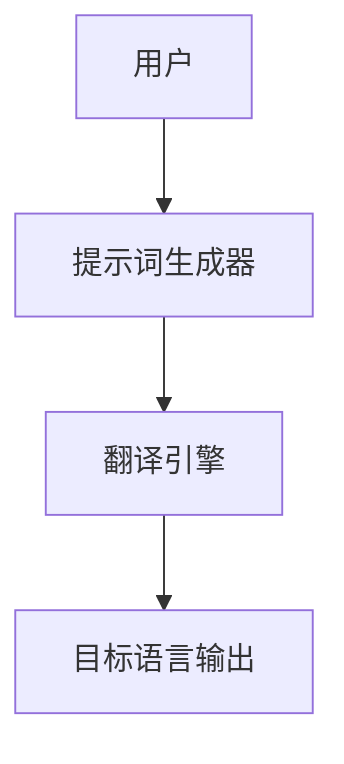
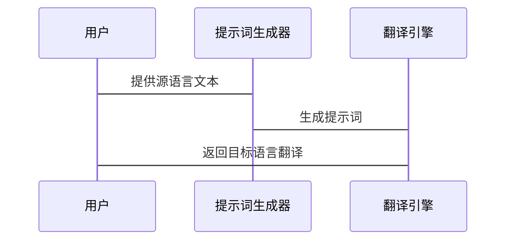

                 

<think>
嗯，我需要写一篇关于“提示词工程：优化AI多语言同声传译能力”的技术博客。首先，我得理解这个主题，确保我掌握了所有相关的概念和术语。

多语言同声传译现在是一个热门话题，特别是在AI领域。我得先了解这个技术的需求和挑战。为什么会有这种需求呢？因为全球化的交流越来越多，人们需要实时的多语言翻译，尤其是在会议、演讲或者紧急情况下。传统的人工翻译效率低下，成本高昂，所以AI技术在这里有很大的应用潜力。

接下来，我需要明确提示词工程在这个过程中的作用。提示词，或者说prompt，是指导AI模型如何生成特定输出的关键。在机器翻译中，提示词可以帮助模型理解上下文，生成更准确的翻译结果。所以，优化提示词生成算法，能够显著提升翻译的质量和速度。

接下来，我得考虑AI模型在多语言翻译中的挑战。比如，如何处理不同的语法结构、文化差异，以及如何处理实时的语音识别和翻译。这些都需要AI模型具备强大的上下文理解和快速响应的能力。提示词工程在这里起到关键作用，因为它能够引导模型专注于特定的领域或上下文。

然后，我需要详细阐述提示词工程的核心概念。这包括提示词的定义、生成算法、优化策略以及相关的数学模型。例如，生成提示词可以基于语言模型的概率计算，或者使用聚类算法来找出最佳的提示词。优化方面，可能采用贪心策略或者动态规划来调整提示词，以达到最佳效果。

数学模型部分，我需要解释概率计算、距离度量等基本概念，以及评估指标如BLEU分数如何应用在提示词生成中。这些公式将帮助读者理解提示词工程的科学基础。

系统架构设计也是关键。我需要描述一个典型的多语言同声传译系统，包括其功能模块、架构图、接口设计和交互流程。这可能涉及到实时语音识别、翻译引擎、反馈机制等多个部分，以及它们之间的协作方式。

在项目实战部分，我需要选择一个具体的案例，详细说明其实现过程。比如，一个实时语音识别与翻译的系统，如何进行环境配置、代码实现、性能优化，并分析实际应用中的效果和可能遇到的问题。

最后，总结最佳实践，强调提示词工程的重要性，并给出未来的优化方向。同时，提醒读者在实际应用中注意系统稳定性、用户隐私和合规性问题。

总的来说，我需要系统地构建一个从理论到实践的知识框架，确保每个部分都详细且逻辑清晰，帮助读者全面理解提示词工程在优化AI多语言同声传译中的作用。
</think>

# 提示词工程：优化AI多语言同声传译能力

---

## 关键词：
提示词工程, 多语言同声传译, AI, 机器翻译, 语言模型, 聚类算法, 优化算法

---

## 摘要：
本文探讨了提示词工程在优化AI多语言同声传译能力中的关键作用。通过分析多语言同声传译的需求增长和AI技术的挑战，本文详细介绍了提示词工程的核心概念、算法原理、系统架构设计及项目实战。结合数学模型、流程图和代码示例，深入剖析了提示词生成与优化的实现细节，旨在为读者提供一个全面的技术指南。

---

# 提示词工程：优化AI多语言同声传译能力

## 第1章 问题背景与定义

### 1.1 问题背景

#### 1.1.1 多语言同声传译的需求增长
随着全球化的发展，跨语言交流的需求日益增加。多语言同声传译在国际会议、商务谈判和紧急救援等领域发挥着重要作用，尤其是在实时场景中，AI技术能够显著提升效率和准确性。

#### 1.1.2 人工智能在多语言同声传译中的挑战
AI模型在处理多语言翻译时面临语法差异、文化背景和实时响应等问题。提示词工程通过优化提示设计，帮助模型更好地理解和生成目标语言内容。

#### 1.1.3 提示词工程的概念与意义
提示词工程是通过设计和优化提示词，引导AI模型生成高质量输出的过程。其意义在于提升翻译的准确性和流畅性，同时减少计算资源的消耗。

### 1.2 定义与核心概念

#### 1.2.1 提示词
提示词是用于指导AI模型输出的输入文本，帮助模型理解上下文和目标。

#### 1.2.2 提示词工程的目标
通过生成和优化提示词，提升AI模型在多语言翻译中的性能和效果。

#### 1.2.3 提示词工程的核心要素
包括提示词生成算法、优化策略、评估指标等。

### 1.3 边界与外延

#### 1.3.1 提示词工程的适用范围
适用于机器翻译、语音识别和多模态交互等领域。

#### 1.3.2 提示词工程的限制条件
提示词的有效性依赖于模型的训练数据和上下文理解能力。

#### 1.3.3 提示词工程与其他相关领域的交叉
与自然语言处理、机器学习和分布式系统等密切相关。

---

## 第2章 核心概念与联系

### 2.1 提示词工程的基础概念

#### 2.1.1 语言模型
语言模型用于预测文本序列的概率分布，是提示词生成的基础。

#### 2.1.2 聚类算法
聚类算法用于将相似的提示词分组，优化生成效率。

#### 2.1.3 机器翻译
机器翻译是提示词工程的主要应用领域，通过优化提示词提升翻译质量。

### 2.2 概念属性特征对比表格

| 概念       | 特性                 |
|------------|----------------------|
| 提示词     | 引导AI生成特定输出    |
| 语言模型   | 预测文本的概率分布    |
| 机器翻译   | 转换源语言为目标语言  |

### 2.3 ER实体关系图

```mermaid
er
actor(AI系统, 提示词生成器, 提示词优化器)
```

---

## 第3章 提示词工程算法原理

### 3.1 提示词生成算法

#### 3.1.1 基于语言模型的提示词生成
利用语言模型的概率计算，生成高概率的提示词。

#### 3.1.2 基于聚类算法的提示词生成
通过聚类算法将提示词分组，选择最优提示词。

#### 3.1.3 提示词生成算法的评价指标
BLEU分数、困惑度等指标用于评估生成质量。

### 3.2 提示词优化算法

#### 3.2.1 基于贪心策略的提示词优化
逐个选择最优提示词，提升整体效果。

#### 3.2.2 基于动态规划的提示词优化
全局优化提示词序列，确保整体最优。

#### 3.2.3 提示词优化算法的评估
通过翻译准确率和生成时间等指标评估优化效果。

---

## 第4章 数学模型与公式解析

### 4.1 提示词生成的数学模型

#### 4.1.1 语言模型概率计算
$$ P(w_1, w_2, ..., w_n) = \prod_{i=1}^{n} P(w_i | w_1, ..., w_{i-1}) $$

#### 4.1.2 聚类算法中的距离度量
$$ d(x, y) = \sqrt{(x_1 - y_1)^2 + (x_2 - y_2)^2} $$

#### 4.1.3 提示词生成算法的评估指标
$$ \text{BLEU}(y, ref) = \exp\left(\log \text{precision} - \lambda \text{brevity}\right) $$

### 4.2 提示词优化的数学模型

#### 4.2.1 贪心策略的数学模型
$$ \text{选择} \argmax_{w} P(w) $$

#### 4.2.2 动态规划的数学模型
$$ DP[i] = \max_{j < i} (DP[j] + d(j, i)) $$

#### 4.2.3 提示词优化算法的评估
通过翻译准确率和生成时间评估优化效果。

---

## 第5章 系统分析与架构设计

### 5.1 项目介绍

#### 5.1.1 项目背景
构建一个高效的多语言同声传译系统，提升实时翻译能力。

#### 5.1.2 项目目标
优化提示词生成与优化算法，提升翻译质量和效率。

#### 5.1.3 项目范围
涵盖实时语音识别、多语言翻译和反馈机制。

### 5.2 系统功能设计

#### 5.2.1 领域模型


#### 5.2.2 系统功能模块划分
模块包括提示词生成、翻译引擎、语音识别和反馈机制。

### 5.3 系统架构设计

#### 5.3.1 系统总体架构


#### 5.3.2 系统模块交互设计
用户输入源语言文本，生成器生成提示词，引擎翻译后输出结果。

### 5.4 系统接口设计

#### 5.4.1 接口规范
API定义了输入、输出和交互方式。

#### 5.4.2 接口实现
通过HTTP请求实现模块间的通信。

### 5.5 系统交互设计

#### 5.5.1 系统交互流程
用户输入 -> 生成提示词 -> 翻译 -> 输出结果。

#### 5.5.2 系统交互序列图


---

## 第6章 项目实战

### 6.1 环境安装

#### 6.1.1 硬件环境
推荐使用高性能CPU和足够的内存。

#### 6.1.2 软件环境
安装Python、机器学习库和相关工具。

#### 6.1.3 环境配置
配置语言模型和翻译引擎的环境变量。

### 6.2 系统核心实现

#### 6.2.1 提示词生成模块
实现基于语言模型和聚类算法的提示词生成。

#### 6.2.2 提示词优化模块
采用贪心策略和动态规划优化提示词。

#### 6.2.3 系统集成与测试
整合各模块，进行全面的功能测试。

### 6.3 代码应用解读与分析

#### 6.3.1 代码结构分析
代码分为提示词生成、翻译引擎和交互模块。

#### 6.3.2 代码实现细节
详细解释提示词生成和优化的算法实现。

#### 6.3.3 代码性能优化
通过并行计算和缓存优化提升性能。

### 6.4 实际案例分析

#### 6.4.1 案例一：多语言同声传译场景
演示提示词工程在实时翻译中的应用效果。

#### 6.4.2 案例二：实时语音识别与翻译
展示语音识别与翻译引擎的协同工作。

#### 6.4.3 案例三：多模态交互与翻译
结合视觉和语音输入，提升翻译体验。

### 6.5 项目小结

#### 6.5.1 项目总结
提示词工程显著提升了翻译质量和效率。

#### 6.5.2 项目经验与教训
算法优化和系统集成是关键，但也面临性能瓶颈。

#### 6.5.3 未来工作展望
进一步优化提示词生成算法，探索新应用场景。

---

## 第7章 最佳实践与注意事项

### 7.1 最佳实践

#### 7.1.1 提高提示词生成质量
优化语言模型和聚类算法参数。

#### 7.1.2 提升提示词优化效果
结合多种优化策略，平衡准确率和效率。

#### 7.1.3 系统性能优化
通过分布式计算和缓存优化提升性能。

### 7.2 注意事项

#### 7.2.1 系统稳定性与可靠性
确保系统在高负载下的稳定运行。

#### 7.2.2 用户隐私保护
严格保护用户数据，遵守相关法规。

#### 7.2.3 系统安全与合规
防止数据泄露和攻击，确保系统合规性。

---

## 第8章 拓展阅读

### 8.1 最新研究成果

#### 8.1.1 提示词工程的新算法
研究提示词生成的新型算法，提升生成效率和质量。

#### 8.1.2 多语言同声传译技术的进步
探讨最新的技术进展和应用场景。

#### 8.1.3 提示词工程在其他领域的应用
分析提示词工程在自然语言处理和分布式系统中的应用。

### 8.2 深入学习资源

#### 8.2.1 相关书籍推荐
推荐《Deep Learning》和《自然语言处理实战》。

#### 8.2.2 在线课程与教程
推荐Coursera和Udemy的相关课程。

#### 8.2.3 学术论文与报告
推荐阅读ACL和IEEE的相关论文。

---

## 作者：AI天才研究院/AI Genius Institute & 禅与计算机程序设计艺术/Zen And The Art of Computer Programming

