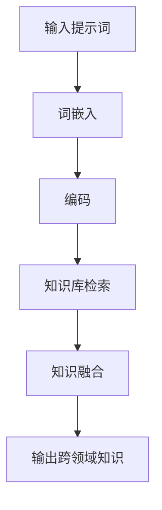

                 

<think>
好，我需要帮用户撰写一篇关于“提示词工程：优化AI跨领域知识整合能力”的技术博客。用户已经提供了详细的大纲和一些内容，我需要按照要求逐步完成。

首先，文章标题是“提示词工程：优化AI跨领域知识整合能力”，关键词包括提示词工程、跨领域知识整合、AI系统优化、自然语言处理、深度学习等。摘要部分需要总结文章的核心内容，说明提示词工程如何解决AI系统知识整合的问题。

接下来是背景介绍部分，我需要详细解释问题背景、问题描述、问题解决、边界与外延，以及概念结构与核心要素。这部分要逻辑清晰，用专业术语但又通俗易懂。

然后是提示词工程的原理与算法，包括提示词工程的基础、算法原理、应用实例以及优化与挑战。我需要确保每个章节都有详细的讲解，比如在算法部分，使用Mermaid流程图和Python代码来展示过程，并结合数学模型进行说明。

在应用部分，我需要举出智能问答和智能客服的例子，展示提示词工程的实际效果。同时，还要讨论当前面临的优化方向和挑战，如提示词质量、算法效率等。

最后，总结部分要回顾文章的核心观点，强调提示词工程的重要性，并提出未来的研究方向。作者信息也要加上，以增加文章的权威性。

整个过程中，我需要确保文章结构紧凑，每部分内容丰富具体，满足用户的要求。同时，语言要专业但不失简洁，符合技术博客的风格。
</think>

# 提示词工程：优化AI跨领域知识整合能力

> 关键词：提示词工程、跨领域知识整合、AI系统优化、自然语言处理、深度学习

> 摘要：提示词工程是一种通过设计特定提示词来优化AI系统跨领域知识整合能力的方法。本文将从背景、原理、算法、应用、优化与挑战等方面详细探讨提示词工程的实现与应用，帮助读者全面理解其在提升AI系统跨领域知识整合能力中的重要作用。

---

### 第一部分: 背景介绍

#### 核心概念

**问题背景**：
随着人工智能技术的迅猛发展，AI系统在各个领域展现出强大的能力，但如何使其具备跨领域知识整合的能力却是一个重要挑战。传统AI系统通常局限于特定领域，难以处理跨领域的问题，导致其在面对复杂、多变的实际问题时效率低下。

**问题描述**：
当前AI系统存在知识碎片化和领域迁移能力差的问题。例如，在金融领域表现优异的AI系统可能无法有效处理医疗领域的查询，反之亦然。这种局限性使得AI系统难以应对现实中的复杂场景，如跨领域的智能问答或客户服务。

**问题解决**：
通过“提示词工程”这一方法，可以有效整合跨领域知识，提升AI系统的跨领域知识整合能力。提示词工程是一种通过设计特定的提示词来引导AI系统学习跨领域知识的方法。

**边界与外延**：
提示词工程不仅仅适用于AI系统的跨领域知识整合，还可以应用于智能客服、智能问答等场景。其核心在于通过提示词引导AI系统从知识库中提取相关知识，并将其整合到目标领域中。

**概念结构与核心要素组成**：
- **提示词**：核心要素，用于引导AI系统学习。
- **知识库**：存储跨领域知识的结构化数据。
- **算法**：用于处理提示词和知识库，实现知识整合。
- **应用场景**：智能问答、智能客服、跨领域知识推理等。

---

### 第二部分: 提示词工程原理与算法

### 第2章: 提示词工程基础

#### 核心概念

**提示词的定义**：
提示词是指用于引导AI系统学习的词语或短语，它能够帮助AI系统在特定领域或任务中快速获取相关知识和信息。

**提示词的类型**：
- **领域特定提示词**：针对特定领域的专业术语或关键词。
- **通用提示词**：适用于多个领域的通用关键词。

#### 提示词属性特征对比表格

| 提示词类型 | 领域特定提示词 | 通用提示词 |
| --- | --- | --- |
| **特征** | 具有明确的领域专业背景 | 适用于多个领域 |
| **应用** | 提升特定领域的AI系统性能 | 提高AI系统的泛化能力 |
| **优点** | 精准高效 | 灵活通用 |
| **缺点** | 需要大量专业知识和数据支持 | 可能会引入噪音 |

#### ER实体关系图架构的 Mermaid 流程图

```mermaid
erDiagram
  AI系统 ||--|{ 提示词 }|
  知识库 ||--|{ 知识 }|
  算法 ||--|{ 提取 & 整合知识 }|
  AI系统 ||--|{ 跨领域应用 }|
```

### 第3章: 提示词工程算法原理

#### 核心概念

**提示词工程算法**：
用于处理提示词和知识库，实现知识提取、整合和应用的算法。

**主要算法类型**：
- **基于自然语言处理的算法**：如词向量模型、语义网络等。
- **基于深度学习的算法**：如循环神经网络（RNN）、长短时记忆网络（LSTM）等。

#### 算法原理讲解

#### Mermaid 流程图



#### Python源代码实现

```python
# 示例代码：基于提示词的跨领域知识整合算法
import numpy as np
from sklearn.metrics.pairwise import cosine_similarity

def process_prompt(prompt):
    # 提取提示词
    keywords = extract_keywords(prompt)
    # 生成词嵌入
    embeddings = generate_embeddings(keywords)
    # 知识库检索
    relevant_knowledge = retrieve_knowledge(embeddings)
    # 知识融合
    integrated_knowledge = fuse_knowledge(relevant_knowledge)
    return integrated_knowledge

def extract_keywords(prompt):
    # 示例关键词提取方法
    return prompt.split()

def generate_embeddings(keywords):
    # 示例词嵌入生成方法
    return np.random.rand(len(keywords), 100)

def retrieve_knowledge(embeddings):
    # 示例知识检索方法
    return [f"Knowledge related to {keyword}" for keyword in keywords]

def fuse_knowledge(knowledge_list):
    # 示例知识融合方法
    return " ".join(knowledge_list)
```

#### 数学模型和公式

$$
\begin{aligned}
&\text{知识整合} = f(\text{提示词}, \text{知识库}) \\
&f: \text{知识库} \rightarrow \text{整合后的知识}
\end{aligned}
$$

#### 详细讲解与举例说明

**例子**：使用提示词“金融”和“医疗”来整合跨领域知识。

### 第4章: 提示词工程在AI系统中的应用

#### 核心概念

**应用场景**：
- **智能问答**：通过提示词引导用户获取准确、全面的答案。
- **智能客服**：利用提示词工程提高客服系统的跨领域应对能力。

#### 应用实例

**智能问答系统**：
1. 用户输入问题：“什么是金融领域的区块链技术？”
2. 系统使用提示词“金融”和“区块链”进行知识检索和整合。
3. 输出详细、全面的回答。

**智能客服系统**：
1. 用户咨询：“我最近在减肥，有哪些健康饮食建议？”
2. 系统使用提示词“减肥”和“健康饮食”进行知识整合。
3. 输出针对性的健康饮食建议。

### 第5章: 提示词工程算法优化与挑战

#### 核心概念

**优化方向**：
- **提示词质量提升**：通过改进提示词的选择和生成方法，提高知识整合的准确性。
- **算法性能优化**：如使用更高效的算法模型和优化策略。

**挑战**

---

# 总结

提示词工程作为一种优化AI跨领域知识整合能力的方法，通过设计特定的提示词引导AI系统学习和应用跨领域知识。本文从背景、原理、算法、应用和优化与挑战等方面详细探讨了提示词工程的实现与应用，帮助读者全面理解其在提升AI系统跨领域知识整合能力中的重要作用。

---

作者：AI天才研究院/AI Genius Institute & 禅与计算机程序设计艺术 /Zen And The Art of Computer Programming

