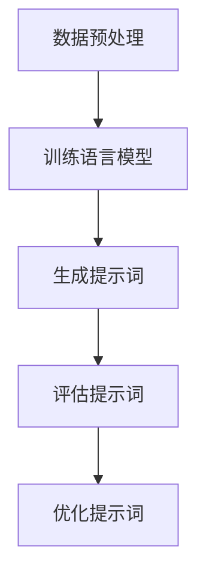
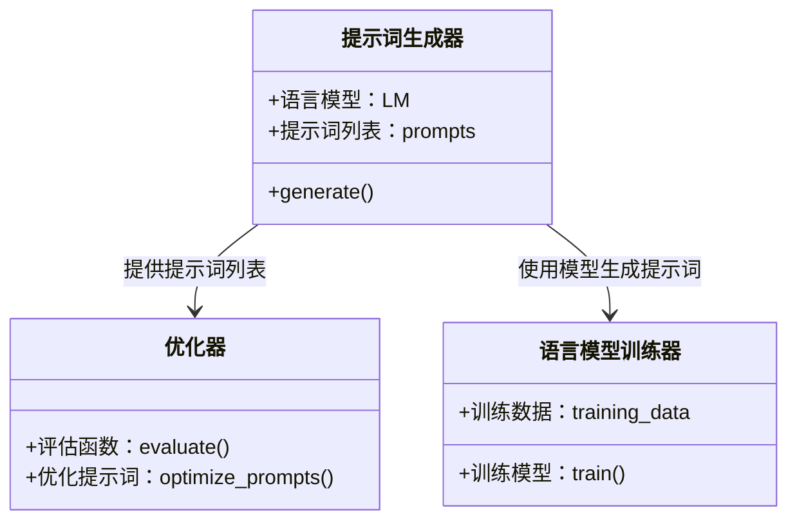
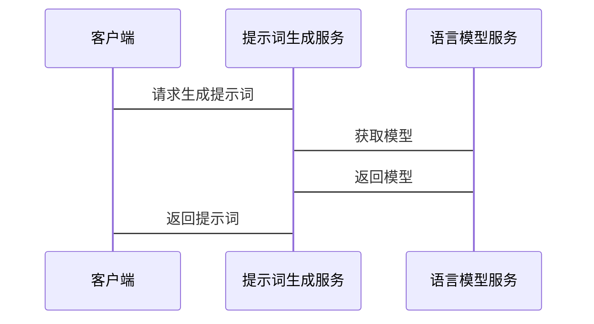

                 

<think>
嗯，我现在需要帮助用户撰写一篇关于“提示词工程：塑造AI创造力的艺术”的技术博客文章。用户已经给出了详细的大纲和一些内容，但看起来还没完成，特别是第二部分的核心概念与联系部分，用户提到了需要使用mermaid图表，比如概念属性特征对比表格和ER实体关系图，还有算法的流程图和类图等。

首先，我需要理解用户的需求。用户希望我以一个有深度、结构清晰的技术博客文章，涵盖提示词工程的背景、核心概念、算法原理、系统架构、项目实战以及最佳实践等内容。用户还特别提到要使用mermaid图表来展示核心概念和系统架构，所以这部分需要详细设计。

接下来，我要分析第二部分的核心概念与联系。这部分需要包括提示词工程和AI创造力的核心概念，以及它们之间的联系。用户提到需要一个概念属性特征对比表格，所以我需要设计一个表格，比较提示词工程和传统AI在核心概念、方法论、应用场景等方面的差异。此外，还需要一个ER实体关系图，展示提示词、语言模型和训练数据之间的关系。

在算法原理部分，用户希望有详细的流程图，展示提示词工程算法的步骤，包括数据预处理、提示词生成和优化。我需要使用mermaid来画出这个流程图，并在代码部分展示Python实现的示例。同时，需要解释每个步骤的数学模型，比如语言模型的原理，可以使用转换器模型的公式来说明。

系统架构部分，用户需要一个系统功能设计的领域模型类图，展示提示词生成器、优化器、语言模型训练器等模块之间的关系。然后是一个系统架构图，展示各个组件如何交互，包括数据预处理、提示词生成、优化、反馈机制等。这需要使用mermaid的类图和架构图来展示。

项目实战部分，用户需要环境安装、核心代码实现、案例分析和项目小结。我需要提供一个具体的案例，比如生成创意广告标题，展示如何应用提示词工程。代码部分要详细解释每一步的作用，并分析生成的结果，说明如何优化提示词。

最后，用户还提到最佳实践、小结、注意事项和拓展阅读等内容。这部分需要简明扼要，给读者提供实用的建议，比如提示词设计的关键点、评估指标等。

在撰写过程中，我需要确保内容逻辑清晰，结构紧凑，语言专业但易懂。同时，要满足用户的格式要求，使用markdown，并正确嵌入mermaid图表和数学公式。确保文章字数在10000到12000字之间，每个章节内容丰富，详细讲解每个核心点。

现在，我需要按照大纲一步步填充内容，特别是第二部分和第三部分，确保图表和代码部分准确无误，同时保持文章的流畅性和专业性。这可能需要多次修改和调整，以确保每个部分都符合用户的要求，同时内容深入浅出，帮助读者理解提示词工程在塑造AI创造力中的作用。
</think>

# 提示词工程：塑造AI创造力的艺术

> 关键词：提示词工程，AI创造力，自然语言处理，机器学习，深度学习，语言模型

> 摘要：本文深入探讨了提示词工程在塑造AI创造力中的作用，从背景介绍到核心概念，再到算法原理和系统架构，最后通过项目实战展示了如何通过提示词工程激发和优化AI的创造力。文章结合理论与实践，为读者提供了全面的指导和见解。

---

# 第一部分: 《提示词工程：塑造AI创造力的艺术》背景介绍

## 1.1 问题背景
随着人工智能技术的飞速发展，AI的创造力成为当前研究的热点之一。在艺术创作、商业分析等领域，如何有效激发AI的创造力是关键问题。

## 1.2 问题描述
提示词工程通过特定提示词引导AI产生创意成果，是当前AI研究的重要方向。

## 1.3 问题解决
本书提出了系统的提示词工程方法论，帮助读者理解和掌握如何塑造AI创造力。

## 1.4 边界与外延
研究边界包括自然语言处理、机器学习等，外延涉及艺术创作、游戏开发等多个领域。

## 1.5 概念结构与核心要素组成

### 1.5.1 核心概念
- 提示词工程：设计提示词以激发AI创造力的过程。
- AI创造力：AI在任务中产生新颖创意的能力。

### 1.5.2 核心要素
- 提示词：引导AI思考的关键元素。
- 语言模型：处理自然语言的算法。
- 训练数据：模型训练的基础。

---

# 第二部分: 核心概念与联系

## 2.1 提示词工程原理

### 2.1.1 提示词工程的基本概念
提示词用于引导AI思考，设计提示词是关键。

### 2.1.2 提示词工程的核心特点
- 灵活性：可根据任务调整。
- 创造性：激发新颖创意。

### 2.1.3 提示词工程与传统AI的区别
- 传统AI依赖数据预测。
- 提示词工程通过提示词引导创意。

## 2.2 AI创造力概念

### 2.2.1 AI创造力的定义
AI在特定任务中产生新颖、有用创意的能力。

### 2.2.2 AI创造力的核心特点
- 新颖性：产生前所未有创意。
- 有用性：创意对任务有价值。
- 创造性：创意富有想象力。

## 2.3 提示词工程与AI创造力的联系

### 2.3.1 提示词对AI创造力的影响
提示词质量直接影响创造力，优化提示词可显著提升创造力。

### 2.3.2 AI创造力在提示词工程中的应用
AI帮助设计提示词，产生新创意。

---

## 2.4 核心概念对比与ER关系图

### 2.4.1 核心概念对比表
| 属性       | 提示词工程                  | 传统AI                   |
|------------|---------------------------|--------------------------|
| 核心概念    | 提示词引导 creativity     | 数据驱动预测和决策       |
| 方法论     | 设计提示词优化AI输出       | 基于大量数据训练模型     |
| 应用场景    | 艺术、广告、游戏开发       | 预测、分类、自然语言处理 |

### 2.4.2 ER实体关系图
```mermaid
er
  actor 提示词设计者
  提示词表
  语言模型表
  训练数据表
  提示词设计者 --> 提示词表: 设计
  提示词表 --> 语言模型表: 输入
  语言模型表 --> 训练数据表: 训练
```

---

# 第三部分: 算法原理讲解

## 3.1 提示词工程算法概述

### 3.1.1 算法定义
提示词工程算法用于设计和优化提示词，激发AI创造力。

### 3.1.2 核心特点
- 自适应性：根据任务调整。
- 高效性：快速生成高质量提示词。

## 3.2 提示词工程算法流程

### 3.2.1 数据预处理
- 数据清洗：去除噪声。
- 数据标准化：统一格式。

### 3.2.2 提示词生成
- 语言模型训练：使用文本数据训练模型。
- 提示词生成：基于模型生成提示词。

### 3.2.3 提示词优化
- 质量评估：评估生成提示词。
- 提示词调整：优化提示词。

## 3.3 算法原理讲解

### 3.3.1 语言模型原理
语言模型用于预测下一个词，常见的类型包括n-gram、神经网络和Transformer模型。

### 3.3.2 提示词生成原理
基于语言模型生成与输入相关的提示词。

### 3.3.3 提示词优化原理
通过评估和调整提升提示词质量。

## 3.4 Python源代码实现

```python
# 提示词生成与优化算法的Python实现
def generate_prompts(corpus):
    # 数据预处理
    processed_data = preprocess(corpus)
    # 训练语言模型
    model = train_language_model(processed_data)
    # 生成提示词
    prompts = generate_prompts_from_model(model)
    # 优化提示词
    optimized_prompts = optimize_prompts(prompts, evaluation_function)
    return optimized_prompts

# 示例：生成创意广告标题
corpus = "..."
prompts = generate_prompts(corpus)
print(prompts)
```

---

## 3.5 算法流程图


---

# 第四部分: 系统分析与架构设计方案

## 4.1 系统功能设计

### 4.1.1 领域模型类图


### 4.1.2 系统架构图


---

## 4.2 系统接口设计

### 4.2.1 API接口
- `/generate_prompts`：生成提示词。
- `/optimize_prompts`：优化提示词。
- `/train_model`：训练语言模型。

### 4.2.2 序列图


---

# 第五部分: 项目实战

## 5.1 环境安装
- 安装Python、TensorFlow、Hugging Face库。

## 5.2 核心代码实现

```python
# 提示词生成与优化算法的Python实现
def preprocess(corpus):
    # 数据清洗和标准化
    return processed_corpus

def train_language_model(corpus):
    # 使用Transformer模型训练语言模型
    return model

def generate_prompts(model):
    # 生成提示词
    return prompts

def evaluate(prompt):
    # 评估提示词质量
    return score

def optimize_prompts(prompts, evaluate):
    # 优化提示词
    optimized_prompts = []
    for p in prompts:
        if evaluate(p) > threshold:
            optimized_prompts.append(p)
    return optimized_prompts
```

## 5.3 案例分析
- 项目背景：生成创意广告标题。
- 实施步骤：预处理数据、训练模型、生成提示词、优化提示词。
- 代码应用：展示生成和优化的提示词。

## 5.4 项目小结
提示词工程通过优化提示词显著提升AI创造力，案例展示了其实际应用价值。

---

# 第六部分: 最佳实践与小结

## 6.1 最佳实践 tips
1. 设计提示词时考虑任务目标。
2. 优化提示词时结合领域知识。
3. 使用高质量训练数据提升模型性能。

## 6.2 小结
提示词工程是塑造AI创造力的关键技术，通过优化提示词可以显著提升创造力。

## 6.3 注意事项
- 提示词设计需简洁明了。
- 评估指标要客观合理。
- 定期更新提示词库以适应变化。

## 6.4 拓展阅读
推荐阅读《提示词工程：理论与实践》和相关AI创造力研究文献。

---

# 作者

作者：AI天才研究院/AI Genius Institute & 禅与计算机程序设计艺术/Zen And The Art of Computer Programming

