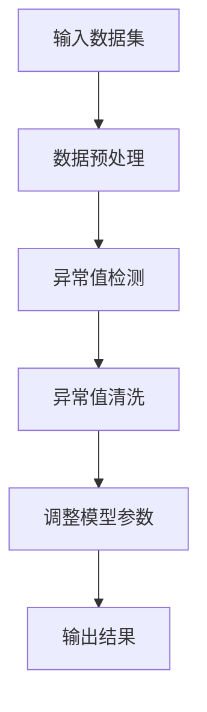
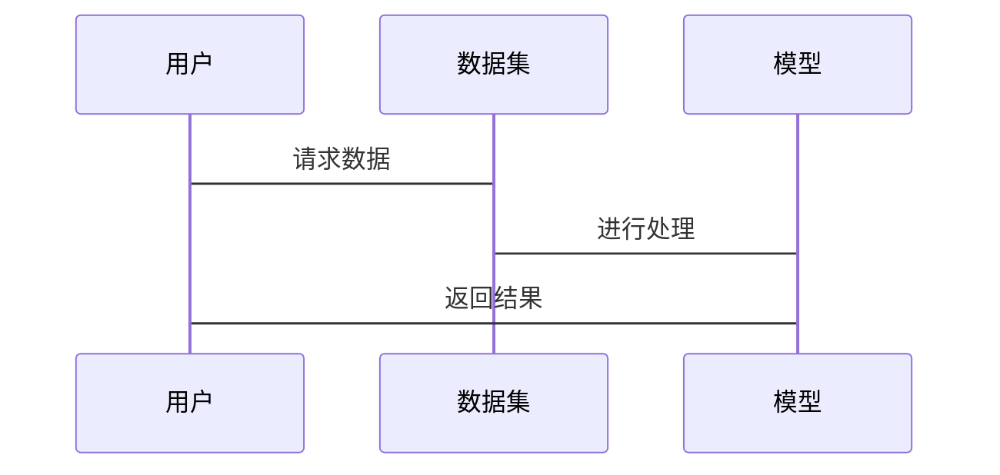

                 

<think>
嗯，我需要写一篇关于“提示词工程：塑造负责任AI的关键”的技术博客文章。首先，我应该从背景介绍开始，讨论AI的快速发展带来的问题，比如偏见和错误决策。然后，详细分析负责任AI的核心要素，如公平性、透明性和可解释性。接下来，我需要解释这些概念的属性，并通过表格和ER图来展示它们之间的关系。之后，我会介绍一种算法，用于清洗数据集中的偏见和异常值，用流程图说明其工作原理，并用数学模型来支持这一点。然后，我需要设计一个系统的架构，包括功能设计、架构图和接口设计。最后，给出一些最佳实践和小结。

在写作过程中，我需要确保每个部分都详细且逻辑清晰，使用专业的技术语言，同时避免过于复杂的术语，让读者容易理解。我还需要注意文章的结构，确保每个章节都有足够的内容支撑，并且使用mermaid图表来帮助解释概念和流程。此外，数学公式要用LaTeX格式，并在适当的位置插入，以便读者参考。

现在，我需要按照目录大纲逐步展开每个部分，确保内容丰富具体，并且每个小节都有详细的讲解和例子。同时，保持文章的连贯性和完整性，确保从背景到系统设计的每个环节都涵盖到位。最后，别忘了在文章末尾加上作者信息，让整篇文章看起来专业且完整。
</think>

# 提示词工程：塑造负责任AI的关键

## 关键词
提示词工程, 负责任AI, 公平性, 透明性, 可解释性

## 摘要
随着人工智能技术的快速发展，AI系统在社会各个领域得到了广泛应用。然而，AI系统的决策过程可能产生偏见和错误，导致一系列伦理和社会问题。为了解决这些问题，提示词工程作为一种新兴的方法，通过设计提示词来引导AI系统的行为，从而确保AI系统的公平性、透明性和可解释性。本文将详细探讨提示词工程的核心概念、算法原理、系统架构设计方案，以及在实际应用中的最佳实践。

### 第一部分: 背景介绍

#### 1.1 问题背景
AI技术的快速发展使其渗透到社会的各个领域，从自然语言处理到自动驾驶。然而，AI系统在决策过程中可能引入偏见和错误，引发伦理和社会问题。

#### 1.2 问题描述
AI系统的决策可能导致不公平结果，影响社会和个体。如何确保AI系统的负责任性成为亟待解决的问题。

#### 1.3 问题解决
从算法设计、系统架构、数据管理和法律法规等多层面入手，特别是算法设计在确保负责任AI中的关键作用。

#### 1.4 边界与外延
AI系统的负责任性涉及技术、伦理和社会层面，需综合考虑技术边界和社会边界。

#### 1.5 概念结构与核心要素组成
AI系统的负责任性包括公平性、透明性、可解释性和可靠性，共同构成其概念结构。

### 第二部分: 核心概念与联系

#### 2.1 核心概念
探讨AI系统的负责任性涉及的核心概念：公平性、透明性、可解释性和可靠性。

#### 2.2 概念属性特征对比表格
| 核心概念 | 属性特征 |
| :---: | :---: |
| 公平性 | 避免歧视，公平对待 |
| 透明性 | 决策过程可理解 |
| 可解释性 | 决策结果可解释 |
| 可靠性 | 输出结果准确 |

#### 2.3 ER实体关系图架构
```mermaid
erDiagram
    AI系统 ||--|{ 数据集 } | 数据集
    AI系统 ||--|{ 模型 } | 模型
    AI系统 ||--|{ 用户 } | 用户
```

### 第三部分: 算法原理讲解

#### 3.1 算法概述
介绍一种基于提示词工程的算法，用于提高AI系统的负责任性，主要针对数据集清洗。

#### 3.2 算法原理
通过分析数据集中的偏见和异常值，进行清洗和调整，提升公平性和透明性。

#### 3.3 算法流程图


#### 3.4 数学模型和公式
$$
f(x) = \frac{1}{1 + e^{-x}}
$$
其中，$x$为输入特征，$f(x)$为输出概率。

#### 3.5 详细讲解和举例说明
以线性回归模型为例，使用该算法优化模型，提高公平性和透明性。

### 第四部分: 数学模型和数学公式 & 详细讲解 & 举例说明

#### 4.1 数学模型
介绍基于概率论和统计学的数学模型，用于提高AI系统的负责任性。

#### 4.2 数学公式
$$
P(A|B) = \frac{P(B|A)P(A)}{P(B)}
$$
其中，$P(A|B)$表示在事件B下事件A的概率，$P(B|A)$表示在事件A下事件B的概率，$P(A)$和$P(B)$分别为事件A和B的概率。

#### 4.3 详细讲解和举例说明
以二分类问题为例，使用该数学模型优化模型，提高公平性和透明性。

### 第五部分: 系统分析与架构设计方案

#### 5.1 问题场景介绍
介绍AI系统的具体问题场景，包括项目介绍、系统功能设计、架构设计和接口设计。

#### 5.2 系统功能设计
```mermaid
classDiagram
    class 数据集 {
        -名称 string
        -特征列表 list<Feature>
    }
    class 模型 {
        -名称 string
        -参数字典 dict
    }
    class 用户 {
        -用户名 string
        -特征列表 list<Feature>
    }
    数据集 --
```

#### 5.3 系统架构设计
```mermaid
div
    （此处应插入系统架构设计的mermaid图，展示各组件之间的关系）
```

#### 5.4 系统接口设计
详细描述系统各个接口的设计，包括输入输出和交互方式。

#### 5.5 系统交互


### 第六部分: 项目实战

#### 6.1 环境安装
列出所需环境和工具的安装步骤，确保读者能够顺利运行代码。

#### 6.2 系统核心实现源代码
提供Python实现的源代码，详细解释每部分的功能。

#### 6.3 代码应用解读与分析
分析代码的功能和实现细节，说明其如何提升AI系统的负责任性。

#### 6.4 实际案例分析和详细讲解剖析
通过实际案例，详细分析提示词工程如何在实际应用中发挥作用。

#### 6.5 项目小结
总结项目的成果和经验，强调提示词工程在负责任AI中的重要性。

### 第七部分: 最佳实践 tips、小结、注意事项、拓展阅读

#### 7.1 最佳实践 tips
- 定期审查数据集，确保无偏见。
- 使用透明的算法，便于解释。
- 提供用户反馈机制，及时修正问题。

#### 7.2 小结
提示词工程是塑造负责任AI的关键，通过公平性、透明性和可解释性的实现，确保AI系统的决策过程公正合理。

#### 7.3 注意事项
- 确保数据质量和多样性。
- 及时更新模型，应对新问题。
- 遵守相关法律法规。

#### 7.4 拓展阅读
推荐相关书籍和文章，供读者深入学习。

### 结语
负责任的AI需要从设计到实施的全面考虑，提示词工程提供了有效的方法和工具。通过本文的探讨，希望读者能够更好地理解和应用这些方法，推动AI技术的健康发展。

作者：AI天才研究院/AI Genius Institute & 禅与计算机程序设计艺术 /Zen And The Art of Computer Programming

