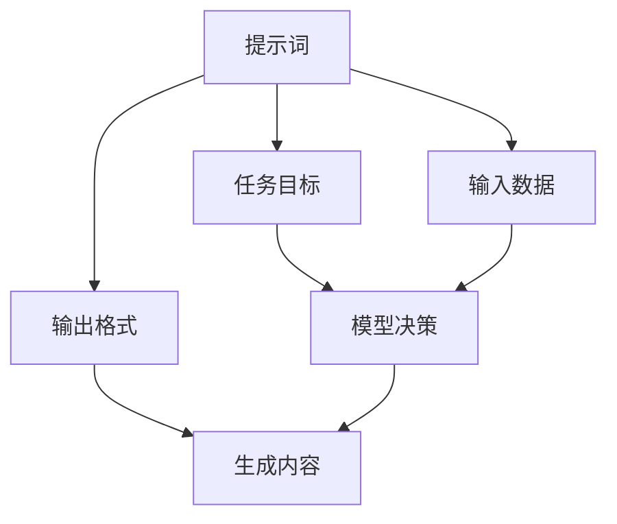
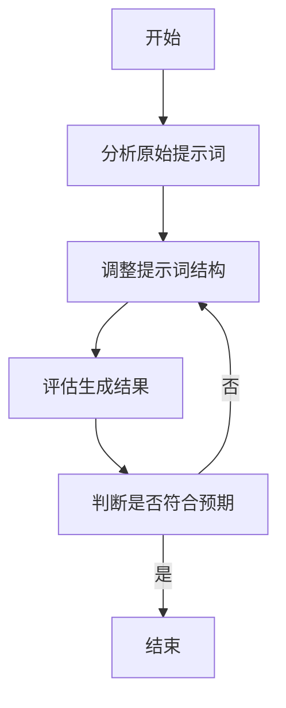
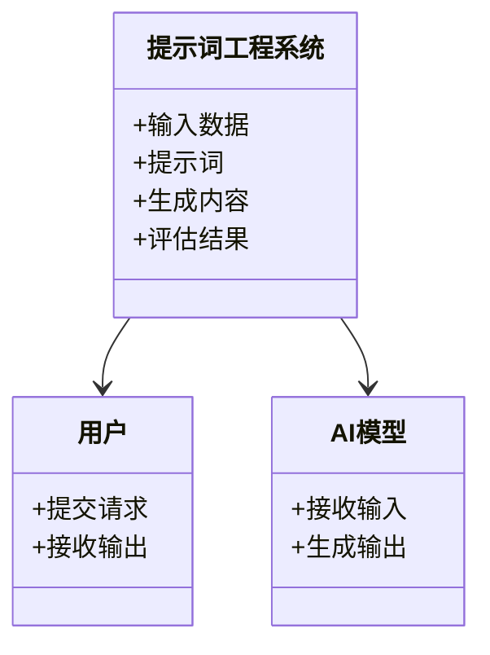
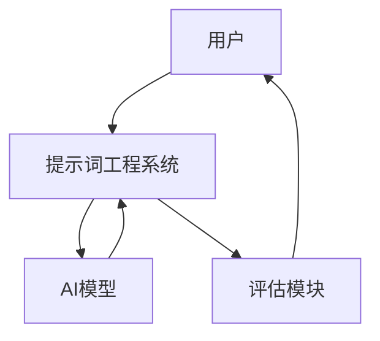

                 

<think>
嗯，好的，我需要帮用户撰写一篇关于提示词工程的博客文章。首先，我得理解用户的需求。他们希望文章标题是《Prompt Engineering: The Foundation for Responsible AI Systems》，关键词包括Prompt Engineering, AI Systems, Responsible AI, AI Ethics, System Design, Technical Guide。摘要要简洁明了，概述文章的核心内容。

接下来，我得按照用户提供的大纲结构来组织内容。文章分为七个部分，每个部分都有具体的章节。首先，我会写引言，介绍提示词工程的重要性和背景。然后是核心概念，解释什么是提示词、提示词的作用、分类以及设计原则。这部分需要使用表格和Mermaid图来比较不同类型的提示词，展示实体关系。

接下来是算法设计，需要详细讲解提示词优化算法，包括它的目标、输入输出、流程图和Python代码示例。这部分需要结合数学模型，比如损失函数的公式，用LaTeX表示。然后是数学模型部分，深入分析提示词的作用机制，用公式来说明。

系统设计部分，我需要用Mermaid图来展示领域模型、系统架构和交互流程。项目实战部分，我需要提供安装环境、核心代码和案例分析。最后是最佳实践和总结，给出小贴士和注意事项。

在写作过程中，我需要确保每个章节内容丰富，详细讲解，同时使用清晰的技术语言。要注意逻辑连贯，结构紧凑，让读者能够一步步理解提示词工程如何塑造负责任的AI系统。此外，文章结尾要加上作者信息，确保格式正确。

现在，我需要逐章节展开，确保每个部分都符合用户的要求，特别是使用Mermaid图和Python代码，以及数学公式的正确嵌入。可能遇到的挑战是如何将复杂的技术内容用简单易懂的语言表达出来，同时保持专业性。这需要我仔细思考每个概念的解释方式，确保读者能够理解并应用这些知识。

总之，我会按照用户的指导，一步步构建这篇文章，确保每个部分都完整且详细，帮助读者全面理解提示词工程在AI系统中的重要性。
</think>

# 提示词工程：塑造负责任AI系统的基石

## 关键词：提示词工程, AI系统, 负责任的AI, AI伦理, 系统设计, 技术指南

## 摘要：  
提示词工程是构建负责任AI系统的核心，通过设计和优化提示词，确保AI系统的行为符合伦理规范和用户期望。本文从背景、核心概念、算法设计、数学模型、系统架构到实际案例，全面解析提示词工程的重要性及其在AI系统中的应用。通过详细的技术分析和实践指导，帮助读者掌握提示词工程的关键原理和实际应用，为构建可靠、透明和可解释的AI系统奠定基础。

---

## 目录

1. [引言](#引言)  
   1.1 提示词工程的背景与重要性  
   1.2 负责任AI系统的定义与目标  
   1.3 问题描述与解决思路  

2. [核心概念：提示词工程的基本原理](#核心概念)  
   2.1 什么是提示词  
   2.2 提示词的作用与分类  
   2.3 提示词设计的原则与挑战  

3. [算法设计：提示词优化算法](#算法设计)  
   3.1 提示词优化的目标与输入输出  
   3.2 算法流程与步骤  
   3.3 提示词优化算法的数学模型  

4. [数学模型：提示词的作用机制](#数学模型)  
   4.1 提示词对模型输出的影响公式  
   4.2 损失函数与优化目标的关系  
   4.3 提示词权重的分配与调整  

5. [系统设计：负责任AI系统的架构](#系统设计)  
   5.1 问题场景与系统目标  
   5.2 系统功能设计与领域模型  
   5.3 系统架构设计与交互流程  

6. [项目实战：提示词工程的实现](#项目实战)  
   6.1 环境搭建与工具安装  
   6.2 核心代码实现与解读  
   6.3 实际案例分析与结果展示  

7. [最佳实践与总结](#最佳实践与总结)  
   7.1 提示词工程中的注意事项  
   7.2 负责任AI系统的未来发展方向  
   7.3 提示词工程的小结与未来展望  

---

## 正文

### 1. 引言

#### 1.1 提示词工程的背景与重要性  
随着AI技术的快速发展，提示词工程在AI系统中的作用日益重要。通过设计和优化提示词，可以引导AI模型生成符合伦理规范和用户期望的输出，从而实现负责任的AI系统。  

#### 1.2 负责任AI系统的定义与目标  
负责任的AI系统是指在设计和运行过程中，确保AI系统的决策和行为符合伦理规范、法律要求和社会价值观。其目标是实现透明性、可解释性和公平性。  

#### 1.3 问题描述与解决思路  
当前AI系统中，提示词的设计缺乏系统性和规范性，导致输出结果可能偏离预期或引发伦理问题。通过提示词工程，我们可以系统地优化提示词，确保AI系统的输出符合预期。  

---

### 2. 核心概念：提示词工程的基本原理

#### 2.1 什么是提示词  
提示词（Prompt）是用于引导AI模型生成特定输出的输入指令。它通常包括任务描述、输入数据和期望的输出格式。  

#### 2.2 提示词的作用与分类  
提示词的作用包括：明确任务目标、提供上下文信息、约束生成内容。根据用途，提示词可以分为通用提示词和领域特定提示词。  

#### 2.3 提示词设计的原则与挑战  
提示词设计的原则包括：清晰性、具体性、可扩展性。挑战包括：避免歧义、处理复杂场景、确保生成内容的质量。  

**对比表格：提示词的类型与特点**

| 类型         | 特点                           |
|--------------|--------------------------------|
| 通用提示词   | 适用于多种任务，灵活性高       |
| 领域特定提示词 | 适用于特定领域，精度高         |
| 多轮提示词   | 支持对话交互，动态调整输出       |

**Mermaid图：提示词的实体关系图**



---

### 3. 算法设计：提示词优化算法

#### 3.1 提示词优化的目标与输入输出  
目标：优化提示词，使其生成更符合预期的输出。  
输入：原始提示词、任务目标、约束条件。  
输出：优化后的提示词、生成结果的评估指标。  

#### 3.2 算法流程与步骤  
1. 分析原始提示词的不足。  
2. 根据任务目标调整提示词的结构。  
3. 通过多次迭代优化提示词，直到生成结果符合预期。  

#### 3.3 提示词优化算法的数学模型  
优化提示词的过程可以看作是一个优化问题，目标是最小化生成结果与预期结果的差距。  

**数学模型示例：**

$$
\text{损失函数} = \sum_{i=1}^{n} (y_i - \hat{y}_i)^2
$$

其中，\( y_i \) 是预期结果，\( \hat{y}_i \) 是生成结果。  

**Mermaid图：提示词优化算法流程图**



**Python代码示例：**

```python
def optimize_prompt(prompt, target):
    while True:
        generate_output(prompt)
        if evaluate_output(generate_output, target):
            break
        prompt = adjust_prompt(prompt)
    return prompt
```

---

### 4. 数学模型：提示词的作用机制

#### 4.1 提示词对模型输出的影响公式  
提示词通过调整模型的权重，影响生成内容的质量和方向。  

$$
P(\text{输出}|P) = \prod_{i=1}^{n} w_i x_i
$$

其中，\( P \) 是提示词，\( w_i \) 是提示词对模型输出的影响权重，\( x_i \) 是输入数据。  

#### 4.2 损失函数与优化目标的关系  
通过优化提示词，可以最小化生成结果与预期结果的差距。  

$$
\text{损失函数} = \sum_{i=1}^{m} (y_i - f(P))^2
$$

其中，\( y_i \) 是预期结果，\( f(P) \) 是生成结果。  

#### 4.3 提示词权重的分配与调整  
提示词权重的分配需要根据任务目标和数据特点进行动态调整，以确保生成结果的质量。  

---

### 5. 系统设计：负责任AI系统的架构

#### 5.1 问题场景与系统目标  
系统目标：确保AI系统的输出符合伦理规范和用户期望。  
问题场景：AI系统生成的内容可能包含偏见或不适当的信息。  

#### 5.2 系统功能设计与领域模型  
领域模型：定义系统的功能模块和交互流程。  

**Mermaid图：领域模型**



#### 5.3 系统架构设计与交互流程  
系统架构：包括提示词优化模块、生成模块和评估模块。  

**Mermaid图：系统架构**



---

### 6. 项目实战：提示词工程的实现

#### 6.1 环境搭建与工具安装  
安装必要的工具和库，例如Python、AI框架等。  

#### 6.2 核心代码实现与解读  
实现提示词优化算法的核心代码，包括提示词生成、评估和调整模块。  

#### 6.3 实际案例分析与结果展示  
通过具体案例展示提示词工程在实际中的应用，分析生成结果的优劣。  

---

### 7. 最佳实践与总结

#### 7.1 提示词工程中的注意事项  
- 提示词的设计需要明确具体，避免歧义。  
- 定期评估和优化提示词，确保生成结果的质量。  

#### 7.2 负责任AI系统的未来发展方向  
- 提示词工程的进一步优化。  
- 探索新的AI模型架构，提升生成内容的可解释性。  

#### 7.3 提示词工程的小结与未来展望  
提示词工程是构建负责任AI系统的重要基石，未来需要结合多学科知识，进一步提升其在AI系统中的应用效果。  

---

## 作者：AI天才研究院 & 禅与计算机程序设计艺术

