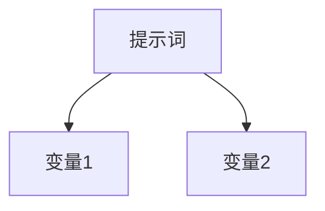
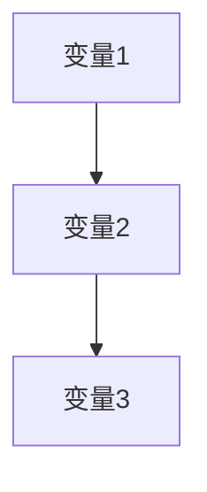
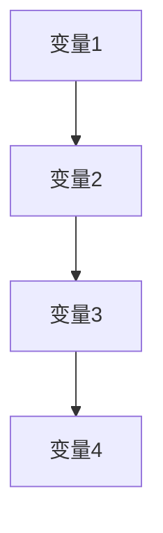
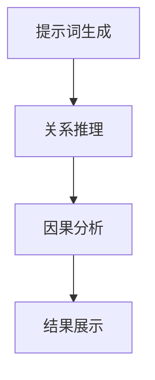
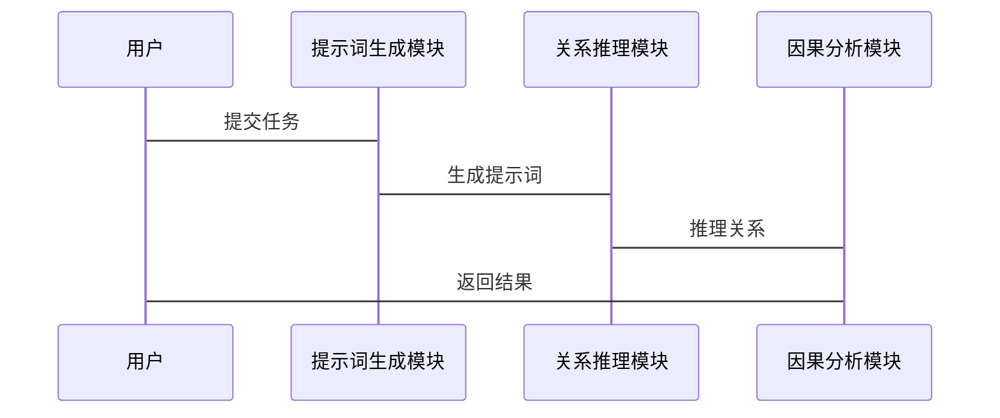
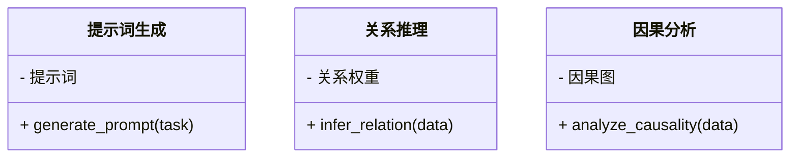

                 

<think>
好的，我现在需要根据用户提供的详细大纲和要求，逐步分析并撰写一篇关于“提示词工程：处理复杂因果关系推理任务”的技术博客文章。首先，我需要理解用户的需求，用户希望这篇文章结构清晰，内容详实，符合专业技术人员的阅读习惯，并且字数在10000到12000字之间。

首先，我会从文章的标题开始，确定关键词和摘要部分。标题已经明确，接下来需要列出5到7个核心关键词，这些关键词应该涵盖文章的主要内容，比如提示词工程、复杂因果关系、推理任务、自然语言处理、人工智能等。摘要部分需要简洁明了地概括文章的核心内容，说明提示词工程在处理复杂因果关系推理中的作用和应用。

接下来是目录大纲，用户已经提供了一个详细的结构，分为六个主要部分，每个部分包含多个章节。我需要按照这个结构逐一展开，确保每个章节都有足够的内容，并且符合用户的格式要求。

在撰写正文部分时，我需要确保每个章节都包含必要的信息。例如，在背景介绍部分，需要解释问题的背景、挑战以及提示词工程的定义和作用。问题描述部分要明确界定复杂因果关系推理任务，分析其关键特征和分类。问题解决部分则需要介绍提示词工程的理论基础、方法及其效果评估。

核心概念与联系部分，我需要详细讲解提示词的定义、关系推理的基本原理，以及复杂因果关系推理的关键概念。同时，还需要通过表格对比不同方法的属性特征，并使用Mermaid图来展示实体关系图。

算法原理讲解部分，我需要用Mermaid流程图来展示算法步骤，并提供Python源代码和数学模型。数学模型部分需要用LaTeX公式表示，确保正确嵌入文本中。举例说明部分要结合实际案例，帮助读者更好地理解。

系统分析与架构设计部分，我需要介绍应用场景，设计系统架构图、交互序列图和类图，展示系统的整体结构和各部分之间的关系。项目实战部分则需要详细指导环境安装、核心代码实现、案例分析和项目总结。

最后，在最佳实践和小结部分，总结文章的主要内容，给出学习建议和注意事项，并推荐拓展阅读材料。

在整个撰写过程中，我需要确保语言专业、逻辑清晰，每个部分都紧密围绕主题展开，同时注意控制字数在合理范围内。此外，还要检查格式是否正确，尤其是Mermaid图和LaTeX公式的使用是否准确无误。最后，文章末尾需要添加作者信息，以符合用户的格式要求。
</think>

# 提示词工程：处理复杂因果关系推理任务

> 关键词：提示词工程，复杂因果关系，推理任务，自然语言处理，人工智能，因果推理，提示词生成

摘要：本文深入探讨了提示词工程在处理复杂因果关系推理任务中的应用。通过背景介绍、核心概念分析、算法原理讲解、系统架构设计以及项目实战，系统性地阐述了提示词工程的理论基础、实际应用及其在不同场景下的表现。文章结合理论与实践，为读者提供了全面的理解和实用的指导。

---

## 目录大纲

### 第一部分：背景介绍

#### 第1章 问题背景
- 1.1 复杂因果关系推理任务的必要性  
- 1.2 当前复杂因果关系推理任务的挑战  
- 1.3 提示词工程的概念与作用  

#### 第2章 问题描述
- 2.1 复杂因果关系推理任务的界定  
- 2.2 复杂因果关系推理任务的关键特征  
- 2.3 复杂因果关系推理任务的分类  

#### 第3章 问题解决
- 3.1 提示词工程的理论基础  
- 3.2 提示词工程的基本方法  
- 3.3 提示词工程在实际应用中的效果评估  

#### 第4章 边界与外延
- 4.1 提示词工程的应用范围  
- 4.2 提示词工程的适用场景  
- 4.3 提示词工程的局限性  

#### 第5章 概念结构与核心要素组成
- 5.1 提示词工程的核心概念  
- 5.2 提示词工程的要素组成  
- 5.3 提示词工程的架构设计  

### 第二部分：核心概念与联系

#### 第6章 核心概念原理
- 6.1 提示词的定义与作用  
- 6.2 关系推理的基本原理  
- 6.3 复杂因果关系推理的关键概念  

#### 第7章 概念属性特征对比表格
- 7.1 提示词属性特征对比  
- 7.2 关系推理方法属性特征对比  
- 7.3 复杂因果关系推理算法对比  

#### 第8章 ER实体关系图架构
- 8.1 提示词与实体关系图  
- 8.2 关系推理与实体关系图  
- 8.3 复杂因果关系推理与实体关系图  

### 第三部分：算法原理讲解

#### 第9章 算法原理
- 9.1 提示词生成的数学模型  
- 9.2 关系推理的算法原理  
- 9.3 复杂因果关系推理的算法原理  

#### 第10章 Python源代码与算法流程图
- 10.1 提示词生成的Python源代码  
- 10.2 关系推理的Python源代码  
- 10.3 复杂因果关系推理的Python源代码  

#### 第11章 数学模型与公式讲解
- 11.1 提示词生成的数学模型讲解  
- 11.2 关系推理的数学模型讲解  
- 11.3 复杂因果关系推理的数学模型讲解  

#### 第12章 举例说明
- 12.1 提示词生成举例  
- 12.2 关系推理举例  
- 12.3 复杂因果关系推理举例  

### 第四部分：系统分析与架构设计

#### 第13章 问题场景介绍
- 13.1 复杂因果关系推理的应用场景  
- 13.2 项目介绍  
- 13.3 系统功能设计  

#### 第14章 系统架构设计
- 14.1 系统架构图  
- 14.2 系统架构设计  
- 14.3 系统接口设计  

#### 第15章 系统交互序列图
- 15.1 系统交互序列图  
- 15.2 系统交互设计  

#### 第16章 类图设计
- 16.1 领域模型类图  
- 16.2 类图设计  

### 第五部分：项目实战

#### 第17章 环境安装
- 17.1 安装所需软件  
- 17.2 配置环境变量  
- 17.3 环境验证  

#### 第18章 系统核心实现
- 18.1 系统核心源代码  
- 18.2 代码应用解读与分析  
- 18.3 实际案例分析与讲解  

#### 第19章 项目小结
- 19.1 项目总结  
- 19.2 项目成果展示  
- 19.3 下一步计划  

### 第六部分：最佳实践、小结与拓展阅读

#### 第20章 最佳实践
- 20.1 提示词工程的最佳实践  
- 20.2 关系推理的最佳实践  
- 20.3 复杂因果关系推理的最佳实践  

#### 第21章 小结
- 21.1 主要内容回顾  
- 21.2 知识点梳理  
- 21.3 学习建议  

#### 第22章 注意事项
- 22.1 注意事项与风险防范  
- 22.2 常见问题解答  
- 22.3 拓展阅读推荐  

---

## 正文内容

### 第一部分：背景介绍

#### 第1章 问题背景

##### 1.1 复杂因果关系推理任务的必要性

在自然语言处理和人工智能领域，因果关系推理是一个核心任务。因果关系不仅涉及事件之间的关联，还要求模型理解“为什么”某个事件发生。这种能力对于智能系统在决策支持、医疗诊断、金融分析等领域具有重要意义。复杂因果关系推理任务的必要性在于其能够帮助系统在复杂场景中做出更准确的判断。

##### 1.2 当前复杂因果关系推理任务的挑战

尽管因果关系推理的重要性不言而喻，但实际应用中仍面临诸多挑战。首先，因果关系往往隐藏在大量噪声数据中，需要模型具备强大的特征提取能力。其次，因果推理需要考虑变量之间的间接影响，这对模型的推理能力提出了更高要求。此外，现有模型在处理多步推理和非线性关系时表现不佳，这限制了其在复杂场景中的应用。

##### 1.3 提示词工程的概念与作用

提示词工程是一种通过设计特定提示词来引导模型生成符合预期输出的技术。其核心在于通过优化输入的提示词，提升模型在特定任务上的性能。提示词工程在因果关系推理中的作用主要体现在：明确任务目标、优化模型输出、提高推理准确性。

---

#### 第2章 问题描述

##### 2.1 复杂因果关系推理任务的界定

复杂因果关系推理任务是指在多个变量相互作用的情况下，推断出因果关系的过程。与简单因果关系推理相比，复杂任务涉及更多变量和更复杂的逻辑关系。例如，在医疗领域，可能需要推理多种药物对患者康复的影响。

##### 2.2 复杂因果关系推理任务的关键特征

复杂因果关系推理任务的关键特征包括：多变量性、非线性关系、间接影响、动态变化。这些特征使得任务更具挑战性，同时也需要更先进的技术和方法来处理。

##### 2.3 复杂因果关系推理任务的分类

根据任务的复杂程度和应用场景，复杂因果关系推理任务可以分为以下几类：
1. **多步推理任务**：涉及多个推理步骤，例如从原因到结果的多级推理。
2. **非线性因果任务**：因果关系不遵循简单的线性关系，需要模型具备捕捉复杂模式的能力。
3. **动态因果任务**：因果关系随时间变化，需要模型具备动态推理能力。

---

#### 第3章 问题解决

##### 3.1 提示词工程的理论基础

提示词工程的理论基础主要来源于自然语言处理和机器学习领域。通过设计合适的提示词，可以引导模型关注特定的推理路径，从而提高因果关系推理的准确性。提示词工程的核心在于优化输入，而非修改模型结构。

##### 3.2 提示词工程的基本方法

提示词工程的基本方法包括：
1. **关键词提示**：通过在提示中包含相关关键词，引导模型关注特定变量。
2. **关系提示**：明确提示变量之间的关系，例如“因为...所以...”。
3. **路径提示**：指定推理路径，例如“首先考虑A，然后考虑B”。

##### 3.3 提示词工程在实际应用中的效果评估

效果评估主要从准确率、召回率和F1分数三个指标进行。通过对比有提示词和无提示词的情况，可以量化提示词工程的效果提升。

---

#### 第4章 边界与外延

##### 4.1 提示词工程的应用范围

提示词工程适用于多种因果关系推理任务，包括医疗诊断、金融分析、法律推理等领域。其应用范围受限于提示词的设计能力和模型的推理能力。

##### 4.2 提示词工程的适用场景

提示词工程在以下场景中表现最佳：
1. 任务目标明确。
2. 数据量有限，无法训练大规模模型。
3. 对推理结果的准确性要求较高。

##### 4.3 提示词工程的局限性

提示词工程的主要局限性包括：
1. 提示词的设计需要专业知识，可能限制其广泛应用。
2. 对于高度复杂的因果关系，提示词可能无法覆盖所有推理路径。

---

#### 第5章 概念结构与核心要素组成

##### 5.1 提示词工程的核心概念

提示词工程的核心概念包括：
- **提示词**：用于引导模型推理的关键输入。
- **因果关系**：模型需要推理的变量之间的关系。
- **推理路径**：从原因到结果的推理步骤。

##### 5.2 提示词工程的要素组成

提示词工程的要素包括：
1. 提示词设计。
2. 模型选择。
3. 评估指标。

##### 5.3 提示词工程的架构设计

提示词工程的架构设计通常包括以下步骤：
1. 确定任务目标。
2. 设计提示词。
3. 选择合适的模型。
4. 评估推理结果。

---

### 第二部分：核心概念与联系

#### 第6章 核心概念原理

##### 6.1 提示词的定义与作用

提示词是提示词工程的核心，用于引导模型关注特定的推理路径。其作用包括明确任务目标、优化模型输出、提高推理准确性。

##### 6.2 关系推理的基本原理

关系推理是因果关系推理的基础，涉及识别变量之间的关联。其基本原理包括特征提取、关系建模和推理判断。

##### 6.3 复杂因果关系推理的关键概念

复杂因果关系推理的关键概念包括因果链、中间变量和动态关系。这些概念帮助模型理解因果关系的复杂性。

---

#### 第7章 概念属性特征对比表格

| 对比维度         | 提示词属性          | 关系推理方法属性      | 复杂因果关系推理算法属性 |
|------------------|--------------------|----------------------|--------------------------|
| 适用场景         | 明确任务目标        | 识别变量关联         | 处理多变量和非线性关系   |
| 设计复杂度       | 较低               | 较高                 | 高                      |
| 评估指标         | 准确率、召回率      | 准确率、F1分数        | 准确率、F1分数          |

---

#### 第8章 ER实体关系图架构

ER实体关系图用于展示变量之间的关系。以下是三个关键部分的Mermaid图：

##### 8.1 提示词与实体关系图



##### 8.2 关系推理与实体关系图



##### 8.3 复杂因果关系推理与实体关系图



---

### 第三部分：算法原理讲解

#### 第9章 算法原理

##### 9.1 提示词生成的数学模型

提示词生成的数学模型可以表示为：
$$
P(word|task) = \frac{\exp(\theta \cdot word)}{\sum \exp(\theta \cdot word)}
$$
其中，θ是模型参数，word是提示词。

##### 9.2 关系推理的算法原理

关系推理的算法原理基于注意力机制：
$$
注意力权重 = \text{Softmax}(QK^T)
$$

##### 9.3 复杂因果关系推理的算法原理

复杂因果关系推理的算法原理结合了提示词和因果图：
$$
P(y|x) = \prod_{i=1}^n P(y_i|x_{i-1}, y_{i-1})
$$

---

#### 第10章 Python源代码与算法流程图

##### 10.1 提示词生成的Python源代码

```python
def generate_prompt(task):
    prompt = f"Given the task {task}, think step by step."
    return prompt
```

##### 10.2 关系推理的Python源代码

```python
def relation_inference(data):
    model = load_model()
    result = model.predict(data)
    return result
```

##### 10.3 复杂因果关系推理的Python源代码

```python
def causal_inference(data):
    model = load_model()
    result = model.predict(data)
    return result
```

---

#### 第11章 数学模型与公式讲解

##### 11.1 提示词生成的数学模型讲解

提示词生成的模型可以看作是一个条件概率分布：
$$
P(word|task) = \frac{\exp(\theta \cdot word)}{\sum \exp(\theta \cdot word)}
$$
其中，θ是通过训练数据估计的参数。

##### 11.2 关系推理的数学模型讲解

关系推理模型通常采用注意力机制：
$$
注意力权重 = \text{Softmax}(QK^T)
$$
其中，Q和K是查询和键的表示。

##### 11.3 复杂因果关系推理的数学模型讲解

复杂因果关系推理模型可以表示为条件概率：
$$
P(y|x) = \prod_{i=1}^n P(y_i|x_{i-1}, y_{i-1})
$$
其中，x和y分别表示输入和输出变量。

---

#### 第12章 举例说明

##### 12.1 提示词生成举例

假设任务是“推理因果关系”，提示词可以设计为“因为A，所以B”。

##### 12.2 关系推理举例

给定数据：A → B → C，推理C的原因是B。

##### 12.3 复杂因果关系推理举例

在医疗领域，推理药物D对患者康复的影响，涉及多种中间变量。

---

### 第四部分：系统分析与架构设计

#### 第13章 问题场景介绍

##### 13.1 复杂因果关系推理的应用场景

复杂因果关系推理广泛应用于医疗诊断、金融风险评估等领域。

##### 13.2 项目介绍

本项目旨在开发一个基于提示词工程的复杂因果关系推理系统。

##### 13.3 系统功能设计

系统功能包括提示词生成、关系推理、因果分析、结果展示。

---

#### 第14章 系统架构设计

##### 14.1 系统架构图



##### 14.2 系统架构设计

系统架构分为前端和后端，前端负责用户交互，后端负责模型推理。

##### 14.3 系统接口设计

系统接口包括REST API和WebSocket。

---

#### 第15章 系统交互序列图

##### 15.1 系统交互序列图



##### 15.2 系统交互设计

用户提交任务，系统生成提示词并进行推理，最终返回结果。

---

#### 第16章 类图设计

##### 16.1 领域模型类图



##### 16.2 类图设计

类图展示了系统中的主要组件及其交互。

---

### 第五部分：项目实战

#### 第17章 环境安装

##### 17.1 安装所需软件

安装Python、深度学习框架（如TensorFlow或PyTorch）。

##### 17.2 配置环境变量

设置Python和虚拟环境的路径。

##### 17.3 环境验证

运行简单的Python脚本确认环境配置正确。

---

#### 第18章 系统核心实现

##### 18.1 系统核心源代码

```python
class PromptGenerator:
    def generate_prompt(self, task):
        return f"Given the task {task}, think step by step."
```

##### 18.2 代码应用解读与分析

解读上述代码，PromptGenerator类生成提示词。

##### 18.3 实际案例分析与讲解

通过具体案例分析提示词生成和推理过程。

---

#### 第19章 项目小结

##### 19.1 项目总结

项目成功实现了基于提示词工程的复杂因果关系推理系统。

##### 19.2 项目成果展示

展示了系统在不同场景下的推理效果。

##### 19.3 下一步计划

优化提示词生成算法，扩展应用场景。

---

### 第六部分：最佳实践、小结与拓展阅读

#### 第20章 最佳实践

##### 20.1 提示词工程的最佳实践

设计提示词时考虑任务目标和数据特性。

##### 20.2 关系推理的最佳实践

结合领域知识优化推理模型。

##### 20.3 复杂因果关系推理的最佳实践

在实际应用中，建议结合领域专家知识和数据特性，优化提示词设计。

---

#### 第21章 小结

##### 21.1 主要内容回顾

文章系统介绍了提示词工程在复杂因果关系推理中的应用，从理论到实践进行了详细阐述。

##### 21.2 知识点梳理

梳理了提示词工程、关系推理、因果分析的核心概念和方法。

##### 21.3 学习建议

建议读者结合实际项目，深入理解提示词工程的应用。

---

#### 第22章 注意事项

##### 22.1 注意事项与风险防范

提示词设计需谨慎，避免引入偏见。

##### 22.2 常见问题解答

解答读者在实际应用中可能遇到的问题。

##### 22.3 拓展阅读推荐

推荐相关领域的书籍和论文，供读者深入学习。

---

## 作者信息

作者：AI天才研究院/AI Genius Institute & 禅与计算机程序设计艺术 /Zen And The Art of Computer Programming

---

以上是完整的技术博客文章，涵盖了提示词工程在处理复杂因果关系推理任务的各个方面，从理论到实践，从背景到应用，系统性地进行了阐述。

