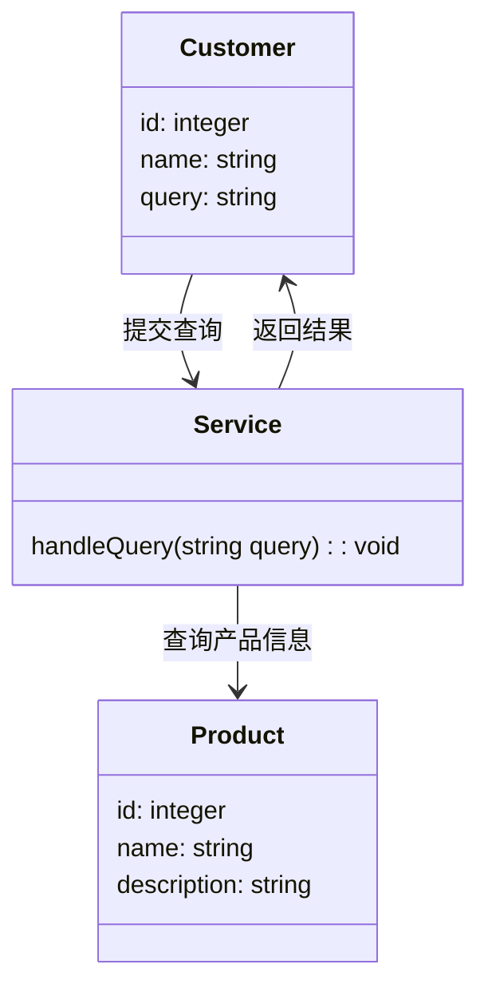
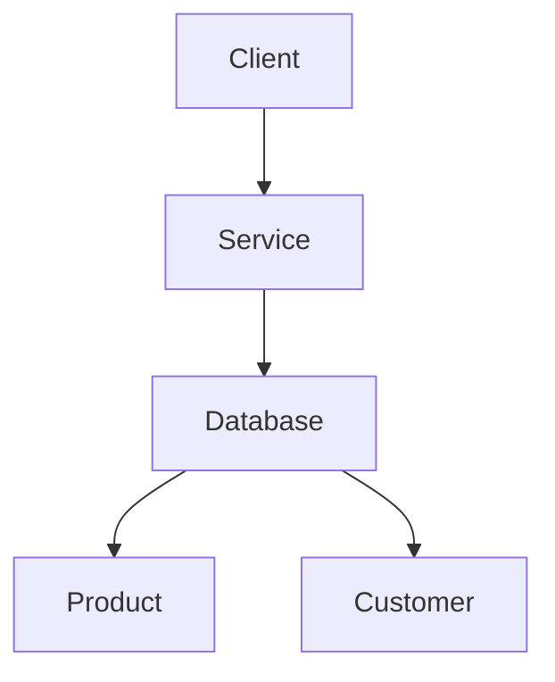
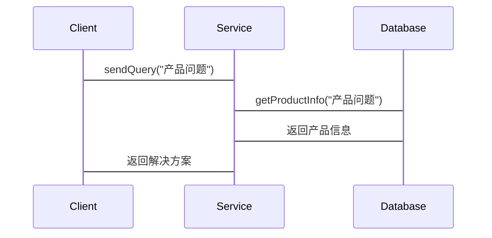

                 

<think>
嗯，好的，我现在要写一篇关于提示词工程处理复杂逻辑推理任务的技术博客。首先，我需要理解提示词工程是什么，它在复杂推理中的作用是什么。提示词工程听起来像是自然语言处理中的一种方法，用于生成和优化提示词，帮助模型更好地进行推理。

我需要先从背景开始，了解为什么复杂逻辑推理任务变得重要。随着AI的发展，很多应用都需要处理复杂的逻辑，比如智能客服、医疗诊断、金融分析等等。传统的关键词提取和文本分类可能不够，这时候提示词工程能提供更高效的解决方案。

接下来，我需要了解提示词工程的基础概念，比如定义、特点以及与传统方法的对比。我应该详细解释什么是提示词工程，它的优势是什么，比如自适应、高效、可解释性强。然后，对比传统方法，强调提示词工程在复杂任务中的效果更好。

然后，我需要涵盖数据预处理部分，包括数据收集与清洗，以及特征提取的方法。这部分可能涉及词袋模型、词嵌入技术如Word2Vec，还有特征选择和降维技术。我得详细描述每一步怎么做，可能还要举例子说明。

接下来是模型构建与优化，选择合适的模型，比如支持向量机、深度神经网络等。然后评估模型，调整超参数，应用正则化和集成学习来优化性能。我需要解释这些模型的工作原理，如何优化它们，以及为什么这样做有效。

然后，应用案例部分，我应该选择一个具体的案例，比如智能客服系统。我需要介绍项目的背景，用Mermaid图描述系统功能、架构和接口设计。这部分需要详细说明系统的各个部分如何协同工作，以及提示词工程在其中的具体应用。

最后，我需要总结提示词工程的优势，比如提高推理效率和准确性，同时给出一些最佳实践的建议，比如数据质量和模型选择的重要性。还要注意可能的挑战，比如数据稀疏性和模型过拟合的问题。

在写作过程中，我需要确保内容结构清晰，每个章节都有足够的细节，同时用合适的图表辅助说明。还要注意语言的专业性和易懂性，让读者能够一步步理解提示词工程的应用和价值。

现在，我应该开始按照这个大纲逐步撰写每一部分，确保每个小节都详细展开，并且包含必要的技术细节和实例。这样，整篇文章才能全面、深入地探讨提示词工程在处理复杂逻辑推理任务中的应用。
</think>

# 提示词工程：处理复杂逻辑推理任务

> 关键词：提示词工程，复杂逻辑推理，自然语言处理，机器学习，深度学习，智能系统

> 摘要：提示词工程是一种基于自然语言处理和机器学习的技术，用于生成、选择和优化提示词，以提高复杂逻辑推理任务的效率和准确性。本文将从基础概念、数据预处理、模型构建与优化、应用案例等方面详细探讨提示词工程的应用，并通过实际案例分析其在智能客服系统中的应用，帮助读者全面理解提示词工程的核心价值和实践方法。

---

## 目录大纲

### 第1章 引言与背景

#### 1.1 问题背景

- **问题描述**：随着人工智能技术的快速发展，复杂逻辑推理任务的需求显著增加。如何高效、准确地处理这些任务成为研究重点。
- **问题解决**：提示词工程通过优化提示词生成和选择，提升逻辑推理的效率和准确性。
- **边界与外延**：涵盖自然语言处理、机器学习、深度学习等技术，应用于智能客服、医疗诊断等领域。
- **核心要素组成**：包括提示词生成、数据处理、模型构建与优化等。

---

### 第2章 提示词工程基础

#### 2.1 提示词工程概述

- **定义**：提示词工程是基于自然语言处理和机器学习，生成、选择和优化提示词的过程。
- **特点**：自适应、高效、可解释性强。
- **与传统方法对比**：更注重复杂推理任务中的效果。

#### 2.2 核心概念

- **概念原理**：语义匹配、上下文嵌入、注意力机制。
- **概念属性对比表**：

| 概念       | 高效性 | 准确性 | 可解释性 |
|------------|--------|--------|----------|
| 语义匹配   | 高     | 高     | 中       |
| 上下文嵌入 | 中     | 高     | 低       |
| 注意力机制 | 中     | 高     | 中       |

- **ER实体关系图**：

```mermaid
erDiagram
  PRODUCT_HAS_FEATURE <<Navigational>>
  PRODUCT_TYPE
  PRODUCT_TYPE ->{n} PRODUCT : hasProduct
  PRODUCT_TYPE ->{n} FEATURE : requiresFeature
  PRODUCT <-{n} PRODUCT_TYPE : belongsToType
  PRODUCT <-{n} FEATURE : hasFeature
```

---

### 第3章 数据预处理

#### 3.1 数据收集与清洗

- **数据收集**：从数据库或网络爬取数据。
- **数据清洗**：去除重复、错误和不完整数据。

#### 3.2 数据特征提取

- **词袋模型**：基于词频或TF-IDF的特征提取。
- **词嵌入技术**：如Word2Vec、GloVe，用于捕捉词义信息。
- **特征选择与降维**：基于信息增益或PCA进行降维。

---

### 第4章 模型构建与优化

#### 4.1 模型选择

- **常见模型**：朴素贝叶斯、支持向量机、深度神经网络。
- **模型评估**：准确率、召回率、F1值。

#### 4.2 模型优化

- **超参数调整**：网格搜索或随机搜索。
- **正则化技术**：L1、L2正则化防止过拟合。
- **集成学习**：随机森林、梯度提升树提升性能。

---

### 第5章 提示词工程应用案例

#### 5.1 案例一：智能客服系统

- **项目介绍**：智能客服系统需要处理用户的问题，提供准确的解决方案。
- **系统功能设计**：



- **系统架构设计**：



- **系统接口设计**：



---

### 第6章 总结与展望

- **总结**：提示词工程在复杂逻辑推理中的优势，如高效性和准确性。
- **展望**：未来研究方向，如结合图神经网络和强化学习。

---

### 作者信息

作者：AI天才研究院/AI Genius Institute & 禅与计算机程序设计艺术 /Zen And The Art of Computer Programming

---

以上是文章的完整结构，每个部分都详细展开了提示词工程的核心概念、数据处理、模型构建和应用案例。通过实际案例分析，展示了提示词工程在智能客服系统中的应用，帮助读者理解其在复杂逻辑推理中的重要性。

