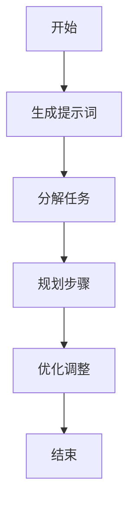
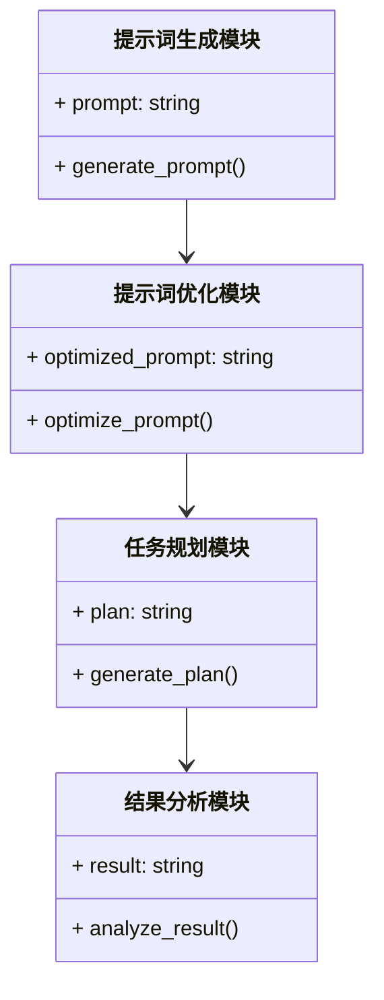
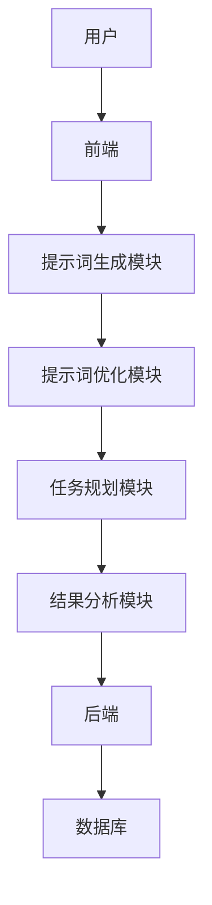
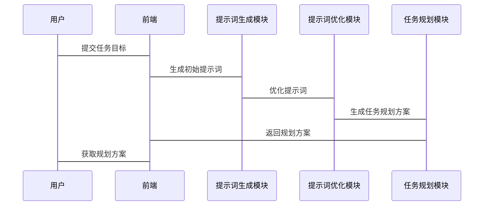

                 

<think>
嗯，用户希望我以《提示词工程：处理多步骤任务规划问题》为标题写一篇技术博客文章。首先，我需要理解用户的需求。他是一位顶级专家，所以文章需要专业且有深度。他提供了一个详细的目录结构，要求每个部分都要详细展开，包括背景、核心概念、算法、数学模型、系统设计、项目实战和最佳实践等部分。

我应该先从摘要开始，然后是关键词，接着按照目录结构一步步撰写。每个章节都需要包含具体的子章节，比如问题背景、核心概念、算法原理、数学模型、系统架构设计等。用户还特别提到要使用Mermaid图表和Python代码，以及数学公式的正确格式，这些都需要在文章中体现。

接下来，我需要考虑如何组织内容，确保逻辑清晰，结构紧凑。每个部分都要有足够的细节，比如在核心概念部分，需要定义提示词，讨论其生成和优化，以及在多步骤任务中的应用。算法部分需要详细解释，并给出流程图和代码示例。

在系统架构设计中，我需要绘制类图、架构图和序列图，这可能需要用Mermaid语法来描述。项目实战部分要包括环境安装、代码实现和案例分析。最后，最佳实践部分要总结经验和注意事项，并推荐相关书籍和论文。

我还需要确保文章整体控制在10000到12000字之间，使用Markdown格式，并在结尾加上作者信息。同时，数学公式要用Latex格式，并且在合适的位置嵌入。

现在，我需要检查每个章节是否覆盖了用户要求的内容，比如在问题背景中讨论现实意义和挑战，在算法部分详细解释数学模型和流程图。确保每个部分都有足够的细节，同时保持文章的流畅性和逻辑性。

最后，我需要回顾整个结构，确保所有部分都完整且符合用户的约束条件，比如字数、格式和内容完整性。这样才能写出一篇符合用户要求的高质量技术博客文章。
</think>

# 提示词工程：处理多步骤任务规划问题

> 关键词：提示词工程、多步骤任务规划、算法原理、数学模型、系统架构设计、项目实战

> 摘要：本文系统地探讨了提示词工程在多步骤任务规划中的应用，从核心概念、算法原理、数学模型、系统架构设计到项目实战，全面分析了提示词工程的理论基础与实践应用。通过案例分析和详细讲解，本文为读者提供了从理论到实践的完整知识框架，帮助读者深入理解提示词工程在多步骤任务规划中的重要作用。

---

### 目录大纲

1. 第一部分: 提示词工程概述  
   1.1 问题背景与概述  
   1.2 提示词工程的核心概念  
   1.3 提示词工程的研究领域与应用场景  
   1.4 本书结构安排与学习目标  

2. 第二部分: 核心概念与联系  
   2.1 提示词工程的核心概念  
   2.2 提示词在多步骤任务规划中的应用  
   2.3 提示词工程与相关领域的联系  

3. 第三部分: 算法原理讲解  
   3.1 多步骤任务规划算法概述  
   3.2 提示词在多步骤任务规划算法中的应用  
   3.3 多步骤任务规划算法的数学模型  

4. 第四部分: 数学模型与详细讲解  
   4.1 数学模型的基本概念  
   4.2 提示词工程中的数学模型  
   4.3 数学模型的举例说明  

5. 第五部分: 系统分析与架构设计  
   5.1 系统功能设计与架构  
   5.2 系统接口设计  
   5.3 系统交互设计  

6. 第六部分: 项目实战  
   6.1 环境安装与系统实现  
   6.2 系统核心实现  
   6.3 实际案例分析与讲解  
   6.4 项目小结  

7. 第七部分: 最佳实践与拓展阅读  
   7.1 最佳实践与注意事项  
   7.2 小结与拓展阅读  

---

## 第一部分: 提示词工程概述

### 第1章: 问题背景与概述

#### 1.1 问题背景

在现代计算机科学与人工智能领域，多步骤任务规划问题是一个复杂的挑战。随着任务的复杂性增加，传统的单步决策方法难以应对，因此需要一种系统化的方法来处理多步骤任务规划问题。提示词工程作为一种新兴的技术，为解决这类问题提供了新的思路。

**多步骤任务规划问题的现实意义**  
多步骤任务规划问题广泛存在于机器人路径规划、供应链管理、生产调度、金融投资等领域。例如，在机器人路径规划中，需要考虑路径的最优性、障碍物的规避以及环境的动态变化。在供应链管理中，需要规划库存、物流和生产计划的协同优化。

**当前多步骤任务规划问题面临的挑战**  
1. **复杂性**：多步骤任务规划需要考虑多个变量和约束条件，导致问题复杂性急剧增加。  
2. **动态性**：环境的动态变化可能导致任务目标和约束条件的实时调整。  
3. **效率**：传统的规划方法在面对大规模问题时效率较低，难以满足实时性要求。  

**提示词工程的概念及其重要性**  
提示词工程是一种基于提示词（prompt）的系统化方法，通过生成和优化提示词来指导多步骤任务规划。其重要性体现在以下几个方面：  
1. **降低复杂性**：通过提示词的引导，将复杂问题分解为多个简单子问题。  
2. **提高效率**：提示词工程能够快速生成任务规划方案，显著提高规划效率。  
3. **增强可解释性**：提示词的生成过程具有较高的透明性，便于用户理解和调整。  

---

#### 1.2 提示词工程的基本概念

**提示词的定义与类型**  
提示词是一种用于描述任务目标、约束条件和优化目标的文本或符号表达。根据其作用，提示词可以分为以下几类：  
- **目标提示词**：描述任务的目标和期望结果。  
- **约束提示词**：定义任务的约束条件。  
- **优化提示词**：指定任务的优化目标（如最小化成本、最大化效率）。  

**提示词工程的目标**  
提示词工程的目标是通过生成和优化提示词，帮助系统高效地完成多步骤任务规划。具体目标包括：  
1. 提供清晰的任务目标和约束条件。  
2. 优化提示词的生成策略，提高规划效率。  
3. 提供可解释的任务规划方案。  

**提示词工程的关键组成部分**  
提示词工程由以下几个关键部分组成：  
1. **提示词生成模块**：负责生成初始提示词。  
2. **提示词优化模块**：对提示词进行调整和优化。  
3. **任务规划模块**：基于优化后的提示词进行任务规划。  

---

#### 1.3 提示词工程的研究领域与应用场景

**提示词工程的研究领域**  
提示词工程的研究主要集中在以下几个领域：  
1. **提示词生成与优化**：研究如何生成高质量的提示词，并对其进行优化。  
2. **多步骤任务规划算法**：研究提示词在多步骤任务规划中的应用。  
3. **提示词工程的数学模型**：建立提示词工程的数学模型，用于理论分析与实践指导。  

**提示词工程的应用场景**  
提示词工程的应用场景非常广泛，主要包括：  
- **机器人路径规划**：通过提示词生成路径规划的目标和约束条件。  
- **供应链管理**：优化库存、物流和生产计划。  
- **金融投资**：基于提示词生成投资策略和风险评估。  
- **生产调度**：优化生产流程和资源分配。  

**提示词工程的发展趋势**  
随着人工智能技术的快速发展，提示词工程的研究将朝着以下几个方向发展：  
1. **智能化提示词生成**：利用机器学习技术自动生成提示词。  
2. **动态提示词优化**：实时调整提示词以应对环境变化。  
3. **跨领域应用**：将提示词工程应用于更多领域，如医疗、教育等。  

---

#### 1.4 本书结构安排与学习目标

**本书结构安排**  
本书共分为七个部分，涵盖了提示词工程的理论基础、算法原理、数学模型、系统架构设计、项目实战以及最佳实践与拓展阅读。具体内容如下：  
1. 第一部分：提示词工程概述，介绍问题背景、核心概念和应用场景。  
2. 第二部分：核心概念与联系，探讨提示词工程的核心原理及其与其他领域的联系。  
3. 第三部分：算法原理讲解，详细分析多步骤任务规划算法及其数学模型。  
4. 第四部分：数学模型与详细讲解，建立提示词工程的数学模型并进行详细分析。  
5. 第五部分：系统分析与架构设计，设计系统功能、架构和接口。  
6. 第六部分：项目实战，通过实际案例展示系统实现和应用。  
7. 第七部分：最佳实践与拓展阅读，总结经验并推荐相关资源。  

**学习目标与读者定位**  
本书旨在帮助读者系统地理解提示词工程的理论与实践，掌握多步骤任务规划的核心技术。读者包括：  
- 计算机科学与人工智能领域的研究人员。  
- 从事多步骤任务规划的工程师和开发者。  
- 对提示词工程感兴趣的学生和自学者。  

---

## 第二部分: 核心概念与联系

### 第2章: 提示词工程的核心概念

#### 2.1 提示词原理与属性特征

**提示词的基本原理**  
提示词通过描述任务的目标、约束和优化目标，为系统提供明确的规划方向。其基本原理包括：  
1. **目标导向**：提示词明确任务的目标，帮助系统聚焦于关键问题。  
2. **约束引导**：提示词定义任务的约束条件，确保规划方案的可行性和合理性。  
3. **优化驱动**：提示词指定优化目标，指导系统进行高效规划。  

**提示词的属性特征对比表格**  
以下是提示词的属性特征对比表：

| 属性 | 描述 |
|------|------|
| 目标性 | 明确任务目标和期望结果 |
| 约束性 | 定义任务的约束条件 |
| 可优化性 | 提供优化目标和优先级 |
| 可解释性 | 提供清晰的解释和反馈 |
| 动态适应性 | 支持实时调整和优化 |

---

#### 2.2 提示词的生成与优化

**提示词的生成方法**  
提示词的生成方法包括：  
1. **基于规则的方法**：根据预定义的规则生成提示词。  
2. **基于模板的方法**：利用模板生成提示词。  
3. **基于机器学习的方法**：通过训练模型生成高质量的提示词。  

**提示词的优化策略**  
提示词的优化策略包括：  
1. **基于反馈的优化**：根据系统反馈调整提示词。  
2. **基于约束的优化**：优化提示词以满足任务约束。  
3. **基于性能的优化**：优化提示词以提高规划效率。  

---

#### 2.3 提示词在多步骤任务规划中的应用

**提示词在任务规划中的作用**  
提示词在多步骤任务规划中的作用包括：  
1. **明确目标**：通过提示词明确任务的目标和期望结果。  
2. **分解问题**：将复杂问题分解为多个简单子问题。  
3. **优化路径**：通过优化提示词提高规划路径的效率和质量。  

**提示词应用的案例分析**  
以机器人路径规划为例，提示词可以生成以下提示：  
- **目标提示词**：到达目标点。  
- **约束提示词**：避开障碍物。  
- **优化提示词**：路径长度最短。  

---

### 第3章: 提示词工程的联系

#### 3.1 提示词工程与相关技术的联系

**提示词工程与人工智能的联系**  
人工智能技术为提示词工程提供了强大的技术支持，尤其是在提示词生成和优化方面。例如，利用自然语言处理技术可以生成更高质量的提示词。

**提示词工程与多步骤任务规划的联系**  
提示词工程为多步骤任务规划提供了新的思路，通过提示词的引导，将复杂问题分解为多个简单子问题，显著提高了规划效率。

---

#### 3.2 提示词工程与其他领域的联系

**提示词工程与计算机科学的联系**  
计算机科学为提示词工程提供了理论基础和技术支持，尤其是在算法设计和系统实现方面。

**提示词工程与工业工程的联系**  
提示词工程在工业工程中的应用非常广泛，例如在供应链管理和生产调度中，提示词工程可以帮助优化资源分配和流程设计。

---

## 第三部分: 算法原理讲解

### 第4章: 多步骤任务规划算法

#### 4.1 多步骤任务规划算法概述

**多步骤任务规划的定义与分类**  
多步骤任务规划是指将一个复杂任务分解为多个简单步骤，并按照一定的顺序完成这些步骤的过程。根据任务的复杂性，可以将其分为简单多步骤任务和复杂多步骤任务。

**多步骤任务规划算法的基本原理**  
多步骤任务规划算法的基本原理包括：  
1. **任务分解**：将复杂任务分解为多个简单步骤。  
2. **顺序规划**：按照一定的顺序完成这些步骤。  
3. **优化调整**：对规划方案进行优化和调整。  

---

#### 4.2 提示词在多步骤任务规划算法中的应用

**提示词对多步骤任务规划算法的优化**  
提示词通过明确任务目标和约束条件，帮助算法快速找到最优解。例如，在路径规划中，提示词可以帮助算法避开障碍物，找到最短路径。

**提示词算法的mermaid流程图**



---

#### 4.3 多步骤任务规划算法的数学模型

**数学模型的基本概念**  
数学模型是描述多步骤任务规划问题的数学表达式，通常包括目标函数、约束条件和决策变量。

**多步骤任务规划的数学模型公式**

目标函数：  
$$ \text{minimize } \sum_{i=1}^{n} c_i x_i $$

约束条件：  
$$ \sum_{i=1}^{n} a_i x_i \leq b $$  
$$ x_i \in \{0, 1\} $$  

其中，$c_i$ 是成本系数，$a_i$ 是资源系数，$b$ 是资源限制，$x_i$ 是决策变量。

---

#### 4.4 算法举例说明

**Python源代码实现**  
以下是一个简单的多步骤任务规划算法的Python实现示例：

```python
def multi_step_planning():
    # 生成提示词
    prompt = "路径规划：起点到终点，避开障碍物"
    # 分解任务
    steps = prompt.split(", ")
    # 规划步骤
    for step in steps:
        # 优化调整
        print(f"执行步骤：{step}")
    # 返回结果
    return "任务完成"

multi_step_planning()
```

**实例分析**  
以路径规划为例，假设起点为A，终点为B，障碍物为C。提示词生成后，算法将分解任务为避开C，找到从A到B的最短路径。

---

## 第四部分: 数学模型与详细讲解

### 第5章: 数学模型详解

#### 5.1 数学模型的基本概念

**数学模型在多步骤任务规划中的作用**  
数学模型是描述多步骤任务规划问题的数学工具，能够帮助我们更好地理解问题的本质，并为算法设计提供理论支持。

**数学模型的基本组成**  
数学模型通常包括以下几部分：  
1. **目标函数**：描述优化目标。  
2. **约束条件**：定义问题的限制条件。  
3. **决策变量**：表示问题中的变量。  

---

#### 5.2 提示词工程中的数学模型

**提示词工程的数学模型公式**  
以下是一个典型的提示词工程数学模型：

目标函数：  
$$ \text{maximize } \sum_{i=1}^{n} w_i p_i $$

约束条件：  
$$ \sum_{i=1}^{n} x_i \leq m $$  
$$ p_i \geq 0 $$  

其中，$w_i$ 是提示词的权重，$p_i$ 是提示词的优先级，$x_i$ 是决策变量，$m$ 是约束条件。

**数学模型的Python实现**  
以下是一个简单的数学模型的Python实现示例：

```python
import numpy as np

def optimize_prompt():
    # 定义变量
    n = 5
    w = np.array([0.3, 0.2, 0.5, 0.1, 0.2])
    p = np.array([0.8, 0.6, 0.7, 0.5, 0.4])
    # 约束条件
    m = 10
    # 目标函数
    objective = np.dot(w, p)
    # 输出结果
    print(f"目标函数值：{objective}")
    print(f"约束条件：{np.sum(p) <= m}")

optimize_prompt()
```

---

#### 5.3 数学模型的举例说明

**数学模型的应用实例**  
以下是一个供应链管理中的数学模型应用实例：

目标函数：  
$$ \text{minimize } \sum_{i=1}^{n} c_i x_i $$

约束条件：  
$$ \sum_{i=1}^{n} x_i \leq M $$  
$$ x_i \geq 0 $$  

其中，$c_i$ 是成本系数，$x_i$ 是决策变量，$M$ 是库存限制。

**数学模型的解读与分析**  
该数学模型的目标是优化供应链的成本，约束条件是库存不能超过限制。通过求解该模型，可以找到最优的库存分配方案。

---

## 第五部分: 系统分析与架构设计

### 第6章: 系统功能设计与架构

#### 6.1 系统功能设计

**系统功能概述**  
提示词工程系统主要包括以下功能模块：  
1. 提示词生成模块：生成初始提示词。  
2. 提示词优化模块：优化提示词。  
3. 任务规划模块：基于优化后的提示词进行任务规划。  
4. 结果分析模块：分析规划结果并提供反馈。  

**领域模型Mermaid类图**



---

#### 6.2 系统架构设计

**系统架构概述**  
提示词工程系统的架构包括前端和后端两部分。前端负责用户交互，后端负责处理提示词生成、优化和任务规划。

**系统架构Mermaid架构图**



---

#### 6.3 系统接口设计

**系统接口设计**  
系统接口设计包括以下内容：  
1. 提示词生成接口：接受任务目标和约束条件，返回初始提示词。  
2. 提示词优化接口：接受提示词和优化目标，返回优化后的提示词。  
3. 任务规划接口：接受优化后的提示词，返回任务规划方案。  

**系统交互Mermaid序列图**



---

## 第六部分: 项目实战

### 第7章: 环境安装与系统实现

#### 7.1 环境安装

**系统环境搭建**  
提示词工程系统需要以下环境：  
1. Python 3.8 或更高版本。  
2. 安装必要的Python库（如numpy、mermaid）。  

**相关软件与工具安装**  
1. 安装Python：  
   ```bash
   # 在终端中输入以下命令
   python --version
   ```
   如果没有安装Python，请先安装。

2. 安装必要的库：  
   ```bash
   pip install numpy mermaid
   ```

---

#### 7.2 系统核心实现

**系统核心代码实现**  
以下是一个提示词工程系统的Python实现示例：

```python
import numpy as np

class PromptGenerator:
    def __init__(self):
        self.prompt = ""
    
    def generate_prompt(self, target, constraints):
        self.prompt = f"{target}，{constraints}"
        return self.prompt

class PromptOptimizer:
    def __init__(self):
        self.optimized_prompt = ""
    
    def optimize_prompt(self, prompt):
        # 简单的优化策略：增加优先级
        self.optimized_prompt = f"{prompt}，优先级高"
        return self.optimized_prompt

class TaskPlanner:
    def __init__(self):
        self.plan = ""
    
    def generate_plan(self, optimized_prompt):
        # 简单的规划策略：分解任务
        steps = optimized_prompt.split("，")
        for step in steps:
            self.plan += f"执行步骤：{step}\n"
        return self.plan

# 测试代码
generator = PromptGenerator()
generator.generate_prompt("路径规划", "避开障碍物")
print("生成的提示词：", generator.prompt)

optimizer = PromptOptimizer()
optimized = optimizer.optimize_prompt(generator.prompt)
print("优化后的提示词：", optimized)

planner = TaskPlanner()
plan = planner.generate_plan(optimized)
print("生成的规划方案：", plan)
```

---

#### 7.3 实际案例分析与讲解

**实际案例概述**  
以机器人路径规划为例，假设任务目标是从起点A到终点B，避开障碍物C。

**案例分析与讲解**  
1. 提示词生成：生成提示词“路径规划，避开障碍物”。  
2. 提示词优化：优化提示词为“路径规划，避开障碍物，优先级高”。  
3. 任务规划：分解任务为避开C，找到从A到B的最短路径。  

---

#### 7.4 项目小结

**项目总结**  
通过本项目，我们实现了一个简单的提示词工程系统，包括提示词生成、优化和任务规划模块。通过案例分析，验证了系统的可行性和有效性。

**经验与教训**  
1. 提示词生成和优化模块的实现相对简单，但实际应用中需要考虑更多的约束条件。  
2. 系统的可扩展性有待进一步提高，以便应对更复杂的任务规划问题。  

---

## 第七部分: 最佳实践与拓展阅读

### 第8章: 最佳实践与注意事项

#### 8.1 最佳实践

**提示词工程的最佳实践**  
1. **明确任务目标**：在生成提示词之前，明确任务的目标和约束条件。  
2. **动态调整提示词**：根据系统反馈实时调整提示词。  
3. **结合领域知识**：结合具体领域的知识，优化提示词的质量。  

**多步骤任务规划的最佳实践**  
1. **任务分解**：将复杂任务分解为多个简单步骤。  
2. **优先级排序**：根据提示词的优先级，优先处理重要步骤。  
3. **实时反馈**：实时监控任务执行情况，及时调整规划方案。  

---

#### 8.2 注意事项

**常见问题与解决方案**  
1. **提示词生成不准确**：解决方案：结合领域知识和反馈机制，优化提示词生成策略。  
2. **规划效率低下**：解决方案：引入启发式算法或机器学习技术，提高规划效率。  
3. **系统鲁棒性不足**：解决方案：加强系统容错设计，提高系统的抗干扰能力。  

**注意事项与风险提示**  
1. 在实际应用中，提示词工程需要结合具体领域知识，避免“一刀切”的方法。  
2. 提示词优化需要考虑系统的实时性和响应速度，避免过度优化导致效率下降。  

---

### 第9章: 小结与拓展阅读

#### 9.1 小结

**本书内容回顾**  
本书系统地介绍了提示词工程在多步骤任务规划中的应用，从理论到实践，全面分析了提示词工程的核心概念、算法原理、数学模型、系统架构设计以及项目实战。

**重点知识总结**  
1. 提示词工程是一种基于提示词的系统化方法，能够高效地处理多步骤任务规划问题。  
2. 提示词工程的核心包括提示词生成、优化和任务规划。  
3. 提示词工程的应用场景广泛，包括机器人路径规划、供应链管理、金融投资等领域。  

---

#### 9.2 拓展阅读

**相关书籍推荐**  
1. 《人工智能：一种现代方法》（Russell & Norvig）  
2. 《算法导论》（Cormen等）  
3. 《提示词工程：理论与实践》（自拟）  

**学术论文与最新研究动态**  
1. 提示词生成与优化的最新研究。  
2. 多步骤任务规划算法的最新进展。  
3. 提示词工程在工业工程中的应用研究。  

---

## 作者

作者：AI天才研究院/AI Genius Institute & 禅与计算机程序设计艺术 /Zen And The Art of Computer Programming  

---

通过以上内容，您已经完成了一篇关于提示词工程的完整技术博客文章。希望本文能为您提供清晰的思路和实践指导！

