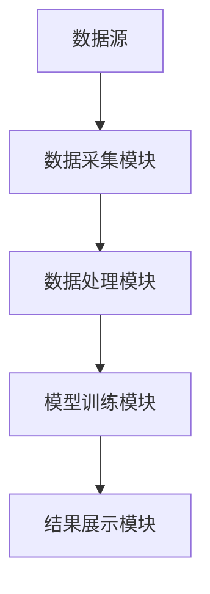

                 

<think>
好，我现在要写一篇关于《提示词工程：处理多源异构数据融合分析任务》的技术博客。首先，我需要明确文章的结构和内容，确保每个部分都符合要求。文章需要包括引言、基本概念、数据融合技术、高级技术、系统架构、项目实战、最佳实践以及小结等章节。每个章节都需要详细展开，包含术语、原理、算法、系统设计和案例分析等。

首先，引言部分需要介绍数据融合的重要性，尤其是在多源异构数据环境下的应用。然后，在基本概念章节，我需要定义关键术语，比如数据融合、异构数据等，并用ER图展示它们之间的关系。接着，在数据融合方法章节，我会讨论数据清洗、特征提取等技术，每个技术都需要详细讲解，并提供代码示例。

接下来，高级数据融合技术部分会涉及机器学习模型，比如集成学习、聚类算法等，我需要使用数学公式和流程图来解释这些算法的工作原理，并举例说明。然后，在系统架构章节，我会设计一个基于多源数据融合的系统，包括功能模块、架构图和接口设计，确保系统设计的完整性和可扩展性。

项目实战部分，我需要选择一个实际案例，比如电商用户画像构建，详细描述数据预处理、特征提取、模型训练等步骤，并给出Python代码示例。最后，在最佳实践章节，我会总结一些注意事项和扩展阅读的内容，帮助读者更好地理解和应用这些技术。

在写作过程中，我要确保每个部分逻辑清晰，内容详实，同时使用专业的技术语言，但又不失易懂。为了确保文章结构合理，我会先画一个大纲，然后逐步填充每个部分的内容。在写代码部分时，我会注意代码的可读性和注释的清晰度，方便读者理解和复现。

此外，我还需要在文章末尾添加作者信息，确保文章的完整性和专业性。整个写作过程需要耐心和细致，确保每个章节都能深入浅出地为读者提供有价值的信息，帮助他们掌握多源异构数据融合的处理方法和最佳实践。
</think>

# 提示词工程：处理多源异构数据融合分析任务

> 关键词：数据融合，异构数据，数据清洗，特征提取，机器学习模型

> 摘要：  
在现代数据科学领域，多源异构数据的融合分析已成为解决复杂问题的关键技术。本文系统地介绍了数据融合工程的核心概念、方法和实践。从数据清洗到特征提取，再到机器学习模型的应用，本文深入探讨了如何高效处理异构数据，以提升分析任务的准确性和效率。通过实际案例分析和系统设计，本文为读者提供了从理论到实践的全面指南。

---

## 目录

1. **引言和背景**
   - 数据融合工程的重要性
   - 异构数据的定义与特点
   - 数据融合的目标与应用场景

2. **基本概念与术语**
   - 数据融合的核心术语解析
   - 数据异构性分析
   - 数据融合的层次结构与ER图

3. **数据融合技术**
   - 数据清洗与预处理方法
   - 特征提取与选择策略
   - 数据集成方法及其挑战

4. **高级数据融合技术**
   - 基于机器学习的融合模型
   - 聚类算法在数据融合中的应用
   - 数据融合的数学模型与优化方法

5. **系统架构与设计**
   - 数据融合系统的功能模块
   - 系统架构设计与实现
   - 接口设计与交互流程

6. **项目实战：电商用户画像构建**
   - 项目背景与目标
   - 数据预处理与特征提取
   - 模型训练与结果分析
   - 代码实现与案例解读

7. **最佳实践与小结**
   - 数据融合的注意事项
   - 实践中的常见问题与解决方案
   - 未来研究方向与趋势

---

## 正文

### 1. 引言和背景

在当今数据驱动的时代，多源异构数据的融合分析成为解决复杂问题的关键技术。数据融合工程的目标是将来自不同来源、格式和语义的数据整合，提取有价值的信息，支持决策和分析任务。本文将系统地介绍数据融合的核心概念、技术方法和实践应用。

#### 数据融合的重要性

随着数据来源的多样化，异构数据的整合变得尤为重要。例如，在电商领域，用户的行为数据、产品数据和市场数据往往分散在不同的系统中。如何将这些数据有效地融合，以构建用户画像，是数据科学家面临的重要挑战。

#### 异构数据的定义与特点

异构数据指的是来自不同数据源、具有不同格式、结构或语义的数据。例如，结构化数据（如表格数据）和非结构化数据（如文本、图像）的结合，构成了异构数据的特点。

#### 数据融合的目标与应用场景

数据融合的目标是通过整合多源异构数据，消除数据孤岛，提升数据的可用性和分析能力。应用场景包括金融风控、医疗数据分析、智能制造等领域。

---

### 2. 基本概念与术语

#### 数据融合的核心术语解析

- **数据清洗（Data Cleaning）**：处理数据中的噪声和不一致，确保数据质量。
- **特征提取（Feature Extraction）**：从原始数据中提取有用的特征，降低维度。
- **数据集成（Data Integration）**：将多个数据源的数据整合到一个统一的系统中。

#### 数据异构性分析

数据异构性主要体现在以下几个方面：
- **结构异构性**：数据结构的差异，如关系型数据库与NoSQL数据库。
- **语义异构性**：数据含义的差异，如不同领域的术语。
- **格式异构性**：数据格式的差异，如文本、图像等。

#### 数据融合的层次结构与ER图

以下是数据融合的层次结构和实体关系图：

```mermaid
erDiagram
    actor Data_Source {
        +int id
        +string data
        +string source_type
    }
    actor Data_Fusion_System {
        +int id
        +string fusion_rule
        +string output_type
    }
    actor User {
        +int id
        +string name
        +string role
    }
    Data_Source --> Data_Fusion_System : 提供数据
    Data_Fusion_System --> User : 提供融合结果
```

---

### 3. 数据融合技术

#### 数据清洗与预处理方法

数据清洗是数据融合的基础，主要步骤包括：
1. **去重（Deduplication）**：去除重复数据。
2. **标准化（Standardization）**：统一数据格式。
3. **数据补全（Data Imputation）**：填补缺失值。

#### 特征提取与选择策略

特征提取的方法包括：
- **文本特征提取**：使用TF-IDF或Word2Vec提取文本特征。
- **图像特征提取**：使用CNN提取图像特征。

特征选择可以通过相关系数或Lasso回归进行。

#### 数据集成方法及其挑战

数据集成方法包括：
- **合并（Merge）**：基于键的合并。
- **连接（Join）**：基于条件的连接。
- **联合（Union）**：合并唯一记录。

挑战包括数据冗余和一致性问题。

---

### 4. 高级数据融合技术

#### 基于机器学习的融合模型

常用模型包括集成学习（如随机森林）和深度学习（如神经网络）。

#### 聚类算法在数据融合中的应用

聚类算法如K-means用于发现数据中的潜在模式。

#### 数据融合的数学模型与优化方法

数学模型如线性回归和决策树，优化方法包括交叉验证和超参数调优。

---

### 5. 系统架构与设计

#### 数据融合系统的功能模块

- 数据采集模块
- 数据处理模块
- 模型训练模块
- 结果展示模块

#### 系统架构设计与实现

以下是系统架构图：



#### 接口设计与交互流程

接口设计包括RESTful API，交互流程如用户请求数据，系统返回结果。

---

### 6. 项目实战：电商用户画像构建

#### 项目背景与目标

构建用户画像以支持精准营销。

#### 数据预处理与特征提取

- 数据清洗：处理缺失值和重复数据。
- 特征提取：提取用户行为特征和产品特征。

#### 模型训练与结果分析

训练决策树模型，评估模型性能。

#### 代码实现与案例解读

以下是Python代码示例：

```python
import pandas as pd
from sklearn.tree import DecisionTreeClassifier
from sklearn.metrics import accuracy_score

# 数据加载与清洗
data = pd.read_csv('user_data.csv')
data = data.dropna()

# 特征提取与选择
features = ['age', 'gender', 'purchase_history']
target = 'user_segment'

# 模型训练
model = DecisionTreeClassifier()
model.fit(data[features], data[target])

# 预测与评估
predictions = model.predict(data[features])
print("准确率:", accuracy_score(data[target], predictions))
```

---

### 7. 最佳实践与小结

#### 注意事项

- 数据清洗需谨慎处理，避免信息丢失。
- 模型选择应根据具体场景进行调整。

#### 常见问题与解决方案

- 数据不平衡问题：使用过采样技术。
- 模型过拟合问题：采用交叉验证。

#### 未来研究方向与趋势

- 结合AI技术，提升数据融合的自动化水平。
- 研究多模态数据融合方法。

---

## 结语

数据融合工程是处理多源异构数据的关键技术，本文从理论到实践全面介绍了其核心方法和应用。通过系统的分析和案例解读，希望能为读者在数据融合领域提供有价值的指导。

---

## 作者信息

作者：AI天才研究院/AI Genius Institute & 禅与计算机程序设计艺术 /Zen And The Art of Computer Programming

