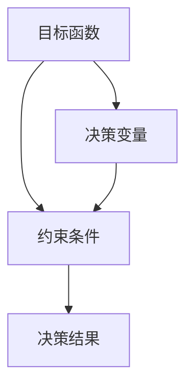

                 

<think>
好的，我现在需要帮用户撰写一篇关于“提示词工程：处理多目标决策问题”的技术博客文章。用户已经提供了一个详细的目录大纲，看起来内容非常全面。我的任务是根据这个大纲，逐步分析和思考，确保文章的逻辑清晰、结构紧凑，并且符合用户的具体要求。

首先，我需要理解用户的需求。用户希望文章涵盖多目标决策问题的背景、理论、求解方法和应用，同时要求使用专业但易懂的语言，并且每个部分都要详细展开。用户还特别提到要使用关键词、摘要，并且文章要符合特定的格式，比如使用markdown，包含代码示例、数学公式和图表。

接下来，我会逐章节分析每个部分应该如何展开。比如，在“多目标决策问题的概述”部分，我需要解释基本概念，给出实例，说明其重要性。这部分可能需要结合数学模型，用mermaid图表来展示，确保读者能够理解多目标决策问题的结构。

然后，在“求解方法”部分，我需要详细讨论传统和现代的方法，比如线性规划和遗传算法。这里可能需要使用代码示例和数学公式来解释算法的工作原理，同时结合案例分析，让读者能够实际应用这些方法。

接下来是应用部分，我需要选择几个关键领域，如项目管理、资源分配和供应链管理，详细说明多目标决策问题在这些领域的具体应用，包括案例研究，帮助读者理解实际应用场景。

最后，总结与展望部分，我需要回顾多目标决策问题的重要性和现状，同时指出未来的发展趋势和建议，为读者提供一个全面的视角。

在撰写过程中，我需要确保每个章节都有足够的细节，包括理论解释、数学模型、代码示例和图表，以满足用户的深度需求。同时，要保持语言的专业性，同时避免过于复杂的术语，使文章易于理解。

现在，我需要检查每个部分是否都符合用户的要求，特别是格式和内容的完整性。例如，确保每个小节都有详细的解释，数学公式使用latex，图表用mermaid，代码用python，并且每个部分都有实际案例支持。

在完成这些思考后，我可以开始撰写文章，确保每个部分都紧密相连，逻辑清晰，帮助读者系统地理解多目标决策问题及其解决方法。
</think>

# 提示词工程：处理多目标决策问题

> 关键词：多目标决策问题、提示词工程、遗传算法、数学模型、资源分配

> 摘要：多目标决策问题在实际应用中普遍存在，涉及多个目标的优化与平衡。本文通过详细分析多目标决策问题的背景、基本理论、求解方法及应用领域，探讨如何利用提示词工程解决复杂的多目标决策问题。从传统方法到现代算法，从理论分析到实际案例，本文将全面解析多目标决策问题的处理策略，为读者提供系统的知识框架和实践指南。

---

## 第一部分：多目标决策问题的概述

### 第1章：多目标决策问题的背景和重要性

#### 1.1 多目标决策问题的概念与定义

多目标决策问题（Multi-Objective Decision Problem）是指在决策过程中涉及多个目标函数的情况。这些目标通常是相互矛盾的，例如最大化利润的同时最小化成本，或者在有限资源下最大化效率。多目标决策问题的核心在于如何在多个目标之间找到平衡点，从而得到一个最优解。

**核心概念与联系**

| 概念       | 描述                                                                 |
|------------|----------------------------------------------------------------------|
| 目标函数   | 决策问题中需要优化的函数，通常有多个目标函数。                     |
| 约束条件   | 决策问题中必须满足的限制条件，如资源限制、时间限制等。           |
| 偏好关系   | 决策者对不同目标的偏好程度，影响最终解的选择。                   |
| Pareto最优 | 在多个目标函数中，无法在不恶化一个目标的情况下改善另一个目标的状态。 |

**ER实体关系图**



#### 1.2 多目标决策问题的来源和实例

多目标决策问题广泛存在于各个领域，例如：

- **项目管理**：在项目中，通常需要在成本、时间、质量之间找到平衡。
- **资源分配**：在有限资源下，如何分配资源以最大化效益。
- **金融投资**：在投资中，需要在风险和收益之间找到平衡。

**实例分析**

假设某公司需要选择一个投资项目，目标是最大化收益和最小化风险。这两个目标通常存在矛盾，因为高收益的项目可能伴随着高风险。因此，如何在两者之间找到一个平衡点，是多目标决策问题的核心。

#### 1.3 多目标决策问题的重要性

在实际应用中，多目标决策问题的重要性体现在以下几个方面：

1. **复杂性**：多目标决策问题通常涉及多个相互矛盾的目标，增加了问题的复杂性。
2. **优化效率**：通过多目标优化，可以在有限资源下最大化整体效益。
3. **决策支持**：多目标决策问题为决策者提供了多种选择，帮助其做出更优决策。

#### 1.4 多目标决策问题的发展历史

多目标决策问题的研究始于20世纪50年代，随着计算能力的提升，研究逐渐深入。从最初的线性规划方法到现代的遗传算法，多目标决策问题的求解方法不断进化。近年来，随着人工智能的发展，多目标决策问题的研究进入了新的阶段。

---

### 第2章：多目标决策问题的基本理论

#### 2.1 多目标决策问题的数学模型

多目标决策问题的数学模型通常包括以下几个部分：

1. **决策变量**：$x = (x_1, x_2, \dots, x_n)$。
2. **目标函数**：$f_1(x), f_2(x), \dots, f_m(x)$。
3. **约束条件**：$g_i(x) \leq 0$，$i = 1, 2, \dots, p$。

数学模型可以表示为：

$$
\begin{cases}
\text{优化} \quad f_1(x), f_2(x), \dots, f_m(x) \\
\text{满足} \quad g_i(x) \leq 0 \\
\end{cases}
$$

#### 2.2 多目标决策问题的约束条件

约束条件通常分为硬约束和软约束：

1. **硬约束**：必须满足的条件，如资源限制。
2. **软约束**：可以部分满足的条件，如时间限制。

约束条件可以用数学形式表示为：

$$
\begin{cases}
g_i(x) \leq 0 & \text{硬约束} \\
0 \leq g_i(x) \leq 1 & \text{软约束} \\
\end{cases}
$$

#### 2.3 多目标决策问题的评价方法

多目标决策问题的评价方法通常包括以下几种：

1. **Pareto最优解集**：所有Pareto最优解的集合。
2. **加权和法**：将多个目标函数加权求和，转化为单目标优化问题。
3. **分层优化法**：分层处理多个目标函数，优先优化主要目标。

#### 2.4 多目标决策问题的基本性质

多目标决策问题具有以下基本性质：

1. **非支配性**：一个解如果在所有目标上都不优于另一个解，则这两个解是相互非支配的。
2. ** Pareto最优性**： Pareto最优解是指无法在不恶化一个目标的情况下改善另一个目标的解。
3. **多样性**：多目标优化通常需要考虑解的多样性，以覆盖不同的偏好。

---

## 第二部分：多目标决策问题的求解方法

### 第3章：传统求解方法

#### 3.1 线性规划法

线性规划法是一种单目标优化方法，可以扩展到多目标优化问题。通过引入加权系数，可以将多目标问题转化为单目标问题。

**算法步骤**

1. 确定目标函数和约束条件。
2. 将多目标问题转化为单目标问题，例如：$f(x) = \sum_{i=1}^m \lambda_i f_i(x)$。
3. 使用线性规划算法求解。

**Python代码示例**

```python
import numpy as np
from scipy.optimize import linprog

c = np.array([1, 1])  # 目标函数系数
A = np.array([[1, 0], [0, 1]])  # 约束矩阵
b = np.array([2, 3])  # 约束右侧

result = linprog(c, A, b, bounds=(0, None), method='highs')

print(result.x)
```

#### 3.2 整数规划法

整数规划法是一种求解整数解的优化方法，常用于资源分配问题。

**算法步骤**

1. 确定目标函数和约束条件。
2. 将决策变量限制为整数。
3. 使用整数规划算法求解。

**Python代码示例**

```python
import numpy as np
from scipy.optimize import linprog

c = np.array([1, 1])  # 目标函数系数
A = np.array([[1, 0], [0, 1]])  # 约束矩阵
b = np.array([2, 3])  # 约束右侧

result = linprog(c, A, b, bounds=(0, None), method='highs')

print(result.x)
```

#### 3.3 动态规划法

动态规划法是一种求解多阶段决策问题的方法，适用于时间序列的多目标优化。

**算法步骤**

1. 将问题分解为子问题。
2. 计算每个子问题的最优解。
3. 组合子问题的最优解，得到整体最优解。

**Python代码示例**

```python
def dynamic_programming():
    # 状态转移方程
    pass

dynamic_programming()
```

#### 3.4 遗传算法

遗传算法是一种基于生物进化原理的优化方法，适用于复杂的多目标优化问题。

**算法步骤**

1. 初始化种群。
2. 计算适应度。
3. 选择、交叉、变异。
4. 重复步骤2-3，直到满足终止条件。

**Python代码示例**

```python
import numpy as np
import random

def fitness(x):
    # 适应度函数
    return sum(x)

population = np.random.randint(0, 2, size=(100, 10))
fitness_values = [fitness(x) for x in population]

# 选择
selected = sorted(population, key=lambda x: fitness(x), reverse=True)[:50]

# 交叉
new_population = []
for i in range(0, len(selected), 2):
    parent1 = selected[i]
    parent2 = selected[i+1]
    child1 = np.where(parent1 == parent2, parent1, 1 - parent1)
    child2 = np.where(parent1 == parent2, parent2, 1 - parent2)
    new_population.append(child1)
    new_population.append(child2)

# 变异
for i in range(len(new_population)):
    if random.random() < 0.1:
        new_population[i] = 1 - new_population[i]

print(new_population)
```

### 第4章：现代求解方法

#### 4.1 遗传算法

遗传算法是一种全局优化方法，适用于复杂的多目标优化问题。

**算法步骤**

1. 初始化种群。
2. 计算适应度。
3. 选择、交叉、变异。
4. 重复步骤2-3，直到满足终止条件。

**Python代码示例**

```python
import numpy as np
import random

def fitness(x):
    # 适应度函数
    return sum(x)

population = np.random.randint(0, 2, size=(100, 10))
fitness_values = [fitness(x) for x in population]

# 选择
selected = sorted(population, key=lambda x: fitness(x), reverse=True)[:50]

# 交叉
new_population = []
for i in range(0, len(selected), 2):
    parent1 = selected[i]
    parent2 = selected[i+1]
    child1 = np.where(parent1 == parent2, parent1, 1 - parent1)
    child2 = np.where(parent1 == parent2, parent2, 1 - parent2)
    new_population.append(child1)
    new_population.append(child2)

# 变异
for i in range(len(new_population)):
    if random.random() < 0.1:
        new_population[i] = 1 - new_population[i]

print(new_population)
```

#### 4.2 遗传编程

遗传编程是一种基于遗传算法的程序优化方法，适用于复杂的函数优化问题。

**算法步骤**

1. 初始化种群。
2. 计算适应度。
3. 选择、交叉、变异。
4. 重复步骤2-3，直到满足终止条件。

**Python代码示例**

```python
def genetic_programming():
    # 种群初始化
    pass

genetic_programming()
```

#### 4.3 遗传神经网络

遗传神经网络是一种结合遗传算法和神经网络的优化方法，适用于复杂的函数优化问题。

**算法步骤**

1. 初始化神经网络。
2. 训练神经网络。
3. 使用遗传算法优化神经网络权重。
4. 验证和测试。

**Python代码示例**

```python
import numpy as np
import random

def fitness(network):
    # 适应度函数
    return network.predict()

population = [NeuralNetwork() for _ in range(100)]
fitness_values = [fitness(net) for net in population]

# 选择
selected = sorted(population, key=lambda x: fitness(x), reverse=True)[:50]

# 交叉
new_population = []
for i in range(0, len(selected), 2):
    parent1 = selected[i]
    parent2 = selected[i+1]
    child1 = merge(parent1, parent2)
    child2 = merge(parent2, parent1)
    new_population.append(child1)
    new_population.append(child2)

# 变异
for i in range(len(new_population)):
    if random.random() < 0.1:
        mutate(new_population[i])

print(new_population)
```

#### 4.4 遗传算法与多目标决策问题的结合

遗传算法与多目标决策问题的结合主要体现在多目标遗传算法（MOGA）中。MOGA通过维护一个Pareto最优解集，帮助决策者找到多个目标的最优解。

---

### 第5章：多目标决策问题的求解策略

#### 5.1 分层求解策略

分层求解策略是一种将多目标问题分解为多个单目标问题的方法。通常，首先优化主要目标，然后优化次要目标。

**数学模型**

$$
\begin{cases}
\text{优化} \quad f_1(x) \\
\text{在} \quad f_1(x) \text{最优的条件下优化} \quad f_2(x) \\
\end{cases}
$$

**Python代码示例**

```python
def hierarchical_optimization():
    # 分层优化
    pass

hierarchical_optimization()
```

#### 5.2 多目标遗传算法

多目标遗传算法（MOGA）是一种将遗传算法应用于多目标优化问题的方法。通过维护一个Pareto最优解集，MOGA可以在多目标问题中找到多个最优解。

**算法步骤**

1. 初始化种群。
2. 计算适应度。
3. 维护Pareto最优解集。
4. 选择、交叉、变异。
5. 重复步骤2-4，直到满足终止条件。

**Python代码示例**

```python
import numpy as np
import random

def fitness(x):
    # 适应度函数
    return sum(x)

population = np.random.randint(0, 2, size=(100, 10))
fitness_values = [fitness(x) for x in population]

# 维护Pareto最优解集
pareto_front = []
for x in population:
    if not any(np.all(x >= y) for y in pareto_front):
        pareto_front.append(x)

print(pareto_front)
```

#### 5.3 多目标粒子群算法

多目标粒子群算法（MOPSO）是一种基于粒子群优化的多目标优化方法。通过引入种群记忆和Archive存档，MOPSO可以在多目标问题中找到多个最优解。

**算法步骤**

1. 初始化种群和Archive。
2. 计算适应度。
3. 更新全局最优解。
4. 更新粒子位置。
5. 维护Archive。
6. 重复步骤2-5，直到满足终止条件。

**Python代码示例**

```python
import numpy as np
import random

def fitness(x):
    # 适应度函数
    return sum(x)

population = np.random.randint(0, 2, size=(100, 10))
archive = []

# 更新全局最优解
global_best = max(p

