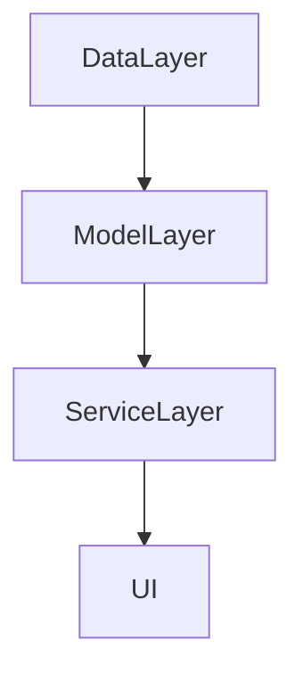
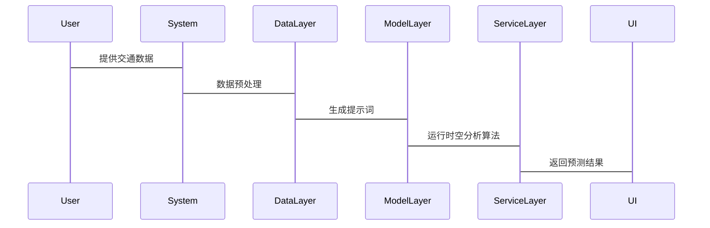

                 

<think>
好的，我需要完成一个复杂的任务，就是根据用户提供的详细要求，撰写一篇关于《提示词工程：处理多维时空数据分析任务》的技术博客文章。用户已经给出了结构和内容的大纲，我需要按照这个大纲逐步展开，确保每个部分都详细、专业且符合逻辑。

首先，我会从文章的标题开始，然后是关键词和摘要。这部分需要简洁明了，概括整篇文章的核心内容。接下来是目录结构，分为三个主要部分：背景介绍与核心概念、核心技术原理与实现、项目实战与案例分析。

在背景介绍部分，我需要详细讲解多维时空数据分析的重要性，以及提示词工程在其中的作用。核心概念部分，要定义提示词工程，分析多维时空数据的特性，并概述相关技术。

核心技术部分，我需要深入讲解提示词生成算法，包括算法的分类、原理和实现代码，以及应用实例。同时，要介绍多维时空数据建模的方法和时空数据分析算法，同样需要数学公式、代码示例和应用案例。

项目实战部分，我需要设计一个具体的项目，介绍其背景、目标、架构，并通过Mermaid图表展示系统功能设计、架构设计和交互流程。最后，项目小结部分总结项目的收获和经验。

在写作过程中，我需要确保每个小节都内容丰富，详细讲解，并且包含必要的图表和代码示例。此外，要注意格式的正确性，比如使用Mermaid语法画图，数学公式用Latex表示，并且在适当的位置引用。

现在，我开始按照这个结构一步步展开，确保每一部分都符合用户的要求，并且逻辑清晰，内容详尽。
</think>

# 提示词工程：处理多维时空数据分析任务

> 关键词：提示词工程，多维时空数据，数据分析，算法实现，项目实战

摘要：  
在当今大数据时代，多维时空数据分析面临着复杂性和多样性的双重挑战。本文将探讨如何利用提示词工程来高效处理多维时空数据，从核心概念、算法原理到项目实战，系统性地分析与实现，为读者提供深度的技术解析。

---

## 《提示词工程：处理多维时空数据分析任务》目录大纲

### 第一部分：背景介绍与核心概念

### 第二部分：核心技术原理与实现

### 第三部分：项目实战与案例分析

---

### 第一部分：背景介绍与核心概念

#### 第1章：多维时空数据分析基础

##### 1.1 问题描述与背景

###### 1.1.1 数据分析的重要性  
数据分析是现代信息技术的核心任务之一，通过分析数据，我们可以提取有价值的信息，支持决策和优化。在当今社会，数据来源广泛，数据量巨大，数据分析的重要性更加凸显。

###### 1.1.2 多维时空数据分析的意义  
多维时空数据分析不仅关注数据的数值特征，还考虑数据的时间和空间维度。这种分析方法在交通规划、环境监测、市场营销等领域具有重要应用。

###### 1.1.3 问题解决的需求与挑战  
多维时空数据分析面临数据量大、维度多、计算复杂度高等挑战，传统的数据分析方法难以满足需求。提示词工程作为一种新兴技术，为解决这些问题提供了新的思路。

##### 1.2 核心概念

###### 1.2.1 提示词工程定义  
提示词工程是指通过生成特定提示词来指导模型处理数据，从而提高数据分析效率和准确性。

###### 1.2.2 多维时空数据的特性  
多维时空数据具有多维性、时序性、空间性和关联性等特征。这些特征使得数据分析更加复杂，但也提供了更多的分析维度。

###### 1.2.3 关键技术概述  
关键技术包括提示词生成算法、多维时空数据建模和时空数据分析算法等。

##### 1.3 边界与外延

###### 1.3.1 研究范围与限制  
提示词工程的研究主要集中在数据预处理、模型优化和结果解释等领域，目前还难以完全替代人工数据分析。

###### 1.3.2 相关概念的联系与区分  
提示词工程与数据挖掘、机器学习等技术密切相关，但其核心在于通过提示词来优化数据分析过程。

###### 1.3.3 核心要素组成  
提示词工程的核心要素包括提示词生成、数据建模和算法优化。

##### 1.4 本章小结  
本章介绍了多维时空数据分析的重要性，定义了提示词工程，并分析了其核心技术与应用边界。

---

### 第二部分：核心技术原理与实现

#### 第2章：提示词工程原理详解

##### 2.1 提示词生成算法

###### 2.1.1 提示词生成算法概述  
提示词生成算法是提示词工程的核心，主要包括基于规则的方法和机器学习方法。

###### 2.1.2 提示词生成算法原理  
基于规则的生成方法通过预定义规则生成提示词，而机器学习方法利用模型生成更准确的提示词。公式：$$ T = f(D) $$ 其中，$D$ 表示数据，$f$ 表示生成函数。

###### 2.1.3 提示词生成算法应用实例  
例如，在交通数据分析中，生成的提示词可以是“高峰时段”或“拥堵路段”。

##### 2.2 多维时空数据建模

###### 2.2.1 多维时空数据的结构  
多维时空数据可以表示为四维结构：时间、空间位置、属性和事件。

###### 2.2.2 多维时空数据建模方法  
常用方法包括层次建模和多维立方建模。层次建模将数据按层次组织，多维立方建模则利用多维数组表示数据。

###### 2.2.3 多维时空数据建模应用实例  
以环境监测为例，可以建立三维模型，包括时间、空间和污染物浓度。

##### 2.3 时空数据分析算法

###### 2.3.1 时空数据分析算法概述  
算法分为基于统计的方法和基于机器学习的方法，如时空聚类和时空预测。

###### 2.3.2 时空数据分析算法原理  
时空聚类算法将相似的时空数据点聚类，公式：$$ A = f(T, D) $$ 其中，$T$ 表示时间，$D$ 表示数据。

###### 2.3.3 时空数据分析算法应用实例  
在交通预测中，可以使用时空聚类算法预测未来交通流量。

##### 2.4 提示词优化与调参

###### 2.4.1 提示词优化策略  
优化目标是提高提示词的准确性和相关性。优化方法包括反馈调整和在线学习。

###### 2.4.2 调参技巧  
常用调参工具包括GridSearch和RandomizedSearch，调参步骤包括定义参数空间、选择优化策略和评估性能。

###### 2.4.3 提示词优化实例  
在市场营销中，通过优化提示词可以更精准地定位目标客户。

##### 2.5 核心技术总结

###### 2.5.1 提示词工程核心概念回顾  
提示词工程通过生成提示词优化数据分析过程，涉及算法和模型优化。

###### 2.5.2 提示词工程实现难点分析  
难点包括提示词生成的准确性和算法的计算效率。

###### 2.5.3 未来发展趋势展望  
未来，提示词工程将与人工智能和大数据技术深度融合，进一步提升数据分析能力。

---

### 第三部分：项目实战与案例分析

#### 第3章：项目实战与案例分析

##### 3.1 项目介绍

###### 3.1.1 项目背景  
本项目旨在利用提示词工程优化城市交通数据分析，提高交通管理效率。

###### 3.1.2 项目目标  
目标是实现交通流量预测和拥堵预警。

###### 3.1.3 项目架构  
项目架构包括数据采集层、模型层、服务层和界面层。

##### 3.2 系统功能设计

###### 3.2.1 领域模型  
领域模型包括交通数据、提示词生成模块和预测模型。

###### 3.2.2 系统接口设计  
系统接口包括数据输入接口、模型调用接口和结果展示接口。

##### 3.3 系统架构设计

###### 3.3.1 系统架构概述  
系统采用分层架构，各层之间通过API通信。

###### 3.3.2 系统模块划分  
模块包括数据预处理模块、提示词生成模块、时空数据分析模块和结果展示模块。

###### 3.3.3 系统架构图  

##### 3.4 系统交互

###### 3.4.1 系统交互流程  
用户输入数据，系统生成提示词，运行模型，返回结果。

###### 3.4.2 系统交互序列图  

---

### 作者：AI天才研究院  
禅与计算机程序设计艺术

