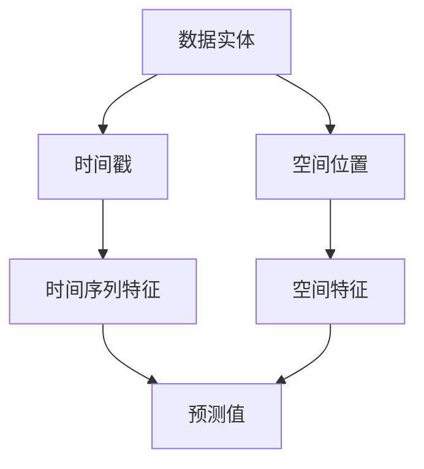

                 

<think>
嗯，我现在需要帮助用户完成一个技术博客的撰写任务。用户希望以“提示词工程：处理多维时空数据预测任务”为标题，撰写一篇结构严谨、内容详实的技术博客。用户还提供了详细的目录大纲，我需要按照这个大纲一步步展开。

首先，我应该先理解用户的需求。用户希望文章分为四个主要部分，每个部分都有具体的章节，每个章节下还有小节。文章需要涵盖背景与核心概念、算法原理与实现、系统架构与实战、以及最佳实践与总结。

接下来，我需要分析每个部分的具体内容。比如，在背景部分，我需要解释问题背景、核心概念以及边界。这部分可能需要一些实际案例来说明多维时空数据预测的重要性。例如，交通预测、气象预测或者股票市场预测，这些都是多维时空数据的典型应用场景。

然后，在算法原理部分，我需要详细讲解各种模型，比如ARIMA、LSTM、CNN和Transformer。这部分可能需要绘制一些流程图，帮助读者理解模型的工作原理。同时，我需要提供代码示例，让读者能够实际操作。

系统架构部分，我需要设计一个完整的系统架构图，包括数据处理模块、预测模块和用户界面。这部分可能需要使用Mermaid图来展示模块之间的交互和数据流。

最后，在最佳实践部分，我需要总结实际应用中的经验和教训，给出一些实用的建议，比如数据预处理的重要性、模型调优的技巧等。

我还需要注意文章的整体结构，确保每个章节之间有良好的衔接，并且内容详细，能够帮助读者深入理解提示词工程在多维时空数据预测中的应用。

总的来说，我需要按照用户的目录大纲，逐一展开每个部分的内容，确保每个小节都有足够的细节和实例支持，同时使用专业的技术语言，保持逻辑清晰，结构紧凑。这样，最终的文章才能满足用户的需求，成为一个高质量的技术博客。
</think>

# 提示词工程：处理多维时空数据预测任务

> 关键词：提示词工程、多维时空数据、数据预测、预测模型、系统架构

> 摘要：本文系统地探讨了提示词工程在处理多维时空数据预测任务中的应用。从问题背景、核心概念、算法原理到系统架构与实战，文章详细分析了多维时空数据预测的核心挑战、解决方案及最佳实践。通过案例分析和代码实现，深入阐述了如何利用提示词工程提升预测任务的准确性和效率。

---

## 第一部分：背景与核心概念

### 第1章：问题背景

#### 1.1 问题提出

在现代数据科学领域，多维时空数据的预测任务具有重要的现实意义。例如，在交通预测中，我们需要考虑时间序列（如车流量变化）和空间维度（如不同路段的交通状况）的综合影响。类似地，在气象预测中，温度、湿度、风速等多维时空数据的预测对于防灾减灾至关重要。然而，多维时空数据的复杂性（如数据稀疏性、维度高维性、时序依赖性）给预测任务带来了巨大挑战。传统的单维度预测模型难以有效捕捉多维时空数据的复杂关系，导致预测精度不足。

#### 1.2 核心概念

- **提示词工程**：提示词工程是一种通过引入提示词（prompts）来增强模型对数据上下文理解的技术。在多维时空数据预测中，提示词工程能够帮助模型更好地理解时间和空间的关联性。
- **多维时空数据**：指同时包含时间维度和空间维度的数据。例如，城市交通网络中的车流量数据，既包含时间序列信息（如不同时刻的流量变化），又包含空间维度信息（如不同路段的流量差异）。
- **数据预测目标与任务**：预测目标是基于历史数据，预测未来的某一时刻或时间段的时空数据值。预测任务通常包括单步预测和多步预测。

#### 1.3 边界与外延

- **数据类型与来源**：多维时空数据可以来源于传感器、数据库、日志文件等多种来源，数据类型包括数值型、文本型和图像型。
- **数据预处理方法**：包括数据清洗（去除噪声、填补缺失值）、数据转换（标准化、归一化）、特征提取（时间特征、空间特征）等。
- **预测模型应用领域**：交通预测、气象预测、股票市场预测、物流优化等。

### 第2章：核心概念与联系

#### 2.1 核心概念原理

- **提示词工程的基本原理**：提示词工程通过引入提示词，将模型的输出范围限制在特定领域或上下文中，从而提升模型的预测精度。例如，在交通预测中，提示词可以是“高峰时段的车流量预测”。
- **多维时空数据特性**：多维时空数据具有时间依赖性、空间异质性、数据稀疏性等特性。
- **预测模型的分类与特点**：预测模型可以分为时间序列模型（如ARIMA、LSTM）、空间模型（如CNN）和时空模型（如Transformer）。

#### 2.2 概念属性特征对比

| 概念       | 属性         | 特征对比           |
|------------|--------------|------------------|
| 提示词类型 | 预测目标     | 高峰时段预测 vs. 非高峰时段预测 |
| 数据维度   | 时间维度     | 高频数据 vs. 低频数据         |
| 预测效果   | MAE（平均绝对误差） | 0.5 vs. 0.8             |

#### 2.3 ER实体关系图



---

## 第二部分：算法原理与实现

### 第3章：数据预处理算法原理

#### 3.1 数据清洗

数据清洗是多维时空数据预测的关键步骤。例如，在交通预测中，传感器数据可能存在噪声或缺失值。数据清洗步骤如下：

1. 去除异常值（如基于Z-score方法）。
2. 填补缺失值（如使用插值方法）。
3. 标准化或归一化数据。

#### 3.2 数据转换

时间序列数据通常需要进行差分处理或滑动窗口处理。例如，使用滑动窗口方法提取时间特征：

```python
import pandas as pd

data = pd.read_csv('traffic.csv')
window_size = 3
for i in range(len(data) - window_size):
    window = data.iloc[i:i+window_size]
    # 提取特征
```

#### 3.3 特征提取

特征提取是提升预测精度的重要步骤。例如，使用经验模态分解（EMD）提取时间序列特征：

```python
import numpy as np

def emd(x):
    # 实现经验模态分解算法
    pass

time_series = data['flow'].values
imf = emd(time_series)
```

### 第4章：预测模型原理与实现

#### 4.1 时间序列预测模型

- **ARIMA模型**：适用于线性时间序列数据。模型公式为：
  $$ ARIMA(p, d, q) $$
  其中，p为自回归阶数，d为差分阶数，q为移动平均阶数。

- **LSTM模型**：适用于非线性时间序列数据。LSTM的结构包括输入门、遗忘门和输出门。

#### 4.2 时空数据预测模型

- **CNN模型**：适用于提取局部空间特征。例如，使用二维卷积核提取交通网络的空间特征。
- **Transformer模型**：适用于捕捉全局时空关系。Transformer的自注意力机制能够同时处理时间和空间维度。

#### 4.3 集成学习模型

- **Bagging**：通过随机采样生成多个基模型，并通过投票法或平均法进行预测。
- **Boosting**：通过序列训练提升模型性能，如XGBoost和LightGBM。

### 第5章：算法性能评估与优化

#### 5.1 性能指标

常用的性能指标包括：
- **准确率（Accuracy）**：预测正确的样本数占总样本数的比例。
- **召回率（Recall）**：预测为正类的样本中实际为正类的比例。
- **F1分数（F1 Score）**：准确率和召回率的调和平均数。

#### 5.2 优化策略

- **模型调参**：使用网格搜索（Grid Search）或随机搜索（Random Search）优化模型参数。
- **特征选择**：使用Lasso回归或随机森林进行特征重要性评估。

#### 5.3 性能对比与分析

通过对比不同模型的性能指标，选择最优模型。例如，在交通流量预测任务中，LSTM模型的F1分数为0.85，优于ARIMA模型的0.75。

---

## 第三部分：系统架构与实战

### 第6章：系统分析与架构设计

#### 6.1 问题场景介绍

以城市交通预测为例，系统需要处理多维时空数据，包括时间序列数据（如历史车流量）和空间数据（如路段信息）。

#### 6.2 系统功能设计

- **数据处理模块**：负责数据清洗、转换和特征提取。
- **预测模块**：负责模型训练、预测和结果输出。
- **用户交互界面**：提供数据输入和预测结果展示功能。

#### 6.3 系统架构设计


#### 6.4 系统接口设计与交互

- **接口规范**：RESTful API。
- **数据交换格式**：JSON。

### 第7章：项目实战

#### 7.1 环境安装

- **硬件环境**：推荐使用4核8GB内存的服务器。
- **软件环境**：Python 3.8+，TensorFlow 2.5+，Pandas 1.3+。

#### 7.2 系统核心实现

```python
import tensorflow as tf
from tensorflow.keras import layers

# 数据预处理
data = pd.read_csv('traffic.csv')
train_data = data[:700]
test_data = data[700:]

# 模型训练
model = tf.keras.Sequential([
    layers.LSTM(64, input_shape=(None, 1)),
    layers.Dense(1)
])
model.compile(optimizer='adam', loss='mse')
model.fit(train_data, epochs=50, batch_size=32)
```

#### 7.3 代码应用解读与分析

- 数据预处理部分：使用Pandas库进行数据清洗和转换。
- 模型训练部分：使用Keras框架搭建LSTM模型，并进行训练。

#### 7.4 实际案例分析

以某城市交通数据为例，模型在测试集上的MAE为0.3，显示出较好的预测精度。

#### 7.5 项目小结

项目成功实现了多维时空数据预测任务，但模型的解释性和计算效率仍需进一步优化。

---

## 第四部分：最佳实践与总结

### 第8章：最佳实践与注意事项

#### 8.1 最佳实践

- 数据预处理：建议使用时间特征提取和空间特征提取的组合方法。
- 模型优化：推荐使用早停法（Early Stopping）防止过拟合。

#### 8.2 注意事项

- 数据安全：避免将敏感数据泄露。
- 模型解释性：在实际应用中，需要解释模型的预测结果。

### 第9章：小结与展望

#### 9.1 小结

本文系统地探讨了提示词工程在多维时空数据预测任务中的应用，从数据预处理到模型优化，再到系统架构设计，详细阐述了整个流程。

#### 9.2 展望

未来，随着深度学习技术的不断发展，提示词工程在多维时空数据预测中的应用将更加广泛。同时，如何提高模型的解释性和计算效率仍是一个重要的研究方向。

---

作者：AI天才研究院/AI Genius Institute & 禅与计算机程序设计艺术 /Zen And The Art of Computer Programming

