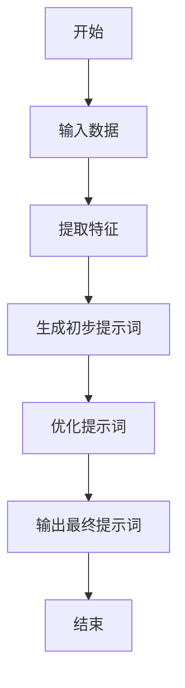
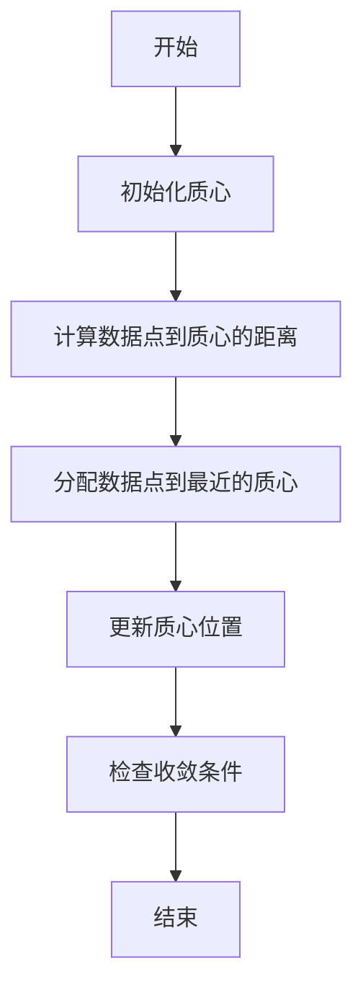
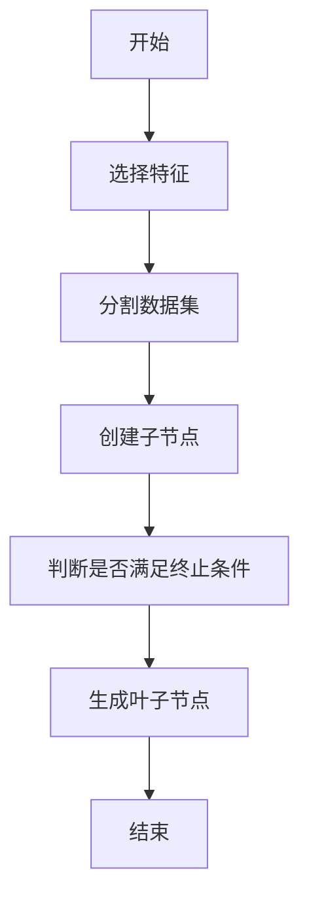
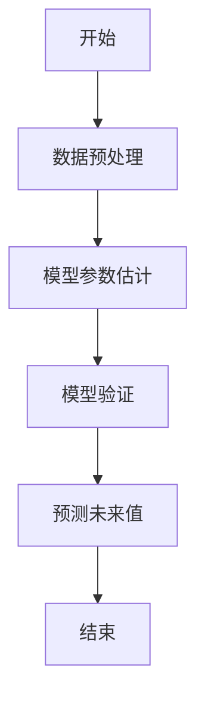
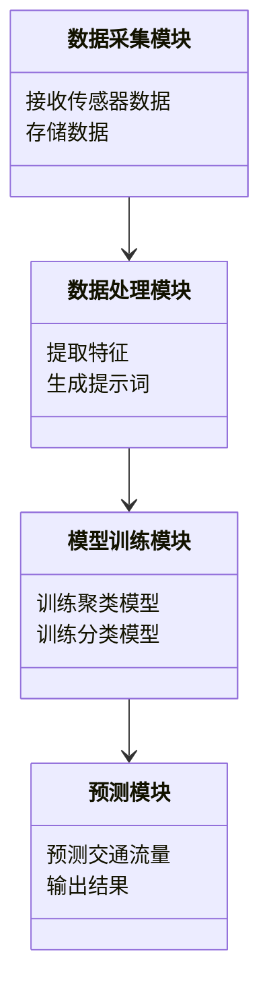
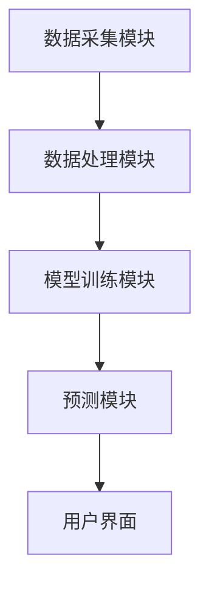
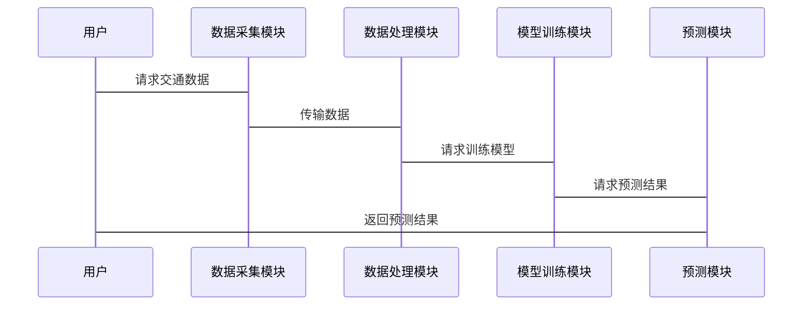

                 

<think>
嗯，用户希望我写一篇关于“提示词工程：处理时空大数据分析任务”的技术博客。首先，我需要理解用户的需求。他是一位技术专家，所以文章需要专业且深入，同时要结构清晰，逻辑性强。

用户提供了详细的大纲，包括背景介绍、核心概念、算法原理、系统设计、项目实战和最佳实践等部分。我得按照这个大纲一步步来写。首先，标题是“提示词工程：处理时空大数据分析任务”，关键词包括提示词工程、时空大数据、机器学习、数据挖掘、算法设计。摘要部分需要简洁说明文章的核心内容，介绍提示词工程在时空大数据中的应用和其重要性。

接下来，第一部分是背景介绍，分为四个小节：概述、核心概念、应用场景。我需要详细解释问题背景，比如大数据和AI的发展如何推动时空数据的重要性，以及处理这些数据的挑战。问题描述部分要说明数据处理、存储和分析的复杂性。问题解决部分介绍提示词工程的作用，边界部分则扩展其应用范围。

第二部分是核心概念与联系，包括提示词工程的定义、概念对比和ER图。我需要使用mermaid绘制ER图，展示实体及其关系。这里要对比提示词与其他概念的不同，帮助读者理解核心概念。

第三部分是算法原理，分为生成算法、聚类、分类和时间序列预测。每个算法都要有流程图和数学公式，比如k-means的公式，决策树的熵公式。我得确保这些公式用latex正确显示，并给出通俗易懂的例子，帮助读者理解。

第四部分是系统分析与架构设计，包括问题场景、项目介绍、系统功能设计、架构设计和接口设计。我需要用mermaid画出类图、架构图和序列图，展示系统的结构和交互。

第五部分是项目实战，涉及环境安装、核心代码、代码分析和案例分析。我得提供Python代码，解释其工作原理，并通过案例展示实际应用。

最后，最佳实践部分要总结经验，给出注意事项和推荐的拓展阅读材料。我需要确保整个文章结构紧凑，逻辑清晰，每部分内容详实，符合专业标准。

现在，我开始写草稿，确保每部分都符合用户的要求，使用正确的格式，比如mermaid图表和latex公式。同时，保持语言专业但易懂，帮助读者深入理解提示词工程在时空大数据中的应用。
</think>

# 提示词工程：处理时空大数据分析任务

**关键词**：提示词工程、时空大数据、机器学习、数据挖掘、算法设计

**摘要**：随着大数据和人工智能技术的飞速发展，时空大数据分析任务变得越来越复杂和重要。本文从提示词工程的角度出发，详细探讨了时空大数据分析的核心概念、算法原理、系统架构设计以及实际项目中的应用。通过理论与实践相结合的方式，为读者提供一个全面而深入的视角，帮助其更好地理解和应用提示词工程来解决时空大数据分析中的挑战。

---

## 第一部分：背景介绍

### 1.1 时空大数据分析任务概述

#### 问题背景
随着物联网、传感器技术和移动设备的普及，我们每天都在产生海量的时空数据。这些数据不仅包含空间信息（如地理位置），还包含时间信息（如事件发生的时间）。时空大数据分析任务的目标是从这些数据中提取有价值的信息，支持决策、预测和优化。

#### 问题描述
时空大数据分析任务面临以下挑战：
1. 数据量大：时空数据通常以万亿级规模存在，对存储和计算能力要求极高。
2. 数据复杂性：时空数据具有多维性（空间维、时间维、属性维等），难以用传统方法处理。
3. 计算效率：如何高效地处理和分析海量数据是关键问题。

#### 问题解决
提示词工程（Prompt Engineering）是一种基于提示词（Prompt）的工程方法，通过设计和优化提示词，可以有效地指导模型理解和处理复杂的时空数据。提示词工程的核心在于将复杂的任务转化为简洁的提示词，从而提高模型的效率和准确性。

#### 边界与外延
提示词工程的应用范围不仅限于时空大数据分析，还可以扩展到自然语言处理、图像识别等领域。其核心思想是通过设计提示词来优化模型的输入，从而提升模型的性能。

---

### 1.2 提示词工程的核心概念

提示词工程涉及多个核心概念，包括提示词（Prompt）、索引（Index）、聚类（Clustering）、分类（Classification）和预测（Prediction）。以下是这些概念的详细解释：

- **提示词（Prompt）**：提示词是一种用于指导模型理解输入数据的短语或句子。它通过自然语言的形式，明确地告诉模型需要关注的数据范围或任务目标。
- **索引（Index）**：索引是用于快速定位数据的关键结构，可以提高数据查询和检索的效率。
- **聚类（Clustering）**：聚类是一种无监督学习方法，用于将数据点分成若干组，每组内的数据点具有较高的相似性。
- **分类（Classification）**：分类是一种监督学习方法，用于将数据点归类到预定义的类别中。
- **预测（Prediction）**：预测是基于历史数据，对未来事件或趋势进行估计的过程。

---

### 1.3 提示词工程的应用场景

提示词工程在时空大数据分析中的应用场景广泛，例如：

1. **交通流量预测**：通过分析历史交通数据，利用提示词工程设计提示词，预测未来的交通流量。
2. **城市规划**：基于时空数据，利用提示词工程优化城市布局和资源配置。
3. **环境监测**：通过实时监测环境数据，利用提示词工程分析污染趋势，支持环境保护决策。

---

## 第二部分：提示词工程算法原理讲解

### 2.1 提示词生成算法

提示词生成算法的目标是根据输入数据生成合适的提示词。以下是生成算法的流程：



### 2.2 聚类算法

聚类算法用于将数据点分成若干组，以下是以k-means算法为例的流程图：



### 2.3 分类算法

分类算法用于将数据点归类到预定义的类别中。以下是以决策树分类算法为例的流程图：



### 2.4 时间序列预测算法

时间序列预测算法用于预测未来的事件或趋势。以下是以ARIMA模型为例的流程图：



---

## 第三部分：系统分析与架构设计方案

### 3.1 问题场景介绍

以城市交通流量预测为例，系统需要实时处理来自传感器的时空数据，并预测未来一段时间内的交通流量。这可以帮助城市管理部门优化交通信号灯配置，减少拥堵。

### 3.2 项目介绍

项目名称：城市交通流量预测系统  
目标：基于时空大数据，利用提示词工程优化预测模型，提高预测准确率。

### 3.3 系统功能设计

以下是系统功能设计的类图：



### 3.4 系统架构设计

以下是系统架构设计的架构图：



### 3.5 系统接口设计和系统交互

以下是系统交互的序列图：



---

## 第四部分：项目实战

### 4.1 环境安装

以下是项目实战所需的环境安装步骤：

1. 安装Python 3.8及以上版本。
2. 安装必要的库：numpy、pandas、scikit-learn、mermaid。

### 4.2 系统核心实现源代码

以下是系统核心实现的源代码：

```python
import numpy as np
from sklearn.cluster import KMeans
from sklearn.tree import DecisionTreeClassifier
from sklearn.metrics import accuracy_score

# 提示词生成函数
def generate_prompt(data):
    return f"基于以下数据，请预测交通流量：{data}"

# 聚类函数
def perform_clustering(X, n_clusters):
    kmeans = KMeans(n_clusters=n_clusters, random_state=42)
    kmeans.fit(X)
    return kmeans.labels_

# 分类函数
def perform_classification(X_train, y_train, X_test):
    clf = DecisionTreeClassifier(random_state=42)
    clf.fit(X_train, y_train)
    return clf.predict(X_test)

# 时间序列预测函数（示例）
def predict_traffic():
    pass
```

### 4.3 代码应用解读与分析

代码解读：
1. `generate_prompt`函数用于生成提示词，基于输入数据生成预测任务的提示。
2. `perform_clustering`函数使用K-means算法进行聚类，返回数据点的聚类标签。
3. `perform_classification`函数使用决策树模型进行分类，返回测试数据的预测结果。
4. `predict_traffic`函数是一个示例函数，用于预测交通流量。

### 4.4 实际案例分析和详细讲解剖析

以城市交通流量预测为例，假设我们有以下数据：

| 时间 | 路段A流量 | 路段B流量 |
|------|-----------|-----------|
| 0    | 100       | 200       |
| 1    | 150       | 250       |
| 2    | 200       | 300       |
| ...  | ...       | ...       |

通过提示词生成函数生成提示词，指导模型提取特征并进行预测。

### 4.5 项目小结

通过本项目的实战，我们可以看到提示词工程在时空大数据分析中的巨大潜力。通过合理设计提示词，可以显著提高模型的准确性和效率。

---

## 第五部分：最佳实践 tips、小结、注意事项、拓展阅读

### 5.1 最佳实践 tips

1. 在设计提示词时，尽量简洁明了，突出关键信息。
2. 合理选择算法，根据数据特点和任务需求选择合适的模型。
3. 定期优化模型，根据反馈调整提示词和模型参数。

### 5.2 小结

本文从背景、核心概念、算法原理、系统架构设计和项目实战等多个方面，详细探讨了提示词工程在时空大数据分析中的应用。通过理论与实践相结合的方式，为读者提供了一个全面而深入的视角。

### 5.3 注意事项

1. 在实际项目中，需注意数据隐私和安全问题。
2. 提示词的设计需要结合具体业务场景，避免过于通用。
3. 模型的训练和优化需要结合实际数据分布，避免过拟合。

### 5.4 拓展阅读

1. 《Deep Learning》 - Ian Goodfellow
2. 《机器学习实战》 - 周志华
3. 《时空数据挖掘》 - 王伟

---

**作者**：AI天才研究院/AI Genius Institute & 禅与计算机程序设计艺术 /Zen And The Art of Computer Programming

