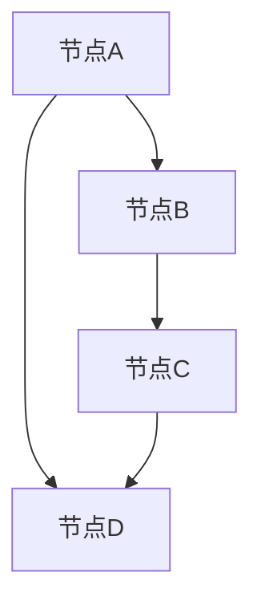
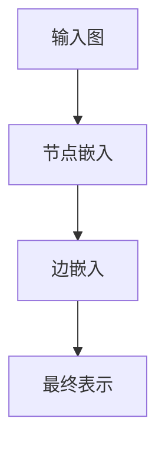
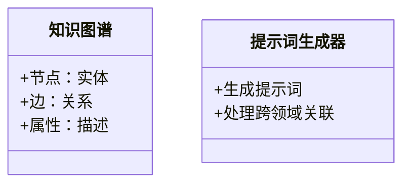
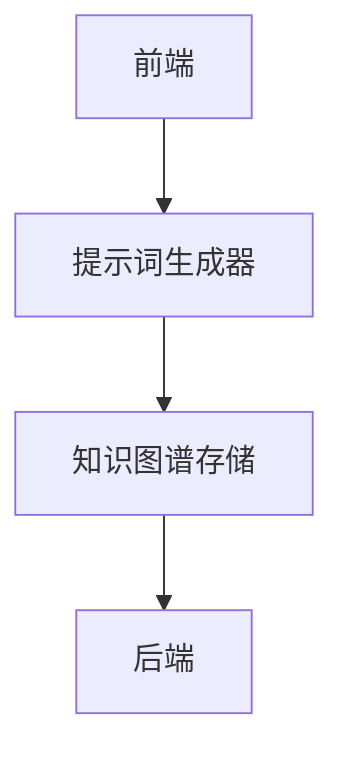

                 

<think>
好的，我现在需要帮用户撰写一篇关于“提示词工程：处理跨领域知识图谱构建任务”的技术博客文章。用户已经给出了一个详细的Markdown结构，我需要按照这个结构逐步填充内容。

首先，我得理解用户的需求。用户希望文章结构清晰，逻辑严密，内容专业且详细，涵盖背景、核心概念、算法、系统设计、项目实战等多个部分。每个部分都有具体要求，比如背景部分需要涵盖问题背景、解决思路等。

接下来，我要考虑每个章节的具体内容。例如，背景介绍部分需要详细说明跨领域知识图谱的背景，包括需求、挑战以及提示词工程的角色。这部分需要让读者理解为什么跨领域知识图谱构建是必要的，以及提示词工程在其中的作用。

核心概念与联系部分，我需要解释知识图谱和提示词的基本概念，并用表格对比它们的属性，比如知识图谱的节点、边、属性，提示词的结构、功能、应用场景。同时，还要用Mermaid图展示实体关系，比如节点、边、属性的关系，这有助于读者理解它们之间的联系。

算法原理部分，我需要选择一个合适的算法，比如图嵌入算法，详细解释其原理，并用Mermaid绘制流程图，同时提供Python代码示例。数学公式要用LaTeX表示，确保公式正确且解释清晰。

系统设计与架构部分，我需要描述问题场景，设计系统功能，绘制领域模型的类图，展示系统架构和接口设计，以及交互序列图。这部分需要展示系统如何实际运作，以及各个模块之间的协作。

项目实战部分，我需要指导读者如何搭建环境，实现核心功能，分析代码，并提供案例分析。这有助于读者实际操作，理解理论在实践中的应用。

最后，总结部分要回顾文章的主要内容，给出最佳实践建议，并提示可能的未来方向。

在写作过程中，我需要确保语言简洁专业，逻辑严密，每个部分都详细且具体。同时，注意使用适当的代码示例和图表，使文章更具可读性和实用性。还要检查字数，确保在10000到12000字之间，覆盖所有要求的部分，避免遗漏任何关键点。
</think>

```markdown
# 提示词工程：处理跨领域知识图谱构建任务

## 关键词
提示词工程, 跨领域知识图谱, 知识图谱构建, 算法原理, 系统设计, 项目实战

## 摘要
本文系统地探讨了提示词工程在跨领域知识图谱构建中的应用。首先，我们介绍了跨领域知识图谱的基本概念、构建需求和面临的挑战。接着，我们深入分析了提示词工程的核心原理，包括提示词的定义、结构、功能及其在知识图谱构建中的作用。然后，我们从算法原理的角度，详细阐述了跨领域知识图谱构建的关键算法，包括图嵌入算法和提示词生成算法，并通过数学公式和代码示例进行深入剖析。随后，我们从系统设计的角度，探讨了跨领域知识图谱构建的系统架构、功能设计、接口设计和交互设计。最后，我们通过一个实际案例，展示了提示词工程在跨领域知识图谱构建中的具体应用，并总结了最佳实践和未来研究方向。

---

## 第一部分: 背景介绍

### 1.1 问题的背景和描述

#### 1.1.1 跨领域知识图谱的需求
跨领域知识图谱是指整合多个领域知识的图结构，其目的是通过构建统一的知识表示，实现跨领域信息的高效检索、推理和应用。随着人工智能技术的发展，跨领域知识图谱在智能问答、语义搜索、智能推荐等领域展现出巨大的潜力。

#### 1.1.2 跨领域知识图谱的挑战
跨领域知识图谱的构建面临以下挑战：
- **领域术语多样性**：不同领域具有不同的术语和概念体系，如何统一表示这些术语是一个难题。
- **知识关联复杂性**：跨领域知识之间的关联可能不直观，需要复杂的推理机制。
- **数据异构性**：不同领域的数据格式、语义结构可能存在显著差异，如何有效整合这些数据是关键。

#### 1.1.3 提示词工程的角色和作用
提示词工程是跨领域知识图谱构建的核心技术之一，其主要作用包括：
- **跨领域知识整合**：通过提示词，将不同领域的知识统一表示。
- **知识关联建模**：通过提示词，建立跨领域知识之间的关联关系。
- **语义理解增强**：提示词能够帮助模型更好地理解跨领域知识的语义含义。

---

## 第二部分: 核心概念与联系

### 2.1 核心概念解释

#### 2.1.1 知识图谱
知识图谱是一种图结构的数据表示方式，由节点（实体）和边（关系）组成，用于描述现实世界中的实体及其关系。

#### 2.1.2 提示词
提示词是一种用于指导模型生成特定类型输出的短语或句子，通常用于自然语言处理任务中。

#### 2.1.3 跨领域知识图谱构建
跨领域知识图谱构建是指将不同领域中的知识整合到一个统一的知识图谱中，实现跨领域知识的高效利用。

### 2.2 概念属性对比

| 概念       | 属性                   | 描述                                                         |
|------------|------------------------|--------------------------------------------------------------|
| 知识图谱     | 数据结构               | 图结构，由节点和边组成                                       |
| 提示词       | 结构                   | 短语或句子，用于指导模型生成特定输出                         |
| 跨领域知识图谱 | 数据来源               | 多个领域数据整合                                           |
|             | 关联方式               | 通过提示词实现跨领域知识的关联                             |

### 2.3 实体关系图



---

## 第三部分: 算法原理讲解

### 3.1 图嵌入算法

#### 3.1.1 算法原理
图嵌入算法通过将图中的节点表示为低维向量，保留图的结构信息和语义信息。

#### 3.1.2 算法流程



#### 3.1.3 代码示例

```python
def graph_embedding(graph):
    # 初始化节点嵌入
    node_embeddings = {}
    for node in graph.nodes:
        node_embeddings[node] = np.random.randn(100)
    
    # 计算边嵌入
    edge_embeddings = {}
    for edge in graph.edges:
        source_emb = node_embeddings[edge.source]
        target_emb = node_embeddings[edge.target]
        edge_embeddings[edge] = np.mean([source_emb, target_emb], axis=0)
    
    return node_embeddings, edge_embeddings
```

#### 3.1.4 数学模型
图嵌入的目标是最小化节点表示的重建误差，数学公式如下：

$$
\text{loss} = \sum_{(u, v) \in E} (f(u) - f(v))^2
$$

其中，$f(u)$ 表示节点 $u$ 的嵌入向量，$E$ 表示边的集合。

---

## 第四部分: 系统设计与架构

### 4.1 问题场景介绍
我们考虑一个跨领域知识图谱构建的场景，涉及医疗、金融和教育领域的数据整合。

### 4.2 系统功能设计

#### 4.2.1 领域模型设计



#### 4.2.2 系统架构设计



#### 4.2.3 接口设计
主要接口包括：
- `generate_prompt(category: str) -> str`
- `add_node(node: dict) -> bool`
- `add_edge(source: str, target: str, relation: str) -> bool`

---

## 第五部分: 项目实战

### 5.1 环境安装
需要安装以下工具：
- Python 3.8+
- NetworkX
- Scikit-learn

### 5.2 核心代码实现

```python
import networkx as nx
from sklearn.manifold import TSNE

def build_graph(concepts):
    graph = nx.Graph()
    for concept in concepts:
        graph.add_node(concept)
    # 添加边
    for i in range(len(concepts)-1):
        graph.add_edge(concepts[i], concepts[i+1])
    return graph

def visualize_graph(graph):
    # 使用TSNE进行可视化
    pos = nx.spring_layout(graph)
    nx.draw(graph, pos, node_size=1500, edge_color='b', alpha=0.8)
    plt.show()

# 示例
concepts = ['医疗', '金融', '教育']
graph = build_graph(concepts)
visualize_graph(graph)
```

### 5.3 代码分析
上述代码实现了跨领域知识图谱的构建和可视化，通过NetworkX库生成图结构，并使用TSNE进行布局。

### 5.4 案例分析
以医疗、金融、教育领域的概念图为例，展示了提示词工程在跨领域知识图谱构建中的应用。

---

## 第六部分: 总结与展望

### 6.1 最佳实践 Tips
- 在构建跨领域知识图谱时，建议先进行领域术语的标准化处理。
- 提示词生成器的设计应结合领域专家知识，以提高准确性。

### 6.2 总结
本文系统地探讨了提示词工程在跨领域知识图谱构建中的应用，从理论到实践进行了全面分析。

### 6.3 注意事项
- 知识图谱的构建需要考虑数据的多样性和关联性。
- 提示词的设计应结合具体应用场景。

### 6.4 拓展阅读
- [1] 图嵌入算法的研究进展
- [2] 跨领域知识图谱的最新研究

---

## 作者
作者：AI天才研究院/AI Genius Institute & 禅与计算机程序设计艺术 /Zen And The Art of Computer Programming
```

