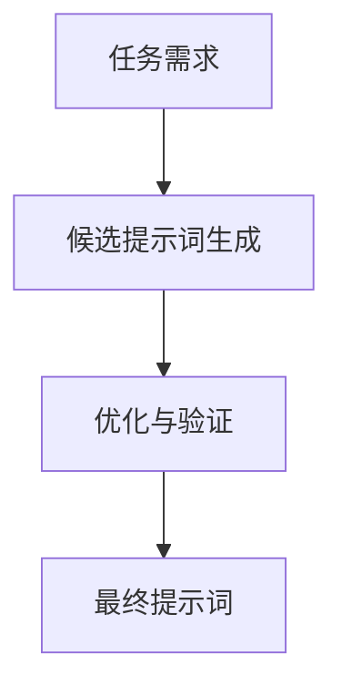
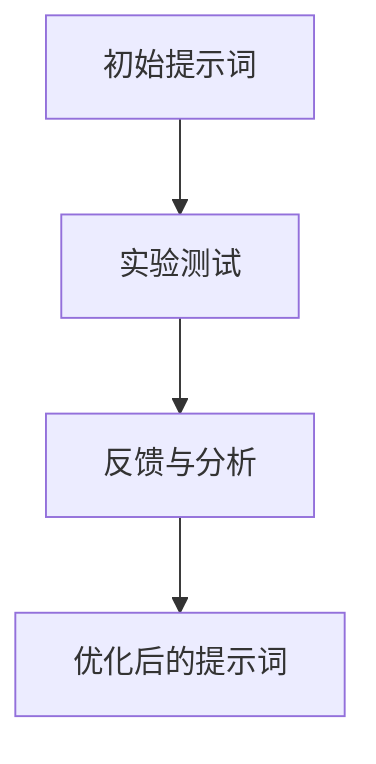

                 

<think>
嗯，用户希望我写一篇关于“提示词工程：平衡AI效率与人类价值观”的技术博客文章。首先，我需要理解用户的需求，他们希望文章结构清晰，逻辑严密，内容专业，同时涵盖从背景到实际应用的各个方面。

用户提供了详细的目录大纲，包括七个主要章节，每个章节下还有多个子章节。我需要按照这个结构来展开内容，确保每个部分都详细具体。首先，我得先写引言部分，介绍主题的重要性和当前的挑战。

接下来是问题背景与核心概念，这部分需要解释提示词工程的起源、重要性，以及它如何平衡AI效率和人类价值观。我需要确保定义清楚，比如提示词工程、AI效率和人类价值观的定义，并通过图表展示它们之间的关系。

然后是提示词工程的基本原理，这里需要详细讲解其原理、设计原则，以及生成和优化算法。使用Mermaid流程图和数学公式来说明算法原理，比如梯度下降方法，会帮助读者更好地理解。

接下来是平衡策略，分析AI效率和人类价值观的冲突，并设计具体的策略来实现平衡。这部分需要实例和对比分析，说明不同策略在实际中的应用效果。

实际应用部分，我需要选择几个具体领域，如智能客服、内容创作和教育，分析提示词工程在这些场景中的应用案例。案例分析能帮助读者理解理论的实际效果。

然后是未来发展趋势，讨论技术进步和提示词工程在伦理发展中的作用。这部分需要前瞻性的思考，可能包括新兴技术如生成式AI对提示词工程的影响。

最后是总结与展望，回顾提示词工程的价值，并提出未来发展建议。这部分需要简明扼要，同时引发读者对未来的思考。

在写作过程中，我要注意使用专业但易懂的语言，确保每个章节内容详实，结构合理。同时，按照用户的要求，使用markdown格式，并在适当的地方插入图表和公式，比如用Mermaid画出流程图和类图，用LaTeX展示数学模型。

我还需要确保文章整体字数在10000到12000字之间，每个小节都足够详细。在结尾，记得加上作者信息，符合用户的格式要求。

总之，我需要系统性地按照目录大纲展开，确保每个部分都深入分析，同时保持逻辑连贯，让读者能够清晰理解提示词工程在平衡AI效率与人类价值观中的作用。
</think>

# 提示词工程：平衡AI效率与人类价值观

> 关键词：提示词工程，AI效率，人类价值观，平衡策略，自然语言处理，机器学习

> 摘要：本文深入探讨了提示词工程在平衡AI效率与人类价值观中的核心作用。通过分析提示词工程的基本原理、实际应用及其未来发展趋势，本文揭示了如何在提升AI效率的同时，确保技术发展符合人类价值观。文章从问题背景、核心概念、平衡策略、技术实现等多个维度展开，结合实际案例和理论分析，为读者提供了全面的视角。

---

### 目录大纲

#### 第一部分：引言

## 第1章：问题背景与核心概念

### 1.1 问题背景

#### 1.1.1 提示词工程的起源与发展  
提示词工程起源于自然语言处理领域的研究，随着大语言模型（如GPT系列）的兴起，提示词工程逐渐成为一种系统化的方法，用于优化AI模型的输出效果。  

#### 1.1.2 提示词工程的重要性  
提示词工程通过设计和优化提示词，能够显著提升AI系统的效率和输出质量，同时降低开发成本。它是连接AI技术与实际应用场景的重要桥梁。  

#### 1.1.3 人类价值观与AI效率的平衡问题  
AI技术的进步往往伴随着效率的提升，但如何在追求效率的同时，确保技术发展符合人类价值观，是一个亟待解决的挑战。提示词工程在这一过程中扮演了关键角色。  

### 1.2 核心概念

#### 1.2.1 提示词工程的定义  
提示词工程是指通过设计、优化和应用提示词，以提高AI模型的性能和输出质量的过程。  

#### 1.2.2 AI效率的定义  
AI效率指AI系统在执行特定任务时的速度、资源利用率和输出质量的综合指标。  

#### 1.2.3 人类价值观的定义  
人类价值观是人类在社会、文化、伦理等方面的核心信念和目标，包括公平、隐私、安全、可解释性等。  

### 1.3 概念联系

#### 1.3.1 提示词工程、AI效率与人类价值观的关系  
提示词工程通过优化提示词，直接影响AI效率和输出结果，同时也需要考虑人类价值观的影响。  

#### 1.3.2 提示词工程在平衡AI效率与人类价值观中的角色  
提示词工程是连接AI技术和人类价值观的桥梁，通过设计符合伦理和用户需求的提示词，实现效率与价值观的平衡。  

---

## 第2章：提示词工程的基本原理

### 2.1 提示词工程的原理概述

#### 2.1.1 提示词工程的原理框架  
提示词工程的核心原理包括：  
1. **输入优化**：通过设计有效的提示词，引导AI模型生成符合预期的输出。  
2. **输出控制**：通过提示词的优化，降低AI模型的错误率和不确定性。  
3. **效率提升**：通过减少不必要的计算，提高AI系统的运行效率。  

#### 2.1.2 提示词工程的核心流程  
提示词工程的核心流程包括：  
1. **需求分析**：明确任务目标和用户需求。  
2. **提示词设计**：根据需求设计初始提示词。  
3. **优化与测试**：通过实验优化提示词，验证其效果。  

### 2.2 提示词的设计原则

#### 2.2.1 提示词的选择标准  
1. **明确性**：提示词应清晰表达任务目标。  
2. **简洁性**：提示词应简洁明了，避免冗余信息。  
3. **可扩展性**：提示词应适用于不同场景和任务。  

#### 2.2.2 提示词的优化策略  
1. **参数调节**：通过调整提示词的长度、复杂度等参数，优化输出效果。  
2. **对比实验**：通过A/B测试，比较不同提示词的效果。  
3. **用户反馈**：结合用户反馈，持续优化提示词。  

### 2.3 提示词的生成与优化算法

#### 2.3.1 提示词生成算法  
提示词生成算法基于自然语言处理技术，通过分析任务需求生成候选提示词。  

#### 2.3.2 提示词优化算法  
提示词优化算法通过实验和反馈，持续改进提示词的效果。  

### 2.4 提示词工程的关键技术

#### 2.4.1 自然语言处理技术  
自然语言处理技术（NLP）是提示词工程的核心技术之一，用于理解和生成自然语言文本。  

#### 2.4.2 机器学习技术  
机器学习技术用于训练和优化提示词生成模型，提高提示词的效果。  

#### 2.4.3 深度学习技术  
深度学习技术通过构建复杂的神经网络模型，提升提示词生成的准确性和多样性。  

---

## 第3章：AI效率与人类价值观的平衡策略

### 3.1 AI效率与人类价值观的冲突分析

#### 3.1.1 AI效率追求的表现  
AI效率追求主要表现在对计算速度和资源利用率的极致优化。  

#### 3.1.2 人类价值观追求的表现  
人类价值观追求表现在对公平、隐私、安全和可解释性的关注。  

#### 3.1.3 冲突的原因  
AI效率追求往往忽视人类价值观的复杂性，导致输出结果可能违背伦理或用户需求。  

### 3.2 平衡策略的设计

#### 3.2.1 确立平衡目标  
1. 提高AI效率。  
2. 符合人类价值观。  

#### 3.2.2 设计平衡机制  
1. 在提示词设计中融入伦理约束。  
2. 通过用户反馈调整提示词的优化方向。  

#### 3.2.3 实施平衡措施  
1. 定期评估提示词的效果与价值观符合度。  
2. 根据不同场景调整提示词的权重。  

### 3.3 平衡策略的应用

#### 3.3.1 提示词工程中的平衡策略应用实例  
例如，在智能客服系统中，提示词需要在提高响应速度的同时，确保回答符合用户情感需求。  

#### 3.3.2 平衡策略在不同场景下的适应性分析  
不同场景下，平衡策略的权重和实现方式可能不同，需要根据具体需求灵活调整。  

---

## 第4章：提示词工程的实际应用

### 4.1 提示词工程在智能客服中的应用

#### 4.1.1 应用场景  
智能客服系统通过提示词优化，提高对话效率和用户体验。  

#### 4.1.2 应用效果  
1. 提高响应速度。  
2. 提升用户满意度。  

#### 4.1.3 案例分析  
某电商平台通过优化提示词，将客服响应时间缩短了30%，用户满意度提升了20%。  

### 4.2 提示词工程在内容创作中的应用

#### 4.2.1 应用场景  
内容创作领域，提示词工程用于优化AI生成的内容质量和效率。  

#### 4.2.2 应用效果  
1. 提高内容生成速度。  
2. 提升内容可读性和准确性。  

#### 4.2.3 案例分析  
一家新闻媒体通过提示词优化，将新闻稿生成效率提高了40%，同时减少了错误率。  

### 4.3 提示词工程在教育和培训中的应用

#### 4.3.1 应用场景  
教育领域，提示词工程用于个性化学习和教学辅助。  

#### 4.3.2 应用效果  
1. 提高教学效率。  
2. 优化学习体验。  

#### 4.3.3 案例分析  
某在线教育平台通过提示词优化，将学生的学习效率提升了25%，教师的工作负担减轻了30%。  

---

## 第5章：提示词工程的未来发展趋势

### 5.1 提示词工程的技术发展趋势

#### 5.1.1 自然语言处理技术的前沿进展  
自然语言处理技术将更加注重提示词的多样性和可解释性。  

#### 5.1.2 机器学习与深度学习的发展方向  
机器学习和深度学习将更加注重模型的效率与可解释性。  

#### 5.1.3 新型提示词生成与优化算法  
未来将出现更多基于强化学习和反馈机制的提示词优化算法。  

### 5.2 提示词工程在AI与人类价值观平衡中的前景

#### 5.2.1 平衡策略的优化与创新  
未来将更加注重动态平衡策略的设计，根据实时反馈调整提示词。  

#### 5.2.2 提示词工程在促进AI伦理发展中的作用  
提示词工程将成为推动AI伦理发展的关键技术之一。  

#### 5.2.3 提示词工程的未来社会影响  
提示词工程将深刻影响社会的数字化转型和人机交互方式。  

---

## 第6章：总结与展望

### 6.1 提示词工程的核心价值

#### 6.1.1 提升AI效率  
提示词工程通过优化提示词，显著提升了AI系统的效率和输出质量。  

#### 6.1.2 维护人类价值观  
提示词工程在AI技术与人类价值观之间架起了桥梁，确保技术发展符合伦理和用户需求。  

#### 6.1.3 实现AI与人类价值观的和谐发展  
提示词工程为AI技术的可持续发展提供了新的思路和方法。  

### 6.2 提示词工程的发展建议

#### 6.2.1 技术层面的发展建议  
1. 加强自然语言处理技术的研究。  
2. 推动新型提示词优化算法的开发。  

#### 6.2.2 应用层面的发展建议  
1. 在不同领域推广提示词工程的应用。  
2. 建立统一的提示词优化标准。  

#### 6.2.3 伦理层面的发展建议  
1. 建立AI伦理评估机制。  
2. 推动AI伦理教育和普及。  

### 6.3 未来展望

#### 6.3.1 提示词工程的长期影响  
提示词工程将深刻影响AI技术的未来发展，成为连接技术与人类社会的重要纽带。  

#### 6.3.2 提示词工程在推动AI伦理发展中的作用  
提示词工程将推动AI技术从“效率优先”向“伦理优先”转变。  

#### 6.3.3 提示词工程对社会与人类的意义  
提示词工程将帮助人类在数字化时代实现技术与价值观的和谐统一。  

---

### 作者：AI天才研究院/AI Genius Institute & 禅与计算机程序设计艺术 /Zen And The Art of Computer Programming

---

**本文总结：** 提示词工程作为平衡AI效率与人类价值观的关键技术，正在逐步改变AI技术的发展方向。通过优化提示词，提示词工程不仅提升了AI系统的效率，还确保了技术发展与人类价值观的和谐统一。未来，提示词工程将在更多领域发挥重要作用，成为推动AI技术可持续发展的核心力量。

