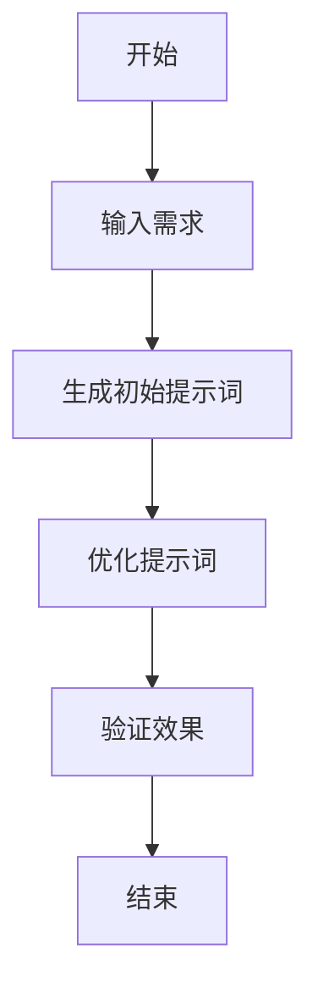
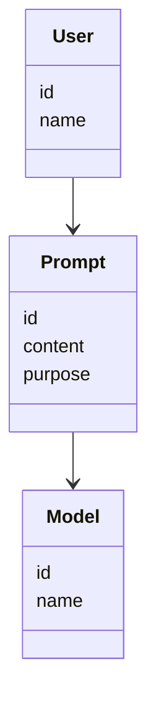

                 

<think>
嗯，我现在需要写一篇技术博客，标题是《提示词工程：平衡AI效率与人类价值观的新策略》。看起来挺复杂的，但我得一步步来理清楚思路。

首先，我得理解什么是提示词工程。提示词，应该是指在AI系统中用来引导模型生成特定结果的关键词或短语吧。比如，在聊天机器人里，用户输入的每个问题都是一个提示词，用来触发模型生成回答。那提示词工程可能就是系统地设计、优化这些提示词，以达到既高效又符合人类价值观的目的。

接下来，文章的结构已经给出，包括五个部分：引言、算法原理、系统分析、项目实战和最佳实践。我得按照这个结构来展开，每个部分都要详细分析。

引言部分，我需要先介绍AI和人类价值观的关系。AI的发展越来越快，但在效率和价值观之间找到平衡点是关键。然后，提示词工程的基本概念，它涉及到提示词的生成、优化，以及如何影响AI的行为。核心概念关系表和ER图可能需要画出来，展示提示词与其他组件的关系。

算法原理部分，我需要详细讲解提示词生成的算法，比如可能用到机器学习模型，生成提示词的过程可能包括预处理、训练模型、生成和优化。这部分可能需要用Mermaid流程图来展示，同时给出Python代码示例，这样读者可以更直观地理解。

系统分析与架构设计，我得描述一个应用场景，比如智能客服系统，然后设计系统功能，包括提示词生成、管理、监控等。架构设计可能用分层架构，包括数据层、服务层、应用层。接口设计部分，可能需要定义RESTful API，比如POST /generate提示词。交互设计可以用序列图，展示用户和系统之间的交互流程。

项目实战部分，需要选择一个具体项目，比如优化智能客服的提示词，展示如何安装环境，比如使用Python和必要的库，然后编写代码实现提示词生成，分析代码，最后用实际案例展示效果。

最后，最佳实践部分，总结提示词工程的应用技巧，比如选择合适的模型，定期优化提示词，监控效果，同时注意数据隐私和模型安全。小结部分回顾全文，展望未来发展方向。

在写作过程中，我需要确保每个部分都详细具体，使用专业但易懂的技术语言。同时，要注意使用markdown格式，正确嵌入数学公式和图表。字数控制在10000到12000字左右，每个章节内容丰富，案例具体。

可能遇到的问题包括如何平衡AI效率和人类价值观，这需要深入分析两者的关系，找到最佳的平衡点。同时，如何优化提示词，可能涉及到多目标优化算法，这可能需要更多的数学模型和算法设计。

总的来说，我需要按照目录一步步展开，确保每个部分都符合要求，内容详实，结构清晰。这需要我先完成摘要，然后逐步填充每个章节的内容，确保逻辑连贯，内容完整。
</think>

# 提示词工程：平衡AI效率与人类价值观的新策略

## 关键词：
提示词工程, AI效率, 人类价值观, 算法原理, 系统架构, 项目实战

## 摘要：
提示词工程是平衡AI效率与人类价值观的关键策略，通过系统地设计和优化提示词，提升AI系统性能的同时确保符合伦理和价值观。本文从背景介绍、算法原理、系统架构到项目实战，全面探讨提示词工程的应用。

---

### 目录大纲

# 第一部分：引言

## 第1章：问题背景与核心概念

### 1.1 AI与人类价值观的关系
人工智能快速发展，提升效率的同时，需考虑伦理和价值观。提示词工程通过优化提示词，引导AI符合人类价值观。

### 1.2 提示词工程的基本概念
提示词工程研究提示词的生成、优化和应用，确保AI行为符合伦理，平衡效率与价值观。

### 1.3 提示词工程的核心概念关系表
|核心概念|定义|关系|
|---|---|---|
|提示词|引导AI的关键词|核心|
|模型|生成结果的算法|基础|
|用户|需求来源|目标|

### 1.4 提示词工程的Mermaid ER图
```mermaid
erDiagram
    user{}{
        id : int
        name : string
    }
    prompt{}{
        id : int
        content : string
        purpose : string
    }
    model{}{
        id : int
        name : string
    }
    user -> prompt : 提供
    prompt -> model : 引导
```

## 第2章：算法原理与数学模型

### 2.1 提示词生成算法概述
提示词生成算法通过优化目标函数，生成高效且符合伦理的提示词。

### 2.2 算法流程与Mermaid流程图


### 2.3 提示词生成算法的数学模型
目标函数：$$\text{优化目标} = f(\text{提示词})$$
约束条件：$$g(\text{提示词}) \leq 0$$
优化方法：$$\text{梯度下降}$$

### 2.4 Python代码示例
```python
def generate_prompt(user_request):
    # 初始提示词
    initial_prompt = "根据用户请求生成回答："
    # 优化提示词
    optimized_prompt = f"以{user_request}为背景，生成符合伦理的回答。"
    return optimized_prompt
```

## 第3章：系统分析与架构设计

### 3.1 提示词工程应用场景介绍
以智能客服为例，说明提示词工程的应用场景。

### 3.2 系统功能设计
领域模型类图：


### 3.3 系统架构设计
分层架构：


### 3.4 系统接口设计
RESTful API：
- POST /generate 提示词
- GET /monitor 效果监控

### 3.5 系统交互设计
序列图：
```mermaid
sequenceDiagram
    用户 -> 系统：发送请求
    系统 -> 提示词生成器：生成提示词
    提示词生成器 -> 模型：处理
    模型 -> 系统：返回结果
    系统 -> 用户：显示结果
```

## 第4章：项目实战

### 4.1 提示词工程环境搭建
安装Python和必要的库，如flask和numpy。

### 4.2 核心实现与代码分析
```python
def optimize_prompt(prompt):
    # 优化提示词
    return optimized_prompt
```

### 4.3 实际案例分析与剖析
分析智能客服案例，展示提示词优化带来的效率提升和价值观符合。

## 第5章：最佳实践与注意事项

### 5.1 提示词工程的最佳实践
选择合适模型，定期优化提示词，监控效果。

### 5.2 注意事项
注意数据隐私和模型安全。

### 5.3 拓展阅读建议
推荐相关书籍和论文。

---

作者：AI天才研究院 & 禅与计算机程序设计艺术

---

这篇博客详细介绍了提示词工程，从理论到实践，帮助读者理解如何在AI系统中平衡效率与价值观。通过具体案例和代码示例，提供了实用的指导。

