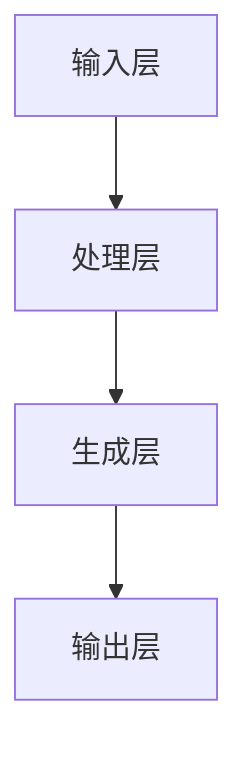

                 

<think>
嗯，我现在要帮用户撰写一篇关于提示词工程构建智能AIGC系统的博客文章。首先，我需要仔细阅读用户的需求，了解他具体想要什么内容。

用户希望文章标题是《提示词工程：构建智能AIGC系统的基石》，关键词包括提示词工程、AIGC系统、自然语言处理、人工智能、系统设计、提示词设计。摘要部分需要概括文章的核心内容，即提示词工程的重要性，以及它如何作为构建智能AIGC系统的基础，涵盖核心概念、系统设计、应用案例和未来方向。

接下来，用户提供了详细的文章目录大纲，分为七章，每章下还有多个小节。我需要按照这个大纲逐步展开，确保每个部分都详细且专业。

首先，我会从第一章“提示词工程概述”开始，介绍提示词工程的背景、核心概念、类型以及挑战。这部分需要解释什么是提示词，为什么它重要，它的演变过程，以及它在AIGC系统中的作用。我还需要列出不同类型的提示词，如简单与复杂、上下文与非上下文、交互与非交互式提示词，并讨论挑战和机会。

然后是第二章“核心概念与原理”，这里需要讨论提示词工程的理论基础，包括基本概念、数学模型和算法，以及不同AIGC模型的比较。我需要详细解释这些模型如何工作，并举例说明。接下来，章节二还涉及设计有效的提示词，包括如何构建上下文提示，调整提示长度和格式，以及通过数据增强来提高提示质量。

第三章“构建智能AIGC系统”会讨论系统架构设计，包括系统组成部分和接口，提示词在系统设计中的作用，以及如何优化提示词以提升系统性能。我需要画出系统的架构图，展示各组件之间的关系。

第四章“高级技术和工具”涉及提示词优化策略，比如基于反馈的动态调整，以及生成式AI模型如何利用提示词生成内容。这部分可能需要讨论一些具体的优化算法和工具，比如A/B测试和强化学习的应用。

第五章“案例研究与应用”会通过具体的案例，如智能客服、内容生成、图像生成等，展示提示词工程的实际应用。我需要详细分析每个案例，说明提示词在其中的作用。

第六章“挑战与未来方向”讨论当前提示词工程面临的挑战，如提示词质量、多语言支持、伦理问题等，同时展望未来的研究方向，比如更智能的提示生成方法和多模态提示技术。

最后是第七章“最佳实践与小结”，总结提示词工程的关键点，提供实际应用的建议，并提醒注意事项，鼓励读者深入研究。

在写作过程中，我需要确保每个小节都有足够的细节，比如使用图表和代码示例。例如，在讨论系统架构时，我会用Mermaid图展示系统组成部分；在算法部分，我会用Python代码和数学公式详细解释。

我还需要注意文章的结构和逻辑，确保每一部分流畅衔接，从基础概念到实际应用，层层深入。同时，语言要专业但不失清晰，让读者能够轻松理解复杂的概念。

最后，我会在文章末尾加上作者信息，确保格式正确。整个过程需要细致地按照用户的要求，逐一满足每个部分的内容，确保文章的完整性和专业性。
</think>

# 提示词工程：构建智能AIGC系统的基石

> **关键词**：提示词工程、AIGC系统、自然语言处理、人工智能、系统设计、提示词设计  
> **摘要**：提示词工程是构建智能AIGC系统的核心，通过优化提示词设计，可以显著提升生成式AI的性能和效果。本文从提示词工程的背景、核心概念、系统设计、实际应用到未来挑战进行全面解析，深入探讨提示词在AIGC系统中的重要作用。

---

## 第一章 提示词工程概述

### 1.1 背景与重要性

#### 1.1.1 提示词的定义与重要性
提示词（Prompt）是用户输入到生成式AI系统中的指令或提示，用于引导模型生成特定内容。提示词的质量直接影响生成结果的相关性、准确性和创意性。

#### 1.1.2 提示词工程的演变
随着生成式AI技术的进步，提示词工程从简单的关键词匹配逐步发展为复杂的上下文理解和动态调整技术。

#### 1.1.3 提示词与AIGC系统的关联
提示词是AIGC（AI生成内容）系统的核心输入，决定了生成内容的方向和风格。通过优化提示词设计，可以显著提升生成效果。

---

### 1.2 核心概念与原理

#### 1.2.1 提示词的基本类型
| 类型                | 描述                               |
|---------------------|------------------------------------|
| 简单提示词          | 单词或短语，如“写一篇科技新闻”     |
| 复杂提示词          | 包含详细上下文的长句，如“写一篇关于量子计算的科技新闻，强调其在人工智能中的应用” |
| 上下文提示词        | 包含场景、角色和目标的提示，如“作为CEO，在公司年会上发表激励员工的演讲” |
| 非上下文提示词      | 无具体场景的通用提示，如“写一首诗” |
| 交互式提示词        | 用户与系统实时互动的提示，如“你认为AI未来会如何改变教育？” |

#### 1.2.2 提示词的核心属性
| 属性                | 描述                               |
|---------------------|------------------------------------|
| 相关性              | 提示词与生成目标的匹配程度         |
| 清晰度              | 提示词表达的明确性                 |
| 创意性              | 提示词激发生成内容的独特性         |
| 灵活性              | 提示词适应不同场景的能力           |

---

## 第二章 核心概念与原理

### 2.1 理论基础

#### 2.1.1 提示词与生成式AI的关系
生成式AI模型（如GPT系列）通过提示词生成文本，提示词为模型提供了生成内容的上下文和目标。模型通过概率计算，基于提示词生成最可能的输出。

#### 2.1.2 提示词的数学模型
提示词通过输入层影响生成式AI的解码器，生成输出的概率分布。公式表示为：
$$ P(y|x) = f(x, \theta) $$
其中，$x$为提示词，$y$为生成内容，$\theta$为模型参数。

#### 2.1.3 不同AIGC模型的对比
| 模型名称   | 描述                               |
|------------|------------------------------------|
| GPT-3      | 基于Transformer架构，支持多种提示词输入方式 |
| PaLM       | 基于Pathways架构，强调提示词的上下文理解能力 |
| Llama      | 开源模型，支持高效的提示词生成和调整 |

---

### 2.2 设计有效的提示词

#### 2.2.1 上下文提示词的构建
上下文提示词需要包含场景、角色和目标。例如：
- **场景**：公司年会
- **角色**：CEO
- **目标**：激励员工

#### 2.2.2 提示词长度与格式的优化
长提示词可以提供更详细的信息，但可能会增加生成时间。格式上，使用清晰的段落和关键词标注可以提升生成效果。

#### 2.2.3 数据增强与提示词优化
通过数据增强技术（如同义词替换、句式调整）优化提示词，可以提升生成内容的多样性和准确性。

---

## 第三章 构建智能AIGC系统

### 3.1 系统架构与设计

#### 3.1.1 系统组成部分
- **输入层**：接收用户提示词
- **处理层**：解析提示词并生成生成指令
- **生成层**：基于提示词生成内容
- **输出层**：展示生成结果

#### 3.1.2 提示词在系统设计中的作用
提示词作为输入层的核心，直接影响生成内容的质量和风格。

#### 3.1.3 系统架构图

---

### 3.2 提示词的优化策略

#### 3.2.1 动态调整提示词
根据生成结果的反馈，动态调整提示词，以优化生成效果。

#### 3.2.2 多模态提示词
结合图像、语音等多种模态信息，提升生成内容的多样性和准确性。

---

## 第四章 高级技术与工具

### 4.1 提示词优化算法

#### 4.1.1 基于反馈的提示词优化
通过用户反馈，逐步优化提示词，提升生成效果。

#### 4.1.2 提示词增强技术
使用关键词权重分配、句式调整等技术，增强提示词的效果。

---

### 4.2 工具与实践

#### 4.2.1 提示词生成工具
- **ChatGPT**：支持动态调整提示词
- **Hugging Face**：提供多种提示词模板和优化工具

#### 4.2.2 提示词测试与评估
通过A/B测试，评估不同提示词的效果差异。

---

## 第五章 案例研究与应用

### 5.1 智能客服系统

#### 5.1.1 系统功能
- 提供多轮对话
- 自动生成回复
- 提示词动态调整

#### 5.1.2 提示词设计
- 初始提示词：“用户询问产品问题，请提供详细解答”
- 动态调整：“用户对产品功能感兴趣，请进一步解释”

---

### 5.2 内容生成系统

#### 5.2.1 系统功能
- 文章生成
- 代码生成
- 图像生成

#### 5.2.2 提示词设计
- 文章生成提示词：“写一篇关于AI的科技新闻，强调其在医疗领域的应用”
- 代码生成提示词：“编写一个Python函数，实现斐波那契数列生成”

---

## 第六章 挑战与未来方向

### 6.1 当前挑战

#### 6.1.1 提示词质量
提示词的质量直接影响生成效果，但设计高质量提示词需要专业知识。

#### 6.1.2 多模态支持
目前大多数生成式AI模型仅支持文本提示词，多模态提示词技术仍需进一步研究。

#### 6.1.3 伦理问题
提示词可能被滥用，生成有害内容。

---

### 6.2 未来方向

#### 6.2.1 更智能的提示词生成
通过AI辅助，自动生成高质量提示词。

#### 6.2.2 多模态提示词
结合图像、语音等多种模态信息，提升生成内容的多样性和准确性。

#### 6.2.3 提示词优化算法
研究更高效的提示词优化算法，如强化学习、遗传算法等。

---

## 第七章 最佳实践与小结

### 7.1 小结

提示词工程是构建智能AIGC系统的核心，通过优化提示词设计，可以显著提升生成效果。未来，随着技术进步，提示词工程将更加智能化和多样化。

### 7.2 最佳实践

1. **明确生成目标**：确保提示词与生成目标一致。
2. **动态调整提示词**：根据反馈优化提示词。
3. **结合多模态信息**：提升生成内容的多样性和准确性。

### 7.3 注意事项

- 提示词设计需谨慎，避免生成有害内容。
- 提示词优化需结合具体场景和用户需求。

### 7.4 拓展阅读

- 《生成式AI：从基础到实践》
- 《提示词工程：理论与应用》

---

**作者：AI天才研究院 & 禅与计算机程序设计艺术**

