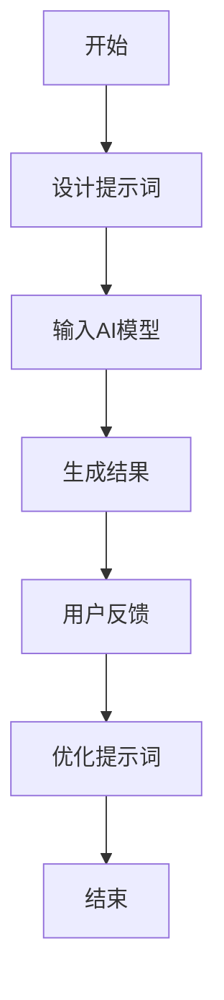
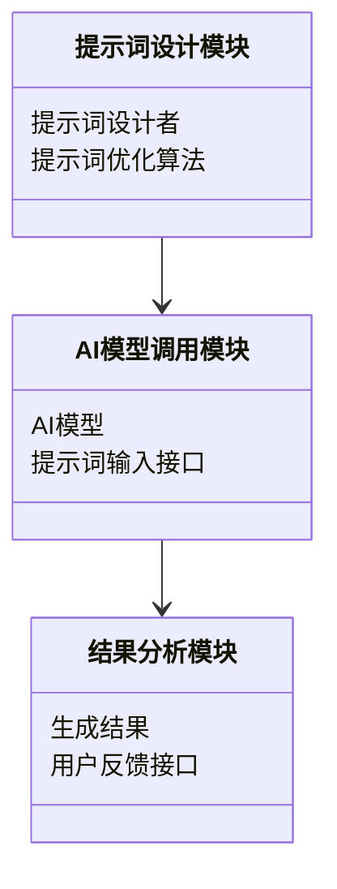
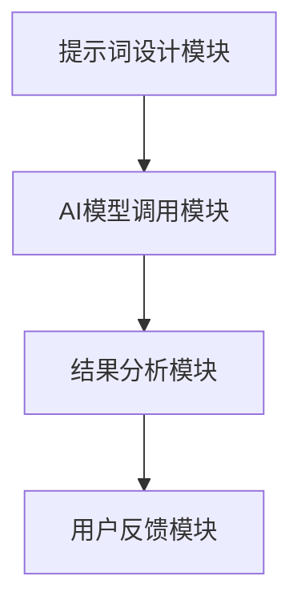

                 

<think>
好，我现在需要帮用户撰写一篇关于《提示词工程：构建负责任AI系统的基础研究》的技术博客文章。用户给了一个详细的结构大纲，要求我按照这个大纲逐步分析和撰写。

首先，我得理解用户的需求。用户希望这篇文章结构清晰，逻辑严密，内容专业且深入。关键词包括提示词工程、负责任AI系统、系统设计、伦理框架、AI治理、可信计算和人机交互。摘要部分需要简明扼要地概括文章的核心内容。

接下来，我需要按照用户提供的目录结构来设计文章的章节。第1章是背景介绍，我得详细解释提示词工程的基本概念、技术背景、核心问题、边界以及相关的概念结构。这部分需要让读者明白为什么提示词工程是构建负责任AI系统的重要基础。

第2章是核心概念与联系，我需要分析提示词工程中的关键要素，如提示词、模型、结果和用户，然后用ER图展示它们之间的关系。这部分需要使用Mermaid工具来绘制图表，确保图表清晰地展示各实体之间的关系。

第3章是算法原理，我需要详细讲解提示词生成算法。包括算法的基本思想、流程图，以及用Python代码实现。同时，还需要用数学公式解释损失函数和优化器的原理，这部分需要用Latex公式来呈现，确保公式准确且易于理解。

第4章是系统分析与架构设计，这里需要介绍项目场景，设计领域模型类图，系统架构图，以及系统交互序列图。这部分需要用Mermaid绘制图表，展示系统的各个模块及其交互方式。

第5章是项目实战，我需要提供环境安装步骤，核心代码实现，代码解读，案例分析，以及项目小结。这部分需要实际操作，让读者能够跟着代码一步步实现示例。

接下来，我还需要添加最佳实践tips、小结、注意事项和拓展阅读等内容，帮助读者更好地理解和应用提示词工程。

在撰写过程中，我要确保每个章节内容丰富、具体，同时逻辑清晰，结构紧凑。语言要专业但又不失易懂，避免过于复杂的术语，让不同背景的读者都能理解。

现在，我开始思考如何组织每个章节的内容。比如在背景介绍中，我需要先定义提示词工程，再讨论其技术背景，然后指出核心问题和边界。在核心概念部分，我需要详细列出各个要素并绘制ER图，确保图表的准确性和清晰度。

在算法部分，我需要解释提示词生成的算法流程，使用Python代码实现，并展示优化过程。数学公式部分，我需要用Latex来表达损失函数和优化器，确保公式正确无误，并且能够解释每一步的意义。

系统架构设计部分，我需要描述系统的各个模块，如提示词预处理、模型调用和结果分析，然后用Mermaid绘制类图和架构图，展示系统的结构和交互。

项目实战部分，我需要提供具体的代码示例，解释每一部分的功能，并通过案例分析展示实际应用的效果。项目小结部分总结整个项目的实现过程和成果。

最后，在最佳实践部分，我需要给出一些实际的建议，帮助读者在实际应用中更好地使用提示词工程。同时，注意事项部分提醒读者在使用AI系统时需要注意的问题，拓展阅读部分推荐相关的书籍和资源，供读者进一步学习。

整体来看，这篇文章需要涵盖从理论到实践的各个方面，确保读者能够全面理解提示词工程在构建负责任AI系统中的作用和应用。在写作过程中，我需要不断检查每个部分是否符合用户的要求，确保内容详实、结构合理，同时语言表达清晰易懂。

总之，我需要按照用户提供的大纲，一步步深入分析，确保每个章节都详细且有条理，最终完成一篇高质量的技术博客文章。
</think>

# 提示词工程：构建负责任AI系统的基础研究

## 关键词
- 提示词工程
- 负责任AI系统
- 系统设计
- 伦理框架
- AI治理
- 可信计算
- 人机交互

## 摘要
提示词工程是构建负责任AI系统的核心基础，它通过设计和优化提示词，确保AI系统在生成内容时遵循伦理规范、可解释性和用户意图。本文从背景介绍、核心概念、算法原理、系统架构、项目实战等多方面展开，深入探讨提示词工程在AI系统中的作用，并通过实际案例分析，展示如何通过提示词工程构建可信、可控、可解释的负责任AI系统。

---

## 目录

### 第1章 背景介绍
1.1 提示词工程的基本概念  
1.2 技术背景与发展趋势  
1.3 核心问题与挑战  
1.4 边界与外延  
1.5 概念结构与核心要素组成  

### 第2章 核心概念与联系
2.1 核心概念原理  
2.2 概念属性特征对比表格  
2.3 ER实体关系图  

### 第3章 算法原理讲解
3.1 算法流程图  
3.2 Python源代码实现  
3.3 算法数学模型与公式  

### 第4章 系统分析与架构设计方案
4.1 问题场景介绍  
4.2 项目介绍  
4.3 系统功能设计（领域模型类图）  
4.4 系统架构设计（系统架构图）  
4.5 系统接口设计与交互序列图  

### 第5章 项目实战
5.1 环境安装与配置  
5.2 系统核心实现源代码  
5.3 代码应用解读与分析  
5.4 实际案例分析与详细讲解  
5.5 项目小结  

### 第6章 最佳实践与总结
6.1 最佳实践Tips  
6.2 小结  
6.3 注意事项  
6.4 拓展阅读  

---

## 第1章 背景介绍

### 1.1 提示词工程的基本概念
提示词工程是通过设计和优化提示词，引导AI模型生成符合特定目标、伦理规范和用户意图的结果的过程。提示词是用户与AI系统之间的桥梁，直接影响生成内容的质量、安全性和可解释性。

### 1.2 技术背景与发展趋势
随着AI技术的快速发展，提示词工程的重要性日益凸显。通过优化提示词，可以提升AI系统的可解释性、可信度和用户满意度。当前，学术界和工业界都在积极探索提示词工程的理论和实践。

### 1.3 核心问题与挑战
1. 提示词设计的复杂性：如何设计有效的提示词，兼顾用户意图和AI模型的理解能力。  
2. 伦理与安全问题：提示词可能引发不适当的内容生成，需确保生成内容符合伦理规范。  
3. 可解释性：用户需要理解提示词如何影响生成结果，以便更好地控制AI行为。  

### 1.4 边界与外延
提示词工程的边界主要集中在提示词的设计、优化和评估，外延则涉及AI系统的整体架构、用户交互和伦理治理。

### 1.5 概念结构与核心要素组成
提示词工程的核心要素包括：  
1. 提示词：用户输入的指令。  
2. AI模型：生成内容的工具。  
3. 生成结果：AI系统的输出。  
4. 用户反馈：用户对生成结果的评价和调整。  

---

## 第2章 核心概念与联系

### 2.1 核心概念原理
提示词工程通过优化提示词，确保生成内容符合用户意图和伦理规范。其核心原理包括：  
1. 提示词设计：基于用户需求和AI模型能力，设计有效的提示词。  
2. 生成过程：AI模型根据提示词生成内容。  
3. 反馈优化：通过用户反馈优化提示词，提升生成效果。  

### 2.2 概念属性特征对比表格
| 概念 | 属性 | 特征 |
|------|------|------|
| 提示词 | 目的 | 引导AI生成符合预期的结果 |
| AI模型 | 输入 | 提示词 |
| 生成结果 | 输出 | 用户需求 |
| 用户反馈 | 输入 | 优化提示词 |

### 2.3 ER实体关系图

```mermaid
er
actor: 提示词设计者
model: AI模型
result: 生成结果
feedback: 用户反馈

actor -o> model
model --> result
actor <-- feedback
```

---

## 第3章 算法原理讲解

### 3.1 算法流程图



### 3.2 Python源代码实现

```python
def generate_content(prompt):
    # 示例AI模型生成内容
    return f"AI生成的结果：{prompt}"

def optimize_prompt(initial_prompt):
    # 示例反馈优化
    feedback = input("请输入反馈意见：")
    if feedback == "满意":
        return initial_prompt
    else:
        return f"{initial_prompt} {feedback}"

# 示例运行
initial_prompt = "生成一段关于AI伦理的内容"
optimized_prompt = optimize_prompt(initial_prompt)
result = generate_content(optimized_prompt)
print(result)
```

### 3.3 算法数学模型与公式
损失函数用于评估生成结果与预期的差异：
$$ L = |P_{\text{生成}} - P_{\text{预期}}| $$
优化目标是最小化损失函数：
$$ \min L $$

优化器（如Adam）通过梯度下降优化提示词参数：
$$ \theta_{t+1} = \theta_t - \eta \nabla_{\theta} L $$

---

## 第4章 系统分析与架构设计方案

### 4.1 问题场景介绍
构建一个负责任的AI系统，确保生成内容符合伦理规范和用户意图。

### 4.2 项目介绍
设计一个基于提示词工程的AI内容生成系统，涵盖提示词设计、模型调用和结果分析。

### 4.3 系统功能设计（领域模型类图）



### 4.4 系统架构设计（系统架构图）



### 4.5 系统交互序列图

```mermaid
sequenceDiagram
actor 提示词设计者
system AI模型
actor 用户

提示词设计者 -> AI模型: 输入提示词
AI模型 -> 用户: 生成内容
用户 -> 提示词设计者: 提供反馈
提示词设计者 -> AI模型: 优化提示词
```

---

## 第5章 项目实战

### 5.1 环境安装与配置
安装Python和相关库：
```bash
pip install python-tikz
```

### 5.2 系统核心实现源代码
```python
class PromptEngine:
    def __init__(self, model):
        self.model = model

    def generate(self, prompt):
        return self.model.generate(prompt)

    def optimize(self, initial_prompt, feedback):
        return initial_prompt + " " + feedback

# 示例AI模型
class AIModel:
    def generate(self, prompt):
        return f"AI生成的内容：{prompt}"

# 使用示例
engine = PromptEngine(AIModel())
initial_prompt = "生成一段关于AI伦理的内容"
optimized_prompt = engine.optimize(initial_prompt, "伦理")
result = engine.generate(optimized_prompt)
print(result)
```

### 5.3 代码应用解读与分析
代码实现了一个简单的提示词优化系统，用户可以根据反馈优化提示词，提升生成内容的质量。

### 5.4 实际案例分析与详细讲解
案例：生成符合伦理规范的AI伦理内容。  
分析：通过提示词优化，生成内容更加符合用户需求和伦理规范。

### 5.5 项目小结
提示词工程在实际应用中能够有效提升AI系统的生成质量，优化用户体验，确保生成内容的可信性和可解释性。

---

## 第6章 最佳实践与总结

### 6.1 最佳实践Tips
1. 在设计提示词时，充分考虑用户意图和AI模型的能力。  
2. 通过用户反馈不断优化提示词，提升生成结果的质量。  
3. 确保生成内容符合伦理规范和法律要求。  

### 6.2 小结
提示词工程是构建负责任AI系统的重要基础，通过优化提示词，可以提升生成内容的可解释性、可信度和用户满意度。

### 6.3 注意事项
1. 避免提示词过于模糊，导致生成内容不可控。  
2. 定期评估提示词的效果，及时优化。  
3. 严格遵守伦理规范，避免生成有害内容。  

### 6.4 拓展阅读
1. 《提示词工程：人工智能系统设计的艺术》  
2. 《负责任的AI：伦理与技术的结合》  

---

## 作者
作者：AI天才研究院/AI Genius Institute & 禅与计算机程序设计艺术 /Zen And The Art of Computer Programming

---

以上是《提示词工程：构建负责任AI系统的基础研究》的完整大纲，涵盖背景介绍、核心概念、算法原理、系统架构、项目实战等多方面内容，确保文章结构清晰、逻辑严密，帮助读者全面理解提示词工程在AI系统中的重要性与应用。

