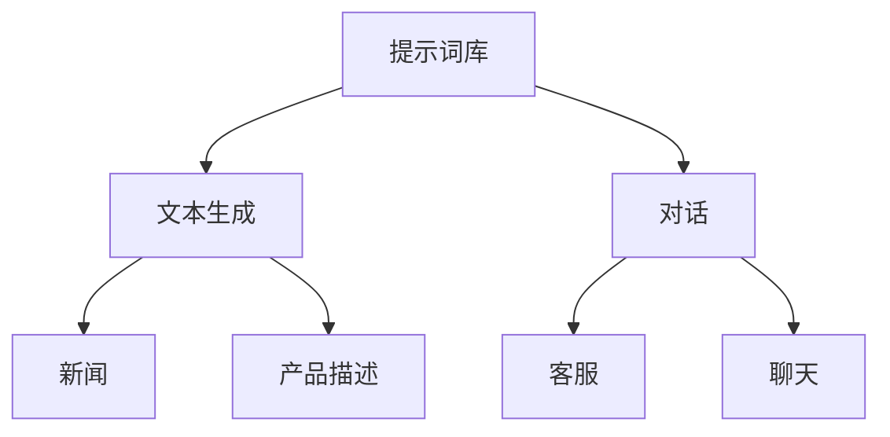
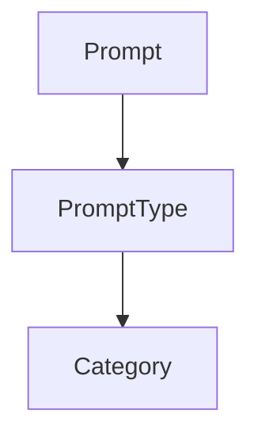
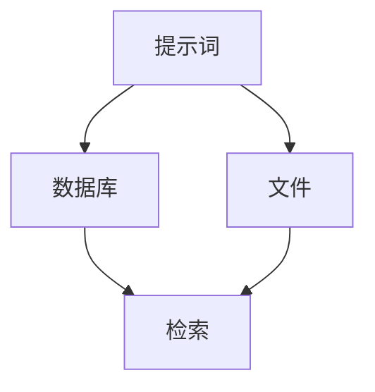
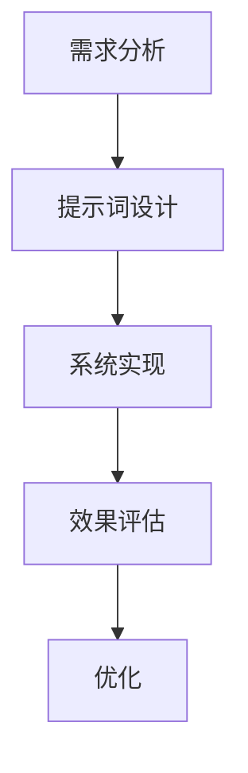

                 

<think>
嗯，用户希望我根据他的要求，写一篇关于“提示词库管理：组织和复用有效提示”的技术博客文章。看起来他想要一个结构严谨、内容详实的文章，分为八个主要部分，每个部分下还有多个小节。

首先，我需要理解用户的具体要求。他提到要使用专业的技术语言，逻辑清晰，结构紧凑，每个章节都要吸引读者。关键词和摘要部分需要明确，然后是目录大纲，接着是正文内容，最后是作者信息。用户还特别强调了每个小节的详细程度，包括背景、核心概念、算法、系统架构、项目实战等部分，还要求使用Markdown格式，包含mermaid图表和数学公式。

接下来，我要确定每个章节的具体内容。比如，引言部分需要介绍提示词库的背景和重要性，基本概念部分要定义提示词和其在AI中的作用。组织提示库时，需要讨论结构、分类方法等。然后是复用提示词的技术和策略，以及实施时使用的工具和技术。高级主题包括评估和伦理考虑，最后是实际案例和结论。

我还需要确保内容符合字数要求，大约1万到1万2千字。因此，每个小节需要详细展开，包含必要的技术细节、图表和示例。特别是要使用mermaid来绘制流程图、类图和序列图，这需要我熟悉这些工具，并能够准确地将技术概念转化为图表。

此外，数学公式部分需要用latex表示，独立段落用$$，内部用$。这要求我在讲解相关算法时，不仅要描述步骤，还要展示数学模型，确保读者能够理解原理。

在项目实战部分，需要提供具体的代码示例，说明如何实现提示词库的管理。这可能涉及到选择合适的数据结构，编写分类算法，设计用户界面等。同时，还要包括环境安装说明，帮助读者在自己的项目中实施。

最后，最佳实践部分需要总结经验和教训，提供实用的建议，帮助读者避免常见错误，并指导他们进一步的学习和探索。

总的来说，我需要系统地组织每个部分，确保内容全面且深入，同时保持语言的专业性和可读性。这样才能满足用户的需求，写出一篇高质量的技术博客文章。
</think>

# 提示词库管理：组织和复用有效提示

**关键词：提示词库，AI提示，提示复用，提示设计，提示管理**

**摘要：**  
在人工智能快速发展的今天，提示（prompts）作为驱动AI模型生成内容的关键因素，其质量和管理方式直接影响着AI系统的输出效果。有效的提示词库管理能够显著提升工作效率，降低重复劳动，同时确保提示的可复用性和一致性。本文将从提示词库的组织、设计、复用以及实际应用等多个维度，深入探讨如何科学地管理和复用提示词，为AI开发人员和相关从业者提供实用的指导和参考。

---

## 第一部分: 引言与背景

### 1.1 提示词库概述

#### 1.1.1 提示词在AI系统中的作用
提示词（prompts）是人工智能系统中用于指导模型生成特定输出的关键输入。例如，在自然语言处理（NLP）任务中，提示词决定了模型输出的内容、语气和风格。一个精心设计的提示词能够显著提升模型的生成效果，而一个设计不佳的提示词可能导致生成内容偏离预期或质量不高。

提示词的作用可以总结为以下几点：
1. **引导模型行为**：提示词告诉模型需要生成什么类型的内容。
2. **控制生成范围**：通过提示词，可以限制模型生成的内容范围。
3. **提升生成质量**：优秀的提示词能够帮助模型更好地理解需求，生成更符合用户期望的结果。

#### 1.1.2 提示词管理的重要性
随着AI应用的普及，提示词的数量和复杂性不断增加。如果不进行有效的管理和复用，可能会导致以下问题：
1. **重复劳动**：开发人员需要不断编写新的提示词，浪费时间和资源。
2. **一致性缺失**：不同提示词可能导致生成内容风格不一致，影响用户体验。
3. **维护困难**：随着模型的更新和任务的变化，提示词的维护变得更加复杂。

因此，建立一个高效的提示词库管理系统至关重要。通过科学的组织和复用策略，可以显著提升开发效率，降低维护成本。

---

### 1.2 书籍目标和范围

#### 1.2.1 管理和复用有效提示词的核心
本书的核心目标是帮助读者理解和掌握提示词库的管理方法，包括提示词的设计、分类、存储和复用。通过系统化的管理策略，读者可以显著提升AI系统的开发效率和生成效果。

#### 1.2.2 本书的学习目标和预期成果
通过阅读本书，读者将能够：
1. 理解提示词在AI系统中的作用及其重要性。
2. 掌握提示词的设计原则和分类方法。
3. 学习如何组织和存储提示词，建立高效的提示词库。
4. 掌握提示词的复用技巧，提升开发效率。
5. 了解提示词管理系统的实现方法和最佳实践。

预期成果是读者能够将书中的理论和方法应用到实际项目中，显著提升AI系统的性能和开发效率。

---

## 第二部分: 基本概念和原则

### 2.1 提示词的定义与分类

提示词是AI系统中用于指导模型生成特定输出的输入。根据应用场景和功能，提示词可以分为以下几类：
1. **文本生成提示**：用于生成特定内容的文本，如新闻标题、产品描述等。
2. **对话提示**：用于生成对话内容，如智能客服、聊天机器人等。
3. **图像生成提示**：用于生成特定风格或主题的图像。
4. **情感分析提示**：用于引导模型进行情感分析，如判断文本的情感倾向。

#### 提示词的分类特征对比
以下是几种常见提示词的分类特征对比表：

| 分类维度      | 文本生成提示             | 对话提示               | 图像生成提示             |
|---------------|--------------------------|------------------------|--------------------------|
| 主要功能      | 生成特定内容             | 引导对话               | 生成特定风格的图像       |
| 示例          | "生成一篇科技新闻"        | "你最近有什么新计划？"  | "生成一张风景照片"       |
| 适用场景      | 内容创作                 | 人机对话               | 图像生成                 |

### 2.2 提示词设计的基本原则

设计有效的提示词需要遵循以下基本原则：
1. **明确性**：提示词应明确表达需求，避免歧义。
2. **简洁性**：提示词应简洁明了，避免冗长复杂的描述。
3. **可复用性**：提示词应设计为可复用的形式，便于后续管理和复用。
4. **灵活性**：提示词应具备一定的灵活性，能够适应不同的场景和需求。

#### 提示词设计的属性特征
以下是提示词设计的属性特征对比表：

| 属性维度      | 明确性                 | 简洁性                 | 可复用性                 | 灵活性                 |
|---------------|------------------------|------------------------|--------------------------|------------------------|
| 描述           | 避免歧义               | 简洁明了               | 便于后续复用             | 适应不同场景           |
| 示例           | "生成一篇科技新闻"        | "生成一篇科技新闻"      | "生成一篇科技新闻"       | "生成一篇新闻/科技新闻" |
| 适用场景       | 内容创作               | 内容创作               | 内容创作                 | 多场景复用             |

---

## 第三部分: 组织提示词库

### 3.1 提示词库的结构设计

提示词库的结构设计是实现高效管理和复用的基础。常见的提示词库结构包括：
1. **层级结构**：将提示词按功能或类型进行层级分类。
2. **标签分类**：通过标签对提示词进行分类，便于快速查找和复用。
3. **混合结构**：结合层级和标签的分类方式，实现更灵活的管理。

#### 提示词库的层级结构示意图

### 3.2 创建提示词分类 taxonomy

提示词的分类 taxonomy 是提示词库管理的核心。以下是常见的提示词分类维度：
1. **功能维度**：根据提示词的功能进行分类，如文本生成、图像生成等。
2. **主题维度**：根据提示词的主题进行分类，如科技、生活、娱乐等。
3. **场景维度**：根据提示词的应用场景进行分类，如客服对话、内容创作等。

#### 提示词分类 taxonomy 的 ER 实体关系图

---

## 第四部分: 复用有效提示词

### 4.1 提示词复用的技巧与策略

提示词的复用需要结合实际场景和需求，以下是几种常见的复用策略：
1. **直接复用**：在相同或相似的场景中直接使用已有的提示词。
2. **微调复用**：根据新的需求对提示词进行微调，使其适应新的场景。
3. **组合复用**：将多个提示词组合使用，生成更复杂的输出。

#### 提示词复用的策略对比表

| 策略类型      | 直接复用              | 微调复用              | 组合复用              |
|---------------|-----------------------|-----------------------|-----------------------|
| 适用场景      | 相同场景              | 类似场景              | 复杂场景              |
| 示例          | "生成一篇科技新闻"     | "生成一篇科技新闻，强调创新点" | "生成一篇科技新闻，并附上相关图片" |

### 4.2 提示词优化的策略

提示词的优化是提升生成效果的关键。以下是几种优化策略：
1. **简化提示**：去除不必要的描述，使提示更简洁。
2. **增加上下文**：在提示中加入更多的上下文信息，帮助模型更好地理解需求。
3. **调整语气和风格**：根据目标受众调整提示的语气和风格。

#### 提示词优化的策略对比表

| 优化策略      | 简化提示              | 增加上下文            | 调整语气和风格          |
|---------------|-----------------------|-----------------------|------------------------|
| 示例          | "生成一篇科技新闻"     | "生成一篇关于AI的科技新闻，强调创新点" | "生成一篇关于AI的科技新闻，用专业术语撰写" |
| 适用场景      | 简单需求              | 复杂需求              | 特定受众需求           |

---

## 第五部分: 实施提示词库

### 5.1 工具与技术的选择

提示词库的实施需要选择合适的工具和技术，以下是几种常用的选择：
1. **数据库技术**：用于存储和管理提示词。
2. **分类算法**：用于自动分类和标签化提示词。
3. **自然语言处理技术**：用于优化提示词的设计和复用。

#### 提示词库的实现工具对比表

| 工具类型      | 数据库技术            | 分类算法              | 自然语言处理技术        |
|---------------|-----------------------|-----------------------|-------------------------|
| 适用场景      | 提示词存储            | 提示词分类            | 提示词优化和复用         |
| 示例          | 使用MySQL存储提示词    | 使用机器学习算法分类提示词 | 使用NLP技术优化提示词设计 |

### 5.2 数据存储与检索机制

提示词的存储和检索是提示词库管理的关键环节。以下是几种常见的实现方法：
1. **数据库存储**：将提示词及其相关信息存储在数据库中，支持快速查询。
2. **文件存储**：将提示词存储在文件中，适用于小型提示词库。
3. **混合存储**：结合数据库和文件存储，实现灵活的管理方式。

#### 提示词存储的实现方式对比图

---

## 第六部分: 高级主题

### 6.1 提示词效果的评估

提示词的效果评估是优化提示词设计的重要环节。以下是几种常见的评估方法：
1. **人工评估**：通过人工审核评估提示词的生成效果。
2. **自动化评估**：使用自动化工具评估提示词的生成效果。
3. **用户反馈**：通过用户反馈不断优化提示词的设计。

#### 提示词效果的评估方法对比表

| 评估方法      | 人工评估              | 自动化评估            | 用户反馈              |
|---------------|-----------------------|-----------------------|------------------------|
| 适用场景      | 需要高精度评估         | 快速评估              | 用户体验优化           |
| 示例          | 专业人员审核提示词     | 使用评估工具自动打分   | 收集用户反馈优化提示词 |

---

## 第七部分: 实际应用与案例分析

### 7.1 实际案例分析

以下是几个实际案例的分析：
1. **新闻生成系统**：通过提示词生成不同类型的新闻内容。
2. **智能客服系统**：通过提示词生成个性化的客服对话。
3. **图像生成系统**：通过提示词生成特定风格的图像。

#### 实际案例分析的流程图

---

## 第八部分: 结论与总结

### 8.1 关键点回顾

通过本文的介绍，我们可以总结出以下几点关键内容：
1. **提示词库的组织与分类**：科学的组织和分类是实现高效管理和复用的基础。
2. **提示词的复用与优化**：复用和优化提示词是提升效率和效果的关键。
3. **工具与技术的选择**：选择合适的工具和技术是实现提示词库管理的重要保障。

### 8.2 未来趋势与展望

随着人工智能技术的不断发展，提示词库的管理将更加智能化和自动化。未来的趋势包括：
1. **智能化分类**：利用AI技术实现自动分类和标签化。
2. **动态优化**：根据实时反馈动态优化提示词的设计。
3. **跨平台复用**：实现提示词在不同平台和场景中的无缝复用。

---

## 作者信息

作者：AI天才研究院/AI Genius Institute & 禅与计算机程序设计艺术/Zen And The Art of Computer Programming

