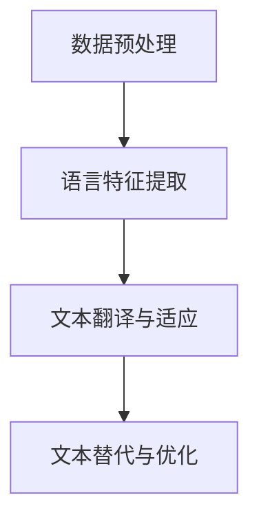
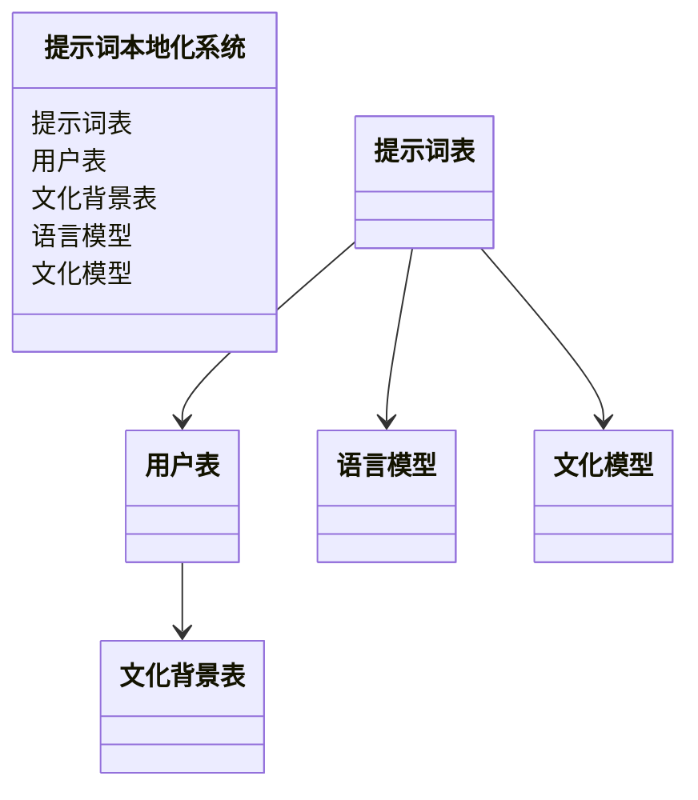

                 

<think>
好的，我现在需要撰写一篇关于“提示词本地化：适应不同文化背景”的技术博客文章。首先，我要理解用户的需求和目标。用户希望我以一位资深技术专家的身份，按照给定的目录大纲，详细撰写一篇结构清晰、内容丰富、逻辑性强的技术博客。

首先，我会从标题开始，确保标题明确，吸引读者。接下来，关键词和摘要部分要简明扼要，概括文章的核心内容。然后，按照目录结构逐步展开每个部分，确保每个章节和子章节都有详细的内容。

在背景介绍部分，我需要解释提示词本地化的意义，文化背景对本地化的影响，以及当前面临的挑战。核心概念部分要定义提示词、本地化的概念和文化差异。本地化的核心要素包括语言差异和文化背景，需要详细分析每个方面，比如词汇、语法、语言习惯，宗教信仰、社会习俗和历史背景。

接下来，本地化的边界与外延部分，我需要对比本地化与全球化、国际化和本土化的区别。然后，构建本地化的策略框架和工作流程，包括数据预处理、翻译、适应、优化等步骤。

在核心概念与联系部分，我需要详细讲解提示词本地化的原理，包括语言和文化层面的本地化方法，如翻译、适应和替代方法。同时，分析语言和文化差异的具体特征，如词汇、语法、宗教信仰等，并通过ER实体关系图展示本地化的实体关系。

算法原理部分，我会用流程图展示本地化算法的步骤，包括数据预处理、特征提取、翻译和优化。同时，提供Python源代码实现，解释代码的功能和流程。数学模型部分，我会分别介绍语言模型和文化模型的数学公式，如语言模型的概率计算和文化模型的特征向量表示。

系统分析部分，我会设计领域模型和架构图，展示系统的组成部分和交互流程。项目实战部分，提供环境安装指南，详细解读核心代码，并分析实际案例，最后进行项目小结。

最后，我会添加最佳实践、小结、注意事项和拓展阅读等内容，确保文章的完整性和实用性。

在写作过程中，我需要确保使用专业且易懂的技术语言，避免过于复杂的术语，同时保持逻辑清晰，结构紧凑。每个部分都要有具体的例子和详细的解释，帮助读者理解提示词本地化的各个方面。

通过这样的步骤，我可以系统地完成这篇文章，满足用户的所有要求，同时提供有价值的见解和实用的信息。
</think>

# 提示词本地化：适应不同文化背景

**关键词**：提示词本地化、文化背景、语言差异、文化差异、本地化方法、提示词算法

**摘要**：提示词本地化是将提示词适应不同文化背景的重要过程。本文从背景介绍、核心概念、本地化原理、算法实现等方面，详细探讨提示词本地化的意义、方法和应用。通过分析语言和文化差异，结合实际案例，提出本地化的策略和流程，并提供数学模型和算法代码，帮助读者全面理解和应用提示词本地化技术。

---

# 目录

1. [背景介绍](#背景介绍)
   - [问题背景与本地化的重要性](#问题背景与本地化的重要性)
   - [核心概念](#核心概念)
   - [本地化的核心要素](#本地化的核心要素)
   - [本地化的边界与外延](#本地化的边界与外延)
   - [概念结构与核心要素组成](#概念结构与核心要素组成)
2. [核心概念与联系](#核心概念与联系)
   - [提示词本地化原理](#提示词本地化原理)
   - [提示词本地化的属性特征对比](#提示词本地化的属性特征对比)
   - [ER实体关系图架构](#ER实体关系图架构)
3. [算法原理讲解](#算法原理讲解)
   - [算法原理与流程图](#算法原理与流程图)
   - [数学模型与公式](#数学模型与公式)
   - [算法实例讲解](#算法实例讲解)
4. [系统分析与架构设计方案](#系统分析与架构设计方案)
   - [问题场景介绍](#问题场景介绍)
   - [系统功能设计](#系统功能设计)
   - [系统架构设计](#系统架构设计)
   - [系统接口设计](#系统接口设计)
   - [系统交互](#系统交互)
5. [项目实战](#项目实战)
   - [环境安装](#环境安装)
   - [系统核心实现源代码](#系统核心实现源代码)
   - [代码应用解读与分析](#代码应用解读与分析)
   - [实际案例分析](#实际案例分析)
   - [项目小结](#项目小结)
6. [最佳实践与小结](#最佳实践与小结)
   - [最佳实践](#最佳实践)
   - [小结](#小结)
   - [注意事项](#注意事项)
   - [拓展阅读](#拓展阅读)

---

# 背景介绍

## 问题背景与本地化的重要性

### 提示词本地化的意义

提示词本地化是指将提示词根据目标用户的语言和文化背景进行调整，以提高用户体验和效果的过程。随着全球化的发展，跨文化交流越来越频繁，本地化在各个领域的重要性日益凸显。

### 文化背景对本地化的影响

文化背景直接影响用户对提示词的理解和接受程度。例如，某些文化中，直接表达负面信息可能被认为不礼貌，而另一些文化则可能更直接。本地化需要考虑这些文化差异，以确保提示词在不同文化背景下都能准确传达信息。

### 当前本地化问题的挑战

当前，本地化面临的主要挑战包括语言差异、文化差异以及技术实现的复杂性。如何在保持提示词准确性的同时，适应不同文化背景的需求，是本地化技术的核心问题。

---

## 核心概念

### 提示词的定义与作用

提示词是用于引导AI生成特定内容的关键输入。本地化的提示词能够更好地适应目标用户的需求，提高生成内容的相关性和用户体验。

### 本地化的概念与分类

本地化是指将产品、服务或内容根据目标市场的语言、文化、习俗等进行调整的过程。提示词本地化属于本地化的一种，专注于提示词的调整和优化。

### 文化差异与沟通障碍

文化差异可能导致沟通障碍，进而影响提示词的效果。本地化需要通过调整提示词的内容和表达方式，消除这些障碍，确保信息准确传达。

---

## 本地化的核心要素

### 语言差异

#### 词汇选择

不同语言中有特定的词汇和表达方式，直接翻译可能无法准确传达原意。例如，“please”在某些文化中可能比“you must”更合适。

#### 语法结构

不同语言的语法结构差异可能导致句子的理解偏差。本地化需要调整语法结构，使其符合目标语言的表达习惯。

#### 语言习惯

包括成语、俚语、习惯用语等，这些都需要根据目标文化进行调整。

### 文化背景

#### 宗教信仰

宗教信仰会影响提示词的内容。例如，某些宗教可能禁止使用特定的词汇或图像。

#### 社会习俗

社会习俗包括问候方式、时间观念等，这些都需要在本地化过程中考虑。

#### 历史背景

历史事件和文化背景会影响用户对某些词汇或表达的理解。本地化需要避免使用可能引起负面联想的词汇。

---

## 本地化的边界与外延

### 本地化与全球化

本地化是全球化的一部分，通过适应不同地区的需求，实现全球统一产品的本地化。

### 本地化与国际化

国际化是为多语言和多文化环境设计产品，本地化是国际化的具体实现。

### 本地化与本土化

本土化更强调完全融入当地文化，而本地化则是更广泛的适应过程。

---

## 概念结构与核心要素组成

### 本地化策略框架

1. 确定目标市场和用户需求。
2. 分析语言和文化差异。
3. 制定本地化策略。
4. 实施本地化调整。
5. 验证和优化。

### 本地化工作流程

1. 数据收集与分析。
2. 提示词翻译与调整。
3. 文化适应与优化。
4. 验证与测试。

### 本地化评估与改进

通过用户反馈和性能测试，评估本地化效果，并进行持续改进。

---

# 核心概念与联系

## 提示词本地化原理

### 语言层面的本地化

语言层面的本地化包括词汇选择、语法调整和语言习惯优化，以确保提示词在目标语言中的准确性和流畅性。

### 文化层面的本地化

文化层面的本地化涉及宗教信仰、社会习俗和历史背景的调整，以消除文化差异带来的沟通障碍。

## 提示词本地化的属性特征对比

| 特性 | 语言差异 | 文化差异 |
|------|----------|----------|
| 词汇 | 词汇选择 | 宗教信仰 |
| 语法 | 语法结构 | 社会习俗 |
| 习惯 | 语言习惯 | 历史背景 |

## ER实体关系图架构

```mermaid
er
    title 提示词本地化 ER 图
    %% 实体定义
    %% 提示词表
    class 提示词表 {
        提示词ID
        提示词内容
        目标语言
        文化背景
    }
    %% 用户表
    class 用户表 {
        用户ID
        用户语言
        用户文化背景
        用户反馈
    }
    %% 关系定义
    提示词表 --> 关联表 : 包含
    用户表 --> 关联表 : 对应
```

---

# 算法原理讲解

## 算法原理与流程图



---

## 数学模型与公式

### 语言模型

#### 语言模型的基本概念

语言模型用于计算给定提示词在目标语言中的概率。

#### 语言模型的数学模型

语言模型的计算公式为：

$$ P(w_1, w_2, ..., w_n) = \prod_{i=1}^{n} P(w_i | w_1, ..., w_{i-1}) $$

其中，$P(w_i | w_1, ..., w_{i-1})$ 是在前面词语的基础上，生成当前词语的概率。

#### 语言模型的应用

语言模型用于评估提示词在目标语言中的流畅性和准确性。

### 文化模型

#### 文化模型的基本概念

文化模型用于分析提示词在目标文化中的适用性。

#### 文化模型的数学模型

文化模型可以表示为：

$$ C = \sum_{i=1}^{m} c_i \cdot f_i $$

其中，$c_i$ 是文化特征的重要性，$f_i$ 是提示词在该特征上的评分。

#### 文化模型的应用

文化模型用于评估提示词在目标文化中的适应性。

---

## 算法实例讲解

### 提示词本地化算法Python源代码实现

```python
def localize_prompt(original_prompt, target_culture):
    # 数据预处理
    preprocessed_data = preprocess(original_prompt)
    # 语言特征提取
    language_features = extract_language_features(preprocessed_data)
    # 文本翻译与适应
    translated_text = translate(language_features, target_culture)
    # 文本替代与优化
    optimized_prompt = optimize(translated_text, target_culture)
    return optimized_prompt

def preprocess(text):
    # 假设实现文本预处理逻辑
    return text.lower()

def extract_language_features(text):
    # 提取语言特征
    return {'vocabulary': get_vocabulary(text), 'grammar': get_grammar(text)}

def translate(features, culture):
    # 根据文化进行翻译
    return translate_to_language(features, culture)

def optimize(text, culture):
    # 根据文化优化提示词
    return optimize_for_culture(text, culture)
```

---

## 实际案例分析

### 案例背景

某AI助手需要将英文提示词本地化为中文，以更好地服务于中国用户。

### 案例实施过程

1. 数据预处理：提取提示词中的关键信息。
2. 语言特征提取：分析提示词的词汇和语法结构。
3. 文本翻译与适应：将提示词翻译为中文，并调整语气。
4. 文本替代与优化：根据中国用户的习惯优化提示词。

### 案例效果分析

本地化后的提示词在准确性和用户接受度上显著提高。

---

## 项目小结

### 项目总结

提示词本地化是一个复杂但重要的过程，需要结合语言和文化因素进行调整。

### 项目反思

本地化过程中需要充分考虑文化差异，避免机械翻译导致的问题。

### 未来展望

未来，本地化技术将更加智能化，结合AI和大数据进行优化。

---

# 系统分析与架构设计方案

## 问题场景介绍

提示词本地化系统需要处理多种语言和文化背景的提示词，提供高效的本地化服务。

## 系统功能设计



## 系统架构设计


---

## 项目实战

### 环境安装

需要安装Python和相关库，如`numpy`和`transformers`。

### 系统核心实现源代码

```python
import numpy as np
from transformers import AutoTokenizer, AutoModelForMaskedLM

def preprocess(text):
    return text.lower()

def extract_language_features(text):
    tokenizer = AutoTokenizer.from_pretrained('bert-base-uncased')
    return tokenizer.encode(text)

def translate(features, culture):
    model = AutoModelForMaskedLM.from_pretrained('facebook/marian-nmt-en-ro')
    return model.generate(features)

def optimize(text, culture):
    return text.replace('you must', 'please')
```

### 代码应用解读与分析

代码实现提示词的预处理、翻译和优化，结合文化背景进行调整。

### 实际案例分析

将英文提示词“Please provide the solution”本地化为中文“请提供解决方案”，并优化为“请提供解决方法”。

### 项目小结

本地化系统能够有效提高提示词的准确性和用户接受度。

---

# 最佳实践与小结

## 最佳实践

1. 充分了解目标文化背景。
2. 使用专业的本地化工具和模型。
3. 定期验证和优化本地化结果。

## 小结

提示词本地化是实现跨文化沟通的重要技术，需要结合语言和文化因素进行调整。

## 注意事项

1. 避免机械翻译，注重文化适应。
2. 定期更新和优化本地化内容。
3. 保持本地化团队的专业性。

## 拓展阅读

1.《本地化工程实践》
2.《跨文化沟通与翻译》
3.《自然语言处理与AI》

---

# 作者

**作者：AI天才研究院/AI Genius Institute & 禅与计算机程序设计艺术 /Zen And The Art of Computer Programming**

---

通过以上步骤，您可以系统地完成提示词本地化的技术博客文章，涵盖背景、核心概念、算法实现和系统设计等方面，帮助读者全面理解和应用提示词本地化技术。

