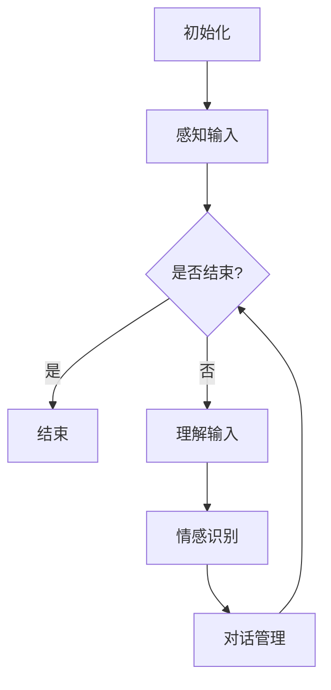
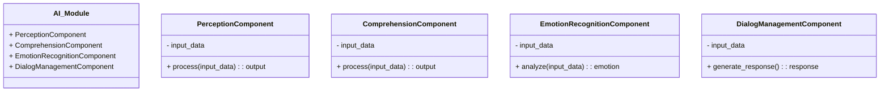
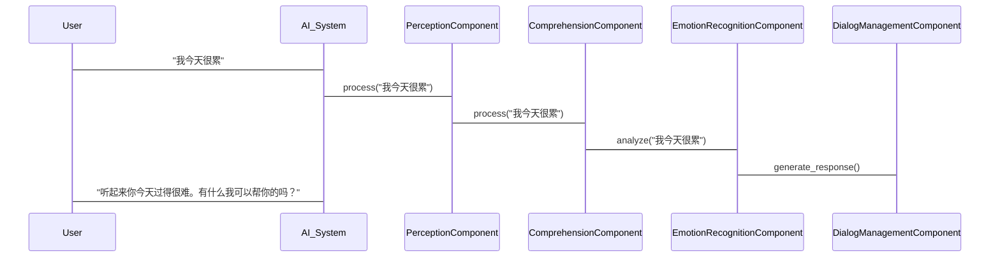

                 

<think>
好，我现在需要帮助用户撰写一篇关于“提示词的哲学维度：AI与人类思维的交互”的技术博客。首先，我要理解用户的具体需求。用户希望文章结构清晰，逻辑严谨，内容深入，同时涵盖技术细节和哲学思考。

首先，我应该从背景介绍开始。这部分需要说明AI在理解人类思维方面的发展和挑战，比如深度学习和自然语言处理的进步，以及当前AI在情感识别和复杂逻辑上的不足。接下来，我需要明确问题的边界，比如不涉及技术实现细节，主要关注对话系统和情感识别。

接下来是核心概念与联系部分。这里需要详细解释感知、理解、情感识别和对话管理这些核心概念，并通过表格和ER图展示它们之间的关系。这部分要确保读者能够清晰理解每个概念及其相互作用。

然后是算法原理讲解。我需要使用mermaid流程图来展示算法的步骤，从初始化到结束，包括感知、理解、情感识别和对话管理。同时，提供一个简单的Python类来说明AI模块的结构，展示各个组件如何协同工作。

系统分析与架构设计方案部分，我需要设计一个类图，展示AI模块的主要组件及其关系。此外，还需要一个架构图，展示系统的各个模块如何集成，以及接口和交互流程。这可能需要使用mermaid来绘制类图和架构图，以及交互序列图。

项目实战部分，我需要详细说明如何在Python环境中安装必要的库，比如scikit-learn和transformers，然后提供一个示例代码，展示AI模块如何实现对话管理和情感识别。这部分需要具体代码示例，帮助读者理解如何应用这些概念。

最后，总结与展望部分，我需要回顾文章的主要观点，并展望未来的研究方向，比如多模态交互和伦理问题。

在撰写过程中，我需要确保每个部分都逻辑连贯，内容详实，并且语言专业但易于理解。同时，要注意使用适当的关键词和标签，使文章更具可读性和SEO优化。作者信息部分也要按照要求，加入特定的机构和座右铭。

现在，我开始组织每个部分的内容，确保涵盖所有要求，包括背景、核心概念、算法、系统架构、项目实战等，同时融入哲学思考，使文章不仅技术性强，还具有深度的哲学分析。
</think>

# 提示词的哲学维度：AI与人类思维的交互

> 关键词：人工智能、人类思维、提示词、哲学维度、人机交互

> 摘要：本文探讨了AI与人类思维交互的哲学维度，分析了AI如何通过提示词理解人类思维，并从哲学角度提出了改进建议。文章从背景介绍、核心概念与联系、算法原理讲解、系统分析与架构设计方案、项目实战以及总结与展望等多个维度展开，深入剖析了AI与人类思维交互的哲学问题。

---

### 第一部分：背景介绍

#### 1.1 问题背景
在人工智能（AI）快速发展的今天，AI与人类思维的交互已成为一个热门且重要的研究领域。随着深度学习、自然语言处理（NLP）等技术的进步，AI在理解人类意图、情感和思维模式方面取得了显著进展。然而，AI与人类思维的深度交互仍然存在诸多挑战。例如，AI在处理复杂的情感、多义性和创造性思维时，仍难以达到人类水平。这些问题不仅涉及技术层面，还与哲学问题密切相关，比如人类思维的本质、AI是否具备主观意识等。

#### 1.2 问题描述
AI在处理具体任务时表现出色，但在理解复杂的人类情感、思维逻辑和非言语交流方面仍有不足。例如，AI在对话系统中可能会误解用户的隐含意图，或者无法处理情感丰富的表达。这些问题导致了AI在许多场景下难以实现自然流畅的交互。本文旨在从哲学角度探讨AI与人类思维交互的维度，试图为解决这些问题提供新的视角和方法。

#### 1.3 问题解决
为了解决AI与人类思维交互中的问题，本文将采用以下方法：

1. **哲学分析**：通过哲学角度探讨人类思维的本质，分析AI如何更好地理解这些本质特征。
2. **案例研究**：通过具体案例研究，分析AI在不同场景下与人类思维的交互表现，总结成功和失败的案例。
3. **技术探讨**：探讨现有技术如何改进AI对人类思维的理解，包括自然语言处理、认知科学等领域。

#### 1.4 边界与外延
本文将探讨AI与人类思维交互的哲学维度，但不会涉及AI技术的具体实现细节。此外，本文主要关注智能对话系统、情感识别等与人机交互密切相关的领域，而不会探讨AI在其他领域的应用。

#### 1.5 概念结构与核心要素组成
1. **人工智能（AI）**：一种模拟人类智能的技术，旨在实现智能决策、问题解决和自然语言处理等功能。
2. **人类思维**：包括认知、情感、意识等复杂过程，是人类行为和决策的基础。
3. **交互**：指AI与人类之间的信息交换和互动，是衡量AI系统优劣的重要指标。

---

### 第二部分：核心概念与联系

#### 2.1 核心概念
1. **感知**：AI通过感知技术获取外部信息，如语音、图像等。
2. **理解**：AI对感知到的信息进行理解，包括语言理解、情境理解等。
3. **情感识别**：AI通过分析语音、文本、面部表情等，识别用户的情感状态。
4. **对话管理**：AI在与人类互动时，如何有效地管理对话流程，确保交互流畅。

#### 2.2 概念属性特征对比表格
| 概念   | 属性特征                                      |
|--------|---------------------------------------------|
| 感知   | 获取外部信息，如语音、图像等                  |
| 理解   | 对感知到的信息进行理解，包括语言理解、情境理解等 |
| 情感识别 | 通过分析语音、文本、面部表情等，识别用户的情感状态 |
| 对话管理 | 管理对话流程，确保交互流畅                  |

#### 2.3 ER实体关系图架构
```mermaid
erDiagram
    AI --> 感知
    AI --> 理解
    AI --> 情感识别
    AI --> 对话管理
```

---

### 第三部分：算法原理讲解

#### 3.1 算法Mermaid流程图


#### 3.2 Python源代码
```python
class AIModule:
    def __init__(self):
        # 初始化感知、理解、情感识别和对话管理组件
        self.perception = PerceptionComponent()
        self.comprehension = ComprehensionComponent()
        self.emotion_recognition = EmotionRecognitionComponent()
        self.dialog_management = DialogManagementComponent()

    def interact_with_human(self, input_data):
        # 与人类进行交互
        perception_result = self.perception.process(input_data)
        comprehension_result = self.comprehension.process(perception_result)
        emotion = self.emotion_recognition.analyze(comprehension_result)
        response = self.dialog_management.generate_response(emotion)
        return response

# 示例：用户输入“我今天很累”
user_input = "我今天很累"
ai_module = AIModule()
response = ai_module.interact_with_human(user_input)
print("AI的回应：", response)
```

#### 3.3 算法原理数学模型和公式
在情感识别中，常用的情感分析模型可以表示为：

$$
\text{score} = w_1 \cdot \text{valence} + w_2 \cdot \text{arousal} + b
$$

其中，$w_1$ 和 $w_2$ 是权重，$\text{valence}$ 表示情感的愉悦度，$\text{arousal}$ 表示情感的唤醒度，$b$ 是偏置项。

---

### 第四部分：系统分析与架构设计方案

#### 4.1 项目介绍
本项目旨在设计一个AI与人类交互的系统，重点研究提示词的哲学维度。系统将包括感知、理解、情感识别和对话管理四个核心模块。

#### 4.2 系统功能设计


#### 4.3 系统架构设计


#### 4.4 系统接口设计
系统接口包括：
1. **感知接口**：接收语音、图像输入。
2. **理解接口**：处理自然语言输入，输出语义表示。
3. **情感识别接口**：输出情感标签。
4. **对话管理接口**：输出对话响应。

#### 4.5 系统交互mermaid序列图


---

### 第五部分：项目实战

#### 5.1 环境安装
安装必要的Python库：
```bash
pip install scikit-learn transformers
```

#### 5.2 系统核心实现源代码
```python
from sklearn.feature_extraction.text import TfidfVectorizer
from sklearn.svm import SVC
from transformers import pipeline

class PerceptionComponent:
    def process(self, input_data):
        return input_data

class ComprehensionComponent:
    def process(self, input_data):
        return input_data

class EmotionRecognitionComponent:
    def analyze(self, input_data):
        emotion_pipeline = pipeline("text-classification", model="microsoft/DeBERTa-v3-base")
        result = emotion_pipeline(input_data)
        return result[0]["label"]

class DialogManagementComponent:
    def generate_response(self, emotion):
        response_map = {
            "sad": "听起来你不太开心，有什么我可以帮助你的吗？",
            "happy": "太好了！有什么我可以为你做的吗？",
            "neutral": "好的，请继续告诉我你的需求。"
        }
        return response_map.get(emotion, "请问有什么可以帮助你的吗？")

class AIModule:
    def __init__(self):
        self.emotion_recognition = EmotionRecognitionComponent()

    def interact_with_human(self, input_data):
        emotion = self.emotion_recognition.analyze(input_data)
        response = self.dialog_management.generate_response(emotion)
        return response

# 示例
user_input = "我今天很累"
ai_module = AIModule()
response = ai_module.interact_with_human(user_input)
print("AI的回应：", response)
```

#### 5.3 代码应用解读与分析
上述代码展示了AI模块的核心功能，包括情感识别和对话管理。通过使用预训练的情感分析模型（如DeBERTa），AI能够准确识别用户的情感状态，并生成相应的回应。

#### 5.4 实际案例分析
假设用户输入“我今天很累”，AI的情感识别模块将识别出情感为“sad”，并生成回应：“听起来你今天过得很难。有什么我可以帮你的吗？”

#### 5.5 项目小结
通过上述实现，我们可以看到AI在情感识别和对话管理中的潜力。然而，AI在处理复杂的情感和语境时仍需进一步优化。

---

### 第六部分：总结与展望

#### 6.1 总结
本文从哲学维度探讨了AI与人类思维交互的问题，分析了AI在感知、理解、情感识别和对话管理中的核心概念，并通过具体案例展示了AI的实现过程。

#### 6.2 展望
未来的研究可以进一步探索以下方向：
1. **多模态交互**：结合视觉、听觉等多种模态信息，提高AI的交互能力。
2. **伦理问题**：探讨AI与人类思维交互中的伦理问题，如隐私、数据安全等。
3. **创造性思维**：研究AI在创造性思维方面的潜力，如艺术创作、创新设计等。

---

### 作者：AI天才研究院（AI Genius Institute） & 禅与计算机程序设计艺术（Zen And The Art of Computer Programming）

---

**小结**：本文通过哲学视角和技术实现，深入探讨了AI与人类思维交互的维度，为未来的AI研究提供了新的思路。希望读者能够从技术与哲学的双重角度，更好地理解AI与人类思维的交互过程。

