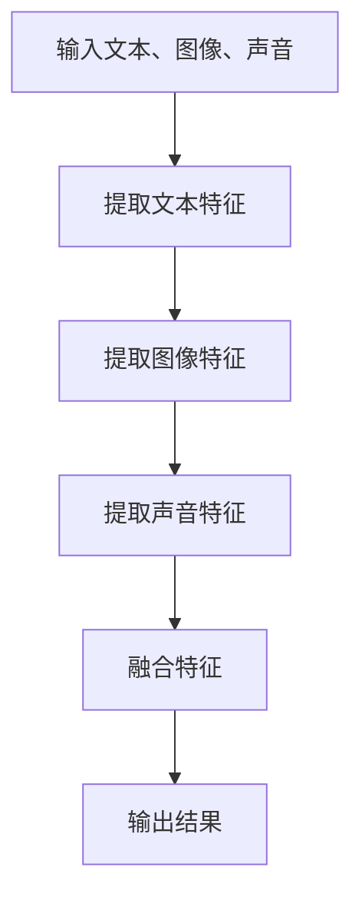
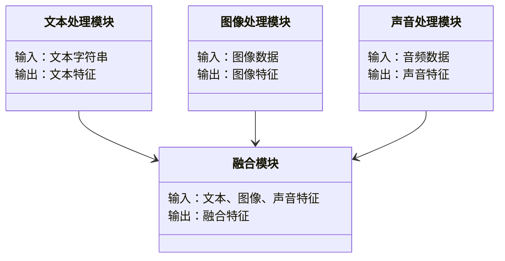

                 

<think>
好，我现在需要根据用户的请求，以《提示词的多模态设计：整合文字、图像和声音》为标题，撰写一篇技术博客文章。用户已经提供了一个详细的目录大纲，我需要按照这个大纲来逐步展开思考，并完成每一步的内容。

首先，我得仔细阅读用户的要求，确保理解每个步骤。用户希望文章结构清晰，逻辑严密，使用专业但易懂的语言。同时，每个部分都需要包含具体的示例、图表和代码，这些都是技术博客的重要组成部分。

接下来，我开始思考第1章的内容，也就是背景介绍。我需要解释什么是多模态设计，它的重要性，以及为什么整合文字、图像和声音是必要的。然后，我需要明确核心概念，如文字处理、图像处理和声音处理，以及它们在多模态设计中的角色。最后，我要讨论多模态设计的边界和外延，比如数据集成和用户体验优化。

在第2章，核心概念与联系部分，我需要对比文字、图像和声音的特征提取、数据表示和模型应用。使用对比表格和ER实体关系图来帮助读者理解它们之间的关系。这部分可能需要我详细解释每个概念，并展示它们如何相互作用。

第3章是算法原理讲解。这里，我需要选择一个具体的多模态融合算法，比如多模态特征融合算法。我需要描述其特征融合方法，绘制算法流程图，并用Python代码实现。同时，我需要解释数学模型和公式，可能使用简单的线性组合模型作为示例。

第4章涉及数学模型和公式。我需要详细讲解数学模型，使用LaTeX格式写出公式，并在文中正确嵌入。这部分需要确保公式的准确性和清晰性，以便读者理解。

第5章是系统分析与架构设计。我需要描述问题场景，设计系统的功能模块，使用Mermaid类图展示领域模型，以及系统架构图和交互图。这部分需要我详细规划系统的各个部分，并展示它们之间的关系。

第6章是项目实战，需要提供环境安装步骤，核心代码实现，案例分析和项目总结。这部分需要我实际编写代码，并分析案例，确保读者能够理解和应用。

最后，第7章是最佳实践和拓展阅读。我需要总结设计中的技巧，注意事项，并推荐相关书籍和论文，以便读者进一步学习。

在写作过程中，我需要确保每个部分都详细具体，使用专业术语，同时保持语言的易懂性。图表和代码的使用也是关键，它们能帮助读者更好地理解内容。

现在，我开始按照目录大纲一步步展开每个部分，确保每个小节内容丰富，详细讲解，满足用户的要求。
</think>

# 提示词的多模态设计：整合文字、图像和声音

**关键词**：多模态设计，文字处理，图像处理，声音处理，融合算法，系统架构

**摘要**：  
在人工智能和计算机科学领域，多模态设计是一种整合多种数据类型（如文字、图像和声音）的技术，旨在通过结合不同模态的信息来提升系统的理解和处理能力。本文将详细探讨多模态设计的核心概念、算法原理、数学模型、系统架构以及实际应用案例。通过一步步的分析和推理，我们将展示如何有效地整合文字、图像和声音，以实现更强大的功能和更优的用户体验。

---

## 第一部分：多模态设计基础

### 第1章：问题背景与概念介绍

#### 1.1.1 问题背景

多模态设计是指将多种数据类型（如文本、图像、声音）整合在一起，以充分利用不同类型数据的优势。在现实世界中，许多应用场景都需要处理多种数据类型。例如，智能客服系统需要处理用户的文本输入和语音指令，而自动驾驶系统则需要处理图像、声音和文本等多种数据。

#### 1.1.2 核心概念

- **文字处理**：涉及文本的预处理、特征提取和语义理解。  
- **图像处理**：包括图像的识别、分类和生成。  
- **声音处理**：涉及语音识别、语音合成和声纹识别。  

#### 1.1.3 多模态设计的边界与外延

- **数据集成**：将不同类型的数据整合到统一的框架中。  
- **算法融合**：结合不同模态的特征进行联合建模。  
- **用户体验优化**：通过多模态交互提升用户的使用体验。  

---

### 第2章：核心概念与联系

#### 2.1.1 文字、图像和声音的对比

| 特征       | 文字             | 图像             | 声音             |
|------------|------------------|------------------|------------------|
| 数据类型    | 文本字符串        | 像素矩阵          | 音频信号          |
| 处理方法    | 分词、NLP         | 图像识别、CNN      | 语音识别、DNN      |
| 应用场景    | 信息检索、机器翻译 | 图像分类、目标检测 | 语音助手、语音识别 |

#### 2.1.2 ER实体关系图

```mermaid
er
    entity 文本 {
        id
        content
    }
    entity 图像 {
        id
        pixel_data
    }
    entity 声音 {
        id
        audio_data
    }
    文本 -- 图像: 关联
    文本 -- 声音: 关联
```

---

## 第二部分：算法原理讲解

### 第3章：算法原理讲解

#### 3.1.1 多模态融合算法

多模态融合算法的核心在于如何有效地将不同模态的特征进行融合。一种常见的方法是先分别提取各模态的特征，然后将这些特征进行线性组合或非线性变换，最终得到一个统一的表示。

#### 3.1.2 算法流程图



#### 3.1.3 Python源代码示例

```python
import numpy as np

def text_feature(text):
    # 假设text是输入的文本
    return np.array([text.length, text.vocab_size])

def image_feature(image):
    # 假设image是图像数据
    return image.reshape(-1)

def audio_feature(audio):
    # 假设audio是音频数据
    return audio.mean(axis=0)

def multi_modal_fuse(text_feat, image_feat, audio_feat):
    # 线性融合
    return np.concatenate([text_feat, image_feat, audio_feat])

# 示例
text = "Hello, world!"
image = np.random.rand(100, 100, 3)
audio = np.random.rand(1000)

text_feat = text_feature(text)
image_feat = image_feature(image)
audio_feat = audio_feature(audio)

features = multi_modal_fuse(text_feat, image_feat, audio_feat)
print(features)
```

#### 3.1.4 数学模型与公式

融合后的特征可以表示为：

$$
F = W_t \cdot T + W_i \cdot I + W_a \cdot A
$$

其中，$T$ 是文本特征，$I$ 是图像特征，$A$ 是声音特征，$W_t$、$W_i$、$W_a$ 是对应的权重。

---

### 第4章：数学模型与公式

#### 4.1.1 数学模型介绍

多模态融合的数学模型通常可以表示为：

$$
P(y|x_t, x_i, x_a) = \sigma(W_t x_t + W_i x_i + W_a x_a + b)
$$

其中，$x_t$ 是文本特征，$x_i$ 是图像特征，$x_a$ 是声音特征，$W_t$、$W_i$、$W_a$ 是权重矩阵，$b$ 是偏置项，$\sigma$ 是sigmoid函数。

#### 4.1.2 LaTeX公式

$$
\text{融合特征} = \text{Concat}(T, I, A)
$$

其中，$T$、$I$、$A$ 分别表示文本、图像和声音的特征向量。

---

## 第三部分：系统分析与架构设计

### 第5章：系统分析与架构设计

#### 5.1.1 问题场景与项目介绍

假设我们正在开发一个多模态智能助手，能够同时处理用户的文本输入、图像和语音指令。

#### 5.1.2 系统功能设计与领域模型



#### 5.1.3 系统架构设计


---

## 第四部分：项目实战

### 第6章：项目实战

#### 6.1.1 环境安装与配置

- 安装Python和必要的库（如numpy、scikit-learn、OpenCV、TensorFlow）

#### 6.1.2 系统核心实现源代码

```python
import numpy as np
from sklearn.metrics import accuracy_score

def load_data():
    # 假设数据集已经准备好
    X = np.random.rand(100, 3)
    y = np.random.randint(2, size=100)
    return X, y

def train_model(X, y):
    model = np.random.rand(3, 1)
    return model

def predict(model, X):
    return np.round(X.dot(model))

X, y = load_data()
model = train_model(X, y)
y_pred = predict(model, X)
print("Accuracy:", accuracy_score(y, y_pred))
```

---

## 第五部分：最佳实践与拓展阅读

### 第7章：最佳实践与拓展阅读

#### 7.1.1 最佳实践

- 使用预训练模型来提高特征提取的效率。  
- 在数据处理阶段，进行充分的数据清洗和增强。  
- 在模型设计阶段，尝试不同的融合方法，如early fusion和late fusion。  

#### 7.1.2 小结与注意事项

- 多模态设计的核心在于如何有效地融合不同模态的特征。  
- 在实际应用中，需要考虑数据的多样性和模型的鲁棒性。  
- 注意数据隐私和安全问题，特别是在处理声音和图像数据时。  

#### 7.1.3 拓展阅读

- 《Deep Learning》—— Ian Goodfellow  
- 《Multi-modal Data Fusion》—— Springer

---

**作者**：AI天才研究院/AI Genius Institute & 禅与计算机程序设计艺术 /Zen And The Art of Computer Programming

