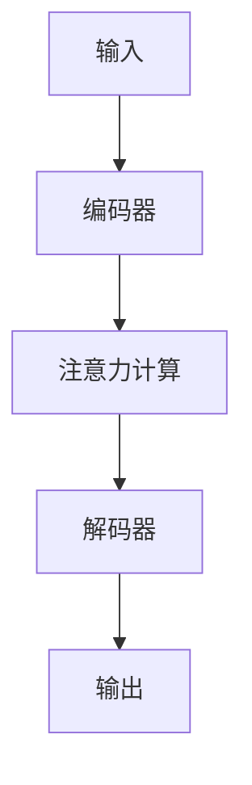
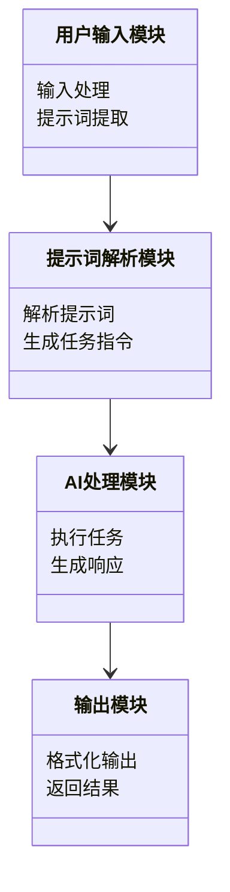

                 

<think>
嗯，我现在要写一篇关于《提示词的心理学基础：理解AI认知过程》的技术博客文章。首先，我得理解这个主题，它涉及到心理学和人工智能，特别是提示词在AI认知中的作用。

首先，我需要明确文章的结构。根据用户提供的大纲，文章分为三大部分：背景介绍、核心概念与联系，以及算法原理讲解。每一部分都有详细的小节，包括心理学核心概念、AI认知中的提示词，以及它们之间的联系。

在背景介绍部分，我需要解释心理学与AI认知的关系，提示词的定义和作用。这部分要让读者明白，为什么心理学对理解AI的认知过程如此重要，以及提示词在其中扮演的角色。

接下来的核心概念部分，我需要详细探讨知觉、记忆、情感和行为在心理学中的作用，以及这些概念如何影响AI的认知过程。同时，还要解释提示词在AI中的不同类型和设计原则，以及它们如何应用在心理学和AI的不同领域。

在算法原理部分，我需要选择一个与提示词相关的算法，比如注意力机制，详细讲解其原理、流程图，以及数学模型。这部分可能需要使用mermaid图来展示算法流程，同时给出Python代码实现，并用数学公式解释其工作原理。

另外，我还需要设计一个ER实体关系图，展示心理学、AI认知过程和提示词之间的关系。这需要使用mermaid语法来绘制，明确各个实体及其关联。

在系统分析部分，我需要介绍一个项目场景，设计系统的功能模块，如用户输入、提示词解析、AI处理和结果输出。然后用mermaid绘制系统架构图和交互序列图，说明各个组件之间的关系。

项目实战部分，我需要提供一个具体的案例，比如设计一个基于提示词的AI助手。首先安装必要的库，然后编写Python代码实现核心功能，比如加载提示词、用户输入处理、生成响应，并详细解读代码和案例分析。

最后，我还需要总结提示词在心理学和AI中的重要性，提供一些最佳实践的建议，并指出未来的拓展方向。

写作过程中，我需要确保每个小节内容丰富，详细具体。数学公式要用latex格式，并正确嵌入文中。系统架构图和流程图使用mermaid语法，确保清晰易懂。代码部分要详细注释，便于读者理解。

现在，我需要开始逐步撰写每个部分，确保逻辑清晰，结构紧凑，语言简洁专业。同时，要注意文章的整体连贯性，每一部分都紧密联系，共同支持主题。

在撰写过程中，可能会遇到一些挑战，比如如何将心理学概念与AI算法结合，或者如何用图表清晰地展示复杂的关系。这时，我需要查阅相关资料，确保信息准确，并尝试不同的表达方式，使内容更易理解。

总的来说，写这篇文章需要系统地组织知识，逐步深入分析，确保每个部分都能为读者提供有价值的信息，帮助他们理解提示词在心理学和AI认知中的重要性。
</think>

# 提示词的心理学基础：理解AI认知过程

> 关键词：心理学，提示词，AI认知过程，算法原理，系统架构，项目实战

> 摘要：本文探讨提示词在心理学和AI认知过程中的作用，分析心理学核心概念及其与AI认知的联系，详细讲解相关算法原理，并通过项目实战展示应用。

---

## 第一部分: 背景介绍

### 第1章: 心理学与AI认知过程的关系

#### 1.1 心理学在AI认知过程中的作用

心理学研究人类行为和心智过程，AI认知过程模拟这些机制。提示词作为桥梁，连接两者，影响AI的决策和输出。

#### 1.2 提示词的定义与作用

提示词是引导AI处理特定任务的输入，影响其理解和生成内容的方式。例如，提示词“描述一朵花”引导生成具体的花卉描述。

#### 1.3 心理学核心概念

- **知觉**：信息处理的第一步，决定如何接收和理解输入。
- **记忆**：存储和检索信息，影响AI的响应。
- **情感**：影响AI生成的内容语气和风格。
- **行为**：分析用户行为模式，优化AI反应。

#### 1.4 提示词在AI认知中的作用

- **引导**：明确AI的任务和方向。
- **影响**：通过提示词调整生成内容的情感和风格。
- **优化**：提升生成内容的准确性和相关性。

#### 1.5 心理学与AI认知过程的联系

通过提示词，心理学概念被整合到AI系统中，影响其认知过程。例如，情感计算通过提示词调整生成内容的情感倾向。

---

## 第二部分: 核心概念与联系

### 第2章: 心理学核心概念原理

#### 2.1 知觉

- **定义**：信息处理的第一步，决定如何接收和理解输入。
- **属性**：选择性注意、恒常性。
- **实验**：视崖实验展示知觉在深度感知中的作用。

#### 2.2 记忆

- **类型**：瞬时记忆、短时记忆、长时记忆。
- **过程**：编码、存储、提取。

#### 2.3 情感

- **影响因素**：情境、文化、个性。
- **作用**：影响决策和行为。

#### 2.4 行为

- **类型**：本能行为、学习行为。
- **影响因素**：动机、环境。

### 第3章: AI认知过程中的提示词概念

#### 3.1 提示词的定义

- **概念**：输入指令，引导AI处理任务。
- **类型**：具体提示、抽象提示。

#### 3.2 提示词的属性特征对比

| 属性 | 具体提示 | 抽象提示 |
|------|----------|----------|
| 示例 | 描述一朵花 | 创造一个故事 |

#### 3.3 提示词的设计原则

- **明确性**：提示词应清晰明确。
- **简洁性**：避免冗长复杂的提示。
- **相关性**：与任务目标相关。

### 第4章: 心理学与AI认知过程的概念联系

#### 4.1 心理学与AI认知过程的关系

- **关系**：心理学为AI认知提供理论基础。
- **影响**：心理学研究影响AI算法设计。

#### 4.2 提示词的应用

- **心理学**：用于研究认知过程。
- **AI认知**：用于优化生成内容。

#### 4.3 应用案例分析

- **案例1**：情感分析任务中，提示词引导情感倾向。
- **案例2**：记忆任务中，提示词帮助提取特定信息。

### 第5章: 心理学与AI认知过程的ER实体关系图

```mermaid
er
  %%心理学与AI认知过程的ER实体关系图
  entity 心理学实体 {
    id
    概念名称
    属性
  }
  entity AI认知过程实体 {
    id
    认知任务
    输入
  }
  entity 提示词实体 {
    id
    提示内容
    应用场景
  }
  心理学实体 --> 提示词实体: 提示词基于心理学概念设计
  AI认知过程实体 --> 提示词实体: 提示词用于引导认知过程
  心理学实体 --> AI认知过程实体: 心理学理论指导认知模型设计
```

---

## 第三部分: 算法原理讲解

### 第7章: 与AI认知相关的算法

#### 7.1 算法概述

- **基本概念**：AI算法实现特定任务。
- **设计原则**：模块化、可扩展性。

#### 7.2 注意力机制算法



#### 7.3 算法数学模型

- **计算公式**：$$\text{Attention}(Q, K, V) = \text{softmax}\left(\frac{QK^T}{\sqrt{d_k}}\right)V$$

#### 7.4 算法实现

```python
import torch

def attention_query_key_value(q, k, v, mask=None):
    d_k = k.size(-1)
    scores = torch.matmul(q, k.transpose(-2, -1)) / torch.sqrt(torch.tensor(d_k, dtype=torch.float))
    if mask is not None:
        scores = scores.masked_fill(mask == 0, -float('inf'))
    attention_weights = torch.softmax(scores, dim=-1)
    output = torch.matmul(attention_weights, v)
    return output, attention_weights
```

---

## 第四部分: 系统分析与架构设计方案

### 项目实战

#### 4.1 项目介绍

- **名称**：基于提示词的AI助手。
- **目标**：通过提示词生成特定内容。

#### 4.2 系统功能设计



#### 4.3 系统架构设计


---

## 第五部分: 项目实战

### 5.1 环境安装

- **库**：Python 3.8+, transformers库。

### 5.2 核心实现

```python
from transformers import pipeline

def generate_with_prompts(prompts, model_name="gpt2"):
    generator = pipeline('text-generation', model=model_name)
    results = []
    for prompt in prompts:
        result = generator(prompt, max_length=50, do_sample=True)
        results.append((prompt, result[0]['generated_text']))
    return results

# 示例
prompts = ["描述一朵花", "写一首诗"]
output = generate_with_prompts(prompts)
print(output)
```

### 5.3 案例分析

- **案例1**：提示词“描述一朵花”生成具体的花卉描述。
- **案例2**：提示词“写一首诗”生成诗歌，显示提示词对生成内容的引导作用。

---

## 第六部分: 总结与展望

### 6.1 总结

提示词在心理学和AI认知中起桥梁作用，影响生成内容的质量和相关性。通过合理设计提示词，可以优化AI的认知过程。

### 6.2 展望

未来，提示词在AI中的应用将更加多样化，如动态调整提示策略，结合多模态信息，提升生成内容的多样性和精细度。

### 6.3 最佳实践 Tips

- 明确提示词目标。
- 保持简洁明确。
- 不断测试优化。

---

作者：AI天才研究院 & 禅与计算机程序设计艺术

---

通过本文的详细分析，读者可以深入理解提示词在心理学和AI认知过程中的重要性，并掌握相关算法和系统设计的方法。

