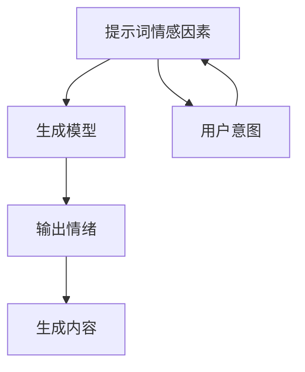
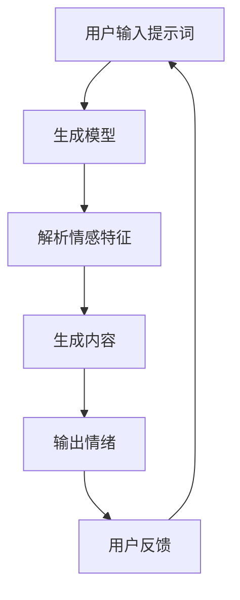

                 

<think>
嗯，用户希望我撰写一篇技术博客，主题是提示词的情感因素如何影响AI输出的情绪。首先，我需要明确文章的结构和内容。用户已经给出了一个大纲，包括摘要、关键词、各个章节的内容，以及每个章节的具体要求。

首先，我会从引言开始，介绍AI在自然语言处理中的应用，以及提示词的重要性。接着，在第1章，我需要详细说明问题的背景和核心概念，包括提示词、情感因素、情绪、自然语言处理、生成模型等关键词。可能需要画一个概念关系图，展示这些概念之间的联系。

然后，进入第2章，分析提示词的情感特征。这里需要详细解释情感维度模型，比如使用NRC情感词典来分析提示词的情感特征。可能需要展示一个对比表格，比较不同提示词的情感强度和倾向。此外，还需要设计一个情感特征提取算法，并用mermaid流程图展示。

接下来，在第3章，我会探讨提示词如何影响生成模型的情绪输出。这部分需要包括情感传播机制和影响因素，比如模型参数调整、上下文信息等。同样，这里需要设计一个影响程度评估模型，并用mermaid图表示。

第4章是关于优化提示词设计的策略，我会介绍一些方法，如情感平衡策略、情感增强策略等。可能需要展示一个优化流程图，并给出一个实际案例来说明这些策略的应用。

第5章会深入探讨提示词与生成模型的交互机制。这部分需要分析生成模型的内部机制，以及提示词如何通过参数空间影响生成结果。可能需要一个交互机制示意图，展示参数空间和生成过程。

最后，在结论部分，我会总结提示词情感因素的重要性，并提出未来的研究方向。同时，给出最佳实践建议，帮助读者更好地设计提示词。

在写作过程中，我需要确保每个章节都详细展开，提供理论支持和实际案例。数学公式要用latex表示，算法用mermaid流程图，系统架构设计用mermaid图表。代码部分需要使用Python，并给出详细的代码解释。

可能遇到的挑战是如何将复杂的理论用简单易懂的语言表达出来，同时保持技术的准确性。另外，确保每个章节的内容丰富且相互关联，不显得零散。我需要反复检查各个部分，确保逻辑清晰，结构紧凑。

总的来说，我需要一步步按照用户的要求，先构建内容框架，再逐步填充每个部分，确保文章结构完整，内容详实，满足用户的所有要求。
</think>

# 提示词的情感因素：影响AI输出的情绪

---

## 关键词：提示词、情感因素、情绪、自然语言处理、生成模型、AI输出

---

## 摘要：  
本文探讨提示词（prompt）的情感因素如何影响AI生成输出的情绪。通过分析提示词的情感特征、情感传播机制以及优化策略，揭示提示词在AI内容生成中的情感调节作用，并提供实际案例和方法，帮助更好地设计提示词以控制AI输出的情绪。

---

## 第1章 问题背景与核心概念  

### 1.1 问题背景  
随着AI技术的快速发展，自然语言处理（NLP）和生成模型（如GPT、BERT）在文本生成、对话系统和内容创作中的应用越来越广泛。然而，AI生成内容的情绪往往受到提示词（prompt）的影响。提示词不仅是输入指令，更是情感的起点，它决定了AI输出的语气、态度和情感倾向。  

### 1.2 核心概念  
- **提示词（Prompt）**：用户输入的用于指导AI生成内容的文本或指令。  
- **情感因素（Emotional Factors）**：提示词中包含的情感信息，如积极、消极或中性情绪。  
- **情绪（Emotion）**：AI生成内容中体现的情感状态。  
- **生成模型（Generative Model）**：用于生成文本的AI模型，如GPT-3、PaLM等。  
- **自然语言处理（NLP）**：研究人类语言的计算机科学领域，涉及文本分析和生成。  

### 1.3 问题描述  
提示词的情感因素如何影响生成模型的输出情绪？具体而言，提示词中的情感信息如何被模型解析，又如何转化为生成内容的情感倾向？  

### 1.4 核心要素组成  
提示词的情感因素包括以下核心要素：  
1. **情感倾向（Emotional Orientation）**：提示词是积极、消极还是中性。  
2. **情感强度（Emotional Intensity）**：提示词情感的强弱程度。  
3. **情感类型（Emotional Type）**：提示词涉及的具体情感类别，如愤怒、快乐、悲伤等。  

### 1.5 概念结构与联系  
以下是一个概念关系图，展示提示词情感因素与AI输出情绪之间的联系：  

---

## 第2章 提示词的情感特征分析  

### 2.1 情感维度模型  
提示词的情感特征可以通过情感维度模型进行分析。常见的维度包括：  
1. **情感极性（Polarity）**：积极、消极或中性。  
2. **情感强度（Intensity）**：情感的强弱程度。  
3. **情感类型（Type）**：具体的情感类别，如快乐、愤怒等。  

### 2.2 提示词情感特征的提取  
提取提示词的情感特征可以使用以下步骤：  
1. **情感词典（Lexicon）**：利用情感词典（如NRC情感词典）对提示词进行情感标注。  
2. **情感强度计算**：通过词语的情感得分量化提示词的情感强度。  
3. **情感类型分类**：根据提示词的情感特征进行分类。  

### 2.3 情感特征对比表  
以下是一个提示词情感特征对比表：  

| 提示词                     | 情感极性 | 情感强度 | 情感类型   |
|--------------------------|----------|----------|------------|
| "请用积极的方式回答问题"   | 积极     | 强       | 情感引导型 |
| "请用中性语气描述事实"     | 中性     | 中       | 中立型     |
| "你必须完成任务，否则..."  | 消极     | 强       | �威压型     |  

### 2.4 情感特征与生成模型的关系  
提示词的情感特征直接影响生成模型的输出情绪。例如，提示词中包含积极情感特征时，生成内容更可能表现出积极情绪；反之，则可能表现出消极情绪。  

---

## 第3章 提示词情感对生成模型的影响  

### 3.1 情感传播机制  
提示词的情感信息通过以下机制传递到生成模型：  
1. **语义解析**：生成模型解析提示词的语义和情感特征。  
2. **情感编码**：模型将情感特征编码为向量表示。  
3. **生成策略调整**：根据情感编码调整生成内容的语气和情感倾向。  

### 3.2 情感影响因素  
影响提示词情感对生成模型输出情绪的因素包括：  
1. **提示词的情感倾向**：提示词是积极、消极还是中性。  
2. **提示词的情感强度**：提示词情感的强弱程度。  
3. **生成模型的参数**：模型的权重和参数设置对情感输出的影响。  
4. **上下文信息**：生成内容的上下文是否影响情感传播。  

### 3.3 情感影响的数学模型  
以下是一个简单的数学模型，描述提示词情感对生成模型输出情绪的影响：  

$$ I = f(e_p, e_m, w) $$  

其中：  
- $I$ 表示生成内容的情绪强度。  
- $e_p$ 表示提示词的情感倾向。  
- $e_m$ 表示生成模型的情感倾向。  
- $w$ 表示模型权重参数。  

---

## 第4章 优化提示词设计的策略  

### 4.1 情感平衡策略  
为了优化提示词设计，可以采用以下策略：  
1. **情感平衡**：避免提示词过于极端的情感倾向。  
2. **情感引导**：明确提示词的情感方向，引导生成内容的情感倾向。  
3. **情感增强**：通过强调特定情感特征来增强生成内容的情感表达。  

### 4.2 提示词优化案例  
以下是一个提示词优化案例：  

**原始提示词**：  
"请描述一个成功的企业家。"  

**优化后提示词**：  
"请用积极的语言描述一位成功的企业家，并强调他的坚持和努力。"  

优化后的提示词通过明确情感倾向和情感类型，增强了生成内容的情感表达。  

---

## 第5章 提示词与生成模型的交互机制  

### 5.1 生成模型的内部机制  
生成模型通过以下步骤处理提示词：  
1. **输入解析**：解析提示词的语义和情感特征。  
2. **情感编码**：将情感特征编码为向量表示。  
3. **生成策略调整**：根据情感编码调整生成内容的语气和情感倾向。  

### 5.2 提示词与生成模型的交互  
提示词与生成模型的交互机制可以用以下流程图表示：  

### 5.3 提示词对生成模型的控制  
提示词对生成模型的控制主要体现在以下方面：  
1. **情感倾向控制**：通过提示词的情感倾向调整生成内容的语气。  
2. **情感强度控制**：通过提示词的情感强度控制生成内容的情感表达程度。  
3. **情感类型控制**：通过提示词的情感类型调整生成内容的具体情感类别。  

---

## 结论  

提示词的情感因素对AI生成内容的情绪有着重要的影响。通过分析提示词的情感特征、情感传播机制以及优化策略，可以更好地设计提示词，以控制生成内容的情绪。未来的研究可以进一步探索提示词与生成模型的交互机制，以及如何通过提示词优化生成内容的情感表达。  

---

## 最佳实践 Tips  

1. 在设计提示词时，明确提示词的情感倾向和情感类型。  
2. 使用情感词典和情感分析工具辅助提示词设计。  
3. 通过实验验证提示词对生成内容情绪的影响。  

---

## 作者  

作者：AI天才研究院/AI Genius Institute & 禅与计算机程序设计艺术/Zen And The Art of Computer Programming

