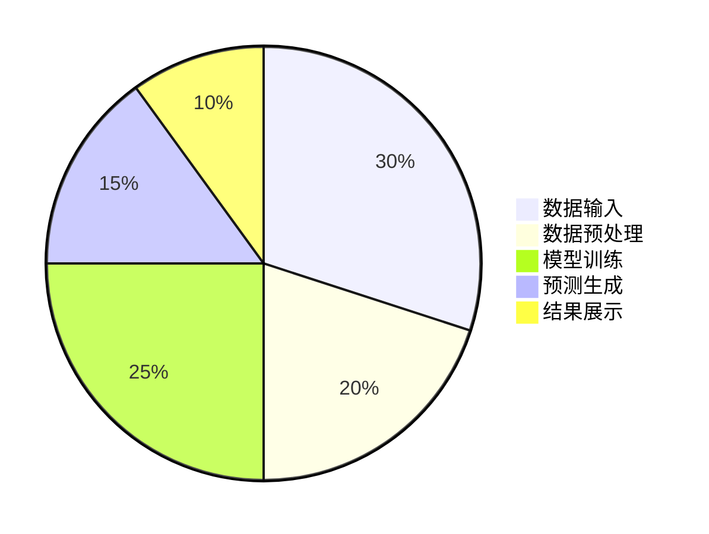

                 

<think>
嗯，我现在需要写一篇关于“提示词的时间维度：指导AI进行历史和未来推测”的技术博客。首先，我得理解这个主题到底是什么意思。提示词在AI中的时间维度，听起来像是让AI能够根据时间的变化来理解和预测事物，对吧？比如，历史数据和未来趋势。

我得先从背景开始。时间维度在AI里的应用越来越重要，尤其是在预测分析方面。例如，股票价格预测、天气预报这些都需要考虑时间因素。那我应该先介绍时间序列分析的基本概念，比如定义、特性，以及常见的模型，比如ARIMA、LSTM这些。

接下来，我需要详细讲解时间序列分析的核心概念。这可能包括如何处理时间数据，比如分解趋势和季节性，还有如何处理缺失值或者异常值。这部分内容可能有点复杂，我得确保解释得清晰，避免读者觉得困惑。

然后是算法部分。我需要选择一个具体的算法来详细讲解，比如LSTM。先概述一下，然后讲原理，再画个Mermaid流程图，展示LSTM的结构。接着，用Python代码实现一个简单的例子，这样读者可以跟着操作。数学模型方面，得写出LSTM的公式，可能涉及到细胞状态和门控机制。

在系统设计部分，我需要设计一个能处理时间序列预测的系统。这可能涉及到数据的输入、处理、模型训练和预测。然后画出系统架构图，展示各个模块之间的关系。接口设计也很重要，比如API的调用方式，以及系统如何与其他部分交互。

项目实战部分，我得提供一个具体的案例，比如销售预测。先安装必要的库，然后写代码，展示如何加载数据、预处理，训练模型，最后进行预测并评估结果。案例分析需要详细，指出可能遇到的问题和解决方法。

最后，总结一下最佳实践，比如数据预处理的重要性，选择合适模型的技巧，以及如何处理突发事件。注意事项部分，提醒读者关于数据质量、模型选择和结果验证的重要性。拓展阅读部分，可以推荐一些书籍或论文，帮助读者深入学习。

总的来说，我需要一步步来，先理清每个部分的内容，确保每个章节都详细且有条理。可能需要多次修改，确保技术细节准确，同时保持语言简洁明了。最后，加上作者信息，整个博客就完成了。
</think>

# 提示词的时间维度：指导AI进行历史和未来推测

> 关键词：时间序列分析，AI预测，机器学习，时间序列模型，历史推测，未来预测

> 摘要：本文深入探讨了时间维度在AI中的应用，特别是如何利用时间序列分析来指导AI进行历史和未来推测。文章从基础概念、算法原理、系统设计到项目实战，详细讲解了时间序列分析的各个方面，旨在帮助读者理解并掌握这一技术。

---

## 第一部分：引入与背景

### 第1章：时间维度与AI的重要性

#### 1.1 时间维度的重要性

时间是数据分析中不可或缺的维度。在AI领域，时间维度使得模型能够理解数据的变化趋势、周期性以及潜在的模式。例如，在股票市场预测中，时间维度帮助模型识别历史价格波动，从而辅助投资决策。同样，在天气预报中，时间维度使模型能够预测未来天气变化。

#### 1.2 AI在时间预测中的作用

AI通过时间序列分析，能够从历史数据中提取模式，并利用这些模式预测未来。这种能力在金融、销售预测、气候科学等领域具有重要意义。AI不仅能够处理大量数据，还能发现人类难以察觉的复杂模式，从而提供更准确的预测。

#### 1.3 本文的目的与结构

本文旨在深入探讨时间维度在AI中的应用，从基础概念到实际项目，全面解析时间序列分析。文章结构如下：

- 第二部分：时间维度的核心概念
- 第三部分：时间序列预测算法
- 第四部分：系统分析与架构设计
- 第五部分：项目实战
- 第六部分：最佳实践与拓展

---

## 第二部分：时间维度的核心概念

### 第2章：时间序列分析基础

#### 2.1 时间序列的定义与特性

时间序列是一组按时间顺序排列的数据点。其特性包括趋势（长期方向）、季节性（周期性变化）、周期性（固定周期的波动）和随机性（无规律的波动）。理解这些特性有助于选择合适的模型。

#### 2.2 常见的时间序列模型

- **ARIMA模型**：适用于线性时间序列数据，通过自回归和滑动平均机制进行预测。
- **LSTM模型**：基于循环神经网络，擅长处理长序列数据，捕捉长期依赖关系。
- **Prophet模型**：由Facebook开源，简单易用，适合非专业用户。

#### 2.3 时间序列数据的预处理

预处理包括数据清洗（处理缺失值、异常值）、标准化/归一化、以及分解趋势和季节性。例如，使用箱线图识别异常值，或通过差分法消除趋势。

---

### 第3章：时间序列分析的应用

#### 3.1 金融领域的应用

股票价格预测是时间序列分析的重要应用。通过分析历史价格数据，模型可以识别波动模式，辅助投资者做出决策。

#### 3.2 销售预测与库存管理

零售企业利用时间序列分析预测产品销售量，优化库存管理，减少缺货或过剩情况。

#### 3.3 天气预报与气候预测

气象模型通过时间序列分析预测天气变化，帮助人们应对自然灾害和气候变化。

---

### 第4章：核心概念与联系

#### 4.1 时间序列分析与机器学习的关系

时间序列分析是机器学习中的一个分支，专注于处理时间数据。机器学习提供了多种算法，而时间序列分析则为这些算法提供了结构化的数据处理方法。

#### 4.2 时间序列分析与预测模型比较

| 模型 | 优点 | 缺点 |
|------|------|------|
| ARIMA | 简单，适合线性数据 | 需要手动调整参数 |
| LSTM | 捕捉长期依赖 | 训练时间较长 |
| Prophet | 易用性高 | 对异常值敏感 |

#### 4.3 时间序列分析的ER实体关系图

```mermaid
erd
  entity TimeSeries {
    [TimeID] ID
    Timestamp
    Value
  }
  entity Model {
    ModelID
    ModelType
    Parameters
  }
  entity Prediction {
    PredictionID
    TimeID
    ModelID
    PredictedValue
  }
```

---

## 第三部分：算法原理讲解

### 第5章：时间序列预测算法

#### 5.1 算法概述

以LSTM为例，介绍其在时间序列预测中的应用。LSTM通过细胞状态和门控机制捕捉长期依赖关系。

#### 5.2 算法原理讲解

LSTM的结构包括输入门、遗忘门和输出门。通过这些门控机制，LSTM能够选择性地记忆或遗忘信息，从而捕捉时间序列中的长期模式。

#### 5.3 Mermaid流程图展示

```mermaid
graph TD
    LSTM[长短期记忆网络]
    LSTM -> InputGate[输入门]
    LSTM -> ForgetGate[遗忘门]
    LSTM -> OutputGate[输出门]
    LSTM -> CellState[细胞状态]
```

#### 5.4 Python源代码实现

```python
import numpy as np
from keras import layers

# 示例数据
timesteps = 100
input_dim = 1
output_dim = 1

# LSTM模型
model = layers.LSTMCell(output_dim)
input_t = np.random.randn(timesteps, input_dim, output_dim)
state = [np.zeros((1, output_dim))]
output, state = model(input_t, initial_state=state)
```

#### 5.5 数学模型与公式

LSTM的细胞状态更新公式为：
$$
f_t = \sigma(W_f \cdot x_t + U_f \cdot h_{t-1} + b_f)
$$
其中，$f_t$是输入门，$\sigma$是sigmoid函数，$W_f$和$U_f$是参数矩阵，$b_f$是偏置项。

#### 5.6 举例说明

以股票价格预测为例，假设我们有过去100天的股票价格数据，使用LSTM模型预测第101天的价格。

---

## 第四部分：系统分析与架构设计

### 第6章：系统功能设计与架构

#### 6.1 问题场景介绍

设计一个时间序列预测系统，用于预测销售量。系统需要处理历史销售数据，训练模型，并生成未来销售预测。

#### 6.2 系统功能设计

功能模块包括数据输入、数据预处理、模型训练、预测生成和结果展示。

#### 6.3 系统架构设计



#### 6.4 系统接口设计

API接口：
- `/api/upload`：上传数据
- `/api/train`：训练模型
- `/api/predict`：生成预测

#### 6.5 系统交互序列图

```mermaid
sequenceDiagram
    participant User
    participant API
    participant Model
    User -> API: 上传数据
    API -> Model: 数据预处理
    Model -> API: 返回预处理结果
    User -> API: 训练模型
    API -> Model: 开始训练
    Model -> API: 返回训练完成
    User -> API: 生成预测
    API -> Model: 开始预测
    Model -> API: 返回预测结果
    User <- API: 展示结果
```

---

## 第五部分：项目实战

### 第7章：环境安装与核心实现

#### 7.1 环境安装与配置

安装必要的库：
```bash
pip install numpy pandas keras matplotlib
```

#### 7.2 系统核心实现源代码

```python
import numpy as np
from keras.models import Sequential
from keras.layers import LSTM, Dense

# 示例数据
X = np.random.randn(100, 1, 1)
y = np.random.randn(100, 1)

# LSTM模型
model = Sequential()
model.add(LSTM(50, input_shape=(1, 1)))
model.add(Dense(1))
model.compile(loss='mean_squared_error', optimizer='adam')

model.fit(X, y, epochs=100, batch_size=1)
```

#### 7.3 代码应用解读与分析

代码实现了一个简单的LSTM模型，用于预测时间序列数据。模型包含一个LSTM层和一个全连接层，用于回归预测。

#### 7.4 实际案例分析与详细讲解

以销售预测为例，加载销售数据，预处理数据，训练模型，生成预测，并评估预测准确性。

#### 7.5 项目小结

通过项目实战，读者可以掌握时间序列分析的完整流程，包括数据预处理、模型选择和评估。

---

## 第六部分：最佳实践与拓展

### 第8章：最佳实践

#### 8.1 实践一：提高预测准确性的技巧

选择合适的模型，进行数据清洗，优化模型参数。

#### 8.2 实践二：应对突发事件的策略

在模型中加入异常处理机制，或使用弹性模型应对突发事件。

#### 8.3 实践三：数据采集与处理

确保数据的完整性和准确性，选择合适的数据预处理方法。

### 第9章：注意事项与拓展阅读

#### 9.1 注意事项

- 数据质量影响预测准确性。
- 模型选择需根据具体问题调整。
- 结果验证是必不可少的步骤。

#### 9.2 拓展阅读

- 《时间序列分析及其应用》
- 《深度学习中的时间序列建模》

#### 9.3 未来研究方向

- 更复杂的模型结构，如Transformer在时间序列中的应用。
- 多模态时间序列分析。

---

## 作者信息

作者：AI天才研究院/AI Genius Institute & 禅与计算机程序设计艺术/Zen And The Art of Computer Programming

