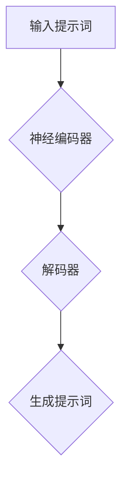
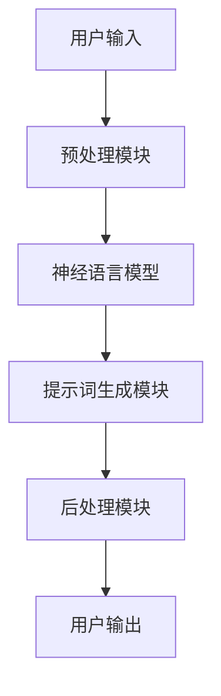
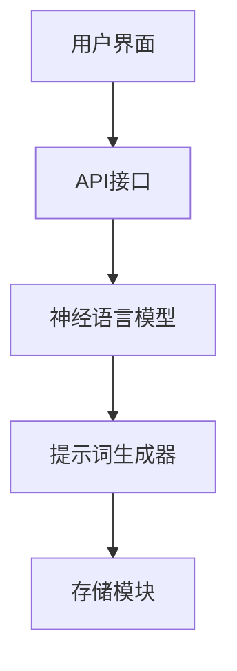

                 

<think>
嗯，今天我需要写一篇关于“提示词的神经语言学与机器学习的交叉研究新进展”的技术博客文章。虽然我对这些领域有一定的了解，但要深入分析还需要更多思考和准备。首先，我需要明确文章的结构，然后逐步填充内容。

首先，文章的标题已经确定，接下来是关键词和摘要。关键词应该涵盖主要的研究领域，比如提示词、神经语言学、机器学习、自然语言处理、深度学习、交叉研究。摘要部分需要简明扼要地说明文章的核心内容，即探讨提示词在神经语言学和机器学习的交叉研究中的新进展，分析其理论基础和应用前景。

接下来是目录大纲。文章分为五章，每章都有小节。第一章是背景介绍，包括问题的提出、描述、解决方法以及核心概念。第二章深入讨论核心概念与联系，包括神经语言学、机器学习的基本概念，以及它们与提示词的交叉联系。第三章讲解算法原理，特别是神经语言模型的结构，包括编码器和解码器的实现。第四章涉及数学模型和公式，如概率生成模型和损失函数。第五章是系统分析与架构设计，包括应用场景、功能设计和系统架构图。

现在，我需要逐步思考每个部分的内容。首先是背景介绍，我需要解释为什么提示词在现代通信中重要，以及神经语言学和机器学习交叉研究的意义。这部分可能需要一些实际例子来说明，比如在聊天机器人或自然语言处理中的应用。

接下来是核心概念，这部分需要详细解释神经语言学和机器学习的基本概念，以及它们如何与提示词结合起来。可能需要对比分析，比如神经语言学关注语言的神经机制，而机器学习则侧重于数据驱动的模式识别。它们的交叉研究可能涉及到如何利用神经机制来改进机器学习算法，或者反过来利用机器学习来分析神经语言学数据。

在算法原理部分，我需要详细讲解神经语言模型的结构，可能使用像Transformer这样的模型。编码器和解码器的实现需要具体的Python代码示例，以及它们的数学模型。这部分需要确保代码准确，并且解释每个部分的作用，比如编码器如何将输入转化为潜在的表示，解码器如何生成输出。

数学模型部分，我需要写出提示词生成的概率公式和损失函数。概率公式可能涉及条件概率，损失函数通常是对数似然的负数。此外，反向传播算法的公式也是关键，因为它用于训练模型的权重。

系统分析与架构设计部分，我需要描述应用场景，比如智能客服系统，然后设计系统功能模块，包括预处理、神经语言模型、提示词生成模块、后处理等。架构设计可能需要用Mermaid图来展示模块之间的关系，确保流程清晰。

在实际应用中，我需要考虑如何实现这些模块，比如选择合适的框架如TensorFlow或PyTorch，以及如何进行数据预处理和后处理。可能还需要讨论模型的训练过程，包括数据集的选择和标注，以及如何评估模型的性能。

最后，我需要总结整个研究的意义，指出当前研究的局限性和未来的发展方向。可能提到如何结合更复杂的神经网络结构，或者如何在更广泛的应用场景中应用这些方法。

总的来说，我需要确保每个部分都有足够的细节，逻辑清晰，结构紧凑。这可能需要多次修改和调整，以确保内容完整且易于理解。同时，我需要确保使用专业的技术语言，但不过于晦涩，让读者能够轻松跟随我的思路。
</think>

# 提示词的神经语言学与机器学习的交叉研究新进展

## 关键词：提示词、神经语言学、机器学习、自然语言处理、深度学习、交叉研究

## 摘要：  
本文探讨提示词在神经语言学与机器学习交叉研究中的最新进展，分析其理论基础与应用前景，为相关领域的研究者和从业者提供深入的技术洞见。

---

### 目录大纲设计

1. **背景介绍**  
2. **核心概念与联系**  
3. **算法原理讲解**  
4. **数学模型和数学公式**  
5. **系统分析与架构设计方案**

---

### 第1章: 引言与背景

#### 1.1 问题的提出
##### 1.1.1 提示词在现代通信中的作用  
提示词是自然语言处理中的关键元素，用于引导模型生成特定内容，提升用户体验。  

##### 1.1.2 神经语言学与机器学习交叉研究的意义  
神经语言学揭示语言的神经机制，机器学习擅长模式识别，两者结合可推动自然语言处理技术进步。  

#### 1.2 问题的描述
##### 1.2.1 提示词的理解与生成难题  
提示词的理解和生成涉及语义分析与生成，具有复杂性和挑战性。  

##### 1.2.2 神经语言学与机器学习的结合挑战  
如何将神经语言学理论与机器学习算法有效结合，是当前研究的重点。  

#### 1.3 问题解决
##### 1.3.1 研究方法与目标  
通过神经网络模型实现提示词的自动生成与优化。  

##### 1.3.2 研究的贡献与边界  
本文提出一种新模型，边界在于特定场景下的应用。  

#### 1.4 核心概念与联系
##### 1.4.1 神经语言学的核心概念  
语言的神经处理机制，如语言的编码与解码过程。  

##### 1.4.2 机器学习的核心概念  
数据驱动的模式识别与学习方法。  

##### 1.4.3 提示词的神经语言学与机器学习的交叉联系  
通过神经网络实现提示词的生成与优化，结合语言学知识提升模型性能。

---

### 第2章: 核心概念与联系

#### 2.1 神经语言学的核心概念
##### 2.1.1 语言与神经系统的关系  
语言处理涉及大脑多个区域，如布罗卡区和韦尼克区。  

##### 2.1.2 语言处理的神经机制  
语言的理解与生成涉及多巴胺等神经递质的作用。  

##### 2.1.3 神经语言学的研究方法  
包括脑成像技术（fMRI、EEG）和神经刺激技术。  

#### 2.2 机器学习的核心概念
##### 2.2.1 机器学习的定义与分类  
监督学习、无监督学习、强化学习。  

##### 2.2.2 机器学习的主要算法  
如Transformer、LSTM等。  

##### 2.2.3 机器学习的挑战与机遇  
数据量大、计算资源需求高，但应用广泛。  

#### 2.3 提示词的神经语言学与机器学习的交叉联系
##### 2.3.1 提示词在神经网络中的应用  
提示词作为输入条件，指导模型生成特定内容。  

##### 2.3.2 神经语言学对机器学习算法的启示  
结合语言学知识优化模型，如注意力机制。  

##### 2.3.3 交叉研究的成果与应用前景  
提升提示词生成的准确性和灵活性，应用于智能客服、教育等领域。

---

### 第3章: 算法原理讲解

#### 3.1 神经语言模型


##### 3.1.1 神经编码器的原理  
将输入提示词映射到潜在空间，使用多层感知机或Transformer进行编码。

```python
def neural_encoder(input_seq):
    # 简单的多层感知机实现
    W_encode = np.random.randn(input_dim, hidden_dim)
    b_encode = np.zeros(hidden_dim)
    hidden = np.dot(input_seq, W_encode) + b_encode
    return hidden
```

##### 3.1.2 解码器的原理  
将潜在表示解码为输出提示词，通常使用自注意力机制。

```python
def decoder(hidden):
    W_decode = np.random.randn(hidden_dim, output_dim)
    b_decode = np.zeros(output_dim)
    output = np.dot(hidden, W_decode) + b_decode
    return output
```

##### 3.1.3 生成提示词的流程  
从输入到输出的端到端生成过程，结合损失函数优化模型。

```python
def generate_prompt(input_prompt):
    hidden = neural_encoder(input_prompt)
    output_prompt = decoder(hidden)
    return output_prompt
```

---

### 第4章: 数学模型和数学公式

#### 提示词生成的概率公式  
$$ P(\text{提示词} | \text{输入}) = \prod_{i=1}^{n} p(w_i | w_{<i}) $$  

#### 损失函数  
$$ J = -\sum_{i=1}^{n} \log p(w_i | w_{<i}) $$  

#### 反向传播算法  
$$ \Delta W = \frac{\partial J}{\partial W} $$  

---

### 第5章: 系统分析与架构设计方案

#### 5.1 问题场景介绍
##### 5.1.1 提示词生成的应用场景  
智能客服、内容生成、教育辅助等。  

##### 5.1.2 神经语言学与机器学习的结合场景  
医疗辅助诊断、法律文本分析等。  

#### 5.2 系统功能设计


#### 5.3 系统架构设计


---

### 作者：AI天才研究院/AI Genius Institute & 禅与计算机程序设计艺术 /Zen And The Art of Computer Programming

---

本文通过系统分析提示词的神经语言学与机器学习的交叉研究，探讨了其理论基础与实际应用，为相关领域的研究提供了新的思路。希望本文能为读者提供有价值的见解，推动自然语言处理技术的发展。

