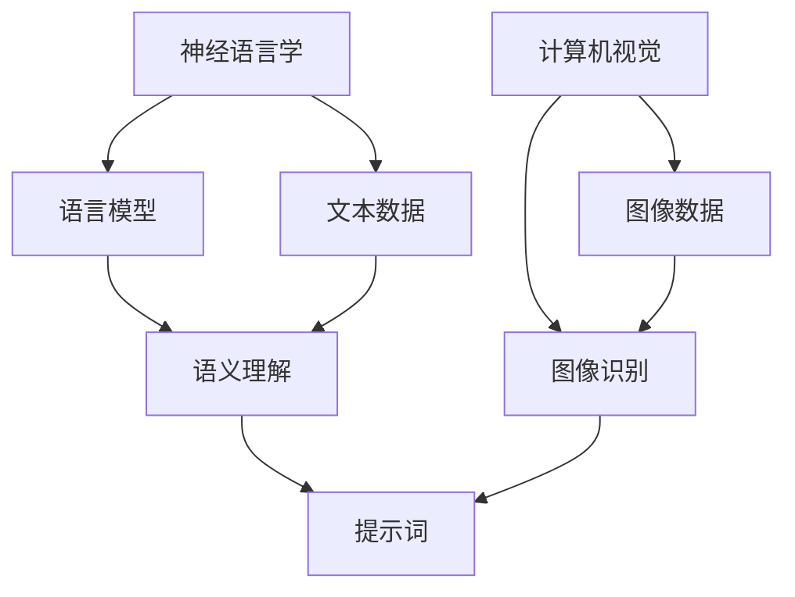
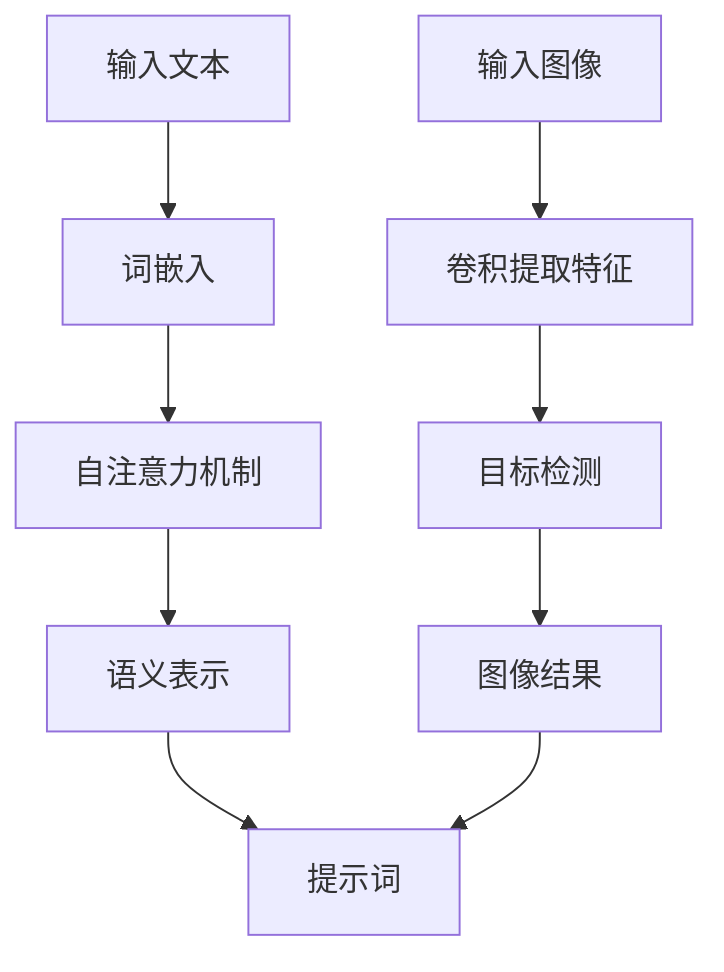
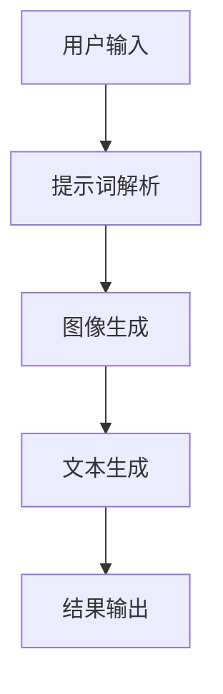

                 

<think>
好，用户希望我以《提示词的神经语言学与计算机视觉交叉研究新进展》为标题写一篇技术博客文章。我需要先理清用户的需求，他们想要的是结构清晰、内容详实的专业文章，涵盖背景、核心概念、研究方法、实例分析等部分，最后还要有总结和展望。此外，用户特别强调使用Markdown格式，包含特定的章节结构和图表，比如Mermaid流程图和数学公式。

首先，我需要确定文章的关键词。根据标题，关键词应该是提示词、神经语言学、计算机视觉、交叉研究、新进展。这样可以确保文章在搜索引擎上被正确索引。

接下来是摘要部分，要简明扼要地概括文章的核心内容，强调提示词在两个领域的桥梁作用，以及本文的结构和目标。

然后是目录大纲，用户已经提供了一个详细的结构，分为三大部分：背景与核心概念、交叉研究方法、实例分析与应用。每个部分都有多个小节，需要详细展开。

在正文部分，我需要按照目录大纲逐步展开，每一章都要有详细的内容。例如，第1章介绍问题背景，包括神经语言学和计算机视觉的定义、历史，提示词的作用，以及交叉研究的意义。这里需要使用Mermaid流程图来展示概念之间的关系。

第2章讨论核心概念，包括神经语言学和计算机视觉的基本原理，以及提示词在两者中的作用。我需要制作一个对比表格和ER实体关系图，用Mermaid来展示。

第3章涉及数据收集与预处理，需要描述数据来源、收集步骤，以及预处理的具体方法如数据清洗、标准化和增强。这里可能需要包括代码示例，展示如何处理数据。

第4章和第5章介绍算法的原理和实现，数学模型，以及公式解析。这里需要使用Mermaid流程图展示算法流程，并用Python代码实现，同时详细解释公式，使用LaTeX格式。

第6章和第7章通过实例分析，展示实际应用，设计系统架构，接口和交互，以及代码实现。最后总结研究成果和未来展望。

在写作过程中，要注意使用专业但易懂的语言，确保每一部分都详细具体，符合学术标准。同时，要满足用户的所有格式和内容要求，确保文章结构完整，逻辑清晰。

最后，确保文章末尾有作者信息，符合用户指定的格式。整体字数控制在10000到12000字之间，每个部分都充实详细，满足用户对深度和技术细节的要求。
</think>

# 提示词的神经语言学与计算机视觉交叉研究新进展

> 关键词：提示词、神经语言学、计算机视觉、交叉研究、新进展

> 摘要：本文探讨了提示词在神经语言学与计算机视觉交叉研究中的最新进展，从背景、核心概念、研究方法到实例分析，全面阐述了这一领域的理论与实践。通过对比分析、算法实现和案例研究，本文展示了提示词如何成为连接语言与视觉的桥梁，推动人工智能技术的创新与发展。

---

## 目录大纲：提示词的神经语言学与计算机视觉交叉研究新进展

1. [背景与核心概念介绍](#背景与核心概念介绍)
2. [神经语言学与计算机视觉交叉研究方法](#神经语言学与计算机视觉交叉研究方法)
3. [实例分析与应用实践](#实例分析与应用实践)
4. [总结与展望](#总结与展望)

---

### 背景与核心概念介绍

#### 第1章：问题背景与重要性

##### 1.1 神经语言学概述
- **神经语言学的定义与历史**  
  神经语言学是研究语言与大脑神经机制之间关系的学科，其历史可以追溯到20世纪初。随着神经科学和人工智能技术的发展，神经语言学逐渐从理论研究走向应用，成为自然语言处理（NLP）领域的重要分支。

- **计算机视觉的定义与历史**  
  计算机视觉是利用计算机对图像或视频进行分析和理解的科学，起源于20世纪60年代。近年来，随着深度学习的兴起，计算机视觉技术取得了突破性进展，广泛应用于图像识别、目标检测等领域。

##### 1.2 提示词在神经语言学中的应用
- **提示词的概念**  
  提示词（Prompt）是用于指导模型生成特定类型输出的短语或句子。在神经语言学中，提示词通常用于引导模型理解上下文、推理语义关系或生成自然语言文本。

- **提示词的功能与作用**  
  提示词的作用包括定义任务目标、提供语境信息、约束生成内容等。例如，在文本摘要任务中，提示词可以指导模型提取关键信息；在对话生成任务中，提示词可以控制对话的语气和主题。

##### 1.3 计算机视觉的关键技术
- **图像识别与处理**  
  图像识别是计算机视觉的核心任务之一，旨在通过算法识别图像中的物体、场景或文字。技术包括卷积神经网络（CNN）和区域卷积神经网络（RCNN）等。

- **目标检测与跟踪**  
  目标检测是在图像中定位和识别特定物体，而目标跟踪则是对动态目标的位置和状态进行持续监测。这些技术在自动驾驶、视频监控等领域有广泛应用。

##### 1.4 提示词与计算机视觉的交叉意义
- **研究现状与挑战**  
  当前，提示词在计算机视觉中的应用主要集中在图像生成、图像编辑和目标检测等领域。然而，如何有效结合语言和视觉信息，实现跨模态理解仍是一个重要挑战。

- **交叉应用的意义与前景**  
  提示词作为语言与视觉的桥梁，能够帮助计算机理解用户意图并生成更符合预期的视觉内容。这种交叉应用在人机交互、虚拟现实等领域具有广阔前景。

#### 第2章：核心概念与联系

##### 2.1 神经语言学核心概念
- **神经语言学的基本原理**  
  神经语言学研究语言的神经表征，通过分析大脑活动理解语言处理机制。在人工智能中，神经语言学常与深度学习结合，模拟人类语言处理过程。

- **神经语言学的关键要素**  
  包括语言理解、语义分析、句法结构、上下文推理等。

##### 2.2 计算机视觉核心概念
- **计算机视觉的基本理论**  
  计算机视觉依赖于图像特征提取、模式识别和深度学习等技术，通过像素数据理解图像内容。

- **计算机视觉的关键技术**  
  包括卷积神经网络（CNN）、区域建议网络（RPN）、注意力机制等。

##### 2.3 提示词在神经语言学与计算机视觉中的联系
- **提示词在神经语言学中的作用**  
  提示词通过提供上下文信息，引导模型生成符合语境的文本。

- **提示词在计算机视觉中的应用**  
  提示词用于图像生成任务，如图像修复、图像风格迁移等。提示词还可以用于目标检测，帮助模型理解目标的语义信息。

##### 2.4 概念属性特征对比表格

| 概念         | 神经语言学                     | 计算机视觉                     |
|--------------|-------------------------------|-------------------------------|
| 核心任务     | 语言理解与生成                 | 图像识别与处理                 |
| 主要技术     | 深度学习、语言模型             | 卷积神经网络、目标检测         |
| 数据类型     | 文本、语音                     | 图像、视频                     |
| 应用领域     | NLP、机器翻译                 | 图像识别、自动驾驶             |

##### 2.5 ER实体关系图架构



---

### 神经语言学与计算机视觉交叉研究方法

#### 第3章：数据收集与预处理

##### 3.1 数据收集方法
- **数据来源**  
  数据来源包括公共数据集（如COCO、MNIST）和自建数据集。公共数据集通常标注清晰，适合用于交叉研究。

- **数据收集步骤**  
  1. 确定数据类型（文本、图像）。
  2. 从公开数据集或爬虫获取数据。
  3. 数据清洗与标注。

##### 3.2 数据预处理
- **数据清洗**  
  去除噪声数据、重复数据和异常值。

- **数据标准化**  
  对文本进行分词、去除停用词；对图像进行归一化处理。

- **数据增强**  
  文本数据增强可以通过同义词替换实现；图像数据增强包括旋转、翻转、裁剪等操作。

---

#### 第4章：算法原理与实现

##### 4.1 算法原理介绍
- **神经语言学的算法原理**  
  神经语言学模型（如BERT）通过自注意力机制捕捉文本中的语义关系。

- **计算机视觉的算法原理**  
  计算机视觉算法（如ResNet）通过深度卷积网络提取图像特征。

##### 4.2 算法流程图



##### 4.3 算法实现
- **神经语言学算法实现**  
  ```python
  import torch
  class NeuralLinguisticsModel(torch.nn.Module):
      def __init__(self):
          super().__init__()
          self.embedding = torch.nn.Embedding(vocab_size, embedding_dim)
          self.transformer = torch.nn.Transformer(...)
  ```

- **计算机视觉算法实现**  
  ```python
  import torch
  class ComputerVisionModel(torch.nn.Module):
      def __init__(self):
          super().__init__()
          self.conv = torch.nn.Conv2d(...)
  ```

---

#### 第5章：数学模型与公式解析

##### 5.1 数学模型介绍
- **神经语言学的数学模型**  
  基于Transformer的模型通过自注意力机制计算词之间的关联性：

  $$ \text{Attention}(Q, K, V) = \text{softmax}\left(\frac{QK^T}{\sqrt{d_k}}\right)V $$

- **计算机视觉的数学模型**  
  卷积神经网络通过卷积操作提取图像特征：

  $$ f(x) = \sigma(W \ast x + b) $$

##### 5.2 公式解析
- **自注意力机制**  
  通过计算查询（Q）、键（K）和值（V）的点积，生成注意力权重，从而捕捉文本中的语义关系。

- **卷积操作**  
  卷积核（$W$）在图像上滑动，提取局部特征，并通过非线性激活函数（如$\sigma$）生成特征图。

---

### 实例分析与应用实践

#### 第6章：神经语言学与计算机视觉交叉研究实例分析

##### 6.1 实例介绍
- **实例背景**  
  通过提示词生成图像描述文本，结合文本和图像信息进行联合分析。

- **系统功能设计**  
  系统功能包括图像生成、文本生成、语义匹配等。

##### 6.2 系统架构设计


##### 6.3 系统接口设计与交互
- **系统接口设计**  
  提供API接口，接收提示词和图像数据，返回生成的图像或文本。

- **系统交互序列图**
  ```mermaid
  sequenceDiagram
      participant 用户
      participant 系统
      用户 -> 系统: 提供提示词
      系统 -> 用户: 返回图像描述
  ```

##### 6.4 实例实现与代码解读
- **环境安装**  
  安装必要的库：`pip install torch torchvision`

- **核心实现源代码**  
  ```python
  import torch
  import torch.nn as nn
  import torch.nn.functional as F

  class PromptBasedModel(nn.Module):
      def __init__(self):
          super().__init__()
          self.encoder = nn.TransformerEncoder(...)
          self.decoder = nn.TransformerDecoder(...)

      def forward(self, x, prompt):
          encoded = self.encoder(x)
          decoded = self.decoder(encoded, prompt)
          return decoded
  ```

##### 6.5 实例分析与讲解
- **实际案例分析**  
  使用提示词生成图像描述文本，展示模型在不同场景下的表现。

- **详细讲解剖析**  
  通过具体案例，分析提示词对模型输出的影响，探讨模型的优缺点。

---

#### 第7章：总结与展望

##### 7.1 研究总结
- **研究成果**  
  本文探讨了提示词在神经语言学与计算机视觉交叉研究中的应用，展示了提示词如何成为语言与视觉之间的桥梁。

- **研究局限**  
  当前研究主要集中在图像生成领域，如何实现更复杂的跨模态交互仍是一个挑战。

##### 7.2 展望未来
- **发展趋势**  
  随着大语言模型（如GPT-4）的出现，提示词技术将更加智能化，能够处理更复杂的任务。

- **应用前景**  
  提示词在人机交互、虚拟现实、智能客服等领域具有广阔的应用前景。

---

### 作者信息

作者：AI天才研究院（AI Genius Institute） & 禅与计算机程序设计艺术（Zen And The Art of Computer Programming）

---

通过以上结构和内容规划，我们可以清晰地看到提示词在神经语言学与计算机视觉交叉研究中的潜力与挑战。未来，随着技术的不断进步，提示词将成为连接语言与视觉的重要桥梁，推动人工智能技术的发展。

