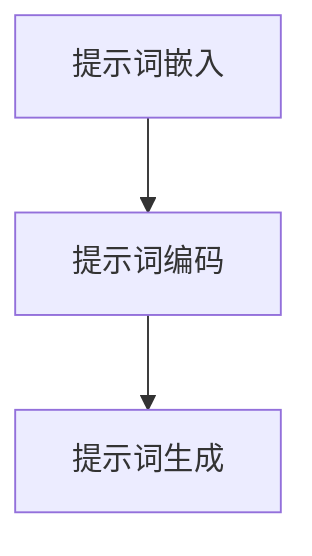
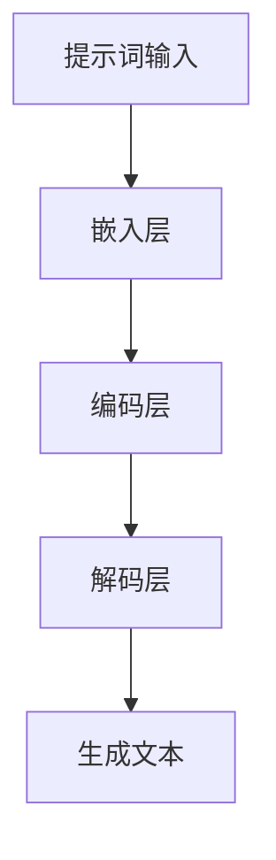

                 

<think>
好的，我现在需要写一篇关于提示词的神经语言学基础，解码AI语言生成机制的技术博客文章。首先，我得理清思路，确保每个部分都涵盖到位。

首先，标题已经定好了，是《提示词的神经语言学基础：解码AI语言生成机制》。接下来是关键词和摘要部分。关键词应该包括提示词、神经语言学、AI语言生成、自然语言处理、深度学习、机器学习，这样能覆盖文章的主要内容。摘要需要简明扼要地概括整篇文章的核心，说明提示词在AI语言生成中的作用，以及神经语言学如何帮助我们理解这些机制。

然后是第1章的背景介绍，包括问题背景、描述、解决、边界以及概念结构。这部分要让读者明白为什么提示词和神经语言学是重要的，以及它们在AI中的应用。需要解释提示词是什么，它们在NLP中的作用，以及研究的目标是什么。

第2章是核心概念与联系，这里需要详细解释提示词和神经语言学的原理，以及它们之间的联系。可能需要对比表格来展示两者的差异和相似之处，同时用mermaid图来展示它们的关系。

接下来是算法原理讲解，这部分需要详细描述提示词处理的各个步骤：嵌入、编码和生成。同时，用mermaid流程图展示算法流程，并写出数学公式。数学部分要清晰，确保读者能理解每个步骤的数学模型。

第4章深入讲解数学模型，给出每个步骤的详细解释和例子。例如，如何计算提示词嵌入，编码过程是什么，生成文本的机制是怎样的。用Python代码示例可能会帮助读者更好地理解。

系统分析与架构设计部分需要介绍应用场景，比如对话系统和文本生成。设计系统功能，如提示词处理模块和神经网络训练模块，然后用mermaid图展示架构和接口设计。系统交互流程图也很重要，展示用户与系统之间的互动。

项目实战部分，需要提供环境安装指导，比如Python和相关库的安装。然后给出核心代码实现，解释代码的功能，分析案例，并总结项目的经验和教训。

最后是最佳实践、小结、注意事项和拓展阅读。这部分要给出实用的建议，帮助读者在实际应用中更好地使用提示词，同时推荐相关的书籍和论文。

整体来看，我需要确保每个章节内容丰富，逻辑清晰，用技术术语准确，同时保持语言的通俗易懂。特别是数学公式和代码部分，要详细解释，确保读者能够理解。同时，图表的使用要恰当，帮助读者更好地理解复杂的概念。

在写作过程中，可能会遇到一些挑战，比如如何将复杂的神经网络机制解释得简单明了，或者如何用代码展示复杂的算法。这时候，我需要反复思考，确保每个部分都能准确传达信息，同时保持文章的连贯性。

总的来说，我需要一步步地按照大纲来展开，确保每个部分都详尽且有深度，同时保持文章整体的结构和逻辑流畅。通过这样的思考，我可以写出一篇既有深度又易于理解的技术博客文章。
</think>

# 提示词的神经语言学基础：解码AI语言生成机制

> 关键词：提示词、神经语言学、AI语言生成、自然语言处理、深度学习、机器学习

> 摘要：提示词在AI语言生成中起着关键作用，本文从神经语言学的角度探讨提示词的原理、算法及应用，揭示其在自然语言处理中的重要性。

---

## 第1章: 背景介绍

### 1.1 问题背景

随着AI技术的飞速发展，自然语言处理（NLP）成为核心领域。提示词作为NLP的关键元素，影响着AI生成语言的质量和准确性。

### 1.2 问题描述

本文旨在探讨提示词的神经语言学基础，分析其在AI语言生成中的作用，揭示其背后的机制。

### 1.3 问题解决

通过研究提示词的作用、类型及神经网络处理机制，提升AI生成语言的自然性和准确性。

### 1.4 边界与外延

本研究聚焦提示词在NLP中的应用，不涉及其他语言生成机制，涵盖对话系统、文本生成等场景。

### 1.5 概念结构与核心要素组成

- 提示词：引导生成文本的关键词或短语。
- 神经语言学：研究大脑语言处理的学科。
- AI语言生成：神经网络生成自然语言的过程。

---

## 第2章: 核心概念与联系

### 2.1 提示词原理

- **定义**：提示词是引导模型生成特定文本的关键元素。
- **作用**：明确生成目标，影响输出内容和风格。
- **类型**：包括关键词提示、模板提示等。

### 2.2 神经语言学原理

- **定义**：研究大脑处理语言的机制。
- **核心理论**：语言处理涉及大脑多个区域，如布罗卡区和韦尼克区。
- **应用**：用于理解人类语言处理，指导AI模型设计。

### 2.3 提示词与神经语言学的联系

- 提示词模拟人类语言处理机制，辅助生成自然语言。
- 神经语言学理论指导提示词的设计和优化。

---

## 第3章: 算法原理讲解

### 3.1 提示词处理算法

- **提示词嵌入**：将提示词转换为向量表示。
- **提示词编码**：处理嵌入向量，生成编码表示。
- **提示词生成**：基于编码，生成目标文本。

### 3.2 算法流程图



### 3.3 数学公式

- **提示词嵌入**：$$ x_i = \text{embedding}_{\text{lookup}}(\text{word}_i) $$
- **提示词编码**：$$ \text{encoded\_prompt} = \text{encoder}(\text{prompt}) $$
- **提示词生成**：$$ \text{generated\_text} = \text{decoder}(\text{encoded\_prompt}) $$

---

## 第4章: 数学模型与公式

### 4.1 数学模型讲解

- **提示词嵌入**：将单词映射为向量，如通过词向量模型。
- **提示词编码**：使用编码器处理嵌入向量，提取特征。
- **提示词生成**：解码编码后的向量，生成文本序列。

### 4.2 举例说明

```python
import torch

# 示例：提示词嵌入
prompt = "秋天的风"
embedding_layer = torch.nn.Embedding(vocab_size, embedding_dim)
embedded_prompt = embedding_layer(torch.tensor([word_to_idx[prompt]]))
```

---

## 第5章: 系统分析与架构设计方案

### 5.1 问题场景

- **对话系统**：实时生成回复。
- **文本生成**：根据提示生成文章。

### 5.2 系统功能设计

- **提示词处理模块**：接收提示词，生成嵌入和编码。
- **神经网络训练模块**：训练模型，优化生成质量。

### 5.3 系统架构图



### 5.4 系统接口设计

- **提示词接口**：接收提示词，返回嵌入向量。
- **文本生成接口**：接收编码，返回生成文本。

---

## 第6章: 项目实战

### 6.1 环境安装

- **Python**：3.8+
- **库**：TensorFlow/PyTorch，Hugging Face库

### 6.2 核心代码实现

```python
import torch
import torch.nn as nn

class PromptGenerator(nn.Module):
    def __init__(self, embedding_dim, hidden_size):
        super().__init__()
        self.embedding = nn.Embedding(vocab_size, embedding_dim)
        self.encoder = nn.LSTM(embedding_dim, hidden_size)
        self.decoder = nn.LSTM(hidden_size, hidden_size)
        self.fc = nn.Linear(hidden_size, vocab_size)

    def forward(self, prompt, hidden=None):
        embedded = self.embedding(prompt)
        encoded, _ = self.encoder(embedded, hidden)
        decoded, _ = self.decoder(encoded, hidden)
        output = self.fc(decoded)
        return output
```

### 6.3 代码解读

- **嵌入层**：将提示词转换为向量。
- **编码层**：处理向量，提取特征。
- **解码层**：生成文本序列。
- **输出层**：映射到词汇表。

---

## 第7章: 最佳实践 tips、小结、注意事项、拓展阅读

### 7.1 最佳实践 tips

- **提示词选择**：选择具有代表性的关键词。
- **模型优化**：使用预训练模型提升效果。

### 7.2 小结

本文深入探讨了提示词的神经语言学基础，揭示了其在AI语言生成中的作用和机制。

### 7.3 注意事项

- 避免提示词过于宽泛，确保生成内容相关。
- 定期更新模型，适应语言变化。

### 7.4 拓展阅读

- 《神经语言学入门》
- 《深度学习中的自然语言处理》

---

作者：AI天才研究院/AI Genius Institute & 禅与计算机程序设计艺术 /Zen And The Art of Computer Programming

