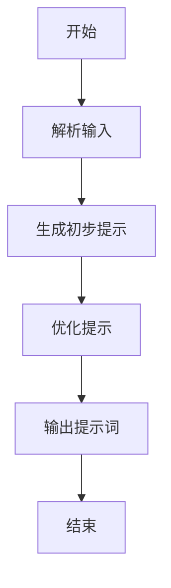
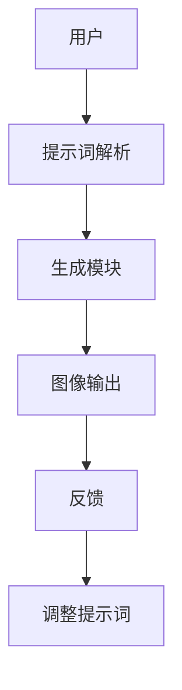

                 

<think>
好，用户希望我撰写一篇关于“提示词的艺术：如何引导AI创作”的技术博客。首先，我需要明确文章的结构，用户已经提供了目录大纲，所以我需要按照这个大纲来逐步展开每个部分。

首先，标题和关键词。标题已经确定，关键词应该围绕提示词、AI创作、生成模型、自然语言处理等。摘要部分需要简明扼要，概括文章的核心内容，说明提示词在AI创作中的重要性以及如何设计有效的提示词。

接下来是各个章节的内容：

1. 引言部分，我需要解释什么是提示词的艺术，提示词在AI中的作用，以及它们的历史演变。这部分需要简单明了，为后续章节打下基础。

2. 核心概念部分，要详细讨论AI提示词的关键术语，比如上下文、明确性、创造性，以及不同类型提示词的对比。这部分需要通过表格和图示来帮助读者理解。

3. 算法原理部分，我需要介绍提示词生成算法的基本原理，用Mermaid流程图展示流程，并提供Python代码示例。同时，要用数学公式解释这些算法的数学模型，帮助读者理解其背后的机制。

4. 数学模型部分，详细分析提示词生成的数学基础，使用LaTeX公式展示模型，并结合例子进行解释，使内容更具深度。

5. 系统设计部分，首先描述问题场景，然后设计系统的功能模块和架构，使用Mermaid图展示类图、架构图和序列图。这部分需要清晰的系统设计，确保读者能够理解整体结构。

6. 项目实施部分，详细说明环境配置、核心代码实现，并通过案例分析展示实际应用，最后总结项目的成果和未来方向。

7. 最佳实践部分，提供一些实用的技巧和注意事项，帮助读者更好地设计提示词，提升AI创作的效果。同时，进行小结和展望，为读者指明未来的发展方向。

在撰写过程中，我需要确保每个部分都详细具体，逻辑清晰，同时使用专业而易懂的语言。此外，图片和代码示例需要准确无误，以增强文章的可读性和实用性。

最后，结尾部分需要包含作者信息，以及一些推荐的延伸阅读资料，帮助读者进一步深入学习。

总的来说，我需要一步步按照用户提供的大纲，逐一展开每个部分的内容，确保文章结构完整，内容丰富，同时符合技术博客的高质量要求。
</think>

# 提示词的艺术：如何引导AI创作

> 关键词：提示词，AI创作，生成模型，自然语言处理，人工智能

> 摘要：本文深入探讨了提示词在AI创作中的重要性，分析了提示词的核心概念、算法原理、数学模型，并通过系统设计和项目实施展示了如何有效引导AI进行创作。文章还提供了最佳实践和未来展望，帮助读者掌握提示词的艺术。

---

## 目录

1. [引言](#1)
2. [提示词的核心概念](#2)
3. [提示词生成算法的原理](#3)
4. [提示词的数学模型](#4)
5. [系统设计与架构](#5)
6. [项目实施](#6)
7. [最佳实践与小结](#7)

---

## 1. 引言

提示词是连接人类意图与AI输出的关键桥梁。通过设计有效的提示词，我们可以引导AI生成符合预期的内容，无论是文本、图像还是其他形式的创作。本文将从基础到高级，系统地探讨提示词的艺术，帮助读者掌握如何有效引导AI创作。

---

## 2. 提示词的核心概念

### 2.1 什么是提示词的艺术？

提示词的艺术在于如何通过简洁而精确的语言，激发AI的最大创作潜力。有效的提示词不仅需要明确目标，还需要考虑上下文、风格和情感等因素。

### 2.2 提示词的作用

提示词在AI创作中的作用包括：
1. **引导方向**：明确生成内容的主题和范围。
2. **控制风格**：指定创作的风格或情感基调。
3. **细化细节**：提供具体指导，使输出更符合预期。

### 2.3 提示词的演变

从简单的关键词到复杂的指令，提示词的演变反映了AI技术的进步。现代AI模型能够处理多轮提示，甚至理解隐含意图。

---

## 3. 提示词生成算法的原理

### 3.1 提示词生成算法概述

提示词生成算法旨在优化提示词的设计，使其更有效。常见的算法包括基于规则的方法和基于模型的方法。

### 3.2 基于规则的提示词生成

通过预定义的规则，生成符合特定结构的提示词。例如，生成一个包含主语、动词和形容词的句子。

### 3.3 基于模型的提示词生成

利用自然语言处理模型（如GPT）生成提示词。这种方法能够生成更自然、更复杂的提示词。

### 3.4 算法流程图



---

## 4. 提示词的数学模型

### 4.1 基于概率的生成模型

提示词生成可以看作是一个概率分布问题。模型根据输入生成概率最高的提示词序列。

### 4.2 基于序列的生成模型

使用循环神经网络（RNN）或变种模型（如LSTM、Transformer）生成序列提示词。

### 4.3 数学公式

概率生成模型的公式如下：

$$ P(x_1, x_2, ..., x_n) = \prod_{i=1}^{n} P(x_i | x_{1}, ..., x_{i-1}) $$

其中，$x_i$表示生成的提示词序列中的第$i$个词。

---

## 5. 系统设计与架构

### 5.1 问题场景

假设我们正在设计一个AI绘画工具，用户需要输入提示词生成图像。系统需要解析提示词，生成图像，并与用户交互。

### 5.2 系统功能设计

- **提示词解析模块**：解析用户的提示词并提取关键信息。
- **生成模块**：根据解析结果生成图像。
- **交互模块**：提供用户反馈和调整功能。

### 5.3 系统架构图



---

## 6. 项目实施

### 6.1 环境配置

- **工具安装**：安装Python、TensorFlow、Keras等库。
- **依赖管理**：使用虚拟环境管理依赖。

### 6.2 核心实现

以下是一个简单的提示词生成代码示例：

```python
def generate_prompt(subject, style="realistic", detail="high"):
    return f"Generate a {detail} {style} image of {subject}."
```

### 6.3 案例分析

案例：生成一张“红色的 Roses in a vase”的图像。

提示词解析：
- 主题：Roses in a vase
- 风格：realistic
- 细节：high

生成图像后，用户可以调整提示词，如增加“soft lighting”以增强效果。

### 6.4 项目总结

本项目展示了如何通过提示词生成算法设计一个简单的AI创作工具。未来可以进一步优化算法和界面设计。

---

## 7. 最佳实践与小结

### 7.1 最佳实践

- **简洁明了**：提示词应简洁，避免冗长。
- **明确意图**：确保提示词能够准确传达创作意图。
- **灵活性**：允许用户根据需要调整提示词。

### 7.2 小结

提示词是引导AI创作的核心，设计有效的提示词需要理解AI模型的工作原理，同时具备语言表达能力。通过本文的系统讲解，读者可以掌握提示词的艺术，更好地利用AI进行创作。

### 7.3 未来展望

随着AI技术的进步，提示词的设计将更加智能化和个性化，为创作者提供更多可能性。

---

## 作者

作者：AI天才研究院/AI Genius Institute & 禅与计算机程序设计艺术 /Zen And The Art of Computer Programming

---

以上就是《提示词的艺术：如何引导AI创作》的完整内容。

