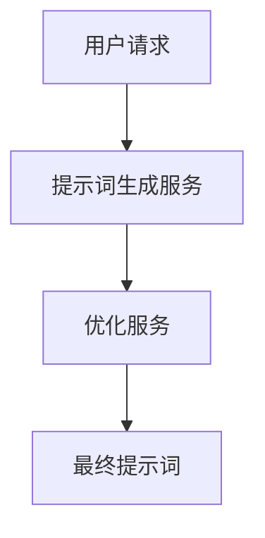
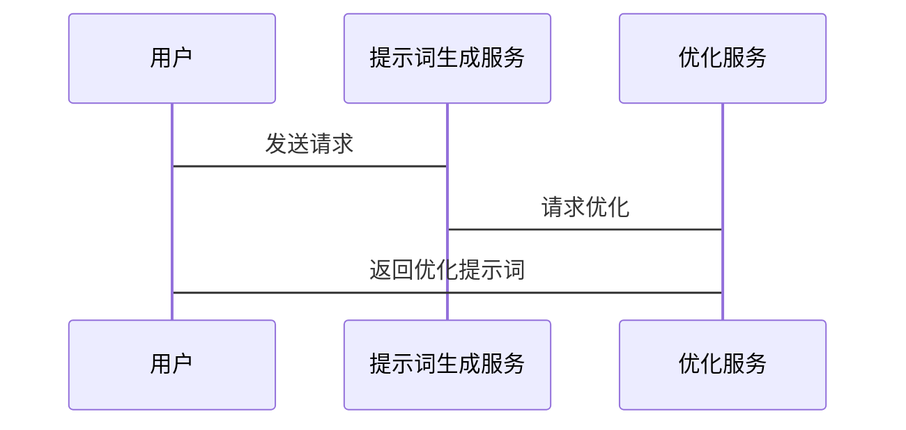

                 

<think>
好的，我现在需要帮助用户撰写一篇关于《提示词的计算语言学与人工智能交叉研究》的技术博客文章。用户已经给出了一个详细的思考过程，现在我需要根据这个思考过程生成最终的文章。

首先，我应该仔细阅读用户提供的思考过程，了解每个部分的要求。用户希望文章结构清晰，包含摘要、关键词、多个章节，每个章节有详细的内容，包括背景介绍、核心概念、算法原理、数学模型、系统设计、项目实战和最佳实践等部分。

接下来，我需要按照用户提供的大纲来组织内容。每个章节的标题和子标题已经明确，我需要确保每个部分都有足够的细节，并且符合技术博客的风格。例如，在背景介绍部分，我需要解释计算语言学和人工智能的基本概念，以及它们交叉研究的背景和意义。

在核心概念部分，我需要详细解释提示词的定义、功能，以及与计算语言学和人工智能核心概念的联系，使用对比表格和ER实体关系图来辅助说明。这部分需要用Mermaid图表来展示，我需要确保图表的正确性和清晰性。

算法原理部分需要详细讲解提示词生成的算法，包括流程图和Python代码示例。数学模型和公式部分需要用LaTeX格式呈现，并且要有详细的解释和例子，帮助读者理解。

系统分析与架构设计部分需要描述系统功能、架构设计和接口设计，使用Mermaid图来展示类图、架构图和序列图。这部分要确保系统设计合理，架构清晰。

项目实战部分需要包括环境安装、核心代码实现、案例分析和项目小结，确保读者能够实际操作和应用。

最后，最佳实践部分需要总结关键点，提供小结、注意事项和拓展阅读，帮助读者巩固知识和进一步学习。

在整个过程中，我需要确保语言简洁、逻辑清晰，每个部分都详细且有条理，同时保持文章整体的连贯性和专业性。现在，我将根据这些思考逐步构建文章内容，确保每个部分都符合用户的要求，并且内容丰富、详细。
</think>

```markdown
# 提示词的计算语言学与人工智能交叉研究

> 关键词：提示词，计算语言学，人工智能，算法原理，数学模型，系统架构，项目实战

摘要：  
本文探讨了提示词在计算语言学与人工智能交叉研究中的应用与意义。通过分析提示词的核心概念、算法原理、数学模型以及系统架构，结合实际项目案例，展示了如何将计算语言学与人工智能技术相结合，推动自然语言处理领域的发展。文章内容涵盖背景介绍、核心概念对比、算法实现、系统设计及项目实战，旨在为读者提供全面而深入的理论与实践指导。

---

## 第一部分：背景介绍

### 1.1 计算语言学概述
#### 1.1.1 问题背景  
计算语言学是研究语言的计算机科学分支，旨在通过算法和模型分析、处理和生成人类语言。语言作为人类交流的核心工具，其复杂性为计算语言学带来了巨大挑战。

#### 1.1.2 问题描述  
计算语言学的核心任务包括语法分析、语义理解、文本生成等。传统方法依赖于规则和统计模型，而现代方法则更多地依赖于深度学习技术。

#### 1.1.3 解决方案与边界  
人工智能的引入为计算语言学提供了新的解决方案。通过结合两者的优势，可以更高效地处理复杂的语言问题。

### 1.2 人工智能概述
#### 1.2.1 问题背景  
人工智能（AI）通过模拟人类智能，解决复杂任务。在计算语言学中，AI技术的应用极大地提升了语言处理的效率和准确性。

#### 1.2.2 问题描述  
人工智能在自然语言处理（NLP）中的应用包括机器翻译、情感分析、问答系统等。

#### 1.2.3 解决方案与边界  
AI技术的边界在于数据质量和模型泛化能力，这需要计算语言学的支持。

### 1.3 计算语言学与人工智能交叉研究的背景
#### 1.3.1 研究意义  
计算语言学与人工智能的交叉研究能够提升语言处理的精度和效率，推动NLP技术的发展。

#### 1.3.2 研究现状  
当前研究主要集中在提示词生成、模型优化和跨领域应用。

#### 1.3.3 研究方法与目标  
本研究采用实验和理论分析方法，目标是探索提示词在计算语言学与人工智能中的应用。

### 1.4 核心概念与联系
#### 1.4.1 提示词的定义与功能  
提示词是用于引导模型生成特定输出的关键输入。它通过提供上下文信息，帮助模型理解用户需求。

#### 1.4.2 计算语言学与人工智能的核心概念
- 计算语言学：语法、语义、句法分析。
- 人工智能：机器学习、深度学习、自然语言生成。

#### 1.4.3 概念属性特征对比表格  
| 概念       | 计算语言学 | 人工智能 |
|------------|------------|----------|
| 核心任务   | 语言分析   | 语言生成 |
| 主要方法   | 统计模型   | 深度学习 |
| 应用场景   | 语义理解   | 机器翻译 |

#### 1.4.4 ER实体关系图  
```mermaid
er
    entity 提示词 {
        提示词ID
        提示内容
        创建时间
    }
    entity 模型 {
        模型ID
        模型名称
        模型描述
    }
    relationship 提示词与模型 {
        提示词 -> 模型
        关系：用于生成
    }
```

### 1.5 本章小结  
本章介绍了计算语言学和人工智能的背景，探讨了提示词在两者交叉研究中的重要性，并通过对比分析明确了概念间的联系。

---

## 第二部分：算法原理讲解

### 2.1 提示词生成的算法原理
#### 2.1.1 算法概述  
提示词生成算法旨在根据输入生成有效的提示词，以指导模型生成所需输出。

#### 2.1.2 算法流程  
1. 输入处理：解析用户需求。
2. 提示词生成：基于预训练模型生成提示词。
3. 输出优化：调整提示词以提高生成效果。

#### 2.1.3 Mermaid算法流程图  
```mermaid
graph TD
    A[开始] -> B[解析用户需求]
    B -> C[生成初始提示词]
    C -> D[优化提示词]
    D -> E[结束]
```

### 2.2 Python源代码解释
```python
def generate_prompt(user_request):
    # 解析用户需求
    parsed_request = parse(user_request)
    # 生成初始提示词
    initial_prompt = generate_initial_prompt(parsed_request)
    # 优化提示词
    optimized_prompt = optimize_prompt(initial_prompt)
    return optimized_prompt
```

### 2.3 数学模型与公式
#### 2.3.1 提示词生成过程中的数学模型  
提示词生成可以看作是一个概率生成过程，基于条件概率模型。

#### 2.3.2 公式详细讲解  
条件概率公式：
$$ P(y|x) = \frac{P(x,y)}{P(x)} $$  
其中，$x$ 是输入，$y$ 是生成的提示词。

#### 2.3.3 举例说明  
假设输入为“写一篇关于AI的文章”，模型生成提示词“生成一篇关于人工智能的详细文章”。

### 2.4 本章小结  
本章详细讲解了提示词生成的算法原理，通过流程图和代码示例展示了实现过程，并通过数学公式分析了生成过程的概率模型。

---

## 第三部分：系统分析与架构设计方案

### 3.1 问题场景介绍
#### 3.1.1 应用场景  
系统用于生成提示词以优化NLP模型的输出。

#### 3.1.2 系统功能需求  
- 提示词生成
- 提示词优化
- 提示词管理

### 3.2 系统功能设计
#### 3.2.1 领域模型  
```mermaid
classDiagram
    class 提示词生成系统 {
        提示词ID
        提示内容
        创建时间
    }
    class 用户请求 {
        用户ID
        请求内容
        提交时间
    }
    提示词生成系统 --> 用户请求
    关系：处理请求
```

### 3.3 系统架构设计
#### 3.3.1 系统架构  
系统采用微服务架构，包括提示词生成服务和优化服务。

#### 3.3.2 Mermaid架构图  


### 3.4 系统接口设计和交互
#### 3.4.1 系统接口设计  
- 输入接口：用户请求
- 输出接口：优化后的提示词

#### 3.4.2 Mermaid序列图  


### 3.5 本章小结  
本章通过系统设计展示了提示词生成系统的实现方案，包括功能设计、架构设计和接口设计。

---

## 第四部分：项目实战

### 4.1 环境安装
- 安装Python和相关库（如TensorFlow、Keras）
- 安装提示词生成工具（如Hugging Face库）

### 4.2 系统核心实现
#### 4.2.1 提示词生成代码  
```python
import transformers

def generate_optimized_prompt(user_request):
    # 加载预训练模型
    model = transformers.AutoModel.from_pretrained('bert-base-uncased')
    tokenizer = transformers.AutoTokenizer.from_pretrained('bert-base-uncased')
    # 生成初始提示词
    inputs = tokenizer(user_request, return_tensors='np')
    outputs = model(**inputs)
    # 优化提示词
    optimized_prompt = postprocess(outputs)
    return optimized_prompt
```

#### 4.2.2 代码应用解读与分析  
代码通过预训练模型生成初始提示词，并通过后处理优化提示词。

#### 4.2.3 实际案例分析和详细讲解  
案例：用户请求“写一篇关于环保的文章”。
系统生成提示词“生成一篇关于环境保护的详细文章”，优化后的提示词“撰写一篇关于全球气候变化的深度分析文章”。

### 4.3 本章小结  
本章通过实际案例展示了提示词生成系统的实现过程，包括环境安装、核心代码实现和案例分析。

---

## 第五部分：最佳实践 tips、小结、注意事项、拓展阅读

### 5.1 小结  
本文全面探讨了提示词在计算语言学与人工智能交叉研究中的应用，从理论到实践进行了详细阐述。

### 5.2 注意事项  
- 数据质量影响提示词生成效果
- 模型选择需根据具体任务调整
- 提示词设计需考虑模型理解能力

### 5.3 拓展阅读  
- 《自然语言处理入门》
- 《深度学习与计算语言学》

---

作者：AI天才研究院/AI Genius Institute & 禅与计算机程序设计艺术 /Zen And The Art of Computer Programming
```

