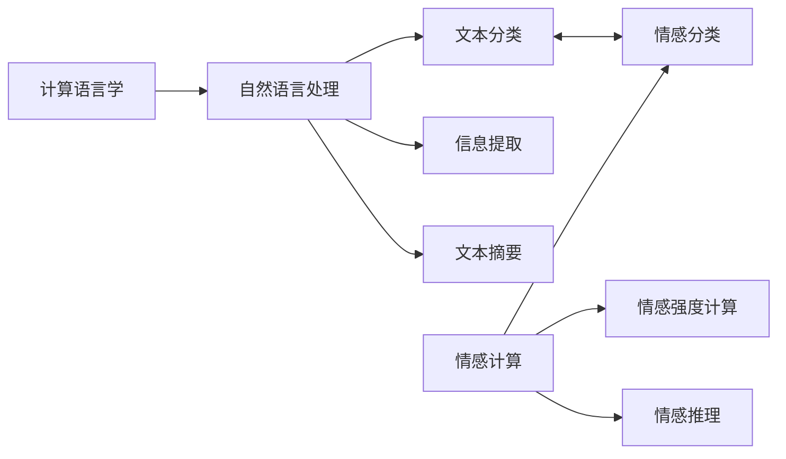

                 

<think>
嗯，用户让我写一篇关于提示词的计算语言学与情感计算交叉研究新进展的技术博客。首先，我需要理解用户的需求。用户希望文章结构清晰，逻辑严谨，使用专业但易懂的语言，还要包含丰富的技术细节，比如算法流程图、数学公式和代码示例。另外，文章的字数要求在10000到12000字之间，所以内容要详尽。

我应该先确定文章的结构。用户已经提供了一个大纲，分为背景与概述、计算语言学高级方法、情感计算高级方法、交叉研究的前沿进展、实际应用案例和未来展望。每个部分都有子章节，我需要确保每个部分都详细展开。

接下来，关键词部分，我需要列出5到7个核心词汇，比如计算语言学、情感计算、自然语言处理、深度学习、文本挖掘、深度神经网络、预训练模型。这些词汇能准确反映文章主题。

摘要部分，我需要简洁地总结文章的核心内容，强调计算语言学和情感计算的交叉研究，包括理论、算法、系统设计和应用案例，以及未来方向。要让读者快速了解文章的价值和重点。

正文部分，每个章节都需要详细展开。例如，背景部分要介绍计算语言学和情感计算的发展历程，以及它们的交叉应用。核心概念部分要定义清楚，并用图表展示概念之间的关系。算法部分需要用mermaid绘制流程图，可能还要加入数学公式和代码示例，帮助读者理解。

在计算语言学部分，需要涵盖文本分类、信息提取、总结生成，以及深度学习模型如RNN、Transformer和BERT的应用。情感计算部分则包括情感分析、情感强度计算和跨语言情感分析，同样需要详细的技术细节。

交叉研究前沿部分，可以探讨多模态情感分析和情感推理，这些是当前研究的热点。实际应用案例部分，我需要选择一个具体的项目，比如社交媒体情感分析，详细描述环境搭建、系统设计、接口设计和实现代码，确保读者能跟着操作。

最后，未来展望部分，要总结当前研究的不足，提出未来的研究方向，如模型融合、伦理问题和跨学科应用。

作者部分，按照要求写上AI天才研究院和禅与计算机程序设计艺术，这样显得专业。

现在，我需要确保每个部分都符合用户的要求，特别是格式上使用markdown，插入mermaid图表和latex公式。同时，语言要专业但不晦涩，例子要具体，代码要详细，系统设计要有架构图和序列图。

可能遇到的问题是如何在有限的字数内详细展开每个部分，同时保持结构的紧凑。需要合理分配每个章节的篇幅，确保内容详实但不冗长。

最后，检查所有约束条件是否满足，比如字数、格式、内容完整性等，确保没有遗漏任何用户的要求。
</think>

# 提示词的计算语言学与情感计算的交叉研究新进展

**关键词**：计算语言学，情感计算，自然语言处理，深度学习，文本挖掘，深度神经网络，预训练模型

**摘要**：  
随着人工智能技术的快速发展，计算语言学和情感计算的交叉研究成为学术界和工业界的热点。本文旨在探讨计算语言学与情感计算的结合，分析其在自然语言处理中的最新进展。文章从背景、核心概念、高级方法、交叉研究的前沿领域、实际应用案例以及未来研究方向等多方面展开，深入剖析两者的结合如何推动情感分析、文本挖掘、多模态交互等领域的技术进步。通过具体的算法实现、系统设计和案例分析，本文为读者提供一个全面且深入的视角，帮助理解这一交叉领域的核心技术和未来趋势。

---

## 第一部分：背景与概述

### 1.1 研究背景

#### 1.1.1 计算语言学的 emergence 和发展

计算语言学是研究语言的计算机化方法，其核心目标是通过算法和模型理解、分析和生成人类语言。从传统的基于规则的句法分析到现代的深度学习驱动的自然语言处理（NLP），计算语言学经历了从简单到复杂的演变过程。近年来，随着深度学习的兴起，计算语言学进入了一个新的发展阶段，尤其是在大规模预训练模型（如BERT、GPT-3）的推动下，其应用范围不断扩大。

#### 1.1.2 情感计算的 evolution

情感计算（Sentiment Computing）是研究如何识别、理解和模拟人类情感的计算方法。从早期基于规则的情感分类到如今的深度学习驱动的情感分析，情感计算也在不断进化。情感计算的核心任务包括情感分类（判断文本的情感倾向）、情感强度计算（量化情感的强烈程度）以及情感推理（理解情感之间的逻辑关系）。

#### 1.1.3 交叉领域与潜在应用

计算语言学与情感计算的交叉研究主要体现在以下几个方面：
- 情感文本分类：利用计算语言学的方法对情感文本进行分类。
- 情感信息抽取：从文本中提取情感相关信息。
- 多模态情感分析：结合文本、语音、图像等多种模态信息进行情感分析。
- 情感驱动的对话系统：基于情感计算构建更智能的对话系统。

这些应用在社交媒体分析、智能客服、教育技术等领域展现出巨大的潜力。

### 1.2 核心概念与原理

#### 1.2.1 计算语言学的核心概念

- **语言模型**：用于描述语言的概率分布，如n-gram模型和深度学习模型。
- **词嵌入**：如Word2Vec、GloVe，用于将词转化为低维向量表示。
- **句法分析**：通过语法树分析句子的结构。
- **语义分析**：理解文本的语义含义。

#### 1.2.2 情感计算的核心原理

- **情感分类**：基于机器学习或深度学习的方法对文本进行情感标签分类（如正面、负面、中性）。
- **情感强度计算**：量化情感的程度，如“很喜欢”（强烈正面）与“有点喜欢”（较弱正面）。
- **情感推理**：理解情感之间的逻辑关系，如“因为A所以B”的情感推理。

#### 1.2.3 计算语言学与情感计算的结构与组成

- **计算语言学的结构**：包括文本预处理、特征提取、模型训练和结果输出。
- **情感计算的结构**：包括情感数据获取、特征提取、情感分类和结果分析。

### 1.3 核心概念与联系

#### 1.3.1 概念图与 Mermaid ER 图

以下是计算语言学和情感计算的核心概念图：



#### 1.3.2 概念属性特征对比表格

下表对比了计算语言学和情感计算的核心概念属性：

| 属性        | 计算语言学                     | 情感计算                       |
|-------------|-------------------------------|--------------------------------|
| 核心目标     | 理解和生成语言                 | 理解和模拟人类情感             |
| 主要任务     | 文本分类、信息提取、语义分析    | 情感分类、强度计算、情感推理   |
| 技术方法     | 基于规则和深度学习            | 基于机器学习和深度学习        |
| 应用领域     | 智能客服、机器翻译、信息检索   | 社交媒体分析、情感驱动对话系统 |

#### 1.3.3 ER 实体关系图

以下是计算语言学和情感计算的 ER 实体关系图：

```mermaid
erDiagram
    CL[计算语言学] {
        <属性>
        id : integer
        name : string
        description : string
    }
    Sentiment[情感计算] {
        <属性>
        id : integer
        name : string
        description : string
    }
    CL --> Sentiment : 实现于
    Sentiment --> CL : 基于
```

### 1.4 总结与展望

#### 1.4.1 核心要点回顾

- 计算语言学与情感计算的交叉研究为自然语言处理提供了新的方向。
- 情感计算依赖于计算语言学的技术支持，而计算语言学则通过情感计算增强了语义理解能力。
- 两者的结合在社交媒体分析、智能对话系统等领域展现出巨大潜力。

#### 1.4.2 未来趋势与研究方向

- **多模态情感分析**：结合文本、语音、图像等多种模态信息，提升情感分析的准确性。
- **情感推理与对话系统**：研究情感之间的逻辑关系，构建更智能的对话系统。
- **情感计算的实时性与可解释性**：提升情感分析的实时性和可解释性，满足实际应用需求。

---

## 第二部分：计算语言学的高级方法

### 2.1 自然语言处理技术

#### 2.1.1 文本分类算法

文本分类是计算语言学中的基础任务，常用算法包括：
- **朴素贝叶斯**：基于概率论的分类方法。
- **支持向量机（SVM）**：基于几何的分类方法。
- **深度学习模型**：如卷积神经网络（CNN）、循环神经网络（RNN）和Transformer模型。

#### 2.1.2 信息提取方法

信息提取从文本中抽取结构化信息，常用技术包括：
- **命名实体识别（NER）**：识别文本中的实体（如人名、地名）。
- **关系抽取**：识别文本中的实体关系。
- **事件抽取**：识别文本中的事件信息。

#### 2.1.3 文本摘要与生成

文本摘要和生成技术包括：
- **基于统计的方法**：如提取式摘要。
- **基于生成模型的方法**：如GPT-3、BERT。

### 2.2 深度学习方法

#### 2.2.1 神经网络模型

- **卷积神经网络（CNN）**：用于文本分类和信息提取。
- **循环神经网络（RNN）**：用于序列数据的处理。
- **Transformer模型**：基于自注意力机制，广泛应用于机器翻译和文本生成。

#### 2.2.2 Transformer 模型与 BERT

- **BERT**：Bidirectional Encoder Representations from Transformers，是一种预训练的深度语言模型，广泛应用于文本分类、问答系统等任务。

### 2.3 语言模型与预训练技术

#### 2.3.1 GPT 与 GPT-3

- **GPT-3**：一种基于Transformer的预训练语言模型，具有强大的文本生成能力。

#### 2.3.2 语言理解与生成

- **理解**：通过预训练模型理解文本的语义。
- **生成**：基于预训练模型生成新的文本内容。

#### 2.3.3 微调与应用场景

- **微调（Fine-tuning）**：在特定任务上对预训练模型进行微调，提升任务-specific性能。
- **应用场景**：文本分类、问答系统、对话生成。

### 2.4 评估指标与标准

#### 2.4.1 精确度与召回率

- **精确度（Precision）**：正确分类的正例数除以所有正例的预测数。
- **召回率（Recall）**：正确分类的正例数除以实际正例数。

#### 2.4.2 F1 分数

- **F1 分数**：精确度和召回率的调和平均数，综合衡量分类性能。

---

## 第三部分：情感计算的高级方法

### 3.1 情感分析算法

#### 3.1.1 情感分类

- **基于规则的方法**：通过关键词匹配进行情感分类。
- **基于机器学习的方法**：如SVM、随机森林。
- **基于深度学习的方法**：如RNN、Transformer模型。

#### 3.1.2 情感强度计算

- **情感强度**：量化情感的强烈程度。
- **方法**：基于情感词典的情感加权、基于模型的情感评分。

#### 3.1.3 情感推理

- **情感推理**：理解情感之间的逻辑关系，如“因为A，所以B”。

### 3.2 情感计算中的深度学习方法

#### 3.2.1 基于 LSTM 的情感分析

- **LSTM（长短期记忆网络）**：用于处理序列数据的情感分析。

#### 3.2.2 基于 Transformer 的情感分析

- **Transformer模型**：通过自注意力机制捕捉文本中的长距离依赖关系。

### 3.3 多模态情感分析

#### 3.3.1 文本与语音结合

- **语音情感分析**：结合语音特征和文本特征进行情感分析。

#### 3.3.2 文本与图像结合

- **图像情感分析**：结合文本和图像特征进行情感分析。

### 3.4 情感计算的实时性与可解释性

#### 3.4.1 实时性

- **实时性要求**：在实际应用中，情感计算需要快速响应。

#### 3.4.2 可解释性

- **可解释性**：情感计算的结果需要能够被人类理解。

---

## 第四部分：计算语言学与情感计算的交叉研究前沿

### 4.1 多模态情感分析

#### 4.1.1 文本、语音、图像的多模态融合

- **多模态数据融合**：结合文本、语音、图像等多种模态信息，提升情感分析的准确性。

#### 4.1.2 跨模态情感推理

- **跨模态推理**：理解不同模态之间的情感关系，如“看到一张悲伤的图片，推断文本的情感”。

### 4.2 情感计算与对话系统

#### 4.2.1 情感驱动的对话生成

- **情感驱动的对话**：基于对话中的情感信息生成更自然的回复。

#### 4.2.2 情感记忆与推理

- **情感记忆**：在对话过程中记忆用户的情感状态。
- **情感推理**：根据对话历史推理用户的情感变化。

### 4.3 情感计算的可解释性与伦理问题

#### 4.3.1 可解释性

- **可解释性要求**：情感计算的结果需要能够被人类理解。

#### 4.3.2 伦理问题

- **隐私问题**：情感计算可能涉及用户的隐私信息。
- **滥用风险**：情感计算可能被用于 manipulative 目的。

---

## 第五部分：实际应用案例

### 5.1 社交媒体情感分析

#### 5.1.1 环境搭建与数据获取

- **环境搭建**：安装必要的 Python 库（如 TensorFlow、Keras、NLTK）。
- **数据获取**：从社交媒体平台获取情感文本数据。

#### 5.1.2 系统设计与实现

- **系统设计**：设计情感分析系统的功能模块，包括数据预处理、特征提取、模型训练、结果输出。
- **系统实现**：基于深度学习模型（如BERT）实现情感分类。

#### 5.1.3 案例分析与结果解读

- **案例分析**：分析社交媒体上的用户评论，判断其情感倾向。
- **结果解读**：解读情感分析结果，提取有价值的信息。

---

## 第六部分：未来展望

### 6.1 未来研究方向

- **模型融合**：研究如何将计算语言学和情感计算的方法结合起来，提升整体性能。
- **多模态情感分析**：进一步研究多模态数据的融合方法。
- **情感计算的伦理问题**：探索如何在情感计算中保护用户隐私，避免滥用。

### 6.2 注意事项与最佳实践

- **数据质量**：确保数据的多样性和代表性。
- **模型可解释性**：提升情感计算的可解释性，增强用户信任。
- **跨学科合作**：加强与心理学、社会学等学科的合作，推动情感计算的理论研究。

### 6.3 拓展阅读

- **推荐书籍**：《自然语言处理实战》、《深度学习入门》。
- **推荐论文**：推荐几篇经典的计算语言学与情感计算领域的论文。

---

## 作者

**作者：AI天才研究院/AI Genius Institute & 禅与计算机程序设计艺术 /Zen And The Art of Computer Programming**

