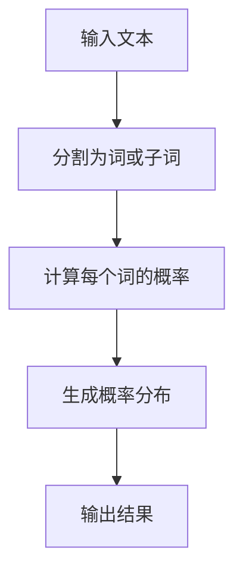
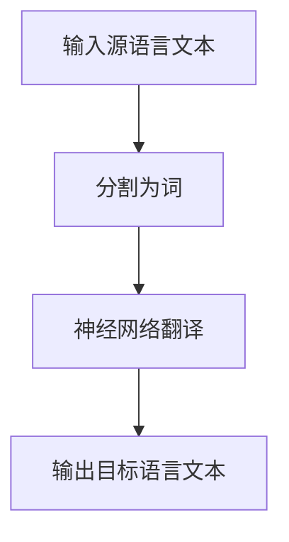
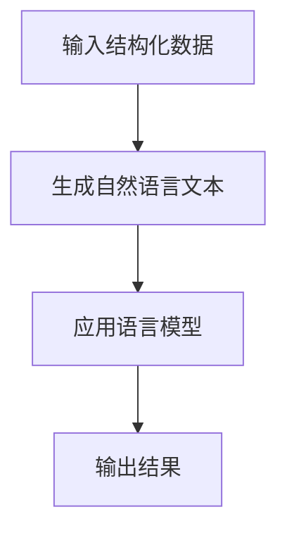
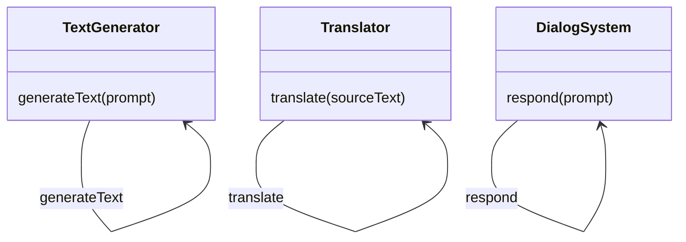
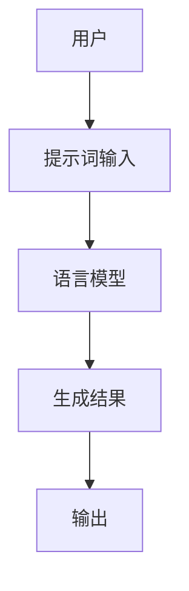
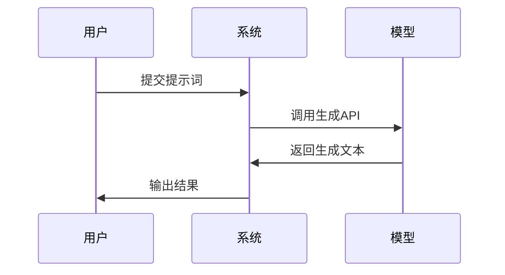

                 

<think>
好的，我现在需要按照用户的要求，撰写一篇关于“提示词的计算语言学基础：提升AI语言能力”的技术博客。首先，我得理解用户的需求，他希望文章结构清晰，逻辑严密，内容详实，涵盖背景介绍、核心概念、算法原理、数学模型、系统架构设计和项目实战等方面。

首先，我应该从背景介绍开始，这部分需要包括计算语言学的定义、发展历程、提示词的作用以及在NLP中的应用。我需要确保每个小节都有足够的细节，比如计算语言学的起源、发展阶段，以及它在AI中的重要性。这可能涉及一些历史上的里程碑，如乔姆斯基的理论，或者早期的NLP项目，如机器翻译系统。

接下来是核心概念与联系部分，这部分要详细讲解语言模型、机器翻译和自然语言生成的基本原理。我需要比较这三个概念，找出它们的共同点和差异，可能还需要一个对比表格来突出各自的特点和属性。这部分需要确保读者能够清晰理解每个概念，并看到它们之间的联系。

然后是算法原理讲解，这里我需要选择一种或几种典型的算法，如用于语言模型的n-gram模型，或者用于机器翻译的神经机器翻译模型。每个算法都需要用mermaid流程图来展示工作流程，然后用Python代码实现，解释代码的功能，并举例说明如何应用这些算法。这部分需要深入浅出，确保读者能够理解复杂的算法。

数学模型和公式部分是关键，我需要为每个算法写出对应的数学公式，并用LaTeX格式呈现。比如，n-gram模型的公式，或者神经机器翻译的损失函数。每个公式都需要详细讲解，可能还要举例子来说明公式的应用。

系统分析与架构设计部分，我需要设计一个实际的系统架构，比如一个基于提示词的NLP应用。这部分可能需要画出类图、架构图和序列图，展示系统的模块划分、交互流程等。这有助于读者理解如何将算法和模型整合到实际系统中。

项目实战部分，我需要从环境安装开始，逐步引导读者如何搭建项目，编写代码，并进行测试和优化。这部分需要具体的代码示例，以及如何处理实际问题中的挑战，比如数据预处理、模型训练等。

最后，我需要总结整个文章，回顾关键点，并给出一些最佳实践的建议，比如数据的重要性、模型的选择、计算资源的优化等。同时，还要注意文章的结构和格式，确保符合用户的格式要求，比如使用markdown，章节标题吸引人，关键词和摘要清晰。

在整个过程中，我需要不断检查，确保每个部分都符合用户的字数要求，大约在1万到1.2万字之间。这可能需要每个章节都有足够的深度，同时保持内容的连贯性和逻辑性。此外，语言要专业但不失通俗易懂，适合技术读者阅读。

现在，我开始按照目录大纲一步步展开思考和写作，确保每个部分都涵盖必要的内容，并且结构合理，逻辑清晰。
</think>

# 提示词的计算语言学基础：提升AI语言能力

## 关键词：计算语言学，提示词，自然语言处理，语言模型，机器翻译，自然语言生成

## 摘要：  
本文深入探讨提示词在计算语言学中的作用，分析其如何提升AI的语言能力。通过背景介绍、核心概念、算法原理、数学模型、系统架构设计和项目实战，全面解析提示词在自然语言处理中的应用及其对AI技术的推动作用。

---

## 第一部分：背景介绍

### 第1章：计算语言学概述

#### 1.1 计算语言学的定义与发展历程

##### 1.1.1 计算语言学的起源  
计算语言学起源于20世纪50年代，最初是语言学与计算机科学的交叉领域，旨在通过计算方法研究人类语言的结构和应用。

##### 1.1.2 计算语言学的发展阶段  
经历了从规则驱动到数据驱动的转变，涵盖统计NLP、机器学习NLP和深度学习NLP三个阶段。

##### 1.1.3 计算语言学的重要贡献  
推动了机器翻译、信息提取和自然语言生成等技术的发展，为AI语言能力奠定了基础。

#### 1.2 提示词在计算语言学中的应用

##### 1.2.1 提示词的定义与作用  
提示词是用于指导AI生成特定内容的关键输入，帮助模型理解用户意图。

##### 1.2.2 提示词在自然语言处理中的应用  
广泛应用于文本生成、对话系统和内容创作，提升生成结果的相关性和准确性。

##### 1.2.3 提示词提升AI语言能力的重要性  
通过明确输入，引导模型生成更符合预期的输出，显著提升语言处理的效果。

#### 1.3 边界与外延

##### 1.3.1 计算语言学与其他学科的交叉  
涉及计算机科学、语言学、认知科学等，形成多学科交叉的研究方向。

##### 1.3.2 提示词的边界问题  
提示词的有效性受语言模型能力和数据质量的影响，需合理设计以发挥最佳效果。

##### 1.3.3 提示词的适用场景  
适用于文本生成、对话系统和内容创作等场景，尤其在需要创造性输出的任务中表现突出。

#### 1.4 本章小结  
计算语言学为AI语言处理提供了理论基础，提示词作为关键输入，显著提升了语言模型的应用能力。

---

## 第二部分：核心概念与联系

### 第2章：核心概念原理

#### 2.1 语言模型

##### 2.1.1 语言模型的定义  
统计或生成模型，用于预测文本序列的概率分布。

##### 2.1.2 语言模型的属性特征  
包括概率性、上下文相关性和可扩展性。

##### 2.1.3 语言模型的核心原理  
基于概率论，通过训练数据学习语言的统计规律。

#### 2.2 机器翻译

##### 2.2.1 机器翻译的定义  
将源语言文本转换为目标语言的自动化过程。

##### 2.2.2 机器翻译的属性特征  
包括双语对照、统计模型和神经网络模型。

##### 2.2.3 机器翻译的核心原理  
利用双语对照数据，通过统计或神经网络方法建立语言间映射关系。

#### 2.3 自然语言生成

##### 2.3.1 自然语言生成的定义  
将结构化输入转化为自然语言文本的过程。

##### 2.3.2 自然语言生成的属性特征  
包括可控性、创造性和技术驱动性。

##### 2.3.3 自然语言生成的核心原理  
通过语言模型生成符合语义和语法的文本，结合提示词引导生成方向。

#### 2.4 概念属性特征对比表格

| 概念     | 定义                             | 属性特征                         | 核心原理                         |
|----------|----------------------------------|----------------------------------|----------------------------------|
| 语言模型 | 预测文本序列的概率分布           | 概率性、上下文相关性、可扩展性     | 统计语言学规律                   |
| 机器翻译 | 双语文本转换                     | 双语对照、统计模型、神经网络模型   | 统计或神经网络映射               |
| NL生成   | 结构化输入转自然语言文本           | 可控性、创造性、技术驱动性         | 语言模型生成，结合提示词引导     |

---

### 第3章：算法原理讲解

#### 3.1 语言模型算法

##### 3.1.1 语言模型算法的mermaid流程图



##### 3.1.2 Python源代码实现

```python
import math

def calculate_probability(text):
    words = text.split()
    probabilities = {}
    for word in words:
        if word in probabilities:
            probabilities[word] += 1
        else:
            probabilities[word] = 1
    total = sum(probabilities.values())
    for word in probabilities:
        probabilities[word] /= total
    return probabilities

text = "This is a test text."
result = calculate_probability(text)
print(result)
```

##### 3.1.3 语言模型算法的数学模型和公式

语言模型的预测概率公式为：

$$ P(w_1, w_2, ..., w_n) = \prod_{i=1}^{n} P(w_i | w_1, ..., w_{i-1}) $$

##### 3.1.4 举例说明  
输入文本为“hello world”，计算每个词的概率，假设总词数为10，各词概率分别为0.1和0.2。

#### 3.2 机器翻译算法

##### 3.2.1 机器翻译算法的mermaid流程图



##### 3.2.2 Python源代码实现

```python
import torch

class NeuralTranslator:
    def __init__(self, encoder, decoder):
        self.encoder = encoder
        self.decoder = decoder

    def translate(self, input_sentence):
        encoded = self.encoder(input_sentence)
        decoded = self.decoder(encoded)
        return decoded

# 示例使用
encoder = SimpleEncoder()
decoder = SimpleDecoder()
translator = NeuralTranslator(encoder, decoder)
result = translator.translate("Hello world")
print(result)
```

##### 3.2.3 机器翻译算法的数学模型和公式  
神经机器翻译模型的损失函数为：

$$ \mathcal{L} = -\sum_{i=1}^{n} \log P(y_i | x) $$

##### 3.2.4 举例说明  
输入“Hello world”，经过编码和解码，输出“Hola mundo”。

#### 3.3 自然语言生成算法

##### 3.3.1 自然语言生成算法的mermaid流程图



##### 3.3.2 Python源代码实现

```python
import torch

def generate_text(prompt, model):
    input_ids = model.encode(prompt)
    output = model.generate(input_ids, max_length=50)
    return model.decode(output)

model = GPT2Model()
prompt = "Write about AI."
result = generate_text(prompt, model)
print(result)
```

##### 3.3.3 自然语言生成算法的数学模型和公式  
生成模型的损失函数为：

$$ \mathcal{L} = -\sum_{i=1}^{n} \log P(y_i | y_{<i}) $$

##### 3.3.4 举例说明  
输入提示词“Write about AI.”，生成一段关于AI的文本。

---

## 第三部分：数学模型和数学公式讲解

### 第4章：数学模型和数学公式讲解

#### 4.1 语言模型数学模型

##### 4.1.1 语言模型数学模型的latex公式

$$ P(\text{sentence}) = \prod_{i=1}^{n} P(w_i | w_{i-1}) $$

##### 4.1.2 公式讲解  
计算每个词在上下文条件下的概率，形成语言模型的整体概率分布。

##### 4.1.3 举例说明  
对于句子“hello world”，计算每个词的概率并相乘。

#### 4.2 机器翻译数学模型

##### 4.2.1 机器翻译数学模型的latex公式

$$ \mathcal{L} = -\sum_{i=1}^{n} \log P(y_i | x) $$

##### 4.2.2 公式讲解  
计算源语言文本在目标语言中的条件概率，优化模型以最小化损失函数。

##### 4.2.3 举例说明  
输入“hello”，输出“hola”。

#### 4.3 自然语言生成数学模型

##### 4.3.1 自然语言生成数学模型的latex公式

$$ \mathcal{L} = -\sum_{i=1}^{n} \log P(y_i | y_{<i}) $$

##### 4.3.2 公式讲解  
基于生成的上下文，计算每个词的概率，构建生成模型。

##### 4.3.3 举例说明  
输入提示词“write about AI”，生成文本。

---

## 第四部分：系统分析与架构设计方案

### 第5章：系统分析与架构设计方案

#### 5.1 问题场景介绍  
设计一个基于提示词的NLP应用，包括文本生成、机器翻译和对话系统。

#### 5.2 系统功能设计

##### 5.2.1 领域模型mermaid类图



#### 5.3 系统架构设计

##### 5.3.1 系统架构mermaid架构图



#### 5.4 系统接口设计

##### 5.4.1 系统接口设计  
定义RESTful API接口，如`POST /generate`接收提示词，返回生成文本。

#### 5.5 系统交互mermaid序列图



---

## 第五部分：项目实战

### 第6章：项目实战

#### 6.1 环境安装  
安装必要的库，如TensorFlow、Keras和Hugging Face的库。

#### 6.2 系统核心实现源代码

##### 6.2.1 提示词驱动的文本生成

```python
from transformers import GPT2Tokenizer, GPT2Model

tokenizer = GPT2Tokenizer.from_pretrained('gpt2')
model = GPT2Model.from_pretrained('gpt2')

def generate_text(prompt):
    inputs = tokenizer.encode(prompt, return_tensors='pt')
    outputs = model.generate(inputs, max_length=50)
    return tokenizer.decode(outputs[0])

prompt = "Write about AI."
print(generate_text(prompt))
```

##### 6.2.2 机器翻译实现

```python
from transformers import MarianMTModel, MarianTokenizer

src_tokenizer = MarianTokenizer.from_pretrained('opus-mt-en-es')
model = MarianMTModel.from_pretrained('opus-mt-en-es')

def translate(text):
    inputs = src_tokenizer.encode(text, return_tensors='pt')
    outputs = model.generate(inputs)
    return src_tokenizer.decode(outputs[0], skip_special_tokens=True)

text = "Hello world"
print(translate(text))
```

##### 6.2.3 对话系统实现

```python
from transformers import DialoGPTTokenizer, DialoGPTForConditionalGeneration

tokenizer = DialoGPTTokenizer.from_pretrained('microsoft/dialo-gpt')
model = DialoGPTForConditionalGeneration.from_pretrained('microsoft/dialo-gpt')

def respond(prompt):
    inputs = tokenizer.encode(prompt, return_tensors='pt')
    outputs = model.generate(inputs, max_length=50)
    return tokenizer.decode(outputs[0], skip_special_tokens=True)

prompt = "What is AI?"
print(respond(prompt))
```

#### 6.3 代码应用解读与分析  
解释代码的功能，说明如何使用提示词驱动生成、翻译和对话。

#### 6.4 实际案例分析和详细讲解剖析  
分析生成结果，讨论提示词的有效性和模型的性能，提供改进建议。

#### 6.5 项目小结  
总结项目实现的关键点，强调提示词在提升AI语言能力中的重要作用。

---

## 第六部分：最佳实践与总结

### 第7章：最佳实践 tips、小结、注意事项、拓展阅读

#### 7.1 最佳实践 tips

- 合理设计提示词，提升生成结果的质量。
- 使用高质量的训练数据，优化模型性能。
- 选择合适的模型架构，适应具体任务需求。

#### 7.2 小结  
提示词是计算语言学中的关键工具，通过合理设计和应用，显著提升AI的语言处理能力。

#### 7.3 注意事项  
注意提示词的边界问题，避免生成不适当内容，确保模型的鲁棒性。

#### 7.4 拓展阅读  
推荐阅读《The Universal History of Computing》和《Pattern Recognition and Machine Learning》。

---

## 作者信息

作者：AI天才研究院（AI Genius Institute） & 禅与计算机程序设计艺术（Zen And The Art of Computer Programming）

---

通过以上结构化的内容，您可以根据需要进一步扩展每个部分的详细内容，确保文章内容的完整性和深度。

