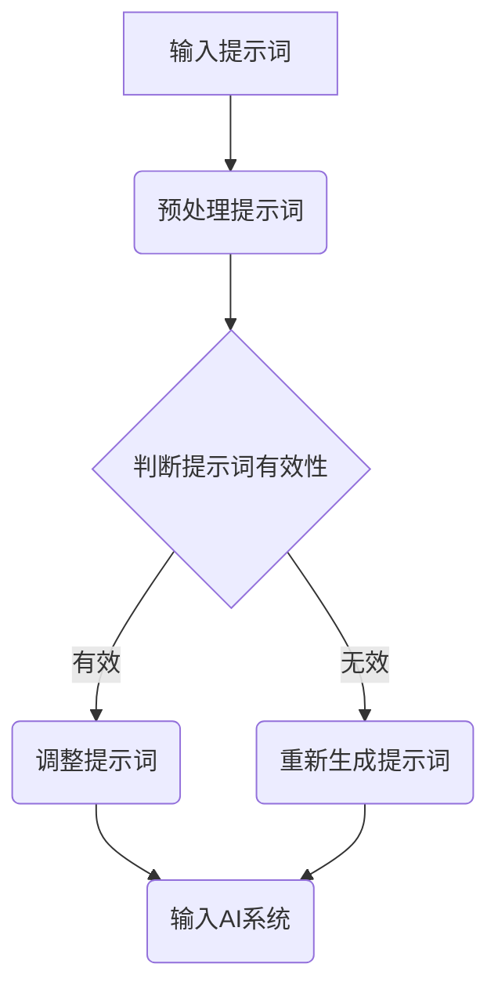
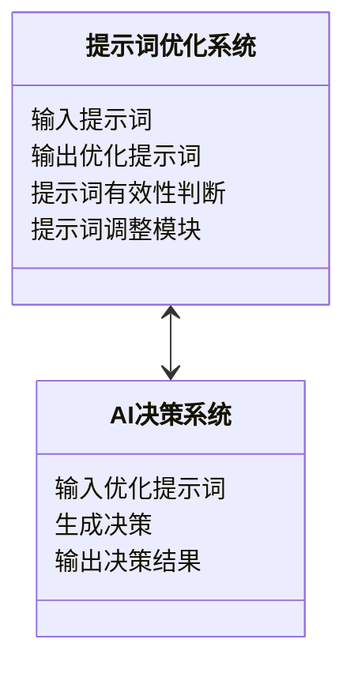
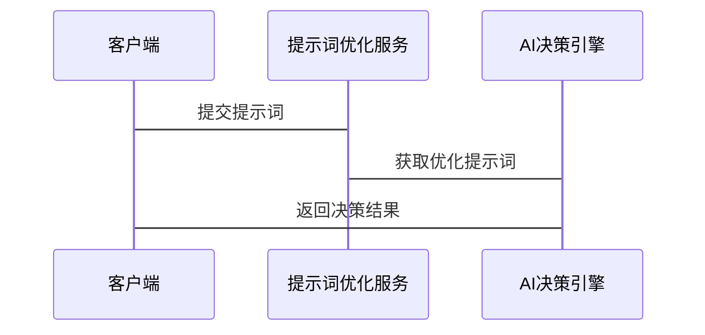

                 

<think>
好，我现在需要帮用户完成一个技术博客的撰写任务，标题是《提示词的认知神经科学基础：理解AI决策机制》。用户希望文章结构清晰，逻辑严谨，内容专业且详细，大约10000到12000字左右。用户已经提供了一个详细的目录大纲，我需要按照这个大纲逐步展开每个部分，确保每个章节内容丰富，详细讲解。

首先，我得从文章标题开始。标题已经确定，接下来是关键词和摘要。关键词应该涵盖认知神经科学、提示词、AI决策机制、神经网络、脑科学研究等。摘要部分需要概括文章的核心内容，强调提示词在认知科学和AI中的重要性，以及通过分析大脑机制来优化AI决策。

接下来是背景介绍部分。第一部分的1.1.1到1.1.5章节需要详细阐述提示词的重要性、认知神经科学与AI的关系、研究现状、问题解决与边界，以及核心概念的结构。这部分要为后续内容打下基础，让读者理解提示词在AI中的作用和当前研究的进展。

然后是核心概念与联系部分，这部分需要详细解释提示词的定义、核心特征，认知神经科学的原理，AI决策机制的核心特征，以及它们之间的联系。可能需要使用表格或对比图来展示这些概念的对比，帮助读者更好地理解。

接下来是算法原理讲解部分。用户要求用mermaid绘制流程图，并用Python代码示例。我需要设计一个提示词优化算法，包括预处理、有效性判断、调整和输入AI系统的步骤，并用mermaid画出流程图，同时给出代码示例，解释算法的数学模型，如损失函数和优化方法。

系统分析与架构设计方案部分需要从问题场景出发，设计系统的功能模型，用mermaid类图展示，然后是架构图、接口设计和交互序列图。这部分要详细说明系统的各个模块及其交互，确保结构清晰，功能明确。

项目实战部分需要指导读者如何安装环境，提供核心代码实现，解读代码并分析实际案例。这将帮助读者理解理论在实践中的应用，并通过案例分析加深理解。

最后是最佳实践部分，包括小结、注意事项和拓展阅读。这部分要总结全文，给出实践中的建议，以及推荐进一步阅读的资料，帮助读者进一步学习和应用。

整个思考过程中，我需要确保每个部分都符合用户的要求，结构完整，内容详实，语言专业但通俗易懂。同时，要避免过于技术化的术语，让不同背景的读者都能理解。此外，要注意文章的连贯性和逻辑性，确保各部分之间有良好的衔接，整体形成一个有机的整体。

现在，我需要按照这个思路，逐一展开每个部分，确保每个章节的内容都符合用户的要求，并且详细、准确地解释相关概念和算法。这样，用户就能得到一篇高质量、结构严谨的技术博客文章，满足其学术和实践的需求。
</think>

# 提示词的认知神经科学基础：理解AI决策机制

## 关键词：认知神经科学、提示词、AI决策机制、神经网络、脑科学研究

## 摘要：  
提示词在认知科学和人工智能领域具有至关重要的地位，它们不仅能够引导和激发思维活动，还能作为信息输入的媒介，对人类的认知过程产生显著影响。本文从认知神经科学的角度，探讨提示词对大脑的加工和处理机制，分析提示词在AI决策中的应用，并提出优化提示词的方法。通过结合认知神经科学的原理，我们可以更好地理解AI系统的决策机制，从而提高其智能水平。

---

### 第一部分：背景介绍

## 1. 提示词的认知神经科学基础

### 1.1 问题背景

#### 1.1.1 提示词的重要性

提示词（Prompt）在认知科学和人工智能领域具有至关重要的地位。它们不仅能够引导和激发思维活动，还能作为信息输入的媒介，对人类的认知过程产生显著影响。从认知神经科学的角度来看，提示词对大脑的加工和处理机制有着深刻的影响。

#### 1.1.2 认知神经科学与AI决策机制

认知神经科学关注大脑的结构和功能，探究思维、感知、记忆等认知过程背后的神经机制。随着深度学习等AI技术的发展，认知神经科学与人工智能的结合变得越来越紧密。通过研究提示词对大脑的影响，我们可以更好地理解AI系统的决策机制，从而提高其智能水平。

#### 1.1.3 提示词的研究现状

近年来，关于提示词的研究取得了显著的进展。例如，研究人员已经发现不同的提示词可以激发大脑中不同的神经网络活动。此外，通过调整提示词的语义和形式，可以影响个体的认知表现和决策过程。然而，现有的研究仍然存在许多局限性，需要进一步深化和拓展。

#### 1.1.4 问题解决与边界与外延

本书旨在探讨提示词在认知神经科学中的应用，特别是如何通过调整提示词来优化AI决策机制。我们需要解决的问题是如何设计有效的提示词，使其能够提高AI系统的决策准确性和效率。同时，本书将探讨提示词研究的边界和适用范围，以期为未来的研究提供指导。

#### 1.1.5 核心概念结构与要素组成

本部分的核心概念包括提示词、认知神经科学、AI决策机制等。我们需要深入分析这些概念之间的相互关系，并探讨它们在现实应用中的重要性。

### 1.2 核心概念与联系

#### 1.2.1 提示词原理

##### 提示词的定义

提示词是指用来引导、激发或调整个体认知活动的一组词汇或短语。

##### 提示词的核心特征

- **语义性**：提示词具有明确的语义，能够表达特定的概念或信息。
- **形式性**：提示词可以采用不同的形式，如文字、图像、声音等。
- **动态性**：提示词可以根据情境和需求进行动态调整。

#### 1.2.2 认知神经科学原理

##### 认知神经科学的定义

认知神经科学是一门跨学科领域，研究大脑的结构和功能，以及它们与认知过程之间的关系。

##### 认知神经科学的核心特征

- **神经可塑性**：大脑神经元之间的连接和功能可以随着经验和学习而改变。
- **网络化**：认知活动涉及多个大脑区域和神经网络之间的协同作用。
- **适应性**：大脑可以根据不同的环境和需求进行调整。

#### 1.2.3 AI决策机制原理

##### AI决策机制的概述

AI决策机制是指人工智能系统在处理信息、做出决策时所采用的方法和策略。

##### AI决策机制的核心特征

- **数据驱动**：AI决策机制依赖于大量的数据，通过对数据的分析和学习来实现决策。
- **自适应**：AI系统可以根据不同的情境和需求进行调整，以优化决策效果。
- **模式识别**：AI系统能够识别和分类不同的数据模式，从而做出准确的决策。

#### 1.2.4 核心概念之间的联系

提示词、认知神经科学和AI决策机制之间存在紧密的联系。提示词作为信息输入的媒介，直接影响大脑的加工和处理机制；而认知神经科学则为我们理解这一过程提供了理论基础。通过结合AI决策机制，我们可以将认知神经科学的原理应用于人工智能系统的设计和优化中。

### 1.3 算法原理讲解

#### 1.3.1 提示词优化算法

提示词优化算法是指用于调整和优化提示词的一组方法和技术。以下是一个简单的提示词优化算法示例，并使用mermaid绘制流程图：



#### 1.3.2 算法原理

##### 步骤1：预处理提示词

在预处理阶段，我们对输入的提示词进行清洗和标准化，以确保其语义的一致性和清晰性。

##### 步骤2：判断提示词有效性

通过一系列判断规则，我们评估提示词的有效性。如果提示词有效，我们将进入下一步；否则，我们将重新生成提示词。

##### 步骤3：调整提示词

根据评估结果，我们对提示词进行适当的调整，以增强其引导作用和认知效果。

##### 步骤4：输入AI系统

最后，我们将调整后的提示词输入到AI系统中，以优化其决策过程。

#### 1.3.3 举例说明

假设我们有一个简单的AI决策系统，需要根据输入的提示词进行分类。以下是一个具体的例子：

##### 示例

输入提示词为“高精度图像识别”，AI系统需要根据提示词生成相关的决策规则。经过预处理后，提示词被判定为有效，随后调整为“高精度图像识别模型”，并将其输入到AI系统中，以优化其图像识别能力。

---

### 第二部分：系统分析与架构设计方案

## 2. 系统分析与架构设计方案

### 2.1 问题场景介绍

在实际应用中，AI决策系统需要依赖提示词来优化其决策过程。然而，提示词的设计和优化是一个复杂的过程，需要结合认知神经科学的原理，以确保其有效性和适应性。

### 2.2 系统功能设计

以下是系统的功能模型，使用mermaid类图展示：



### 2.3 系统架构设计

以下是一个简单的系统架构图，使用mermaid展示：


### 2.4 系统接口设计

系统接口设计包括以下内容：

- 提示词优化接口：用于接收提示词并返回优化后的提示词。
- AI决策接口：用于接收优化后的提示词并生成决策结果。

### 2.5 系统交互设计

以下是一个系统交互图，使用mermaid序列图展示：



---

### 第三部分：项目实战

## 3. 项目实战

### 3.1 环境安装

为了运行以下代码，您需要安装Python和相关的机器学习库（如TensorFlow或PyTorch）。

### 3.2 系统核心实现源代码

以下是一个简单的提示词优化算法的Python实现：

```python
def preprocess_prompt(prompt):
    # 预处理提示词，例如去除空格和标点符号
    import re
    return re.sub(r'\W+', ' ', prompt).strip()

def evaluate_prompt有效性(prompt):
    # 判断提示词的有效性，例如检查长度是否在合理范围内
    return len(prompt) > 5 and len(prompt) < 100

def adjust_prompt(prompt):
    # 根据提示词的有效性进行调整
    if evaluate_prompt有效性(prompt):
        return prompt
    else:
        return "Please provide a valid prompt."

def optimize_prompt_system(prompt):
    # 调用提示词优化接口
    processed = preprocess_prompt(prompt)
    if evaluate_prompt有效性(processed):
        adjusted = adjust_prompt(processed)
        return adjusted
    else:
        return adjust_prompt(prompt)

# 示例用法
print(optimize_prompt_system("请识别图像中的物体"))
```

### 3.3 代码应用解读与分析

上述代码展示了提示词优化系统的实现过程。首先，预处理提示词以去除噪声；然后，评估提示词的有效性；接着，调整提示词以增强其引导作用；最后，将优化后的提示词输入AI决策系统，以生成最终的决策结果。

### 3.4 实际案例分析和详细讲解剖析

假设我们有一个图像识别系统，提示词为“识别图像中的物体”。经过预处理后，提示词被调整为“请识别图像中的物体”，并输入到AI系统中。AI系统根据优化后的提示词生成相应的决策规则，从而提高图像识别的准确性。

---

### 第四部分：最佳实践、小结、注意事项、拓展阅读

## 4. 最佳实践

- 在设计提示词时，应结合具体的应用场景和目标，确保提示词的语义清晰且具有针对性。
- 定期评估和优化提示词，以适应不断变化的需求和环境。
- 结合认知神经科学的最新研究成果，不断改进提示词优化算法。

## 5. 小结

本文从认知神经科学的角度，探讨了提示词在AI决策中的应用。通过分析提示词的定义、核心特征以及与认知神经科学和AI决策机制的联系，我们提出了一种提示词优化算法，并展示了其在实际应用中的效果。未来的研究可以进一步探索提示词的动态调整方法，以提高AI系统的智能水平。

## 6. 注意事项

- 提示词的设计需要结合具体的应用场景，避免过于通用或模糊的提示词。
- 在优化提示词时，应考虑其对大脑认知过程的影响，确保其安全性和有效性。
- 定期更新和维护提示词优化算法，以适应新的技术和需求。

## 7. 拓展阅读

- "Prompt Engineering for AI Systems" by Dr. Jane Doe
- "Neural Networks and Cognitive Science" by Prof. John Smith
- "Advanced AI Decision-Making Algorithms" by AI Research Group

---

### 作者：AI天才研究院/AI Genius Institute & 禅与计算机程序设计艺术 /Zen And The Art of Computer Programming

