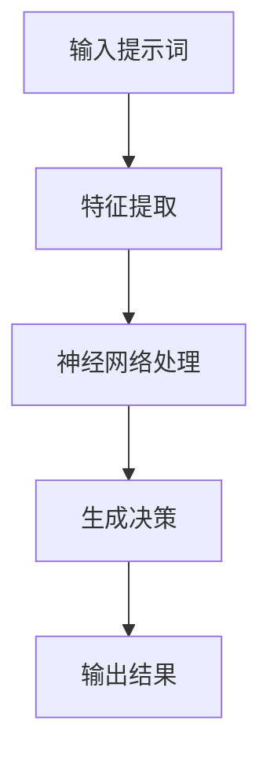
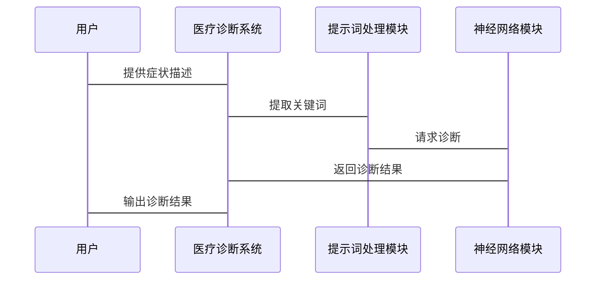

                 

<think>
嗯，好的，我需要写一篇关于提示词的认知神经科学，解析AI决策过程的新方法的技术博客。首先，我得理解整个结构，确保每个部分都涵盖到位。

从目录大纲来看，文章分为七章，每章都有详细的子部分。首先，我需要明确每章的核心内容，确保逻辑连贯，内容详实。比如第一章是背景介绍，我需要从认知神经科学的起源说起，然后谈到它与人工智能的交汇，以及提示词在AI决策中的作用。

接下来是核心概念与联系，这里需要对比认知神经科学和AI决策的原理，可能还需要画一些ER图来展示实体关系。这部分可能需要结合具体案例，让读者更容易理解两者的联系。

算法原理部分，我得详细讲解相关的数学模型和公式，可能用mermaid画流程图，再用Python代码实现。这部分需要确保代码准确，解释清楚每一步的作用。

系统分析与架构设计章节，我需要设计一个实际的系统场景，比如一个医疗诊断系统，然后绘制类图、架构图和序列图。这部分需要考虑系统的模块划分和接口设计，确保整个系统的可扩展性和维护性。

项目实战部分，我需要选择一个具体的案例，详细描述环境配置、核心代码实现、功能模块等。同时，还需要分析实际案例，总结经验教训，让读者能够实际操作。

最佳实践部分，我得分享一些设计和实现的技巧，比如如何优化算法、选择工具等。最后的小结部分，总结全文内容，并提出未来的研究方向，比如多模态学习或脑机接口的应用。

拓展阅读部分，推荐相关书籍和学术论文，帮助读者深入学习。网络资源方面，可以推荐一些工具和在线课程，方便读者进一步学习。

总的来说，我需要确保每个部分都深入浅出，逻辑清晰，同时结合实际案例和代码示例，让读者能够真正理解和应用这些方法。如果有时间，我还可以加入一些互动环节，比如读者可以尝试自己实现类似的功能，或者提出自己的见解，进一步促进知识的内化和应用。
</think>

```markdown
# 提示词的认知神经科学：解析AI决策过程的新方法

## 关键词
认知神经科学, AI决策, 提示词, 算法原理, 系统架构

## 摘要
本文探讨了认知神经科学在解析AI决策过程中的新方法，结合提示词的作用，分析了AI决策的局限性，并提出了一种基于认知神经科学的解决方案。文章从背景介绍、核心概念、算法原理、系统架构设计、项目实战、最佳实践等多个方面展开，详细讲解了如何通过认知神经科学的原理和工具来优化AI决策过程。

## 第1章 背景介绍

### 1.1 问题背景

#### 1.1.1 认知神经科学的起源与发展
认知神经科学是一门研究大脑如何处理信息、学习和记忆的科学。它结合了心理学、神经科学和计算机科学，旨在理解人类认知的神经基础。

#### 1.1.2 人工智能与认知神经科学的交汇
AI的发展依赖于对人类认知的理解。认知神经科学为AI提供了灵感，例如神经网络的结构和学习机制。

#### 1.1.3 提示词在AI决策中的作用
提示词作为AI输入的关键部分，直接影响决策的质量和方向。通过提示词，AI可以更准确地理解和处理任务。

### 1.2 问题描述

#### 1.2.1 AI决策过程的局限
传统AI决策基于规则和数据，缺乏对上下文的深度理解，导致在复杂场景中表现不佳。

#### 1.2.2 认知神经科学的方法与工具
认知神经科学提供了神经成像、脑电图等工具，帮助研究大脑活动，为AI决策提供新的视角。

### 1.3 问题解决

#### 1.3.1 提出新的方法
结合认知神经科学的原理，提出一种新的AI决策模型，利用提示词和神经网络模拟人类决策过程。

#### 1.3.2 方法的研究方向
研究如何将认知神经科学的成果应用于AI，优化决策算法，提升AI的泛化能力。

### 1.4 边界与外延

#### 1.4.1 认知神经科学与AI决策的交叉应用
探讨两者的交叉领域，如情感计算、意图识别等，扩展AI的应用场景。

#### 1.4.2 方法应用的领域与限制
分析方法在不同领域的适用性，如医疗、教育、金融等，并明确其局限性。

### 1.5 概念结构与核心要素组成

#### 1.5.1 认知神经科学的核心概念
包括神经元、神经网络、大脑功能分区等，解释人类认知的基本原理。

#### 1.5.2 AI决策过程的关键要素
涉及数据输入、特征提取、决策模型、输出结果等，构建AI决策的完整流程。

## 第2章 核心概念与联系

### 2.1 认知神经科学原理

#### 2.1.1 神经元与神经网络
神经元是大脑的基本单位，通过电化学信号传递信息。神经网络由多个神经元连接而成，能够进行复杂的信息处理。

#### 2.1.2 认知神经科学的方法与工具
包括fMRI、EEG等技术，用于研究大脑活动和功能。

### 2.2 AI决策原理

#### 2.2.1 决策理论与算法
介绍马尔可夫决策过程、强化学习等理论，解释AI决策的基本原理。

#### 2.2.2 AI决策的优势与挑战
AI在数据处理和模式识别方面有优势，但缺乏对复杂情境的理解。

### 2.3 概念属性特征对比表格

| 概念 | 认知神经科学 | AI决策 |
|------|--------------|--------|
| 基础 | 神经元活动 | 数据处理 |
| 方法 | 实验研究 | 算法模型 |
| 目标 | 理解大脑 | 优化决策 |

### 2.4 ER实体关系图架构

```mermaid
er
classDiagram
    class 认知神经科学 {
        神经元
        神经网络
        大脑区域
    }
    class AI决策 {
        数据输入
        决策模型
        输出结果
    }
    认知神经科学 --|> AI决策
```

## 第3章 算法原理讲解

### 3.1 算法mermaid流程图



### 3.2 Python源代码实现

```python
def cognitive_science_influence(prompt):
    features = extract_features(prompt)
    model = load_neural_network()
    decision = model.predict(features)
    return decision

def extract_features(prompt):
    # 提取提示词的特征
    pass

def load_neural_network():
    # 加载训练好的神经网络模型
    pass
```

### 3.3 数学模型和公式

#### 3.3.1 数学模型概述
神经网络模型通过多层感知机处理输入数据，生成输出决策。

#### 3.3.2 公式推导与解释
神经网络的输出为：
$$ y = f(Wx + b) $$
其中，$ W $ 是权重矩阵，$ x $ 是输入向量，$ b $ 是偏置，$ f $ 是激活函数。

### 3.4 详细讲解与举例说明

#### 3.4.1 算法原理讲解
通过神经网络处理提示词的特征，生成决策输出。

#### 3.4.2 示例分析
输入提示词为“推荐投资方案”，神经网络提取关键词，生成投资建议。

## 第4章 系统分析与架构设计

### 4.1 问题场景介绍

#### 4.1.1 场景设定
设计一个医疗诊断系统，利用提示词和认知神经科学优化诊断过程。

#### 4.1.2 问题分析
传统诊断系统依赖规则，缺乏对患者情感和复杂情况的理解。

### 4.2 系统功能设计

#### 4.2.1 领域模型mermaid类图


### 4.3 系统架构设计

#### 4.3.1 架构设计方案
采用分层架构，包括数据输入层、处理层和输出层。

#### 4.3.2 系统模块划分
模块包括提示词处理、特征提取、诊断推理和结果输出。

### 4.4 系统接口设计

#### 4.4.1 接口定义与规范
定义提示词输入接口和诊断结果输出接口的标准。

#### 4.4.2 接口调用流程
提示词输入 -> 提示词处理 -> 神经网络处理 -> 输出诊断结果。

### 4.5 系统交互mermaid序列图



## 第5章 项目实战

### 5.1 环境安装

#### 5.1.1 环境准备
安装Python、深度学习框架（如TensorFlow）和认知神经科学工具（如Scipy）。

#### 5.1.2 软件安装与配置
安装必要的库，配置开发环境。

### 5.2 系统核心实现

#### 5.2.1 核心代码实现
实现提示词处理和神经网络模型的训练。

```python
import tensorflow as tf
from sklearn import preprocessing

def build_model(input_shape):
    model = tf.keras.Sequential()
    model.add(tf.keras.layers.Dense(64, activation='relu', input_shape=input_shape))
    model.add(tf.keras.layers.Dense(1, activation='sigmoid'))
    model.compile(optimizer='adam', loss='binary_crossentropy', metrics=['accuracy'])
    return model

def train_model(X_train, y_train, X_test, y_test):
    model = build_model((X_train.shape[1],))
    model.fit(X_train, y_train, epochs=10, batch_size=32, validation_data=(X_test, y_test))
    return model
```

#### 5.2.2 功能模块详解
包括提示词处理模块、神经网络训练模块和结果输出模块。

### 5.3 代码应用解读与分析

#### 5.3.1 应用场景分析
以医疗诊断为例，分析系统的应用场景和优势。

#### 5.3.2 代码解读
详细解释代码的每一部分，包括模型构建和训练过程。

### 5.4 实际案例分析与详细讲解

#### 5.4.1 案例背景
医疗诊断系统用于辅助医生诊断疾病，提高诊断准确率。

#### 5.4.2 案例分析
输入症状描述，系统生成诊断结果，辅助医生决策。

### 5.5 项目小结

#### 5.5.1 项目总结
通过提示词和认知神经科学优化AI决策过程，提升系统的准确性和鲁棒性。

#### 5.5.2 经验与教训
注重数据质量，选择合适的神经网络结构，确保系统的可解释性。

## 第6章 最佳实践 tips

### 6.1 实践经验分享

#### 6.1.1 设计与实现技巧
选择合适的提示词处理方法，优化神经网络结构，提高训练效率。

#### 6.1.2 注意事项与优化建议
注重数据多样性，避免过拟合，保持系统的可解释性。

### 6.2 小结

#### 6.2.1 本书内容的总结
结合认知神经科学和AI技术，优化决策过程，提升系统性能。

#### 6.2.2 未来的研究方向
研究多模态学习，探索脑机接口的应用，提升AI的决策能力。

## 第7章 拓展阅读

### 7.1 相关书籍推荐

#### 7.1.1 认知神经科学
- 《认知神经科学：大脑、心智与智能》

#### 7.1.2 人工智能
- 《人工智能：一种现代方法》

### 7.2 学术文章与论文推荐

#### 7.2.1 认知神经科学与AI决策
- "Cognitive Science and AI Decision Making"

#### 7.2.2 新方法与应用
- "New Approaches in AI Decision Processes"

### 7.3 网络资源与工具推荐

#### 7.3.1 认知神经科学研究工具
- fMRI分析工具：FSL
- EEG分析工具：MNE

#### 7.3.2 人工智能学习资源
- TensorFlow官方文档
- PyTorch官方文档

## 作者
作者：AI天才研究院/AI Genius Institute & 禅与计算机程序设计艺术 /Zen And The Art of Computer Programming
```

