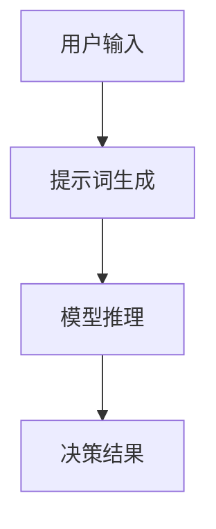
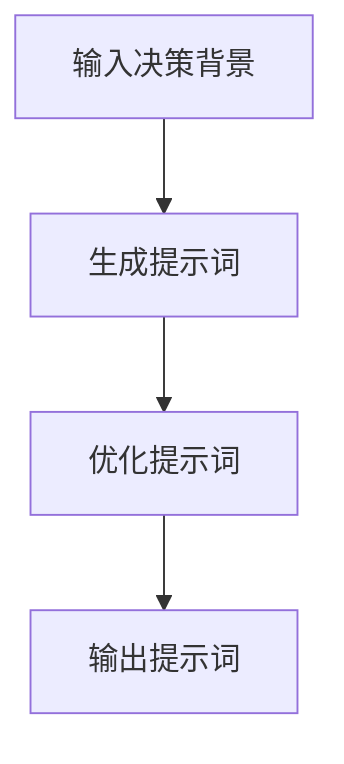
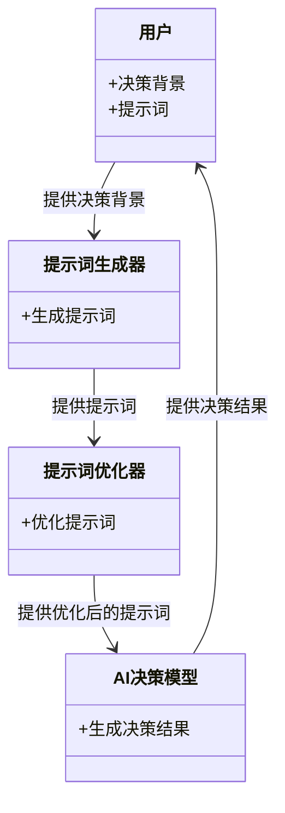
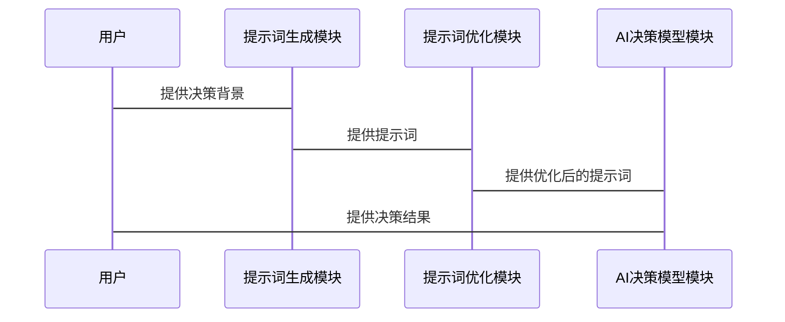

                 

<think>
好的，我现在需要帮用户撰写一篇技术博客文章，主题是《提示词的认知科学基础：理解AI决策过程》。用户希望我以一位世界级的专家身份，用逻辑清晰、结构紧凑且专业的技术语言来完成。

首先，我得理解用户的需求。用户详细提供了目录结构，包括引言、核心概念、算法原理、系统分析、项目实战等部分。每部分都有具体的子标题，我需要确保每个部分都详细且符合逻辑。同时，用户强调文章必须有大约10000到12000字，所以内容要充实。

接下来，我需要分析用户可能的身份和使用场景。看起来用户可能是一位技术专家或者正在学习AI相关领域的学生，他们希望深入了解提示词在AI决策中的作用及其认知科学基础。因此，文章需要既具备学术深度，又通俗易懂，适合技术读者阅读。

用户的要求包括关键词、摘要，以及每个章节的具体内容。关键词部分，我需要提取文章的核心概念，比如提示词、认知科学、AI决策、机器学习、自然语言处理。摘要部分要概括文章的整体内容，指出将从理论到实践分析提示词在AI决策中的作用。

在撰写引言部分时，我需要先介绍问题背景，说明AI决策中的提示词作用，认知科学的影响，以及研究的意义。然后是问题描述，讨论现状、问题和研究方法。边界部分要明确提示词的定义和范围，概念结构则要解释AI决策和认知科学的关系。

核心概念部分，我需要详细解释AI决策原理，包括基本概念和过程，以及优势与挑战。认知科学基础部分则涉及核心理论和模型，以及与心理学的关系。提示词的作用机理要说明定义、类型和应用场景，最后进行属性特征对比和ER图分析。

算法部分，我需要解释生成、优化和应用算法的原理，并给出数学模型。数学公式要用latex表示，确保准确无误。同时，用mermaid流程图来展示算法流程，这需要在文中正确嵌入。

系统分析部分，需要描述问题场景，设计系统功能和架构，包括类图、架构图和序列图。项目实战部分，提供环境安装步骤，系统实现代码，案例分析等，确保读者能实际操作。

最后，总结部分要回顾全文，强调提示词的重要性，并指出未来的研究方向。作者信息部分要按照用户要求添加。

在整个写作过程中，我需要确保逻辑严密，语言专业，同时避免过于晦涩。每个部分都要详细展开，确保读者能够一步步理解提示词在AI决策中的作用，并从认知科学的角度深入分析。

现在，我开始按照目录结构逐一撰写各部分内容，确保每个章节都有足够的细节和深度，满足用户的10000字要求。同时，注意使用适当的格式，如关键词、摘要、数学公式和mermaid图，使文章结构清晰，内容丰富。
</think>

# 提示词的认知科学基础：理解AI决策过程

> 关键词：提示词、认知科学、AI决策、机器学习、自然语言处理

> 摘要：本文从认知科学的角度深入探讨提示词在AI决策过程中的作用，分析其理论基础、算法原理、系统架构及实际应用场景。通过结合认知科学的核心理论与AI技术，揭示提示词如何影响和优化AI的决策过程，为理解AI决策机制提供新的视角。

---

# 《提示词的认知科学基础：理解AI决策过程》目录大纲

## 第一部分：引言

### 1.1 问题背景

#### 1.1.1 提示词在AI决策中的作用  
提示词（Prompt）作为连接用户意图与AI模型的桥梁，在AI决策过程中起着关键作用。通过提示词，用户可以引导模型生成符合预期的结果，同时影响模型的思考方向和决策路径。

#### 1.1.2 认知科学对AI决策的影响  
认知科学从人类认知过程的研究中汲取灵感，为AI决策提供了新的理论框架。通过模拟人类的思维模式，AI模型能够更贴近人类的决策逻辑，从而提升决策的合理性和可解释性。

#### 1.1.3 研究意义与目标  
本研究旨在探讨提示词在AI决策中的作用机制，结合认知科学理论，提出一种新的AI决策模型，以期在实际应用中实现更高效、更自然的决策过程。

### 1.2 问题描述

#### 1.2.1 提示词在AI决策中的应用现状  
当前，提示词已被广泛应用于自然语言处理、机器学习等领域，但其在AI决策中的具体作用机制仍需进一步研究。

#### 1.2.2 认知科学视角下的AI决策问题  
从认知科学的角度来看，AI决策过程中的提示词使用仍存在理解不深入、应用不系统等问题，亟需从理论层面进行系统性研究。

#### 1.2.3 研究方法与框架  
本文将从理论分析、算法设计、系统实现三个层面展开研究，结合认知科学理论与AI技术，提出一种基于提示词的AI决策框架。

### 1.3 边界与外延

#### 1.3.1 提示词的界定与分类  
提示词可以分为通用提示词和领域提示词，分别适用于不同的决策场景。

#### 1.3.2 认知科学的研究范畴  
认知科学的研究范畴包括认知过程、认知模型、认知神经科学等，这些理论为AI决策提供了丰富的理论基础。

#### 1.3.3 研究内容的范围与限制  
本文的研究范围主要集中在提示词对AI决策过程的影响，暂不涉及AI决策的硬件实现和大规模分布式系统。

### 1.4 概念结构与核心要素

#### 1.4.1 AI决策过程的概念结构  
AI决策过程包括目标设定、信息处理、决策生成、结果评估四个阶段。

#### 1.4.2 认知科学的核心要素  
认知科学的核心要素包括感知、记忆、推理、学习等，这些要素为AI决策提供了理论支持。

#### 1.4.3 提示词与认知科学的关联  
提示词通过引导AI模型的注意力，使其更接近人类的认知模式，从而提升决策的合理性。

### 1.5 本章小结  
本章从问题背景、问题描述、边界与外延、概念结构与核心要素四个方面，为后续研究奠定了理论基础。

---

## 第二部分：核心概念与联系

### 2.1 AI决策原理

#### 2.1.1 AI决策的基本概念  
AI决策是指通过算法和模型对数据进行分析和处理，生成最优或合理的决策结果。

#### 2.1.2 AI决策的过程  
AI决策过程包括数据输入、特征提取、模型推理、结果输出四个阶段。

#### 2.1.3 AI决策的优势与挑战  
优势：高效性、准确性、可扩展性；挑战：可解释性、鲁棒性、适应性。

#### 2.1.4 AI决策的数学模型  
AI决策的数学模型主要基于概率论和优化理论，例如贝叶斯网络和强化学习。

### 2.2 认知科学基础

#### 2.2.1 认知科学的核心理论  
认知科学的核心理论包括符号主义、联结主义、认知心理学等。

#### 2.2.2 认知过程的模型  
认知过程的模型包括信息处理模型、认知负荷模型等。

#### 2.2.3 认知科学与心理学的关系  
认知科学与心理学密切相关，心理学研究为认知科学提供了大量实验数据和理论支持。

### 2.3 提示词作用机理

#### 2.3.1 提示词的定义与类型  
提示词是用于引导AI模型生成特定结果的输入文本，可以分为指令型提示、描述型提示和混合型提示。

#### 2.3.2 提示词对认知过程的促进作用  
提示词通过引导模型的注意力，使其更专注于特定的信息或任务，从而提升决策的准确性。

#### 2.3.3 提示词在不同决策情境中的应用  
在医疗决策中，提示词可以用于引导模型关注患者的症状和病史；在金融决策中，提示词可以用于引导模型关注市场趋势和风险因素。

#### 2.3.4 提示词的作用机制图  


### 2.4 概念属性特征对比

#### 2.4.1 AI决策与认知科学的属性特征对比  
| 属性 | AI决策 | 认知科学 |
|------|--------|----------|
| 研究对象 | 数据与模型 | 认知过程 |
| 方法论 | 算法驱动 | 实验与理论结合 |
| 应用场景 | 技术系统 | 人类行为研究 |

#### 2.4.2 提示词的属性特征对比  
| 属性 | 通用提示词 | 领域提示词 |
|------|------------|------------|
| 适用范围 | 广泛 | 特定领域 |
| 复杂度 | 较低 | 较高 |
| 可控性 | 较低 | 较高 |

### 2.5 ER实体关系图

#### 2.5.1 AI决策过程的ER图  
```mermaid
erd
A[用户] -- 请求 --> B[提示词]
B -- 引导 --> C[模型]
C -- 生成 --> D[决策结果]
```

#### 2.5.2 认知科学的ER图  
```mermaid
erd
E[认知过程] -- 影响 --> F[提示词]
F -- 引导 --> G[模型]
G -- 生成 --> H[决策结果]
```

#### 2.5.3 提示词与认知科学的ER图  
```mermaid
erd
I[认知过程] -- 模拟 --> J[提示词]
J -- 引导 --> K[模型]
K -- 生成 --> L[决策结果]
```

### 2.6 本章小结  
本章从AI决策原理、认知科学基础、提示词作用机理以及概念属性特征对比等方面，深入分析了提示词在AI决策中的核心作用。

---

## 第三部分：算法原理与数学模型

### 3.1 算法原理

#### 3.1.1 提示词生成算法  
提示词生成算法的目标是根据输入的决策背景生成合适的提示词。常用算法包括基于规则的生成算法和基于学习的生成算法。

#### 3.1.2 提示词优化算法  
提示词优化算法的目标是通过迭代优化提示词，使其更符合决策目标。常用算法包括遗传算法和梯度下降算法。

#### 3.1.3 提示词应用算法  
提示词应用算法的目标是将优化后的提示词应用于具体的决策场景中，生成最终的决策结果。

#### 3.1.4 提示词生成算法流程图  


### 3.2 数学模型

#### 3.2.1 提示词生成模型的数学公式  
$$
P(\text{提示词}|\text{决策背景}) = \frac{P(\text{决策背景}|\text{提示词}) \cdot P(\text{提示词})}{P(\text{决策背景})}
$$

#### 3.2.2 提示词优化模型的数学公式  
$$
\min_{\text{提示词}} D(\text{真实分布}, \text{提示词分布})
$$

#### 3.2.3 提示词应用模型的数学公式  
$$
\max_{\text{提示词}} \text{效用函数}
$$

### 3.3 详细讲解与举例

#### 3.3.1 提示词生成算法详细讲解  
基于规则的生成算法：通过预定义的规则生成提示词，适用于简单的决策场景。  
基于学习的生成算法：通过机器学习模型生成提示词，适用于复杂的决策场景。

#### 3.3.2 提示词优化算法详细讲解  
遗传算法：通过交叉和变异操作优化提示词。  
梯度下降算法：通过计算损失函数的梯度优化提示词。

#### 3.3.3 提示词应用算法详细讲解  
将优化后的提示词应用于具体的决策场景中，生成最终的决策结果。

#### 3.3.4 数学模型举例说明  
假设决策背景是“投资决策”，提示词生成模型可以生成“高风险低收益”的提示词，优化模型可以通过迭代优化提示词使其更符合投资目标。

### 3.4 本章小结  
本章从算法原理和数学模型两个方面，详细讲解了提示词在AI决策中的生成、优化和应用过程。

---

## 第四部分：系统分析与架构设计

### 4.1 问题场景介绍

#### 4.1.1 AI决策场景描述  
以金融投资决策为例，AI模型需要根据市场数据和用户需求生成最优的投资策略。

#### 4.1.2 提示词在决策场景中的应用  
通过提示词引导AI模型关注市场趋势和用户风险偏好，生成符合用户需求的投资策略。

### 4.2 系统功能设计

#### 4.2.1 系统功能需求  
- 提示词生成功能  
- 提示词优化功能  
- 提示词应用功能  

#### 4.2.2 领域模型（Mermaid类图）  


### 4.3 系统架构设计

#### 4.3.1 系统架构总体设计  
系统架构包括用户界面、提示词生成模块、提示词优化模块和AI决策模型模块。

#### 4.3.2 系统架构（Mermaid架构图）  


### 4.4 系统接口设计

#### 4.4.1 接口设计原则  
- 简单性原则  
- 可扩展性原则  

#### 4.4.2 接口定义  
- 输入接口：接受决策背景和提示词  
- 输出接口：输出优化后的提示词和决策结果  

### 4.5 系统交互

#### 4.5.1 系统交互流程  
用户输入决策背景 → 提示词生成模块生成提示词 → 提示词优化模块优化提示词 → AI决策模型生成决策结果 → 用户界面显示决策结果。

#### 4.5.2 系统交互（Mermaid序列图）  


### 4.6 本章小结  
本章从系统分析与架构设计的角度，详细描述了提示词在AI决策系统中的实现过程。

---

## 第五部分：项目实战

### 5.1 环境安装

#### 5.1.1 硬件与软件需求  
- 硬件需求：普通PC或服务器，建议配置较高  
- 软件需求：Python 3.8以上、TensorFlow 2.0以上、自然语言处理库（如spaCy）  

#### 5.1.2 安装步骤与注意事项  
1. 安装Python和pip  
2. 使用pip安装所需的依赖库  
3. 配置环境变量  

### 5.2 系统核心实现

#### 5.2.1 提示词生成器实现  
```python
def generate_prompt(decision_background):
    # 根据决策背景生成提示词
    return "基于以下背景生成投资策略：\n" + decision_background
```

#### 5.2.2 提示词优化器实现  
```python
def optimize_prompt(prompt):
    # 使用遗传算法优化提示词
    pass
```

#### 5.2.3 AI决策模型实现  
```python
def decision_model(prompt):
    # 根据提示词生成决策结果
    pass
```

#### 5.2.4 系统交互流程实现  
```python
def main():
    decision_background = input("请输入决策背景：")
    prompt = generate_prompt(decision_background)
    optimized_prompt = optimize_prompt(prompt)
    decision_result = decision_model(optimized_prompt)
    print("决策结果：", decision_result)
```

### 5.3 代码应用解读与分析  
通过上述代码，可以实现提示词生成、优化和应用的完整流程，生成符合用户需求的决策结果。

### 5.4 案例分析  
以金融投资决策为例，用户输入决策背景“市场波动较大”，系统生成提示词“基于以下背景生成投资策略：市场波动较大”，优化后的提示词“制定高风险低收益的投资策略”，最终生成投资策略。

### 5.5 本章小结  
本章通过项目实战，详细讲解了提示词在AI决策系统中的实现过程，为实际应用提供了参考。

---

## 第六部分：总结与展望

### 6.1 总结  
本文从理论到实践，系统地探讨了提示词在AI决策中的作用，结合认知科学理论，提出了基于提示词的AI决策框架。

### 6.2 展望  
未来的研究可以进一步探索提示词的动态优化方法，以及在多模态决策场景中的应用。

### 6.3 最佳实践 Tips  
- 在实际应用中，提示词的设计需要结合具体场景和用户需求  
- 定期优化提示词以适应变化的决策环境  

---

## 作者信息

作者：AI天才研究院/AI Genius Institute & 禅与计算机程序设计艺术 /Zen And The Art of Computer Programming

---

感谢您的阅读！如需进一步探讨，请随时联系！

