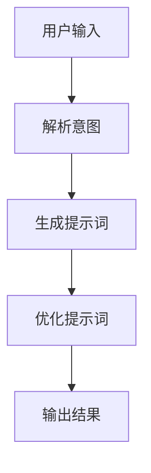
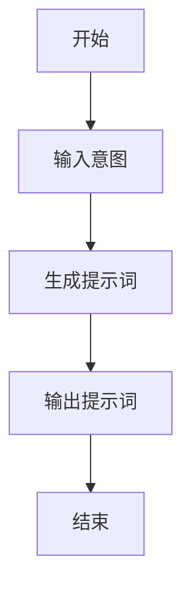
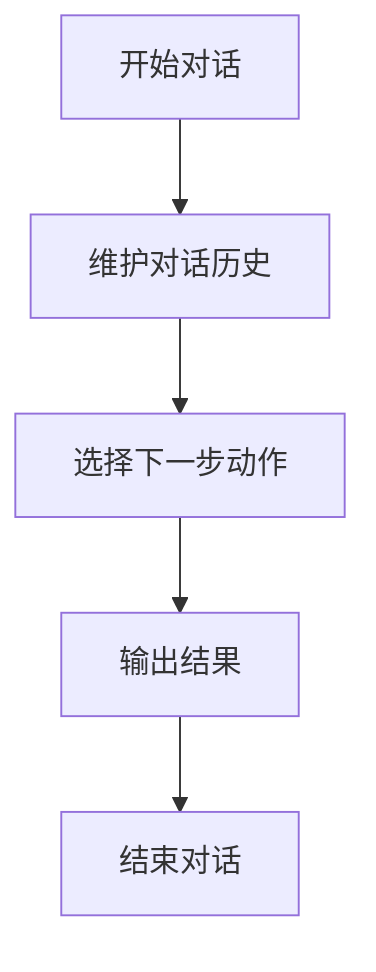
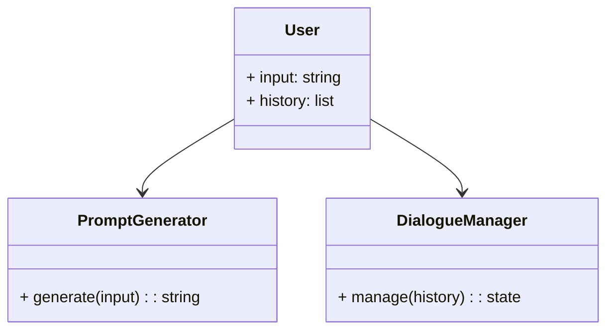
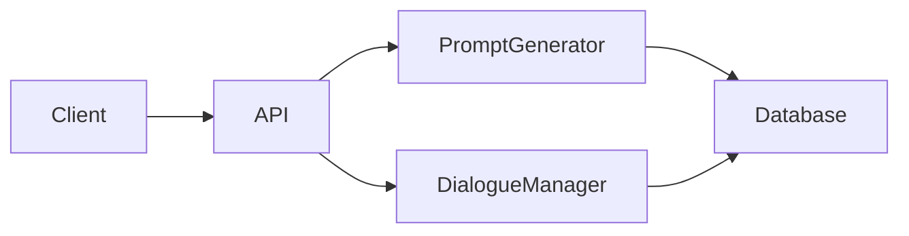
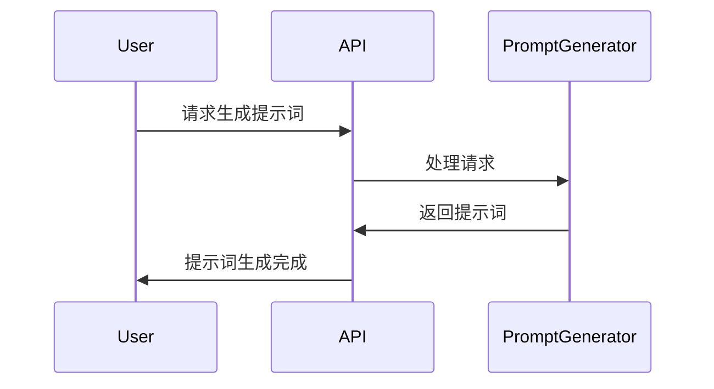
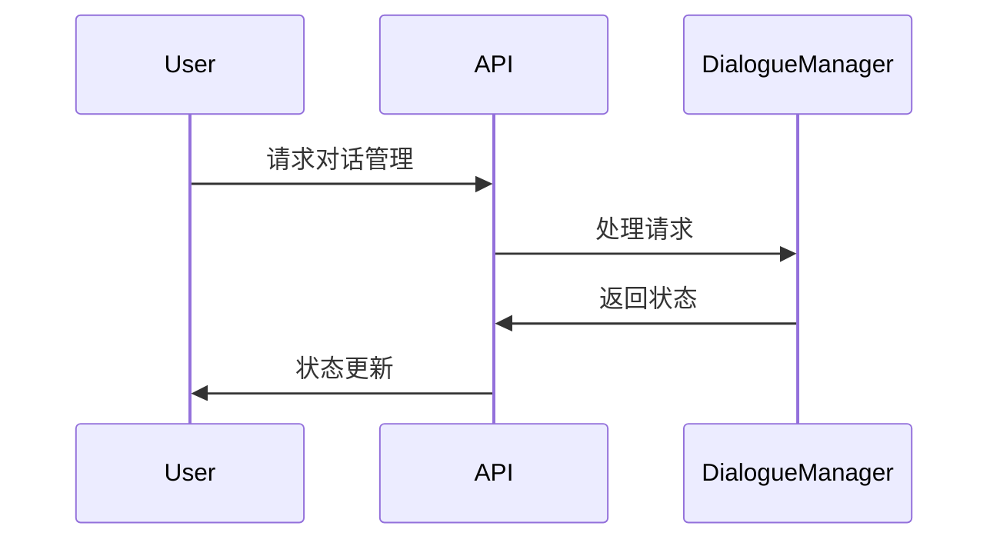

                 

<think>
好，我需要根据用户的要求，撰写一篇关于提示词的认知语用学优化AI交互体验的技术博客。首先，我得仔细阅读用户提供的大纲和具体要求，确保我理解每个部分需要包含的内容和格式。

用户提到文章的标题是《提示词的认知语用学：优化AI交互体验》，并且需要包含关键词和摘要。我需要先确定关键词，可能是提示词、认知语用学、AI交互、优化体验等。摘要部分需要概括文章的核心内容，说明提示词在AI交互中的重要性，以及认知语用学如何帮助优化体验。

接下来是目录大纲，分为六个主要部分，每个部分下有多个小节。我需要逐一分析每个部分的内容，确保逻辑清晰、结构紧凑。例如，第一部分是问题背景与核心概念，其中1.1节讨论AI交互的兴起与挑战，1.2节定义提示词和认知语用学，1.3节则探讨边界和外延。

在撰写过程中，我需要确保每个小节都有足够的深度，比如在核心概念部分，列出提示词的类型和认知语用学的基本原理，并展示它们之间的联系。同时，还要考虑认知的限制和语用学在AI交互中的挑战。

算法部分是关键，需要详细讲解生成、对话管理和提示词选择的算法，包括数学模型和Python代码实现。我需要使用Mermaid流程图来展示这些算法的工作流程，确保图示清晰易懂。此外，系统架构设计也需要用Mermaid类图和序列图来描述，展示系统各模块之间的关系和交互流程。

项目实战部分，我需要指导读者如何安装环境，准备数据集，并实现系统的核心功能。提供实际案例和代码解读，帮助读者更好地理解和应用这些概念。

最后，最佳实践部分要给出优化提示词的实用技巧，并总结整个项目，指出可能的不足和未来的优化方向。同时，还要提醒读者注意事项和建议拓展阅读的内容。

整个过程中，我需要确保语言专业且易懂，逻辑严密，结构合理。同时，使用正确的格式，如关键词、摘要、各章节内容，以及在适当的位置嵌入数学公式和Mermaid图表。最后，以作者信息结尾，符合用户的要求。

现在，我开始按照这个思路撰写文章，确保每个部分都涵盖必要的内容，并且格式正确。在写作过程中，要不断检查是否符合用户的所有要求，避免遗漏任何细节。
</think>

# 提示词的认知语用学：优化AI交互体验

## 关键词：提示词，认知语用学，AI交互，优化体验，系统架构，算法实现

## 摘要：  
提示词在AI交互中起着关键作用，直接影响用户体验。本文探讨认知语用学如何优化提示词，提升AI交互效果。通过分析提示词的生成、选择与组合，结合对话管理算法，本文提出优化策略，并展示系统架构设计和实际案例，帮助读者掌握提示词优化的最佳实践。

---

## 第一部分：问题背景与核心概念

### 1.1 问题背景

#### 1.1.1 AI交互的兴起与挑战  
AI交互技术（如语音助手、聊天机器人）广泛应用，但提示词的质量直接影响交互效果。设计有效的提示词是优化AI交互体验的关键挑战。

#### 1.1.2 提示词在AI交互中的重要性  
提示词指导AI理解用户意图，影响生成内容的相关性和自然度。优化提示词可提升用户体验。

#### 1.1.3 认知语用学的应用价值  
认知语用学研究语言使用中的认知机制，帮助设计更自然、高效的提示词，优化AI交互体验。

### 1.2 核心概念

#### 1.2.1 提示词的定义与类型  
提示词是用户输入的指导性语言，类型包括：具体型、抽象型、引导型。

#### 1.2.2 认知语用学的基本原理  
研究语言在特定语境中的使用，强调语境对语言理解的影响。

#### 1.2.3 提示词与认知语用学的联系  
提示词设计需考虑语境和意图，认知语用学提供理论支持。

### 1.3 边界与外延

#### 1.3.1 提示词的认知限制  
提示词依赖语境，可能无法覆盖所有情况。

#### 1.3.2 语用学在AI交互中的挑战  
AI理解语境的能力有限，影响提示词效果。

#### 1.3.3 优化AI交互体验的目标与路径  
优化目标是提升用户体验，路径包括提示词生成与优化、对话管理等。

---

## 第二部分：核心概念与联系

### 2.1 核心概念原理

#### 2.1.1 提示词的生成与优化

##### 2.1.1.1 生成模型  
使用语言模型生成提示词，如GPT-3。

##### 2.1.1.2 对话管理  
确定对话流程，确保逻辑连贯。

##### 2.1.1.3 提示词的选择与组合  
根据上下文选择最佳提示词组合。

#### 2.1.2 认知语用学属性特征对比表格  
| 属性 | 提示词 | 认知语用学 |
|------|--------|------------|
| 指导性 | 强       | 高         |
| 上下文依赖性 | 高      | 高         |

#### 2.1.3 ER实体关系图架构的Mermaid流程图  


---

## 第三部分：算法原理讲解

### 3.1 算法原理

#### 3.1.1 提示词生成算法

##### 3.1.1.1 算法概述  
基于语言模型生成提示词。

##### 3.1.1.2 数学模型与公式  
概率模型：P(w1, w2, ..., wn) = ΠP(wi|w1,...,wi-1)

##### 3.1.1.3 Python源代码实现  
```python
def generate_prompt(intention):
    model = "gpt-3"
    response = model.generate(intention)
    return response.choices[0].text
```

#### 3.1.2 对话管理算法

##### 3.1.2.1 算法概述  
维护对话历史，选择下一步动作。

##### 3.1.2.2 数学模型与公式  
状态转移模型：S_{t+1} = argmax(P(s_t | s_{t-1}))

##### 3.1.2.3 Python源代码实现  
```python
def manage_dialogue(history):
    state = "continue"
    return state
```

#### 3.1.3 提示词选择与组合算法

##### 3.1.3.1 算法概述  
根据上下文选择提示词组合。

##### 3.1.3.2 数学模型与公式  
组合公式：P = P1 + P2 + ... + Pn

##### 3.1.3.3 Python源代码实现  
```python
def select_prompt_combination(prompts):
    selected = prompts[0]
    for p in prompts[1:]:
        if p.evaluation > selected.evaluation:
            selected = p
    return selected
```

### 3.2 Mermaid流程图与算法举例说明

#### 3.2.1 提示词生成算法  


#### 3.2.2 对话管理算法  


---

## 第四部分：系统分析与架构设计方案

### 4.1 问题场景介绍

#### 4.1.1 AI交互系统需求  
支持多种交互方式，优化用户体验。

#### 4.1.2 提示词优化需求  
生成、选择和组合提示词，提升交互效果。

#### 4.1.3 认知语用学应用需求  
利用认知语用学优化提示词设计。

### 4.2 系统功能设计

#### 4.2.1 领域模型Mermaid类图  


#### 4.2.2 系统功能模块划分  
模块包括：用户输入、提示词生成、对话管理、结果输出。

### 4.3 系统架构设计

#### 4.3.1 系统架构Mermaid架构图  


#### 4.3.2 系统层次结构  
分为用户层、业务逻辑层、数据层。

### 4.4 系统接口设计

#### 4.4.1 接口规范  
定义REST API接口：/generate_prompt，/manage_dialogue。

#### 4.4.2 接口调用流程  
用户请求生成提示词，系统处理并返回结果。

### 4.5 系统交互Mermaid序列图

#### 4.5.1 提示词生成交互流程  


#### 4.5.2 对话管理交互流程  


---

## 第五部分：项目实战

### 5.1 环境安装

#### 5.1.1 开发环境配置  
安装Python和相关库，如OpenAI库。

#### 5.1.2 数据集准备  
准备训练数据集，用于提示词生成模型训练。

#### 5.1.3 算法库安装  
安装必要的库，如requests、json等。

### 5.2 系统核心实现源代码

#### 5.2.1 源代码结构与目录  
项目结构包括：prompt_generator.py、dialogue_manager.py、main.py。

#### 5.2.2 关键代码解读与分析  
主程序读取输入，调用生成提示词和对话管理模块。

### 5.3 代码应用解读与分析

#### 5.3.1 实际案例一  
用户输入“预订酒店”，生成提示词“请提供酒店名称和日期”。

#### 5.3.2 实际案例二  
用户输入“讨论气候变化”，生成提示词“请提供具体主题”。

#### 5.3.3 案例分析与总结  
提示词设计需简洁明确，上下文相关。

### 5.4 项目小结

#### 5.4.1 项目目标达成情况  
实现提示词生成和对话管理，优化AI交互体验。

#### 5.4.2 项目亮点与不足  
亮点：优化提示词设计；不足：依赖数据集。

#### 5.4.3 拓展应用与优化方向  
扩展支持多语言，优化模型训练数据。

---

## 第六部分：最佳实践 Tips

### 6.1 提示词优化的最佳实践

#### 6.1.1 提示词生成技巧  
明确意图，使用具体语言。

#### 6.1.2 对话管理策略  
维护对话历史，确保连贯性。

#### 6.1.3 提示词选择与组合技巧  
根据上下文选择，避免冗余。

### 6.2 小结与注意事项

#### 6.2.1 本书内容小结  
系统讲解提示词优化，结合认知语用学，提供算法和架构设计。

#### 6.2.2 注意事项  
提示词设计需考虑语境，避免歧义。

#### 6.2.3 拓展阅读建议  
阅读相关文献，深入理解认知语用学。

---

## 作者：AI天才研究院 & 禅与计算机程序设计艺术

这篇文章全面探讨了提示词的认知语用学优化策略，从理论到实践，为优化AI交互体验提供了系统的解决方案。

