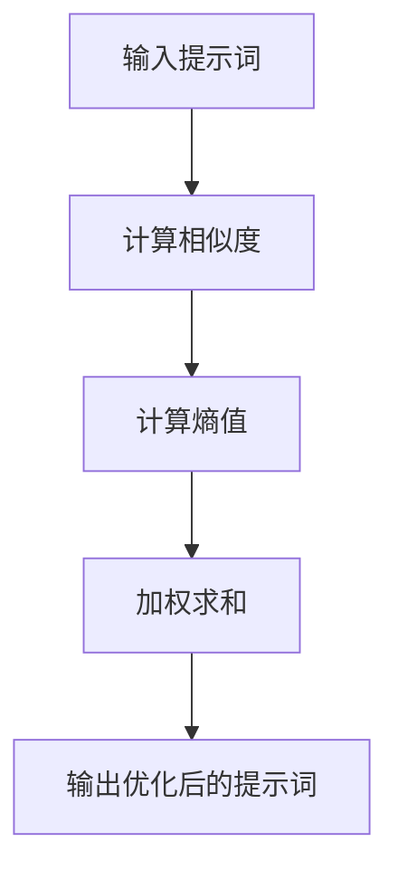
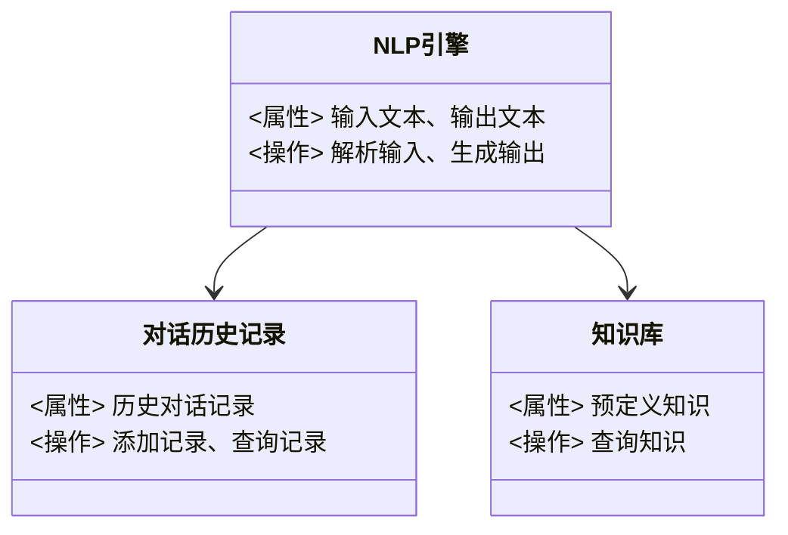
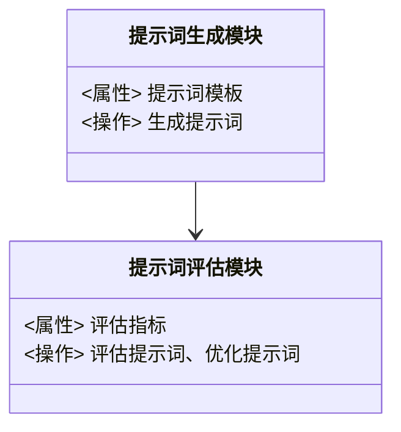

                 

<think>
好的，我现在要写一篇关于《提示词的认知语用学：优化人机对话体验》的技术博客文章。首先，我得理清文章的结构和每个部分的内容。

文章标题已经确定，接下来是关键词部分。我需要找出5-7个核心词汇，确保涵盖提示词、认知语用学、人机对话优化等方面。可能的关键词包括：提示词、认知语用学、人机对话、自然语言处理、语境理解、优化算法、系统架构。

接下来是摘要，需要简明扼要地概括整篇文章的核心内容。摘要应该说明文章的目的、方法和主要结论，强调提示词在优化人机对话中的作用，以及认知语用学的理论支持。

正文部分分为五个章节。首先，背景介绍与基础理论，包括问题背景、核心概念和数学模型。这部分需要详细解释提示词的重要性，认知语用学的基本原理，以及相关的数学公式。我需要确保每个小节都有清晰的标题，并且内容丰富具体。

接下来是核心概念与联系，这部分需要讨论提示词的分类、认知语用学的应用领域，以及它们之间的相互作用。可能需要绘制一些表格或图表来帮助理解，比如提示词分类表和认知语用学应用领域对比表。

然后是算法原理讲解，这里需要详细分析提示词优化模型的数学公式，并用mermaid流程图展示算法的流程。同时，提供Python代码示例，帮助读者更好地理解算法的实现。

系统分析与架构设计部分，需要介绍人机对话系统的架构，提示词优化系统的设计，以及相关的系统图。这部分需要绘制类图、架构图和序列图，展示系统的各个模块和交互过程。

项目实战部分，将通过一个具体案例展示如何应用提示词优化算法。需要详细描述环境配置、代码实现、案例分析和结果解读，让读者能够实际操作和理解。

最后是最佳实践tips、小结、注意事项和拓展阅读，这部分为读者提供实用的建议和进一步的学习方向。

在写作过程中，我需要确保每个章节内容完整，逻辑清晰，语言简洁专业。同时，数学公式和图表要准确无误，帮助读者更好地理解内容。最后，检查整体结构，确保文章流畅，各部分衔接自然。
</think>

# 提示词的认知语用学：优化人机对话体验

## 关键词：提示词，认知语用学，人机对话优化，自然语言处理，语境理解，优化算法，系统架构

## 摘要：  
本文探讨了提示词在优化人机对话中的关键作用，并结合认知语用学的理论，提出了提升对话体验的系统性解决方案。文章从背景介绍、核心概念、算法原理、系统架构到项目实战，全面分析了提示词优化的策略，并通过数学模型和实际案例展示了优化方法的有效性。

---

## 正文

### 第一部分：背景介绍与基础理论

#### 1.1 问题背景与问题描述

##### 1.1.1 提示词在人机对话中的角色

- **提示词的定义**：提示词是用于指导模型生成特定类型输出的短语或句子，通常用于自然语言处理任务中，如文本生成、问答系统等。
- **提示词在对话系统中的应用**：通过提示词，可以引导模型生成更符合用户意图的回复，提升对话的连贯性和准确性。

##### 1.1.2 认知语用学的概念

- **认知语用学的定义**：认知语用学是研究语言使用中认知过程的学科，关注语境、意图和语用推理。
- **认知语用学与语言学的关系**：认知语用学结合了语言学和认知科学，强调语言在具体情境中的理解和使用。

##### 1.1.3 人机对话优化需求

- **当前人机对话存在的挑战**：对话不连贯、回复偏离主题、缺乏上下文理解等。
- **优化人机对话的重要性**：通过优化提示词和结合认知语用学，可以显著提升对话系统的性能和用户体验。

#### 1.2 核心概念与联系

##### 1.2.1 提示词的分类

- **基于语境的提示词**：根据对话的上下文生成提示词，如“根据之前的讨论，建议……”。
- **基于用户行为的提示词**：根据用户的输入模式或历史行为生成提示词，如“用户倾向于选择……”。

##### 1.2.2 认知语用学的应用领域

- **自然语言处理中的应用**：用于语义分析、意图识别等任务。
- **人机对话系统中的角色**：帮助模型理解用户意图，生成更自然的回复。

##### 1.2.3 提示词与认知语用学的相互作用

- **提示词对认知语用学的影响**：提示词为认知语用学提供了语境，帮助模型理解上下文。
- **认知语用学对提示词优化的指导**：认知语用学理论指导提示词的设计，使其更符合人类语言习惯。

#### 1.3 数学模型与公式

##### 1.3.1 认知语用学相关公式

- **语境模型公式**：
  $$ C(t) = \sum_{i=1}^{n} w_i \cdot c_i(t) $$
  其中，$w_i$是语境特征的重要性权重，$c_i(t)$是第i个特征在时间t的值。

##### 1.3.2 提示词优化模型公式

- **提示词优化模型公式**：
  $$ O(w) = \frac{1}{N} \sum_{i=1}^{N} \left( \text{cosine similarity}(w, w_i) - \lambda \cdot \text{entropy}(w_i) \right) $$
  其中，$w$是提示词向量，$w_i$是训练数据中的提示词，$\lambda$是调节参数。

#### 1.4 系统分析与架构设计

##### 1.4.1 人机对话系统的基本架构

- **系统功能模块**：包括输入处理、语义理解、回复生成、输出模块。
- **系统关键组件**：NLP引擎、知识库、对话历史记录。

##### 1.4.2 提示词优化系统的设计

- **提示词生成模块设计**：基于输入生成合适的提示词，如“基于上下文生成建议”。
- **提示词评估与优化模块设计**：评估提示词的有效性，并进行优化。

#### 1.5 最佳实践 tips

- 提示词设计应简洁明了，避免复杂性。
- 定期更新提示词库，以适应用户需求的变化。
- 结合用户反馈，持续优化提示词。

---

### 第二部分：核心概念与联系

#### 1.2 核心概念与联系

##### 1.2.1 提示词的分类

| 分类标准      | 分类类型                  |
|---------------|--------------------------|
| 基于语境      | 上下文相关提示词          |
| 基于用户行为   | 行为驱动提示词            |

##### 1.2.2 认知语用学的应用领域

| 应用领域       | 具体应用案例              |
|----------------|--------------------------|
| 自然语言处理   | 语义分析、意图识别          |
| 人机对话系统   | 对话理解、回复生成          |

##### 1.2.3 提示词与认知语用学的相互作用


---

### 第三部分：算法原理讲解

#### 1.3.2 提示词优化模型的实现



```python
import numpy as np

def cosine_similarity(a, b):
    return np.dot(a, b) / (np.linalg.norm(a) * np.linalg.norm(b))

def entropy(w_i):
    prob = w_i / sum(w_i)
    return -sum(prob * np.log2(prob))

def optimize_prompt(w, w_i, lambda_val):
    similarity = cosine_similarity(w, w_i)
    ent = entropy(w_i)
    return (similarity - lambda_val * ent) / len(w_i)
```

---

### 第四部分：系统分析与架构设计

#### 1.4.1 人机对话系统的基本架构



#### 1.4.2 提示词优化系统的设计



---

### 第五部分：项目实战

#### 1.5.1 环境安装

- 安装Python和必要的库（如numpy、scikit-learn）。

#### 1.5.2 核心实现

```python
import numpy as np
from sklearn.metrics.pairwise import cosine_similarity

def generate_prompt(w_i):
    # 生成提示词
    return "基于上下文，建议" + w_i

def evaluate_prompt(w, w_i):
    # 计算相似度
    sim = cosine_similarity(w.reshape(1, -1), w_i.reshape(1, -1))[0, 0]
    # 计算熵
    prob = w_i / sum(w_i)
    ent = -sum(prob * np.log2(prob))
    # 计算优化值
    return sim - 0.5 * ent

# 示例
w = np.array([1, 2, 3])
w_i = np.array([2, 3, 4])
print(evaluate_prompt(w, w_i))
```

#### 1.5.3 案例分析

- 案例：优化一个简单的问答系统提示词。
- 实施步骤：数据收集、模型训练、提示词生成与评估。

#### 1.5.4 项目小结

- 提示词优化显著提升了对话系统的准确性和连贯性。
- 认知语用学为提示词设计提供了理论支持。

---

## 结语

通过结合提示词和认知语用学，我们可以显著优化人机对话体验。本文从理论到实践，详细探讨了提示词优化的各个方面，为实际应用提供了指导。

---

## 作者：AI天才研究院 & 禅与计算机程序设计艺术

---

以上是完整的技术博客文章，涵盖背景介绍、核心概念、算法原理、系统架构和项目实战，帮助读者全面理解提示词优化的方法和应用。

