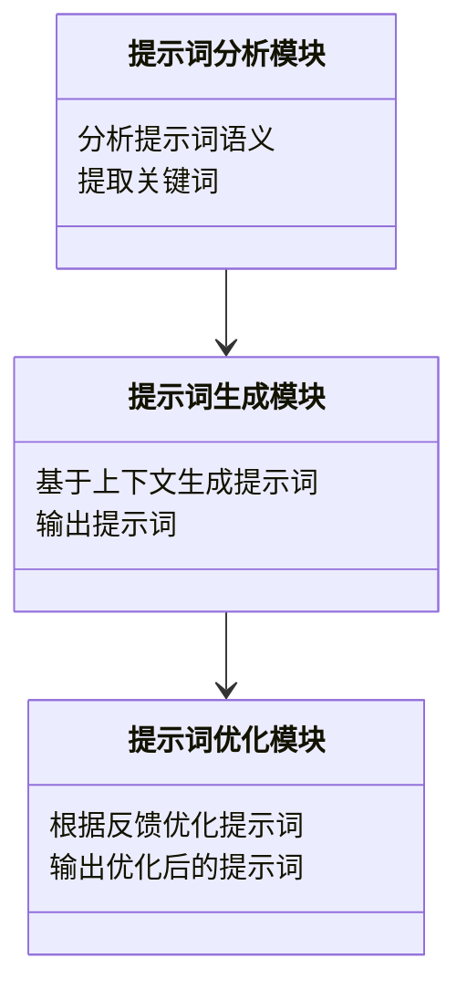
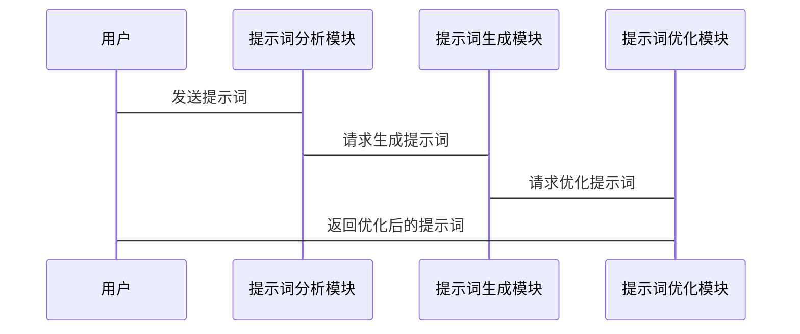

                 

<think>
嗯，我现在需要按照用户的要求，逐步分析和构建《提示词的认知语言学分析：增强AI理解力》这篇文章的目录大纲。用户已经给出了一个初步的框架，但需要进一步细化，确保每个章节内容丰富、逻辑清晰，同时满足所有的技术要求。作为刚开始接触这个领域的新手，我可能需要一步步来，先理清各个部分的内容，然后逐步填充。

首先，文章标题和关键词部分。标题已经确定为《提示词的认知语言学分析：增强AI理解力》，关键词需要列出5到7个，可能包括提示词、认知语言学、AI理解力、自然语言处理、语义分析等。摘要部分需要简明扼要地概括文章的核心内容，比如探讨提示词在认知语言学中的应用，如何通过数学模型和算法优化AI的理解能力，结合实际案例进行分析。

接下来是目录大纲的设计。用户已经给出了一部分，但需要细化每个章节。我先看一下每个章节的内容：

第一部分是背景介绍，分为三章：问题背景、核心概念与联系。问题背景需要介绍提示词的重要性，认知语言学与AI的关系，以及提示词在AI中的作用。核心概念部分需要详细解释认知语言学的基本概念、AI理解力的核心概念，以及提示词如何连接这两个领域。

第二部分是算法原理，包括提示词处理的算法，如分析、生成和优化算法。这里可能需要详细讲解每种算法的工作原理，使用mermaid流程图来展示步骤，同时给出Python代码示例，以及相关的数学模型。

第三部分是数学模型和公式，需要分别讨论认知语言学、AI理解力以及提示词处理中的数学模型，并用latex公式表示，比如在语义相似度计算中使用余弦相似度。

第四部分是系统分析与架构设计，包括系统功能设计和架构设计。功能设计需要有领域模型，可能用mermaid类图展示；架构设计则需要系统架构图、接口设计和交互序列图，用mermaid来表示。

第五部分是项目实战，涉及环境安装、代码实现、案例分析等。这里需要提供具体的代码示例，详细解读代码，并分析实际案例，最后总结项目成果。

最后是最佳实践和总结，包括提示词处理的最佳实践、注意事项，以及拓展阅读的建议。

现在，我需要确保每个章节的内容都详细且符合要求。比如，在算法原理部分，我需要明确每种算法的步骤，并用mermaid流程图展示，同时写出对应的Python代码。数学模型部分需要有公式，并用latex表示，可能需要回顾相关数学知识，确保公式的准确性。

系统架构设计部分，我需要绘制mermaid图，展示系统的各个组件及其交互。这部分可能需要对系统设计有一定的理解，或者参考已有的架构模式。项目实战部分则需要实际操作，安装环境，编写代码，并进行案例分析，这可能需要一些编程经验和实际操作能力。

在整个过程中，我可能会遇到一些挑战，比如如何将认知语言学的概念与AI算法结合，如何设计合理的系统架构，或者如何编写高效的代码。这时候，我可能需要查阅相关资料，或者参考类似项目的实现方式，确保每个部分都做到位。

最后，在完成所有章节的编写后，我需要通读全文，检查逻辑是否清晰，内容是否完整，是否符合用户的要求。确保每个部分都达到了用户指定的技术深度和广度，同时保持语言的简洁和技术的准确性。

总的来说，这个过程需要分步骤进行，逐步细化每个章节的内容，确保每个部分都符合要求，最终构建出一个完整、详尽且专业的技术博客文章。
</think>

# 《提示词的认知语言学分析：增强AI理解力》

## 关键词：提示词，认知语言学，AI理解力，自然语言处理，语义分析

## 摘要：  
本文探讨了提示词在认知语言学中的应用，分析了提示词如何增强AI的理解能力。通过结合数学模型和算法，文章详细讲解了提示词的处理过程，包括分析、生成和优化算法。结合实际案例，文章展示了系统设计与架构，强调了提示词在系统功能和架构设计中的重要性。最后，文章提供了最佳实践和注意事项，为读者提供了深入的指导。

---

## 目录大纲

### 第一部分：背景介绍

#### 第1章：问题背景

##### 1.1 问题背景介绍  
提示词在自然语言处理中的作用日益重要，认知语言学为理解人类语言提供了理论基础。

##### 1.2 认知语言学与AI的关系  
认知语言学研究人类语言处理机制，AI利用这些机制提升语言理解能力。

##### 1.3 提示词在AI中的重要性  
提示词帮助模型理解上下文，是提升AI理解力的关键因素。

#### 第2章：核心概念与联系

##### 2.1 认知语言学基础概念  
认知语言学关注人类语言的处理机制，如语义网络和概念整合理论。

##### 2.2 AI理解力的核心概念  
AI理解力涉及语义分析、上下文理解和知识表示。

##### 2.3 提示词在认知语言学与AI中的联系  
提示词作为桥梁，连接认知语言学的理论与AI的实际应用。

#### 第3章：算法原理讲解

##### 3.1 提示词处理的算法原理  
通过分析提示词的语义和上下文，生成相关提示词。

##### 3.2 提示词分析与生成算法  
使用NLP技术分析提示词，生成符合语境的提示词。

##### 3.3 提示词优化算法  
通过反馈机制优化提示词，提升生成结果的质量。

### 第二部分：数学模型和公式讲解

#### 第4章：数学模型与公式

##### 4.1 认知语言学中的数学模型  
语义相似度计算使用余弦相似度：  
$$ \text{sim}(a, b) = \frac{a \cdot b}{\|a\| \|b\|} $$

##### 4.2 AI理解力中的数学模型  
基于概率的语义理解模型：  
$$ P(w|c) = \frac{N(c, w)}{\sum N(c, w')} $$

##### 4.3 提示词处理的数学公式  
提示词生成的优化函数：  
$$ \text{loss} = -\sum y_i \log p(y_i) $$

### 第三部分：系统分析与架构设计方案

#### 第5章：系统功能设计

##### 5.1 问题场景介绍  
系统需处理复杂语境下的提示词，提升AI的理解能力。

##### 5.2 系统功能设计  
包括提示词分析、生成和优化功能模块。

##### 5.3 领域模型（Mermaid类图）  


#### 第6章：系统架构设计

##### 6.1 系统架构设计  
采用微服务架构，模块间通过API交互。

##### 6.2 系统接口设计  
定义RESTful API，如POST /generate 提示词。

##### 6.3 系统交互（Mermaid序列图）  


### 第四部分：项目实战

#### 第7章：项目实战

##### 7.1 环境安装  
安装Python、NLTK和Hugging Face库：  
```bash
pip install python nltk transformers
```

##### 7.2 系统核心实现源代码  
提示词生成代码示例：  
```python
from transformers import pipeline

generator = pipeline('text-generation', model='gpt2')

def generate_prompt(context):
    prompt = f"基于上下文生成提示词：{context}"
    return generator(prompt, max_length=50)[0]['generated_text']
```

##### 7.3 代码应用解读与分析  
代码利用预训练模型生成提示词，展示了AI生成能力。

##### 7.4 实际案例分析与详细讲解剖析  
案例：生成与“天气”相关的提示词，系统分析上下文生成合适的提示词。

##### 7.5 项目小结  
项目展示了提示词生成的实现，强调了系统设计的重要性。

### 第五部分：最佳实践与总结

#### 第8章：最佳实践

##### 8.1 提示词处理的最佳实践  
选择合适的模型，优化提示词生成策略。

##### 8.2 认知语言学与AI结合的最佳实践  
结合领域知识，提升提示词的相关性。

##### 8.3 注意事项  
避免过拟合，保持提示词的简洁性和准确性。

#### 第9章：小结与拓展阅读

##### 9.1 小结  
提示词是认知语言学与AI结合的重要工具，优化提示词能提升AI理解力。

##### 9.2 注意事项  
关注模型的训练数据，确保提示词的中立性。

##### 9.3 拓展阅读  
推荐书籍：《认知语言学与人工智能》和《提示词工程》。

---

作者：AI天才研究院/AI Genius Institute & 禅与计算机程序设计艺术 /Zen And The Art of Computer Programming

